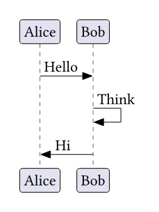

# chronos

A Typst package to draw sequence diagrams with CeTZ

---

This package lets you render sequence diagrams directly in Typst. The following boilerplate code creates an empty sequence diagram with two participants:

<table>
<tr>
<td><strong>Typst</strong></td>
<td><strong>Result</strong></td>
</tr>
<tr>
<td>

```typst
#import "@preview/chronos:0.2.1"
#chronos.diagram({
  import chronos: *
  _par("Alice")
  _par("Bob")
})
```

</td>
<td></td>
</tr>
</table>

> *Disclaimer*\
> The package cannot parse PlantUML syntax for the moment, and thus requires the use of element functions, as shown in the examples.
> A PlantUML parser is in the TODO list, just not the top priority

## Basic sequences

You can make basic sequences using the `_seq` function:

<table>
<tr>
<td><strong>Typst</strong></td>
<td><strong>Result</strong></td>
</tr>
<tr>
<td>

```typst
#chronos.diagram({
  import chronos: *
  _par("Alice")
  _par("Bob")

  _seq("Alice", "Bob", comment: "Hello")
  _seq("Bob", "Bob", comment: "Think")
  _seq("Bob", "Alice", comment: "Hi")
})
```

</td>
<td></td>
</tr>
</table>

You can make lifelines using the following parameters of the `_seq` function:
 - `enable-dst`: enables the destination lifeline
 - `create-dst`: creates the destination lifeline and participant
 - `disable-dst`: disables the destination lifeline
 - `destroy-dst`: destroys the destination lifeline and participant
 - `disable-src`: disables the source lifeline
 - `destroy-src`: destroy the source lifeline and participant

<table>
<tr>
<td><strong>Typst</strong></td>
<td><strong>Result</strong></td>
</tr>
<tr>
<td>

```typst
#chronos.diagram({
  import chronos: *
  _par("A", display-name: "Alice")
  _par("B", display-name: "Bob")
  _par("C", display-name: "Charlie")
  _par("D", display-name: "Derek")

  _seq("A", "B", comment: "hello", enable-dst: true)
  _seq("B", "B", comment: "self call", enable-dst: true)
  _seq("C", "B", comment: "hello from thread 2", enable-dst: true, lifeline-style: (fill: rgb("#005500")))
  _seq("B", "D", comment: "create", create-dst: true)
  _seq("B", "C", comment: "done in thread 2", disable-src: true, dashed: true)
  _seq("B", "B", comment: "rc", disable-src: true, dashed: true)
  _seq("B", "D", comment: "delete", destroy-dst: true)
  _seq("B", "A", comment: "success", disable-src: true, dashed: true)
})
```

</td>
<td></td>
</tr>
</table>

## Showcase

Several features have already been implemented in Chronos. Don't hesitate to checkout the examples in the [gallery](./gallery) folder to see what you can do. 

#### Quick example reference:
<table>
<tr>
<td><strong>Example</strong></td>
<td><strong>Features</strong></td>
</tr>
<tr>
<td>

`example1` <br>([PDF](./gallery/example1.pdf)|[Typst](./gallery/example1.typ))

</td>
<td>Simple cases, color sequences, groups, separators, gaps, self-sequences</td>
</tr>
<tr>
<td>

`example2` <br>([PDF](./gallery/example2.pdf)|[Typst](./gallery/example2.typ))

</td>
<td>Lifelines, found/lost messages, synchronized sequences, slanted sequences</td>
</tr>
<tr>
<td>

`example3` <br>([PDF](./gallery/example3.pdf)|[Typst](./gallery/example3.typ))

</td>
<td>Participant shapes, sequence tips, hidden partipicant ends</td>
</tr>
<tr>
<td>

`notes` <br>([PDF](./gallery/notes.pdf)|[Typst](./gallery/notes.typ))

</td>
<td>Notes (duh), deferred participant creation</td>
</tr>
</table>

> [!NOTE]
> 
> Many examples were taken/adapted from the PlantUML [documentation](https://plantuml.com/sequence-diagram) on sequence diagrams