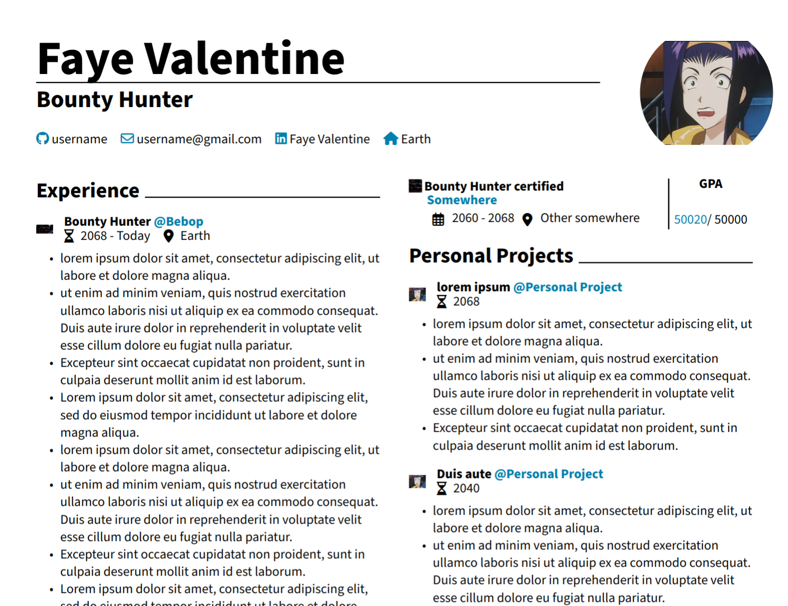

# CV in Typst

These are a minimalistic and modern CV and cover letter written in Typst.

## Setup

- Install [Typst](https://typst.app) and the font awesome fonts on your system, see [guide](https://github.com/duskmoon314/typst-fontawesome).
- Run `typst init @preview/chuli-cv:0.1.0` to start your own CV.
  
## Inspiration

- [brilliant-CV](https://github.com/mintyfrankie/brilliant-CV).
- [light-cv](https://github.com/AnsgarLichter/light-cv).
- [Awesome CV
](https://github.com/posquit0/Awesome-CV).
- [Ritabh Ranjan's CV](https://www.overleaf.com/articles/ritabh-ranjans-cv/ngtndgryfykt).
- [hipster-cv](https://github.com/latex-ninja/hipster-cv).

