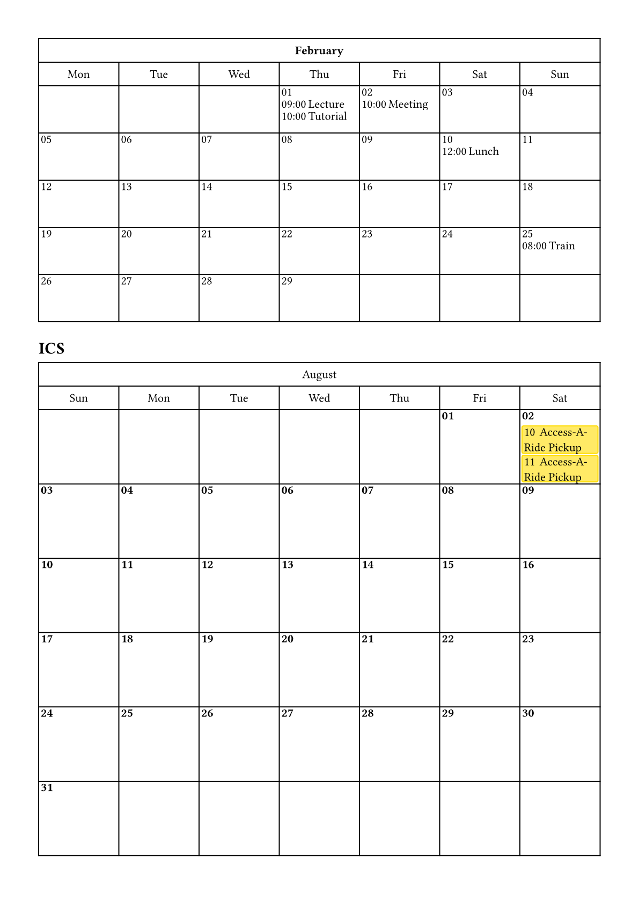
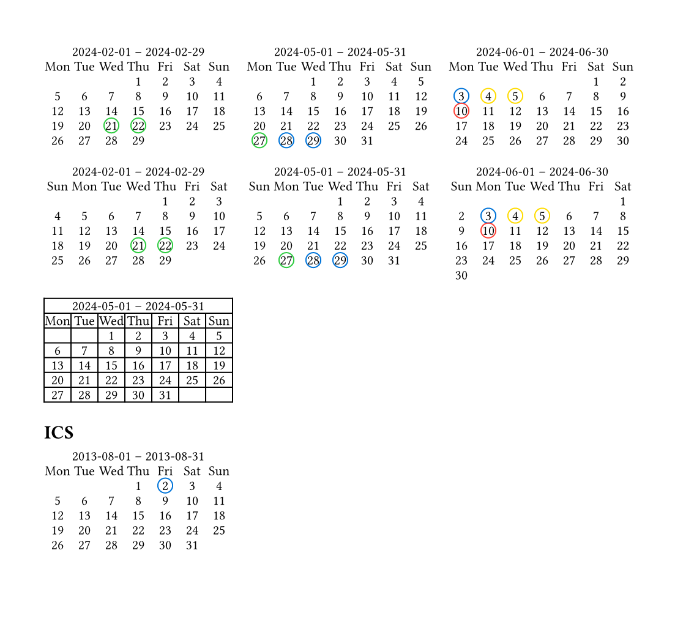

# CINECA: A Typst Package to Create Calendars

CINECA Is Not an Electric Calendar App, but a Typst package to create calendars with events.

## Usage

The package now support creating events from ICS files (thanks @Geronymos).
To do so, read an ICS file and parse with `ics-parser()`.

```typst
#let events2 = ics-parser(read("sample.ics")).map(event => (
  event.dtstart, 
  event.dtstart,
  event.dtend,
  event.summary
))

#calendar(events2, hour-range: (10, 14))
```

### Day view

`calendar(events, hour-range, minute-height, template, stroke)`

Parameters:

- `events`: An array of events. Each item is a 4-element array:
  - Date. Can be `datetime()` or valid args of `day()`.
  - Start time. Can be valid args of `time()`.
  - End time. Can be valid args of `time()`.
  - Event body. Can be anything. Passed to the template.body to show more details.
- `hour-range`: Then range of hours, affacting the range of the calendar. Default: `(8, 20)`.
- `minute-height`: Height of per minute. Each minute occupys a row. This number is to control the height of each row. Default: `0.8pt`.
- `template`: Templates for headers, times, or events. It takes a dictionary of the following entries: `header`, `time`, and `event`. Default: `(:)`.
- `stroke`: A stroke style to control the style of the default stroke, or a function taking two parameters `(x, y)` to control the stroke. The first row is the dates, and the first column is the times. Default: `none`.

> [!NOTE]
> See below for more details about the format of start time and end time.

Example:


### Month view

`calendar-month(events, template, sunday-first, ..args)`

- `events`: Event list. Each element is a two-element array.
  - Day. A datetime object.
  - Additional information for showing a day. It actually depends on the template `day-body`. For the deafult template, it requires a content.
- `template`: Templates for headers, times, or events. It takes a dictionary of the following entries: `day-body`, `day-head`, `month-head`, and `layout`.
- `sunday-first`: Whether to put sunday as the first day of a week.
- `..args`: Additional arguments for the calendar's grid.

Example:

```typst
#let events = (
  (daytime("2024-2-1", "9:0:0"), [Lecture]),
  (daytime("2024-2-1", "10:0:0"), [Tutorial]),
  (daytime("2024-2-2", "10:0:0"), [Meeting]),
  (daytime("2024-2-10", "12:0:0"), [Lunch]),
  (daytime("2024-2-25", "8:0:0"), [Train]),
)

#calendar-month(
  events,
  sunday-first: false,
  template: (
    month-head: (content) => strong(content)
  )
)
```

```typst
#let events2 = (
  (datetime(year: 2024, month: 5, day: 1, hour: 9, minute: 0, second: 0), ([Lecture], blue)),
  (datetime(year: 2024, month: 5, day: 1, hour: 10, minute: 0, second: 0), ([Tutorial], red)),
  (datetime(year: 2024, month: 5, day: 1, hour: 11, minute: 0, second: 0), [Lab]),
)

#calendar-month(
  events2,
  sunday-first: true,
  rows: (2em,) * 2 + (8em,),
  template: (
    day-body: (day, events) => {
      show: block.with(width: 100%, height: 100%, inset: 2pt)
      set align(left + top)
      stack(
        spacing: 2pt,
        pad(bottom: 4pt, text(weight: "bold", day.display("[day]"))),
        ..events.map(((d, e)) => {
          let col = if type(e) == array and e.len() > 1 { e.at(1) } else { yellow }
          show: block.with(
            fill: col.lighten(40%),
            stroke: col,
            width: 100%,
            inset: 2pt,
            radius: 2pt
          )
          d.display("[hour]")
          h(4pt)
          if type(e) == array { e.at(0) } else { e }
        })
      )
    }
  )
)
```



### Month-summary view

`calendar-month-summary(events, template, sunday-first, ..args)`

- `events`: Event list. Each element is a two-element array.
  - Day. A datetime object.
  - Additional information for showing a day. It actually depends on the template `day-body`. For the deafult template, it requires an array of two elements.
    - Shape. A function specify how to darw the shape, such as `circle`.
    - Arguments. Further arguments for render a shape.
- `template`: Templates for headers, times, or events. It takes a dictionary of the following entries: `day-body`, `day-head`, `month-head`, and `layout`.
- `sunday-first`: Whether to put sunday as the first day of a week.
- `..args`: Additional arguments for the calendar's grid.

Example:

```typst
#let events = (
  (day("2024-02-21"), (circle, (stroke: color.green, inset: 2pt))),
  (day("2024-02-22"), (circle, (stroke: color.green, inset: 2pt))),
  (day("2024-05-27"), (circle, (stroke: color.green, inset: 2pt))),
  (day("2024-05-28"), (circle, (stroke: color.blue, inset: 2pt))),
  (day("2024-05-29"), (circle, (stroke: color.blue, inset: 2pt))),
  (day("2024-06-03"), (circle, (stroke: color.blue, inset: 2pt))),
  (day("2024-06-04"), (circle, (stroke: color.yellow, inset: 2pt))),
  (day("2024-06-05"), (circle, (stroke: color.yellow, inset: 2pt))),
  (day("2024-06-10"), (circle, (stroke: color.red, inset: 2pt))),
)

#calendar-month-summary(
  events: events
)

#calendar-month-summary(
  events: events,
  sunday-first: true
)

// An empty calendar
#calendar-month-summary(
  events: (
    (datetime(year: 2024, month: 05, day: 21), (none,)),
  ),
  stroke: 1pt,
)
```



## Day/Time/Daytime Format

In addition to using `datetime()` to set up time, the package provided some other ways,
supported by functions `day()`, `time()`, and `daytime()`.

```typst
- #time(8)
- #time(8, 10)
- #time(8, 10, 30)
- #time("8.30")
- #time(decimal("12.10"))
- #time(14.10)            // 24-hour format
- #time("8:10:08")

- #day(2024)
- #day(2024, 2)
- #day(2024, 2, 5)    // year, month, day
- #day("2024-3-7")    // ISO format (year-month-day)
- #day("26/12/2024")  // British format (day/month/year)

- #daytime(2024)
- #daytime(2024, 2)
- #daytime(2024, 2, 5)
- #daytime(2024, 2, 5, 8)
- #daytime(2024, 2, 5, 8, 10)
- #daytime("2024-6-1", 8)
- #daytime("2024-6-1", 8, 10)
- #daytime("2024-6-1", 8, 10, 30)
- #daytime(2024, "12:00")
- #daytime(2024, 2, "12:00")
- #daytime(2024, 2, 5, "12:00")
- #daytime("2024-3-7", "11:30:45")
- #daytime("2024-12-26 8:30")
```

## Limitations

- Page breaking may be incorrect.
- Items will overlap when they happens at the same time.
