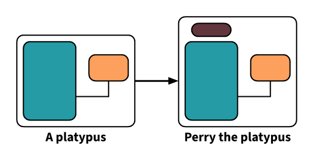
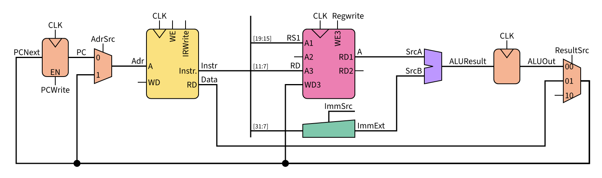
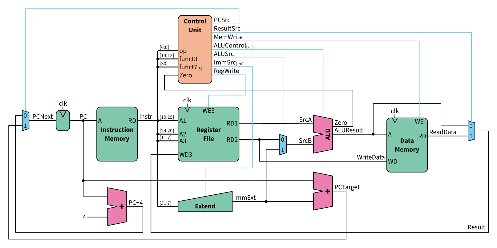
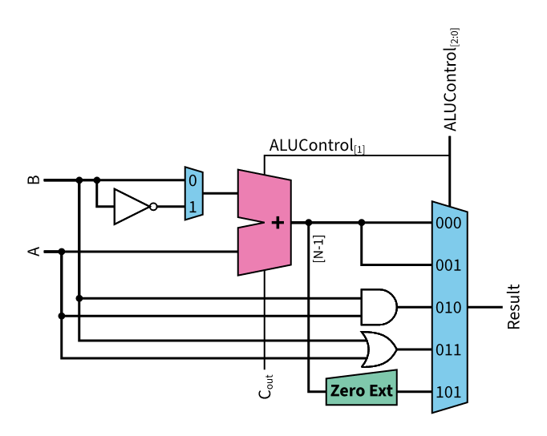

# circuiteria

Circuiteria is a [Typst](https://typst.app) package for drawing block circuit diagrams using the [CeTZ](https://typst.app/universe/package/cetz) package.

<p align="center">
  
</p>

## Examples
<table>
  <tr>
    <td colspan="2">
      <a href="./gallery/test.typ">
        
      </a>
    </td>
  </tr>
  <tr>
    <td colspan="2">A bit of eveything</td>
  </tr>
  <tr>
    <td colspan="2">
      <a href="./gallery/test5.typ">
        
      </a>
    </td>
  </tr>
  <tr>
    <td colspan="2">Wires everywhere</td>
  </tr>
  <tr>
    <td>
      <a href="./gallery/test4.typ">
        
      </a>
    </td>
    <td>
      <a href="./gallery/test6.typ">
        
      </a>
    </td>
  </tr>
  <tr>
    <td>Groups</td>
    <td>Rotated</td>
  </tr>
</table>

> **Note**\
> These circuit layouts were copied from a digital design course given by prof. S. Zahno and recreated using this package

*Click on the example image to jump to the code.*

## Usage
For more information, see the [manual](manual.pdf)

To use this package, simply import [circuiteria](https://typst.app/universe/package/circuiteria) and call the `circuit` function:
```typ
#import "@preview/circuiteria:0.1.0"
#circuiteria.circuit({
  import circuiteria: *
  ...
})
```