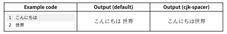
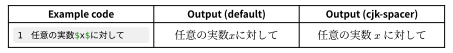
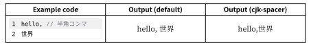
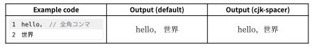
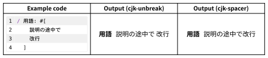

# cjk-spacer

Typst で日本語（CJK文字）を組むときの文字間の空きを改善するパッケージ．\
A package to improve spacing between characters when typesetting Japanese (CJK) characters in Typst.

## 機能 Features

* 和文を途中で改行した場合にスペースを入れない．\
  Prevents adding spaces when a Japanese text line breaks in the middle.

  

* 数式と和文の間のスペースを自動で挿入．\
  Automatically inserts spaces between mathematical formulas and Japanese text.

  


## 使い方 Usage

文書の冒頭に以下の行を追加する．show rule の定義は文書ごとに１回でよい．\
Add the following lines to the beginning of your document.
The show rule definition is only needed once per document.

```typst
#import "@preview/cjk-spacer:0.1.0": cjk-spacer
#show: cjk-spacer
```

デフォルトでは言語が日本語 `"ja"` に設定されているので，他の言語を使う際は，以下のように設定してください．\
The default language is set to Japanese ("ja").
If you wish to use other languages, please configure it as follows.

```typst
#import "@preview/cjk-spacer:0.1.0": cjk-spacer
#show: cjk-spacer.with(lang: "zh")
```


## 制限事項 Limitations
半角のコンマやピリオドなどの句読点の後に改行し和文を続けた場合，間にスペースが入りません． \
If you break a line after a half-width punctuation mark (like a comma or period) and follow it with Japanese text, a space will not be inserted.



和文との接続には全角の句読点を使うようにしてください． \
Please use full-width punctuation marks to connect with Japanese text.



## 別の手段 Alternative methods

* [cjk-unbreak](https://typst.app/universe/package/cjk-unbreak):
  和文（CJK文）の途中で改行した場合の間のスペースを除去するパッケージ．cjk-spacer の１つ目の機能と挙動はほぼ同じだが，実装方法が異なる．
  cjk-unbreak は Typst の文書 AST を再帰的に探査して，和文の前後のスペースを除去していくので，一部未だ対応していない要素がある．
  （例えば，`terms` 関数．詳しくは [Typstの「改行すると半角スペース入ってしまう問題」について ](https://note.com/bismuth083/n/n4f0300d3c1cf) のコメントを参照．）
  一方，cjk-spacer は `text` 関数に対して和文の前後にゼロスペースを追加する show rule を定義する方式なので，すべての `text` に対して作用する．
  \
  A package that removes spaces inserted when a Japanese (CJK) text line breaks in the middle. Its behavior for the first feature is almost the same as cjk-spacer, but the implementation is different.
  cjk-unbreak recursively traverses the Typst document AST to remove spaces before and after Japanese text, so some elements are not yet supported.
  (For example, the `terms` function. See the comments on [Typstの「改行すると半角スペース入ってしまう問題」について ](https://note.com/bismuth083/n/n4f0300d3c1cf) for details.)
  On the other hand, cjk-spacer uses a method that defines a show rule to add zero-width spaces before and after Japanese text for the `text` function, so it affects all `text` elements.

  

* [Typstで和文と数式の間の空きをどうにかしたい話](https://qiita.com/zr_tex8r/items/a9d82669881d8442b574):
  和文と数式の間のスペース問題に関する詳細な記事．cjk-spacer とは別の解決策も提示されてるが，外部フォントが必要である．
  \
  A detailed article on the spacing issue between Japanese text and mathematical expressions. It presents other solutions besides cjk-spacer, but they require some external font.
