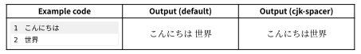
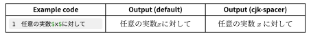
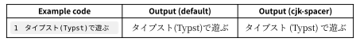
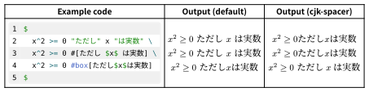
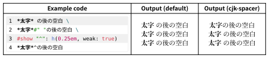

# cjk-spacer

Typst で日本語（CJK文字）を組むときの文字間の空きを改善するパッケージ．\
A package to improve spacing between characters when typesetting Japanese (CJK) characters in Typst.

## 機能 Features

* 和文を途中で改行した場合にスペースを入れない．\
  Prevents adding spaces when a Japanese text line breaks in the middle.

  

* 数式と和文の間のスペースを自動で挿入．\
  Automatically inserts spaces between mathematical expressions and Japanese text.

  

* 半角約物と和文の間のスペースを自動で挿入．\
  Automatically inserts spaces between western punctuation marks and Japanese text.

  


## 使い方 Usage

文書の冒頭に以下の行を追加する．show rule の定義は文書ごとに１回でよい．\
Add the following lines to the beginning of your document.
The show rule definition is only needed once per document.

```typst
#import "@preview/cjk-spacer:0.2.1": cjk-spacer
#show: cjk-spacer
```


## 制限事項 Limitations
数式内の和文テキストと数式の間に関しては自動スペースがうまく機能しません．その場合，`box` 関数でテキストを囲むようにしてください．\
Automatic spacing does not work well between Japanese text inside an equation and the equation itself.
In such cases, please wrap the text in a `box` function.



和文と他の element（太字など）の和文との間に明示的に半角スペースを入れることができません．代わりに空白文字`#" "`を挿入してください．多用する場合は四分空きのコマンドを定義すると便利でしょう．\
It is not possible to explicitly insert a half-width space between Japanese text and other styled Japanese text elements (e.g., bold text).
Instead, please insert a space character `#" "`.
If you need this frequently, it may be useful to define a command for a quarter-em space.




## 別の手段 Alternative methods

* [cjk-unbreak](https://typst.app/universe/package/cjk-unbreak):
  和文（CJK文）の途中で改行した場合の間のスペースを除去するパッケージ．cjk-spacer の１つ目の機能と挙動はほぼ同じだが，実装方法が異なる．
  cjk-unbreak は Typst の文書 AST を再帰的に探査して，和文の前後のスペースを除去していくという方式である．一方，cjk-spacer は `text` 関数に対して和文の前後にゼロスペースを追加する show rule を定義する方式である．
  \
  A package that removes spaces inserted when a Japanese (CJK) text line breaks in the middle. Its behavior for the first feature is almost the same as cjk-spacer, but the implementation is different.
  cjk-unbreak recursively traverses the Typst document AST to remove spaces before and after Japanese text. On the other hand, cjk-spacer defines a show rule to add zero-width spaces before and after Japanese text for the `text` function.

* [Typstで和文と数式の間の空きをどうにかしたい話](https://qiita.com/zr_tex8r/items/a9d82669881d8442b574):
  和文と数式の間のスペース問題に関する詳細な記事．cjk-spacer とは別の解決策も提示されてるが，外部フォントが必要である．
  \
  A detailed article on the spacing issue between Japanese text and mathematical expressions. It presents other solutions besides cjk-spacer, but they require some external font.


## 変更履歴 Change logs

* v0.2.1:
  - show rule の再帰呼び出しが上限回数を超える問題を修正．\
    Fixed an issue where the show rule recursion exceeded the maximum depth.
* v0.2.0:
  - 和文と半角約物の間にスペースを自動で挿入する機能を追加．\
    Added a feature to automatically insert spaces between Japanese text and western punctuation marks.
  - `lang` パラメータの廃止．\
    Removed the `lang` parameter.
* v0.1.0: Initial release.
