# clanker-slop-nicematrix

The mathematical side of LaTeX's [nicematrix](https://ctan.org/pkg/nicematrix)
package, with a Typst API: dotted leaders that stretch between cells, blocks,
rules, fills, exterior label rows and columns, braces and sub-matrices. It
also includes the paths and flood fills of the Typst package
[pavemat](https://github.com/QuadnucYard/pavemat). You write a normal Typst
matrix: `,` between cells, `;` between rows, and `dots.c` / `dots.v` /
`dots.down` where the dots go.

```typ
#import "@preview/clanker-slop-nicematrix:0.1.1": *

$ A = nicemat(delim: "[",
  a_11, dots.c, a_(1 n);
  dots.v, dots.down, dots.v;
  a_(m 1), dots.c, a_(m n)) $
```

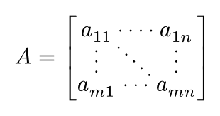

Plain matrices come out **exactly** like `mat` (same size, same delimiters,
same cramped cells). Add one show rule at the top of the document so that
matrices in inline equations (and nested ones) get the smaller cells of an
inline `mat`; `mat: true` also switches every `mat` over:

```typ
#show: nicemat-setup                  // inline matrices sized like `mat`
#show: nicemat-setup.with(mat: true)  // … and every `mat` gets leaders
Inline: $mat(1, dots.c, 1; dots.v, dots.down, dots.v; 1, dots.c, 1)$.
```

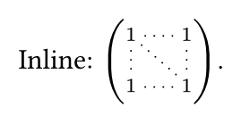

The tabular half of nicematrix (`{NiceTabular}`, notes, captions, X/V/S
columns, trees) is out of scope: use `table` for that.

## Usage

Import the package from Typst Universe; everything you need is exported:

```typ
#import "@preview/clanker-slop-nicematrix:0.1.1": *
```

The functions keep short names that work in math: `nicemat`, `nicearray`, the
leaders `cdots`, `vdots`…, and the markers `cell`, `hline`, `submatrix`,
`connect`, `pave`… (see the reference below). Outside a `nicemat`, the
markers fall back to their plain look (dots, the body of a `cell`…).

The whole library is a single file,
[`nicematrix.typ`](https://github.com/coder56765/clanker-slop-nicematrix/blob/v0.1.1/nicematrix.typ),
without dependencies. You can also copy it into a project and write
`#import "nicematrix.typ": *`. Its internal helpers all start with `_`, so
`import *` only brings in the functions above.

## A tour

The full documentation is [`documentation.pdf`](docs/documentation.pdf?raw=true)
(source: [`documentation.typ`](https://github.com/coder56765/clanker-slop-nicematrix/blob/v0.1.1/docs/documentation.typ),
in the repository of the package). It has four parts, and every example in it
shows the code that produced the result:

1. **Getting started**: installation, a guided tour, and the conventions.
2. **User guide**: one chapter per feature. It includes the examples of the
   pavemat manual, ported to `pave` and `flood`.
3. **Reference**: every option and marker, with its nicematrix or pavemat
   equivalent.
4. **The nicematrix manual, example by example**: the 88 examples of the
   mathematical environments, each with the original LaTeX and its page in
   the manual. The examples that are not ported are listed with the reason
   (`{NiceTabular}`, TikZ decorations, LaTeX configuration).

### Paths and flood fills (from pavemat)

`pave(path)` draws a path along the grid lines. The path is a string of
directions: `W` (up), `A` (left), `S` (down), `D` (right). Lower-case letters
move without drawing, and `(key: value)` groups change the stroke until the
next `]`. `flood(from, fill:)` fills the cells connected to `from` without
crossing a path:

```typ
$ nicemat(1, 2, 3; 4, 5, 6; 7, 8, 9,
  pave("DDSSAAW", stroke: #(dash: "dashed")),
  flood((1, 1), fill: #red.transparentize(80%))) $
```

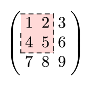

### Dotted leaders

In a `nicemat`, the symbols `dots.h` (or `...`), `dots.c`, `dots.v`,
`dots.down` and `dots.up` are not glyphs any more. They are leaders drawn
between the nearest non-empty cells on both sides. Empty cells in between
are crossed, and consecutive dots of the same kind make a single line.

```typ
$ nicemat(delim: "[",
  0, dots.c, dots.c, 0;
  dots.v, , , dots.v;
  0, dots.c, dots.c, 0) $
```

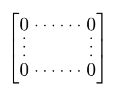

For options, use the functions `ldots`, `cdots`, `vdots`, `ddots` and
`iddots` (or `dots: (..)` for all the leaders; there, `fill` can be a function
`(i, j) => color` of the cell where a leader starts):

```typ
$ nicemat(1, 2, 3, 4, 5;
  1, cdots(span: #3), 5;          // like \Hdotsfor{3}
  1, 2, 3, 4, 5) $

$ nicemat(delim: "[",
  1, #h(1cm), 0;                  // cells with only #h(..) count as empty
  , ddots(above: n "times"), ;    // labels: above, below, middle
  0, , 1) $
```

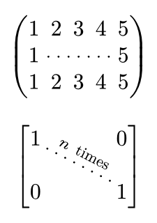

### Blocks, rules, fills and corners

`cell(body, rowspan:, colspan:)` works like `table.cell`. The positions it
covers are skipped automatically, so you don't write placeholders for them.
`\` breaks a cell or a block into lines. Rules are drawn in the middle of the
gaps, like `mat`'s `augment`. They never cross blocks, leaders, empty corners
or the exterior rows. `hvlines: #true` gives all of them, `borders: #false`
leaves out the outer ones.

```typ
$ nicemat(delim: "[", hvlines: #true, margin: #0.2em,
  cell(#text(1.5em)[$A$], rowspan: #3, colspan: #3), 0;
  dots.v;
  0;
  0, dots.c, 0, 0) $

$ nicearray(hvlines: #true, borders: #false,
  cell(x + y \ = z, rowspan: #2), a; b; 1, 2) $

$ nicearray(corners: #(top + right), hlines: #true, vlines: #true,
  1; 1, 1; 1, 2, 1; 1, 3, 3, 1; 1, 4, 6, 4, 1) $
```

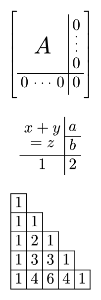

Rules can also be written as markers among the cells, like `table.hline`:

```typ
$ nicemat(1, 2, 3;
  hline();                                   // between the rows
  4, vline(), 5, 6;                          // after the cell it follows
  hline(start: #1, stroke: #(dash: "dashed"));
  7, 8, 9;
  hline(); hline();                          // two markers: a double rule
  10, 11, 12) $
```

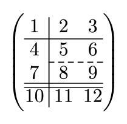

Backgrounds use `fill`, like `table`: a color, an array cycled over the
columns, or a function `(i, j) => color`. Use `cell(.., fill:)` for a block
and `region(from, to, ..)` for any rectangle of cells, or `region(row: 1)`,
`region(cols: (0, 2))` for whole rows and columns.

```typ
$ nicemat(margin: #0.25em,
  fill: #((i, j) => if calc.even(i + j) { red.lighten(85%) } else { blue.lighten(85%) }),
  1, 2, 3; 4, 5, 6; 7, 8, 9) $

$ nicemat(1, 2, 3; 4, 5, 6; 7, 8, 9,
  region(row: 1, fill: #yellow.lighten(50%))) $
```

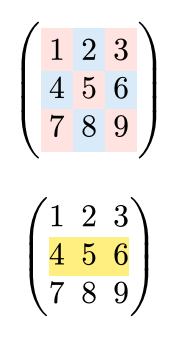

### Exterior rows and columns, braces

`first-row`, `last-row`, `first-col` and `last-col` put the first/last row or
column outside the delimiters. Leaders, `hbrace` and `vbrace` work there too.

```typ
$ nicearray(first-row: #true, last-row: #true, first-col: #true, last-col: #true,
  hlines: #true, vlines: #true,
  , hbrace(p, span: #3), hbrace(q, span: #2);
  vbrace(p, span: #3), 1, 1, 134, 1, 1, vbrace(p, span: #3);
  1, 1, 134, 1, 1;                 // the braces cover the first column here
  1, 1, 13456, 1, 1;
  vbrace(q, span: #2), 1, 1, 134, 1, 1, vbrace(q, span: #2);
  1, 1, 134, 1, 1;
  , hbrace(p, span: #3), hbrace(q, span: #2)) $
```

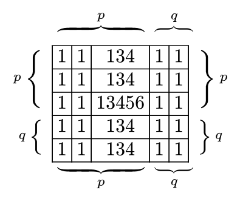

### Sub-matrices, braces over cells, free leaders and arrows

These decorations take two corners `(row, col)` (or whole rows and columns:
`rows: (a, b)`, `cols: (a, b)`) and can be written anywhere among the
arguments:

```typ
$ nicearray(1, 1, 1, x; frac(1, 4), frac(1, 2), frac(1, 4), y; 1, 2, 3, z,
  submatrix((0, 0), (2, 2)),           // room is made for the delimiters
  submatrix((0, 3), (2, 3))) $

$ nicemat(1, 1, 1; 1, a, b; 1, c, d,
  submatrix((1, 1), (2, 2), delim: "[", sup: T)) $

$ nicemat(1, 2, 3, 4, 5, 6; 11, 12, 13, 14, 15, 16,
  hbrace((0, 0), (1, 2), A),                    // like \OverBrace
  hbrace((0, 0), (1, 5), "all", side: #bottom), // like \UnderBrace
  vbrace((0, 0), (1, 5), 2 "rows")) $

$ nicemat(1, 2, 3; 4, 5, 6,
  hbrace(n, cols: (0, 1)),             // whole columns
  vbrace(m, rows: (0, 1))) $

$ nicemat(I, 0, dots.c, 0; 0, I, dots.down, dots.v; dots.v, dots.down, I, 0; 0, dots.c, 0, I,
  dotline((1, 1), (2, 2))) $            // like \line in \CodeAfter

$ nicearray(column-gap: #3em, row-gap: #2em,
  A, B; C, D,
  connect((0, 0), (0, 1), above: f),   // an arrow
  connect((0, 0), (1, 1), bend: -25)) $ // bent, like TikZ's `bend left`
```

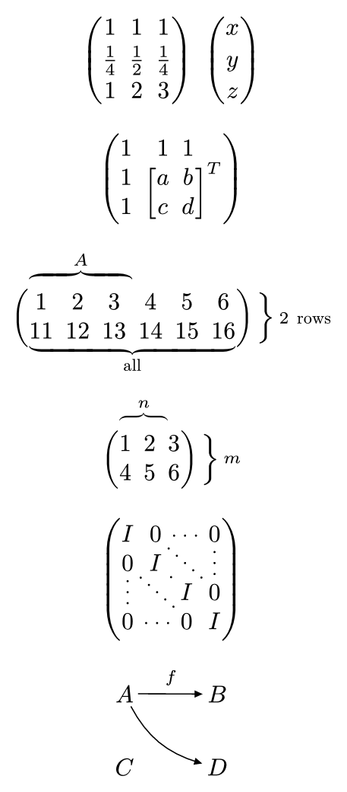

### Stacks of matrices

Matrices inside `nicemat-group[..]` share their column and delimiter
widths, so their columns line up. This is nicematrix's `{NiceMatrixBlock}`
with `auto-columns-width`.

### Your own drawings

`background` and `foreground` take content or a function receiving the
geometry of the matrix. This replaces the TikZ nodes, `\CodeBefore` and
`\CodeAfter`. Coordinates are relative to the top-left corner of the matrix,
ready for `place`:

```typ
$ nicemat(foreground: #(g => {
    let (a, b) = (g.cells.at(0).at(0).ink, g.cells.at(2).at(2).ink)
    place(line(start: (a.x + a.width, a.y + a.height), end: (b.x, b.y),
      stroke: (paint: red, dash: "dashed")))
  }),
  1, 0, 0; 0, 1, 0; 0, 0, 1) $
```

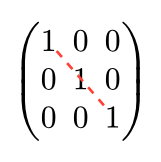

Give matrices a `name` to draw between them (TikZ's `remember picture`):

```typ
$ A = nicemat(name: "A", 1, 2; 3, 4) quad B = nicemat(name: "B", a, b; c, d) $
#nicemat-connect(("A", (0, 1)), ("B", (0, 0)), bend: 30deg)
```

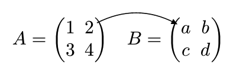

`nicemat-cell(name, (i, j))` gives the position of a cell on the page (in a
`context`). `debug: #true` shows the index and tile of every cell and the
numbers of the rules (`"cells"` or `"rules"` for one of them).

## Conventions

- **Math mode.** Values that are not math need `#`: `#true`, `#red`, `#2pt`,
  `#(dash: "dashed")`. Small integers (`span: 3`), coordinates (`(0, 2)`)
  and lists of indices (`hlines: (1, -1)`) work without it.
- **Aliases** used in math need at least two letters. `#let m = nicemat.with(..)`
  can't be called as `$m(..)$`, because Typst reads `m` as a variable; name it
  `mm` or `mymat`.
- **Cells** are addressed `(row, col)`, from 0, **as written**, including the
  exterior rows and columns. Negative numbers count from the end.
  `fill`, `align` and `map-cells` receive `(i, j)` the same way.
- **Rules** only exist inside the main block. So `hlines`, `vlines`,
  `augment`, `hline(y:)` / `vline(x:)` and the `start` / `end` of the rule
  markers count within it, exactly like `mat`'s `augment`. Line 0 is the
  top/left border, `-1` the last interior line. `true` means all interior
  lines, plus the borders when there are no delimiters.
- **Spans** skip the covered positions, as in `table`: don't write empty
  placeholders under a spanning `cell`, `cdots(span:)` or brace.
- **Rectangles** (`region`, `submatrix`, braces): two corners, or `row:`,
  `rows: (a, b)`, `col:`, `cols: (a, b)`; the other direction is then the
  whole matrix inside the delimiters.
- **Defaults for a document:** `#let nicemat = nicemat.with(..)` or
  `#show math.mat: nicemat.with(..)`. `set math.mat(delim:, align:, gap:,
  row-gap:, column-gap:)` is honoured too.

## Reference

### `nicemat(..rows, ..options)` / `nicearray` (same, `delim: none`)

| option | default | meaning (nicematrix equivalent) |
|---|---|---|
| `delim` | from `mat` | `"("`, `"["`, `"{"`, `"\|"`, `"‖"`, any extensible symbol (`"↓"`…), a pair `("[", ")")` or `none` |
| `delim-fill` | `auto` | color of the delimiters (`delimiters/color`) |
| `align` | from `mat` | alignment, array (one per column) or `(i, j) => alignment` (`l`/`c`/`r`, `columns-type`) |
| `gap`, `row-gap`, `column-gap` | from `mat` | a length, or an array with one value per gap, like `grid` gutters (`\\[..]`, `@{..}`) |
| `augment` | `none` | as in `mat` |
| `hlines`, `vlines` | `none` | `true`, an index or an array of indices (`hlines`, `vlines`) |
| `hvlines` | `false` | `true`: both `hlines` and `vlines` (`hvlines`) |
| `borders` | `auto` | outer rules of `hlines`/`vlines: true`: `auto` (only without delimiters), `true`, `false` (`hvlines-except-borders`) |
| `stroke` | `0.05em` | stroke of the rules (`rules/color`, `rules/width`) |
| `fill` | `none` | color, array (cycled over columns) or `(i, j) => color` (`\rowcolor`, `\rowcolors`, `\chessboardcolors`, …) |
| `corners` | `none` | `true` (the four corners) or alignments: `top + left`, …, `top`, `right`, … (`corners`) |
| `first-row`, `last-row`, `first-col`, `last-col` | `false` | exterior rows and columns |
| `map-cells` | `none` | `(i, j, body) => body` (`code-for-first-row`, `\RowStyle`) |
| `cell-space` | `0pt` | minimum room between ink and row edges; length or `(top:, bottom:)` (`cell-space-limits`) |
| `margin` | `auto` | room inside the delimiters; length or dictionary (`margin`, `extra-margin`) |
| `column-width` | `auto` | a minimum length, one per column (`(auto, 1cm)`, like `w{c}{1cm}`), or `"equal"` (`columns-width`) |
| `baseline` | `horizon` | `top`, `horizon`, `bottom`, a row index, or `(line: k)` to put a rule on the axis (`baseline`) |
| `small` | `auto` | `auto`: like `mat` (smaller in inline equations under `nicemat-setup`, and when nested); `true`: script cells, tighter gaps and dots (`small`); `false`: display cells |
| `dots` | `(:)` | options of the leaders, see below (`xdots/..`) |
| `background`, `foreground` | `none` | content or `(geometry) => content` |
| `name` | `none` | name for `nicemat-cell` / `nicemat-connect` (`name`) |
| `debug` | `false` | `true`, `"cells"` or `"rules"`: indices and tiles, rule numbers (`\ShowCellNames`) |

### Leaders: `ldots`, `cdots`, `vdots`, `ddots`, `iddots`

The same keys are accepted in `nicemat(dots: (..))` for every leader, and by
`dotline` and `connect`.

| option | default | meaning |
|---|---|---|
| `symbols` (in `dots` only) | `true` | turn dots symbols into leaders |
| `span` (leader only) | `1` | cover several columns (`ldots`, `cdots`) or rows (`vdots`), like `\Hdotsfor` / `\Vdotsfor` (even `span: 1`) |
| `above`, `below`, `middle` (leader only) | `none` | labels (`^`, `_`, `:`) |
| `horizontal-labels` | `false` | keep the labels horizontal |
| `fill` | text color | color of the dots, or `(i, j) => color` of the cell where the leader starts (`none`: text color) |
| `stroke` | `auto` | `auto`: round dots; a stroke: a line (`line-style`) |
| `radius`, `spacing` | `0.53pt`, `0.45em` | dot size and distance (`radius`, `inter`); 70% in small cells |
| `shorten`, `shorten-start`, `shorten-end` | `0.3em` | gap at the closed ends; 70% in small cells |
| `bend` (`dotline`, `connect`) | `0` | an angle or a number of degrees: a curve bent left (right when negative), like TikZ's `bend left` |
| `nullify` | `false` | leaders take no room (`nullify`) |
| `parallel` (in `dots` only) | `true` | draw diagonals parallel to the first (`parallelize-diags`) |
| `first` (leader only) | `false` | reference diagonal for the parallel ones (`draw-first`) |
| `marks`, `mark-size` | `none`, `4pt` | arrow tips: `"->"`, `"<-"`, `"<->"` |
| `label-fill` | page fill | background of `middle` labels |

### Markers

| marker | options |
|---|---|
| `cell(body)` | `rowspan`, `colspan`, `fill`, `stroke` (`true`, a stroke, or one per side like `rect`), `radius`, `outset` (length or `(x:, y:)`), `align`, `transparent` (rules cross it), `empty` (`\NotEmpty`) |
| `diagbox(lower, upper)` | a cell slashed diagonally (`\diagbox`); also as the body of a spanning `cell`; `stroke` |
| `hline()` / `vline()` | `start`, `end` (end excluded), `stroke`, `y` / `x` |
| `hbrace(label, span:)` / `vbrace(label, span:)` | in exterior rows/columns: `fill`, `shift` |
| `hbrace(from, to, label)` / `vbrace(from, to, label)` | `side` (`top`/`bottom`, `right`/`left`), `shorten`, `shift`, `fill`; also `hbrace(label, cols: (a, b))`, `vbrace(label, rows: (a, b))` |
| `submatrix(from, to)` | or `row:`/`rows:`/`col:`/`cols:`; `delim`, `sup`, `sub`, `hlines`, `vlines` (relative to the sub-matrix), `stroke`, `slim`, `xshift`, `left-xshift`, `right-xshift`, `extra-height`, `fill`, `reserve`, `bound` |
| `region(from, to)` | or `row:`/`rows:`/`col:`/`cols:`; `fill`, `stroke` (one per side allowed), `radius`, `outset`, `fit` (`"cells"`/`"content"`), `above` |
| `dotline(from, to)` | leader options, `bend` |
| `connect(from, to)` | an arrow: a `dotline` with a solid line and `marks: "->"` |
| `pave(path)` | a path along the grid lines (pavemat): `from` (grid point `(i, j)` counted within the matrix, or a corner `top + right`), `stroke`, `chars` (other letters than `WASD`) |
| `flood(from)` | fills the cells connected to `from` without crossing a path: `fill` |

### Functions

| function | use |
|---|---|
| `#show: nicemat-setup` | inline and nested matrices sized like `mat`; `.with(mat: true)` also draws every `mat` with `nicemat` |
| `nicemat-group[..]` | the matrices inside share their column widths (`{NiceMatrixBlock}`) |
| `nicemat-cell(name, (i, j))` | in a `context`: `none` or the cell of a named matrix on the page (`page`, `x`, `y`, `width`, `height`, `ink`, `baseline`) |
| `nicemat-connect((name, (i, j)), (name, (i, j)))` | a line between cells of named matrices on one page; options of `connect` |

### Geometry (for `background` / `foreground`)

`width`, `height`, `baseline`, `axis`, `main` (rect of the main block),
`rows` (`top`, `baseline`, `bottom`, `tile-top`, `tile-bottom`), `cols`
(`left`, `right`, `tile-left`, `tile-right`), `cells.at(i).at(j)` (tile
`x`, `y`, `width`, `height`, plus `ink`, `baseline`, `empty`, `kind`,
`origin`), and `leaders` (`dir`, `from`, `to`, `open`, `start`, `end`).

## Differences with nicematrix and pavemat

- Cells are set in text style, as in LaTeX and in `mat` inside a display
  equation. Typst gives no way to detect an inline equation without a show
  rule: add `#show: nicemat-setup` to get script-size cells in inline
  equations and nested matrices, like `mat`.
- Nothing needs a second compilation. Everything is measured in one layout
  pass, except `nicemat-group`, which converges in two iterations
  automatically.
- By default, sub-matrices and over/under braces make room for themselves
  instead of overlapping the surroundings (`reserve: #false` restores the
  nicematrix behaviour for sub-matrices).
- Braces use the math font (`overbrace`, stretched `}`) rather than TikZ
  decorations.
- The paths of pavemat use the `stroke` of the matrix: a stroke given to one
  path is added to it (in pavemat it replaces it), and the default is a solid
  rule rather than a dashed line. As in pavemat, a matrix with paths or flood
  fills gets a margin of half a gap around its cells.
- The `fills` of pavemat are split between the `fill` option (whole matrix),
  `region` (a cell or a rectangle) and `flood` (a region bounded by paths).

## Development

The source is at <https://github.com/coder56765/clanker-slop-nicematrix>.
The library is the single file `nicematrix.typ`, in sections ordered so that
every name is defined before it is used (utilities, measuring, markers,
parsing, layout, drawing, leaders, rules, decorations, paths, groups,
`nicemat`, setup, named matrices). `tests/run.sh` compiles every test. The
tests assert the geometry against `mat`, the parsing and the leader
extremities, and render `tests/out/*.png` for visual checks. Build the
documentation from the root of the repository with
`typst compile --root . docs/documentation.typ`.
`docs/readme-examples/render.sh` renders the pictures of this README from its
code blocks (it needs ImageMagick).

## License

The package is released under the MIT license (see [`LICENSE`](LICENSE)).
The paths and flood fills (the section "Paths and flood fills" of
`nicematrix.typ`) are adapted from
[pavemat](https://github.com/QuadnucYard/pavemat) (MIT, © 2024–2025
QuadnucYard).

The documentation, in the `docs` folder of the repository, is not part of the
package, and one of its files is not covered by the MIT license:
[`docs/nicematrix-latex.json`](https://github.com/coder56765/clanker-slop-nicematrix/blob/v0.1.1/docs/nicematrix-latex.json) holds the
code examples of the manual of nicematrix (© François Pantigny), which the
documentation prints next to their Typst ports. They are distributed under the
[LaTeX Project Public License 1.3c](https://www.latex-project.org/lppl/lppl-1-3c/),
like nicematrix itself; the `\emph{..}` highlighting of the manual was
removed. The same excerpts appear in `docs/documentation.pdf`.
