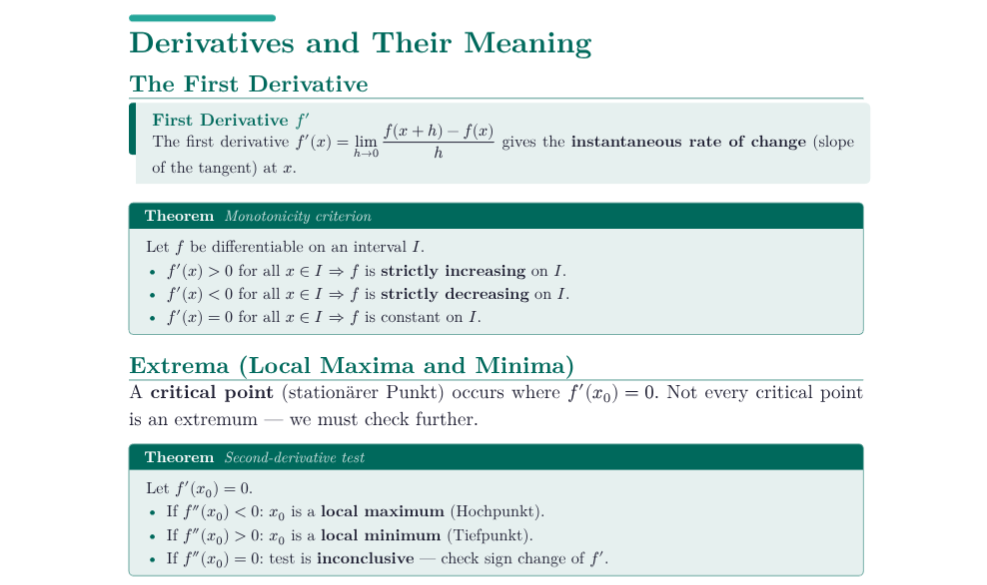

# clari-docs

A comprehensive, highly-customisable Typst template for slides, summaries, and notes. It features four presentation categories, rich built-in components, and full scientific support.



## Quick start

```typst
#import "@preview/clari-docs:0.1.0": *

#show: clari-docs.with(
  category: "professional",  // simple | math | professional | allrounder
  theme:    "midnight",      // named theme or rgb() color
)

#title-slide(
  title:       "My Docs",
  subtitle:    "A clari-docs demo",
  author:      "Your Name",
  institution: "Your University",
)

#overview-slide()

#section-slide[Introduction]

#slide(title: "Hello World", outlined: true)[
  - clari-docs makes beautiful slides easy.
]

#end-slide()
```

## Parameters

### `clari-docs`

| Parameter | Type | Default | Description |
|-----------|------|---------|-------------|
| `category` | string | `"simple"` | `"simple"`, `"math"`, `"professional"`, or `"allrounder"` |
| `theme` | string or color | `"ocean"` | Named theme or `rgb(...)` |
| `accent` | color or none | `none` | Accent color override |
| `font` | string | `"Fira Sans"` | Font family |
| `font-size` | length | `20pt` | Base font size |
| `show-page-numbers` | bool | `true` | Show page numbers |
| `show-progress` | bool | `true` | Show bottom progress bar |
| `progress-height` | length | `3pt` | Progress bar height |
| `back-color` | color | `white` | Default background |

## Themes

| Name | Primary | Category default |
|------|---------|-----------------|
| `"ocean"` | Deep blue | simple |
| `"midnight"` | Navy blue | professional |
| `"forest"` | Forest green | — |
| `"teal"` | Teal | allrounder |
| `"sunset"` | Deep red | — |
| `"amber"` | Warm amber | — |
| `"rose"` | Rose/magenta | — |
| `"lavender"` | Purple | — |
| `"slate"` | Slate grey | math |
| `"charcoal"` | Near-black | — |

## Slide types

| Function | Description |
|----------|-------------|
| `title-slide(...)` | Cover/front slide (category-aware layout) |
| `overview-slide()` | Auto-generated table of contents |
| `section-slide[...]` | Section divider |
| `end-slide(...)` | Closing/thank-you slide |
| `slide(title: ..., outlined: ...)` | Standard content slide |
| `focus-slide[...]` | Full-screen emphasis |
| `blank-slide[...]` | Headerless full-canvas slide |
| `bibliography-slide(bib)` | References slide |

## Components

### Layout
- `cols([...][...])` — multi-column
- `two-col(left, right)` — two-column shorthand
- `img-full(src)`, `img-left(src)[...]`, `img-right(src)[...]`, `img-top(src)[...]`, `img-bottom(src)[...]`
- `comparison(left-title, right-title, left, right)` — side-by-side comparison

### Callouts & boxes
- `callout(type: "note|tip|warning|important|danger|success")[...]`
- `info-v(title: ...)[...]` — vertical info box
- `info-h(title: ...)[...]` — horizontal info box
- `framed(title: ...)[...]` — framed box
- `highlight-box[...]`
- `quote-block(author: ...)[...]`

### Mathematical
- `theorem(title: ..., number: ...)[...]`
- `lemma(...)`, `corollary(...)`, `proposition(...)`
- `definition(term: ...)[...]`
- `proof[...]` — with ∎ QED marker
- `example(...)`, `remark(...)`

### Data
- `data-table(headers: ..., rows: ...)` — styled table
- `step-list(...)` — visual numbered steps
- `timeline(events: ...)` — event timeline
- `bar-chart(data: ...)` — simple bar chart
- `progress-indicator(value, max)` — inline progress bar

### Scientific & math display
- `math-eq(numbered: false)[$ ... $]`
- `math-aligned(...)` — aligned equation system
- `phys-eq(label: ..., unit: ...)[$ ... $]`
- `chem-eq(reactants: ..., products: ..., arrow-type: ...)` 
- `function-def(name, domain, codomain)[...]`
- `pin-eq[$ ... $](annotation1, annotation2, ...)` — annotated equation
- `derivative-display(func, var, order)` 
- `integral-display(integrand, var, lower, upper)`
- `limit-display(expr, var, to)`
- `sum-display(expr, index, from, to)`
- `matrix-display(rows)` — matrix with brackets
- `vector-display(components)` — column/row vector
- `si-value(value, unit, uncertainty)` — SI measurement
- `constants-table(constants)` — physics constants table
- `bar-chart(data)` — simple bar chart

## License

MIT
