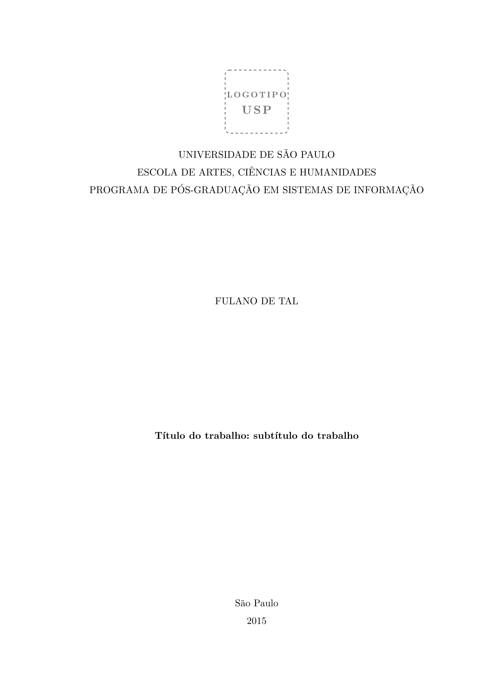

# classic-ppgsi

A dissertation/thesis template for **PPgSI–EACH–USP** (Graduate Program in
Information Systems, University of São Paulo) in [Typst](https://typst.app) —
a 1:1 port of the `abntex2ppgsi` LaTeX class, compliant with ABNT NBR 14724 and
the program's specific adjustments. Document content is in Brazilian Portuguese.



## Usage

```sh
typst init @preview/classic-ppgsi
```

This scaffolds a project from `template/main.typ`, including `referencias.bib`
and the example `assets/`. Then compile:

```sh
typst compile main.typ
```

The entrypoint imports the package and configures the whole document via `thesis`:

```typ
#import "@preview/classic-ppgsi:0.1.0" as ppgsi

#show: ppgsi.thesis.with(
  title: "Título do trabalho: subtítulo do trabalho",
  title-en: "Work title: work subtitle",
  // particles (de, da, dos) go in `given` so the inverted reference reads "TAL, Fulano de"
  author: (given: "Fulano de", surname: "Tal"),
  advisor: [Orientador: Prof. Dr. Fulano de Tal],
  bibliography: read("referencias.bib"),
  catalog-card: image("assets/ficha-1.png", width: 100%, height: 100%, fit: "contain"),
  abstract: (
    pt-br: (body: [Resumo...], keywords: ("palavra1", "palavra2")),
    en-us: (body: [Abstract...], keywords: ("keyword1", "keyword2")),
  ),
  // + siglas, símbolos, banca, dedicatória, epígrafe, etc.
)

= Introdução
...
```

## Features

- Complete front matter: cover, title page, catalog card, errata, approval sheet,
  dedication, acknowledgments, epigraph, abstract (pt/en), lists of
  illustrations/tables, list of acronyms and symbols, table of contents.
- ABNT-style illustrations: `figure`, `table`, `frame` (quadro), `algorithm`,
  `code`, with caption on top and a source line. The source defaults to the
  thesis author and year (`source: auto`); pass content to cite another work,
  or `none` to omit.
- Long direct quotations (`quote`) with the 4 cm ABNT indent.
- Author–date citations and references via a built-in engine (`cite`, `prose`,
  `references`) — see `biblio.typ`.
- Appendices and annexes with independent letters: drop the `appendix` / `annex`
  marker, then write the chapter and its sections with native Typst headings
  (`=`/`==`/`===`); inner sections are numbered automatically and kept out of the
  table of contents.
- Bilingual abstract as a single object (`abstract: (pt-br: ..., en-us: ...)`),
  reused (with `title`/`author`/`keywords`) in the PDF metadata.
- The work's own ABNT reference at the top of each abstract is generated
  automatically from `author`, `title`/`title-en`, year, page count, `degree`
  and institution (`citation: auto` by default; override with content or `none`).
- Validation of mandatory ABNT elements on compile (toggle with `validate: false`).
- Integrated ecosystem packages: acronyms (`@key`, via
  [glossy](https://typst.app/universe/package/glossy)), code highlighting
  ([codly](https://typst.app/universe/package/codly)), checklists
  ([cheq](https://typst.app/universe/package/cheq)), data plots
  ([lilaq](https://typst.app/universe/package/lilaq)) and diagrams
  ([cetz](https://typst.app/universe/package/cetz)).

The USP logo ships with the package (the `logo` parameter), so you don't need to
provide it. The catalog card (`catalog-card`) is specific to each work and must
come from your own project.

## Development

`build.sh` registers this repository in Typst's local package cache
(`@preview/classic-ppgsi`), compiles `template/main.typ`, and produces
`build/main.pdf`, per-page PNGs, and `thumbnail.png`.

## License

[MIT](LICENSE).
