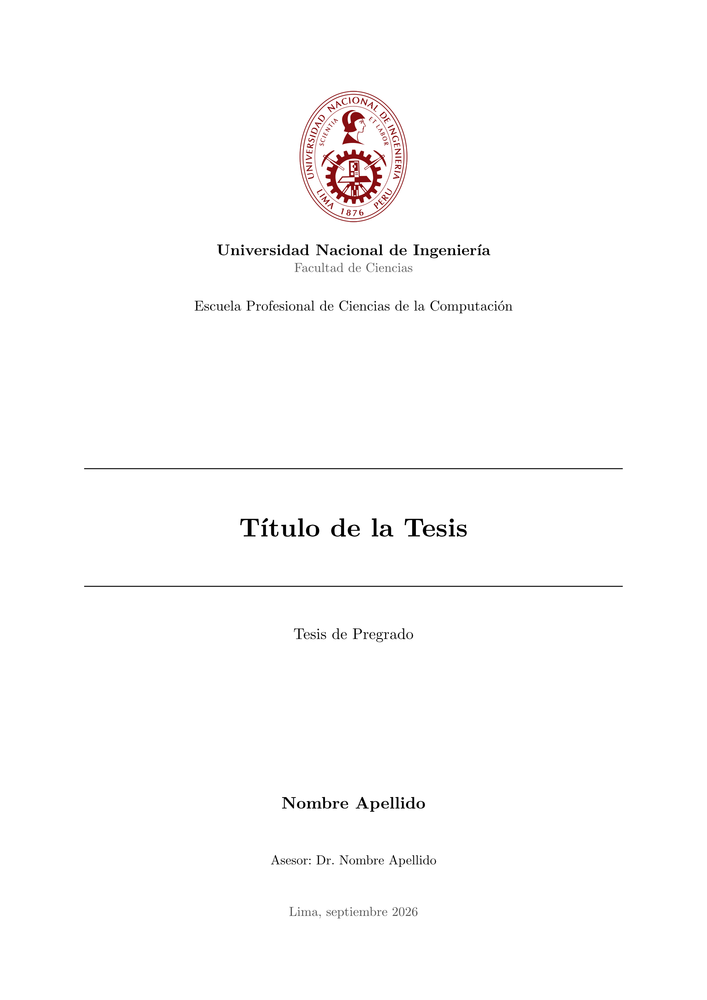

# classic-uni-thesis

Plantilla de Typst para **tesis de pregrado de la Universidad Nacional de
Ingeniería (UNI)**, en español: encabezados serif negros, portada enmarcada por
reglas, material preliminar en números romanos seguido del cuerpo en números
arábigos y citas autor–año (APA). Incluye un ejemplo completo — portada,
certificado, resumen, cuatro capítulos, apéndice, figuras y bibliografía — para
que reemplaces el texto de ejemplo y empieces a escribir de inmediato.

> **Créditos.** Esta plantilla parte de
> [`classic-msc-thesis`](https://github.com/Cobos-Bioinfo/classic-msc-thesis) de
> **Alejandro Cobos** ([@Cobos-Bioinfo](https://github.com/Cobos-Bioinfo)),
> adaptada y traducida para la UNI por **Aarón Flores Alberca**
> ([@bxcowo](https://github.com/bxcowo)). Licencia MIT.



## Características

- **Portada institucional** con el logo de la UNI y el nombre de la universidad
  ya definidos.
- **Material preliminar estructurado**: Certificado de Dirección, Agradecimientos,
  Resumen (+ palabras clave), Índice, Índice de Figuras, Índice de Tablas e
  Índice de Abreviaciones — cada uno opcional.
- **Leyendas cortas en los índices**: `flex-caption` muestra una leyenda larga
  bajo la figura y un título corto en el Índice de Figuras / Tablas.
- **Figuras y tablas** con numeración automática y separada (`Fig. N` /
  `Tabla N`), reglas estilo booktabs y leyendas bien ubicadas (bajo las figuras,
  sobre las tablas).
- **Fechas en español**: `datetime` o texto libre, con los meses localizados.
- **Apto para impresión**: los enlaces y referencias cruzadas se ven en negro
  (siguen siendo clicables en el PDF).
- **Encabezados de página** que muestran el capítulo en curso, numeración
  romana→arábiga y apéndices con letras (A, A.1, …) después de la bibliografía.

## Inicio rápido

### Desde Typst Universe

Una vez publicado el paquete, crea un proyecto con:

```sh
typst init @preview/classic-uni-thesis
cd classic-uni-thesis
typst watch main.typ
```

### Desde este repositorio (desarrollo local)

Los archivos de `template/` importan la librería como
`@preview/classic-uni-thesis:0.1.0`, así que para probarlos en local enlaza el
repositorio en tu carpeta de paquetes:

```sh
DEST="${XDG_DATA_HOME:-$HOME/.local/share}/typst/packages/preview/classic-uni-thesis/0.1.0"
mkdir -p "$(dirname "$DEST")"
ln -s "$(pwd)" "$DEST"

typst compile template/main.typ     # -> template/main.pdf
typst watch   template/main.typ     # vista previa
```

## Estructura del proyecto

```text
lib.typ                # la librería (template `thesis` + helpers)
logo/
  universidad_nacional_de_ingenieria_logo_vector.png
template/
  main.typ             # metadatos + material preliminar + #includes + material final
  chapters/
    01-introduction.typ
    02-methodology.typ
    03-results.typ
    04-discussion.typ  # los cuatro capítulos del cuerpo
    05-appendix.typ    # se renderiza después de las referencias (A, A.1, …)
  figures/
    placeholder.svg    # reemplázalo por tus figuras
  references.bib       # tu bibliografía
```

Solo editas contenido: `template/main.typ` y los archivos de
`template/chapters/`. Todo el diseño lo controla la librería.

## Orden de secciones

El orden lo fija la plantilla:

> Portada → Certificado de Dirección → Agradecimientos → Resumen → Índice →
> Índice de Figuras → Índice de Tablas → Índice de Abreviaciones →
> **Introducción → Metodología → Resultados → Discusión** → Bibliografía → Apéndice.

Cualquier bloque preliminar en `none` se omite, y los interruptores
(`mostrar-tdc`, `mostrar-lista-figuras`, `show-lista-tablas`) se pueden apagar.

## Parámetros de `thesis`

Todo se pasa en `main.typ` mediante `#show: thesis.with(..)`. Cualquier argumento
en `none` (u omitido) elimina el elemento correspondiente.

| Argumento | Descripción |
| --- | --- |
| `titulo`, `subtitulo` | Título (y subtítulo opcional) de la portada |
| `autor` | Nombre del autor |
| `tipo-tesis` | Tipo de documento; por defecto `"Tesis de Pregrado"` |
| `programa` | Programa académico / carrera, p. ej. `"Ingeniería de Sistemas"` |
| `facultad` | Facultad, p. ej. `"Facultad de Ciencias"` |
| `asesor` | Asesor de tesis |
| `tipografia` | Fuente; por defecto `"New Computer Modern"` (también `"Times New Roman"`) |
| `fecha`, `ubicacion` | Fecha y ciudad impresas en la portada |
| `certificate` | Certificado de Dirección (contenido crudo; control total) |
| `agradecimientos` | Sección de agradecimientos |
| `abstract`, `keywords` | Resumen y línea opcional de palabras clave |
| `abreviaciones` | Lista de pares `(corto, largo)` → Índice de Abreviaciones |
| `mostrar-tdc` | Mostrar el índice (`true` por defecto) |
| `mostrar-lista-figuras` | Mostrar el Índice de Figuras (`true` por defecto) |
| `show-lista-tablas` | Mostrar el Índice de Tablas (`true` por defecto) |
| `numeracion-encabezados` | `true` para numerar encabezados (1.1), `false` para ninguno |
| `bibliografia` | Una llamada `bibliography(..)` para la sección de Referencias |
| `apendices` | Contenido que se renderiza tras las referencias (encabezados con letras) |

### Fecha

`fecha` acepta tres formas y siempre se muestra en español:

```typ
fecha: datetime.today()                          // por defecto
fecha: datetime(year: 2026, month: 9, day: 12)   // fecha específica
fecha: "Diciembre 2025"                          // texto libre
```

### Logo y universidad

El logo (`logo/universidad_nacional_de_ingenieria_logo_vector.png`) y el nombre
**Universidad Nacional de Ingeniería** están definidos directamente en la
plantilla; no se pasan como parámetros.

> **Aviso de copyright.** El archivo
> `logo/universidad_nacional_de_ingenieria_logo_vector.png` es una obra y marca
> de la Universidad Nacional de Ingeniería y **no está cubierto** por la licencia
> del paquete. Se distribuye con autorización de su titular; consulta los
> términos de identidad de la UNI en <https://www.uni.edu.pe>.

## Figuras e Índice de Figuras

Las figuras usan `#figure(image(...))`. Para mantener ordenado el Índice de
Figuras, dales un `flex-caption`: la forma **larga** va bajo la figura y la
**corta** en el índice. Impórtalo en cada capítulo que tenga figuras (los
capítulos son `#include`dos y no heredan los imports de `main.typ`):

```typ
#import "@preview/classic-uni-thesis:0.1.0": flex-caption

#figure(
  image("../figures/your-figure.png", width: 80%),
  caption: flex-caption(
    [La leyenda completa que aparece bajo la figura, tan larga como quieras …],  // larga
    [Título corto mostrado en el Índice de Figuras],                             // corta
  ),
) <fig:your-figure>
```

Referénciala con `@fig:your-figure`, que se renderiza como `Fig. N`. Un
`caption: [ … ]` normal también funciona y se muestra completo en ambos lugares.

## Tablas

Envuelve un `table(..)` en un `#figure(..)` para que se numere y aparezca en el
índice. La plantilla aplica reglas estilo booktabs y coloca la leyenda sobre la
tabla; referénciala con `@tab:…`, que se renderiza como `Tabla N`.

## Abreviaciones

Pasa una lista de pares `(corto, largo)` a `abreviaciones:` y el Índice de
Abreviaciones se genera automáticamente:

```typ
abreviaciones: (
  ("DNA", "Ácido desoxirribonucleico"),
  ("API", "Interfaz de programación de aplicaciones"),
),
```

## Citas y bibliografía

Apunta `bibliografia:` a tu archivo `.bib` (o Hayagriva `.yml`) y elige un
estilo:

```typ
bibliografia: bibliography("references.bib", style: "apa"),
```

Cita con `@citekey`. Las citas se renderizan en negro, en estilo autor–año.

## Compilación

Dentro de un proyecto creado con `typst init`:

```sh
typst compile main.typ     # -> main.pdf
typst watch   main.typ     # vista previa mientras editas
```

## Desarrollo de la plantilla

El template usa el import absoluto `@preview/classic-uni-thesis:0.1.0`. Para
trabajar sobre este repositorio, enlázalo como paquete local (ver
"Inicio rápido") y compila con:

```sh
typst compile template/main.typ
```

## Agradecimientos

- A la **Universidad Nacional de Ingeniería (UNI)**, por la institución y por
  autorizar el uso de su logo en esta plantilla.
- A **Alejandro Cobos** ([@Cobos-Bioinfo](https://github.com/Cobos-Bioinfo)),
  autor de
  [`classic-msc-thesis`](https://github.com/Cobos-Bioinfo/classic-msc-thesis),
  del que parte este proyecto.

## Licencia

El paquete usa dos licencias (SPDX `MIT AND MIT-0`):

- **MIT** para el código de la librería (`lib.typ` y los archivos fuera de
  `template/`).
- **MIT-0** para el contenido de `template/`, de modo que puedas reutilizar y
  distribuir el proyecto resultante sin obligación de atribución.

Plantilla original © 2026 Alejandro Cobos
([@Cobos-Bioinfo](https://github.com/Cobos-Bioinfo)); adaptación para la UNI ©
2026 Aarón Flores Alberca ([@bxcowo](https://github.com/bxcowo)).

El logo institucional no está cubierto por estas licencias (ver "Logo y
universidad").
