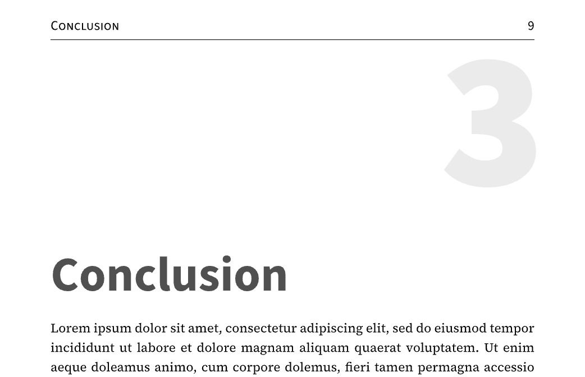

# New Document Structure and Layout

## General Typographic Objectives

A famous typographer once explained the fundamentals of good typographic design in the following way: If you want to draw attention on a crowded fun fair or carnival, you have to scream. In the silence of a church, some whispers  are sufficient. Typography should work as described in the latter case, using subtle elements and especially not trying to be "louder" than the content. So it es easy to emphasize important content with little means. 

This is also the guiding principle of this template. Typographically it can be achieved e.g. by the following means:

- Use as few font styles as possible
- Apply a uniform grey value (*Grauwert*) for the pages; e.g. don't make headlines "too black and bold" in comparison to the body text
- Place all page elements on a uniform grid

In addition, some parameters are intentionally fixed to retain the document "calm" and to avoid "typographic accidents".

## Document Structure
The document defined by the template consists of the following **parts**:
- Frontmatter
	- Title page
	- Abstract (*optional*)
	- Table of Contents
- Body text (consisting of several chapters)
- Appendix
	- References
	- Acronyms (*optional*)
	- Glossary (*optional*)
	- User-defined appendix (*optional*)
- Legal backmatter
	- Confidentiality Statement (*optional*)
	- Declaration of Authorship 

I've added the "*optional*" markers from a content viewpoint to the elements in the list above. I.e. I consider them optional in a thesis or a similar document. On a technical level all components can be switched off, if desired.

This structure reduces the frontmatter to 2-4 pages as it contains in its simplest form just the title page and one page for the TOC or, in a more typical case of a thesis with an abstract and two pages of the TOC, of four pages.

**Page numbering** ist done as follows:
- Titel page: no page number
- Frontmatter (TOC & abstract): small roman numbers
- Rest of the document: arabic numerals (starting with 1 on the first page of chapter 1)

The template defines four levels of **headings**:
- H1: Chapter heading (numbered)
- H2, H3: Subsection headings (numbered)
- H4: Subsection heading (without numbering)

H1-H3 use the "1.1.1"-numbering format within the document body. In the Appendix this changes to an "A.1"-format. The first three heading levels are shown in the table of contents.

H1 to H4 headings can be easily distinguished by their different typographic styles using sizes of 40/16/11/11 pt respectively and bold weighs for H1-H3, whereas H4 is printed in semibold small-caps. A1 (i.e. H1-format within the appendix) is reduced to a size of 32 pt as these headlines typically introduce parts which consist of only a few pages.

## Page Typography

### Body Text and Page Measures
The page has been designed starting with the selection of the body font and an adequate line length. 

[**Source Serif 4**](https://fonts.google.com/specimen/Source+Serif+4) (formerly known as *Source Serif Pro*) has been chosen for the **body text** as it is a high-quality font especially made for on-screen use and the reading of larger quantities of text. It was designed in 2014 by [Frank Grießhammer](https://fonts.adobe.com/designers/frank-griesshammer) for Adobe as a companion to *Source Sans Pro*, thus expanding their selection of Open Source fonts. It belongs to the category of transitional style fonts. Its relatively large x-height is typical for on-screen fonts and adds to the legibility even at small sizes. The font ist constantly being further developed. In the meantime there are special variants available e.g. for small print (*Source Serif Caption*, *Source Serif Small Text*) or large titles (*Source Serif Display*) and headings (*Source Serif Headings*). For people with a Computer Science background, the font might be familiar as it is used for the online documentation of the Rust programming language.

Of the 21 cm of width an A4 page offers, two thirds (14 cm) are used for the body text. This results in a **line length** of about 77 characters, which exceeds the typical recommendation of 70. This is a slight compromise as a thesis and similar documents contain elements like figures, tables or large formulas which also have to fit into this space. 

This leaves the remaining third (7 cm) of the page for **margins**. They are unevenly distributed with 4 cm for the left and 3 cm for the right margin, leaving enough space for a binding of printed versions on the left side.

Vertically these margins are repeated with 4 cm at the top (giving room to a heading) and 3 cm for the bottom margin. This leaves 22.7 cm for the **text block** whose aspect ratio thus results being the _golden section_. 

The underlying structure of the text block is a **vertical grid** of 16 pt height (called `page-grid` within the template), whereof 11 pt are taken by the body text, so that there is a *leading* of 5 pt (i.e. the space between lines). This **line height** produces good legibility for the *Source Serif 4* in this context. 

> *Note*: A font-size of 11 pt means different things in different type setting applications; it seems to me, that Typst uses "*hg-Höhe ohne Fleisch*"  (see: [Schriftgrad](https://www.typolexikon.de/schriftgrad/) on this topic), whereas programs like InDesign or Word use "*hg-Höhe mit Fleisch*". Apart from that, the glyphs of a 11 pt font have different measures in each font (see: [Font-size, Line-height, Measure & Alignment](http://www.typographicwebdesign.com/setting-text/font-size-line-height-measure-alignment/#:~:text=A%20good%20rule%20of%20thumb,a%20good%20place%20to%20start.) and [Point size](https://practicaltypography.com/point-size.html)).

This grid is used for **vertical spaces** wherever possible (e.g. for the paragraph spacing). But elements like headings, figures or tables may need to break it sometimes.

### Guidance Systems
One of the main guiding systems besides page numbers (especially for selective reading) are the **headlines**. Their main structure has already been explained above.

For the headlines as well as for other guiding elements of the document, the **font** [**Source Sans 3**](https://fonts.google.com/specimen/Source+Sans+3) has been chosen. It comes as a natural choice since *Source Serif 4* has been especially designed for this combination. But it has its virtues of its own, e.g. its reduced run length which permits more characters per line. This helps to avoid line-breaks within headings in our use case. *Source Sans 3* (originally named *Source Sans Pro*) has been designed by [Paul D. Hunt](https://blog.typekit.com/2013/11/20/interview-paul-hunt/) in 2012 as Adobes first Open Source font. It has its roots in the family of Gothic fonts thus belonging to a different category than *Source Serif 4*. But under [Robert Slimbachs](https://de.wikipedia.org/wiki/Robert_Slimbach) supervision, both designers succeeded to create a combination that fits well and at the same time the different rootings make the pairing not too "boring".

In larger documents the chapters are an important structuring element. Therefore the **start of a new chapter** must be easily identifiable. This goal is implemented by using an especially large font-size for the chapter heading and by separating the chapter number into the upper right corner of the page (using an even larger size; see example below). This separation has more advantages: It gives the heading text more space, thus avoiding line-breaks and it brings two important guiding elements, namely chapter number and page number to the same place of a page. This allows you, when searching for some specific part of the document (especially when printed on paper), to scroll through the pages quickly and focus your attention on the top right-hand corner.

This brings us to the next guiding element: The **page header**, containing page number and the heading of the current chapter (thus being repeated on each page). So, most important guiding information is gathered at the top of the page, making selective reading hopefully easier.

## Title Page

To solve the problem of overcrowding on the title page, the content itseslf as well as the number of typographic means have been reduced:

- Contentwise only the elements listed in [Usability Issues](usability-issues.md) are shown
- Typographic styles have been reduced to
  - Three font sizes: 
    - 1.5 x `page-grid` for the title
    - 1 x `page-grid` for all sub-titles and the author
    - 11 pt (size of body text) for the info block on the botttom of the page
  - Two font weights: regular and bold (in dark-grey as for the headings within the document)
  - Centered alignment for _all_ elements 

Logos are placed at the top of the page on the same level as the header is displayed within the rest of the document. Centered alignment for the logo(s) means:

- _One_ logo is actually placed centered
- _Two_ logos are treated as a "pair" with equivalent distance to the center of the page

# Recommended Reading

[1] Bringhurst, Robert: *The Elements of Typographic Style*, Hartley & Marks Publishers, Vancouver (Canada), 1997

[2]  [Beier, Sofie](https://www.researchgate.net/profile/Sofie-Beier): *Typeface Legibility: Towards defining familiarity*, PhD thesis, Royal College of Art, 2009

[3] Spiekermann, Erik: *Ursache & Wirkung: Ein typografischer Roman*, Context, Erlangen, 1986

[4] Tschichold, Jan: *Ausgewählte Aufsätze über Fragen der Gestalt des Buches und der Typografie*, Birkhäuser Verlag, Basel 1987, ISBN 3-7643-1946-1

[5] Willberg, Hans Peter; Forssman, Friedrich: *Lesetypographie*, H. Schmidt, Mainz, 1997

Especially [5] is helpful for the design of templates like `clean-dhwb` as it covers all aspects of a document (title page, toc, body text, use of fonts etc.) for different reading purposes. Moreover it shows many examples to explain the advantages and disadvantages of specific design decisions.

The PhD thesis of Sofie Beier [2] makes clear how difficult it is to grasp the concept of "legibility" as there are so many different reading situations. Reading a traffic sign from 50m apart is completely different from reading a novel from a paper-back book you hold in your hand. Apart from that, what we perceive as "good legibility" may also be influenced by our reading experience when we learned to read in first grade. 