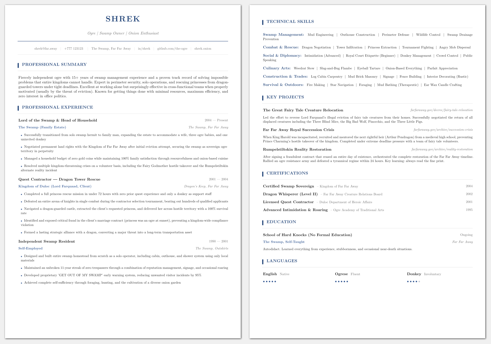

# clean-print-cv

A clean, print-friendly CV template for [Typst](https://typst.app). YAML-driven content, zero color fills, works in B&W.



## Features

- **Print-friendly**: no solid color blocks, minimal ink usage, looks identical in B&W
- **YAML-driven**: edit `cv-data.yaml` with your content, the template handles the rest
- **No page breaks inside sections**: certifications, education, projects, etc. never split across pages
- **ATS-compatible**: single-column layout, standard section headings, clean PDF output
- **Self-contained**: no external Typst packages required

## Using as a Typst package

### Quick start with `typst init`

The fastest way to get started is using Typst's built-in scaffolding:

```
typst init @preview/clean-print-cv:0.1.0 my-cv
cd my-cv
```

This creates a new directory with `main.typ` and `cv-data.yaml` ready to edit.

### Manual import

In any `.typ` file, import the template and use its functions:

```typ
#import "@preview/clean-print-cv:0.1.0": *

#let data = yaml("cv-data.yaml")

#show: cv-page-setup

#cv-header(data.personal)
#cv-summary(data.summary)
#cv-experience(data.experience)
#cv-skills(data.skills)
#cv-projects(data.projects)
#cv-certifications(data.certifications)
#cv-education(data.education)
#cv-languages(data.languages)
```

Then compile:

```
typst compile main.typ
```

## Local development

If you've cloned this repository and want to work on it directly:

1. [Install Typst](https://github.com/typst/typst#installation)
2. Edit `cv-data.yaml` with your data
3. Compile:

```
typst compile cv.typ
```

Or use live reload while editing:

```
typst watch cv.typ
```

## Files

| File | Purpose |
|---|---|
| `cv.typ` | Entry point; compile this. Controls section order. |
| `cv-template.typ` | All styling and layout logic. |
| `cv-data.yaml` | Your CV content. Edit this. |
| `template/` | Scaffolding files for `typst init`. |
| `typst.toml` | Package manifest for Typst Universe. |

## Sections

The template includes these sections, all optional (comment out any line in your entry point to remove):

- Professional Summary
- Professional Experience
- Technical Skills
- Key Projects
- Certifications
- Education
- Languages (with proficiency dots)

Reorder them by moving lines in your `.typ` file.

## Customization

### Colors

Edit the variables at the top of `cv-template.typ`:

```typ
#let primary    = rgb("#2b4c7e")   // headings, name, accent bars
#let accent     = rgb("#3d6098")   // company names, bullets
#let body-color = rgb("#1a1a1a")   // body text
#let muted      = rgb("#666666")   // dates, locations
#let rule-color = rgb("#d0d0d0")   // hairline separators
```

### Font sizes

```typ
#let name-size       = 20pt
#let title-size      = 10pt
#let section-size    = 10.5pt
#let body-size       = 9.5pt
#let small-size      = 8.5pt
```

### Fonts

Change the font in the `cv-page-setup` function:

```typ
set text(font: "New Computer Modern", ...)
```

Replace `"New Computer Modern"` with any system font.

## Licensing

The package code (`cv-template.typ`) is licensed under [MIT](LICENSE).
The template directory contents (`template/`) are licensed under [MIT-0](template/LICENSE),
so you may use, modify, and distribute your CV without attribution or including a license notice.

## Building the thumbnail

The thumbnail for Typst Universe is generated from the template data. Requires [ImageMagick](https://imagemagick.org/):

```
make thumbnail
```
