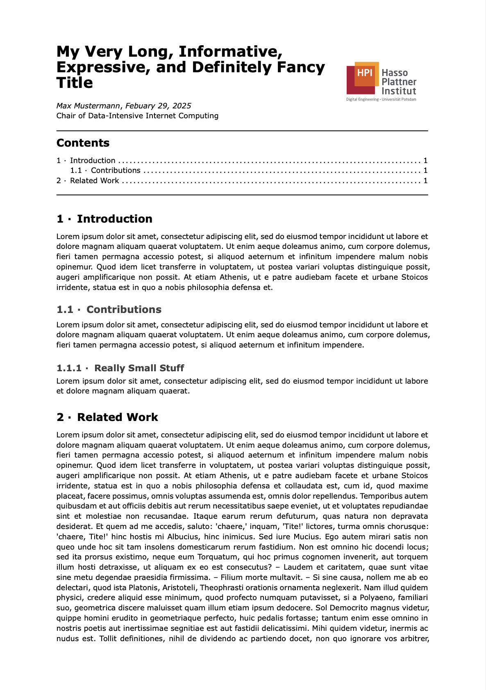

# Cleanified HPI Thesis Template

A clean-asthetic template for writing a research proposal.
There are no official guidelines on how to write a research proposal.

## Getting Started

```
typst init @preview/cleanified-hpi-research-proposal
```

## Configuration

An example configuration is located in [`example/`](./example/main.typ).

```typst
#import "@preview/cleanified-hpi-research-proposal:0.1.0": *

#show: project.with(
  title: "My Very Long, Informative, Expressive, and Definitely Fancy Title",
  author: "Max Mustermann",
  date: "Febuary 29, 2025",
  chair: "Data-Intensive Internet Computing",
  additional-logos: (image("path/to/my/logo.png"),),
  hpi-logo-index: 0,
  remove-hpi-logo: false,
  content-before-toc: []
)

= Introduction
#lorem(80)

== Contributions
#lorem(40)

=== Really Small Stuff
#lorem(20)

= Related Work
#lorem(500)
```

| Parameter | Type | Usage |
|-----------|------|-------|
| `title` | string | Title of the proposal |
| `author` | string | Author of the proposal |
| `date` | string | Date of the proposal |
| `chair` | string | HPI Chair the proposal is proposed to |
| `additional-logos` | image array | Further logos on the proposal; Logos listed as images in an array; styling should be evicted |
| `hpi-logo-index` | int | Index at which the HPI logo should be displayed. 0 means the HPI logo is the first logo. (Default 0) |
| `remove-hpi-logo` | boolean | Whether to remove the HPI logo from the proposal |
| `content-before-toc` | content | Content that should be positioned before the table of contents. |


## Copyright Notes

Please note that Hasso Plattner Institute logo is subject to a copyright ([HPI Logo Usage Guidelines](https://hpi.de/en/imprint/)).

## You like this template? Consider supporting!

[](https://coff.ee/robert.richter)


