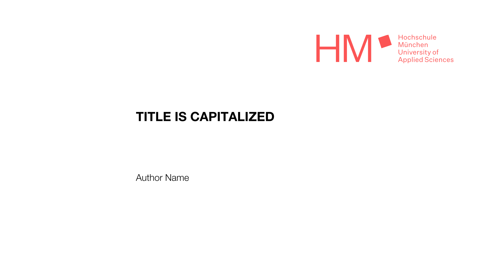

# HM Slide Theme

A template theme for [HM](https://www.hm.edu) presentations for use with
[Polylux](https://github.com/polylux-typ/polylux/).



## Example

Some features of the theme can be seen in the example
[feature-overview](./examples/feature-overview.pdf).


## Usage

To get started use either `typst init @preview/clearly-hm` or add the following
to the document.

```typst
#import "@preview/polylux:0.4.0": *
#import "@preview/clearly-hm:0.1.0" as hm: *

#show: hm.setup.with(
  title: "Project Typst HM Presentation Theme",
  author: "Some Name",
)
```

### Dependencies

The main font is _Helvetica Neue_. The fallback font is _Nimbus Sans_.

### Setup

The `setup` function initializes the HM Polylux presentation theme and applies it to your document content.

```typst
#show: hm.setup.with(
  title: "Your Presentation Title",
  author: "Your Name",
)
```

#### Parameters

| Parameter | Type | Default | Description |
|-----------|------|---------|-------------|
| `aspect-ratio` | string | `"16-9"` | Slide dimensions: `"16-9"` or `"4-3"` |
| `title` | content | `none` | Presentation title |
| `subtitle` | content | `none` | Presentation subtitle |
| `author` | content | `none` | Author name |
| `institute` | content | `none` | Institution/organization |
| `date` | content | `none` | Presentation date |
| `show-footer` | boolean | `true` | Display footer on slides |
| `show-footer-num-pages` | boolean | `true` | Show total page number in footer |
| `color-primary` | color | `hm-red` | Primary accent color |
| `color-accent` | color | `hm-red` | Accent color for lists/elements |
| `font` | array | `("Helvetica Neue", "Nimbus Sans")` | Font family (primary, fallback) |
| `size-base` | length | `16pt` | Base text size |
| `body` | content | — | Document content |

#### Example
```typst
#show: hm.setup.with(
  title: "Compiling",
  subtitle: "My code's compiling",
  author: "Cueball",
  institute: "xkcd 303",
  date: datetime.today().display(),
  color-primary: hm-blue,
)
```

### Layouts

The HM theme comes with a few predefined layouts:

- `slide-vertical`: Content positions left and vertically in the middle
- `slide-centered`: Content positioned in the center
- `slide-split-2`: Two columns, with content starting at the top
- `slide-split-1-2`: Two columns, 1/3 and 2/3 of page width

Each slide has an argument for `title`, the content (e.g. `body`, `content-left`,
`content-right`), and option to disable the footer (`show-footer: false`) and
`content-overlay` to print custom overlay on the slide (see `bmftr-note` below).

To create your own custom slides use the standard `#slide[]` function.
```typst
#slide[
 = Your Title
 Your content here
]
```

### Presentation Support

The theme comes with a few special functions:

- `title-slide` creates the title slide
- `new-section` creates a section slide with a progress bar (or `show-slide:
  false` only add it to the content list)
- `new-section-orientation` creates a section slide with list of sections
- `slide-toc` creates the table of content slide
- `bmftr-note` adds a BMFTR funding note (`language`: `"en"` or `"de"`)

#### Title Slide Overwrites

The `title-slide` function accepts the same arguments as `setup` (`title`,
`subtitle`, `author`, `institute`, `date`) to override the default values, plus
`uppercase-title` (default: `true`), `show-footer`, and `content-overlay`.

```typst
#title-slide(title: "Compilation Successful", date: "Today")
```

### Predefined Colors

The theme provides HM brand colors that can be used for customization:

- `hm-red` (default primary/accent)
- `hm-blue`
- `hm-green`
- `hm-yellow`
- `hm-dark-gray`
- `hm-light-gray`
- `hm-accent1` through `hm-accent4`

Use them with `color-primary` or `color-accent` in the setup function.
