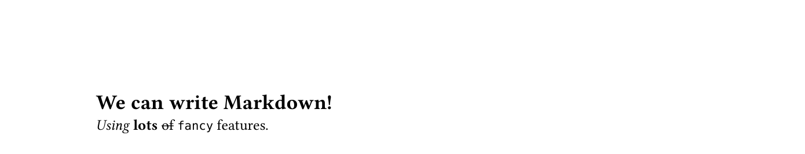

<!--typst-begin-exclude-->

# cmarker
<!--typst-end-exclude-->

This package enables you to write CommonMark Markdown,
and import it directly into Typst.

<table>
<tr>
<th><code>simple.typ</code></th>
<th><code>simple.md</code></th>
</tr>
<tr>
<td>

```typst
#import "@preview/cmarker:0.1.5"

#cmarker.render(read("simple.md"))
```
</td>
<td>

```markdown
# We can write Markdown!

*Using* __lots__ ~of~ `fancy` [features](https://example.org/).
```
</td>
</tr>
</table>
<table>
<tr><th><code>simple.pdf</code></th></tr>
<tr><td></td></tr>
</table>

This document is available
in [Markdown](https://github.com/SabrinaJewson/cmarker.typ/tree/main#cmarker)
and [rendered PDF](https://github.com/SabrinaJewson/cmarker.typ/blob/main/README.pdf)
formats.

## API

We offer a single function:

```typc
render(
  markdown,
  smart-punctuation: true,
  math: none,
  h1-level: 1,
  raw-typst: true,
  html: (:),
  label-prefix: "",
  prefix-label-uses: true,
  scope: (:),
  show-source: false,
  blockquote: none,
) -> content
```

The parameters are as follows:
- `markdown`:
	The [CommonMark](https://spec.commonmark.org/0.30/) Markdown string to be processed.
	Parsed with the [pulldown-cmark](https://docs.rs/pulldown-cmark) Rust library.
	You can set this to `read("somefile.md")` to import an external markdown file;
	see the
	[documentation for the read function](https://typst.app/docs/reference/data-loading/read/).
	- Accepted values: Strings and raw text code blocks.
	- Required.

- `smart-punctuation`:
	Automatically convert ASCII punctuation to Unicode equivalents:
	- nondirectional quotations (" and ') become directional (“” and ‘’);
	- three consecutive full stops (...) become ellipses (…);
	- two and three consecutive hypen-minus signs (-- and ---)
		become en and em dashes (– and —).

	Note that although Typst also offers this functionality,
	this conversion is done through the Markdown parser rather than Typst.
	- Accepted values: Booleans.
	- Default value: `true`.

- `math`:
	A callback to be used when equations are encountered in the Markdown,
	or `none` if it should be treated as normal text.
	Because Typst does not support LaTeX equations natively,
	the user must configure this.
	- Accepted values:
		Functions that take a boolean argument named `block` and a positional string argument
		(often, the `mitex` function from
		[the mitex package](https://typst.app/universe/package/mitex)),
		or `none`.
	- Default value: `none`.

	For example, to render math equation as a Typst math block,
	one can use:
	```typst
	#import "@preview/mitex:0.2.4": mitex
	#cmarker.render(`$\int_1^2 x \mathrm{d} x$`, math: mitex)
	```
	<!--raw-typst
	which renders as: $integral_1^2 x dif x$
	-->

- `h1-level`:
	The level that top-level headings in Markdown should get in Typst.
	When set to zero,
	top-level headings are treated as text,
	`##` headings become `=` headings,
	`###` headings become `==` headings,
	et cetera;
	when set to `2`,
	`#` headings become `==` headings,
	`##` headings become `===` headings,
	et cetera.
	- Accepted values: Integers in the range [0, 255].
	- Default value: 1.

- `raw-typst`:
	Whether to allow raw Typst code to be injected into the document via HTML comments.
	If disabled, the comments will act as regular HTML comments.
	- Accepted values: Booleans.
	- Default value: `true`.

	For example, when this is enabled, `<!--raw-typst #circle(radius: 10pt) -->`
	will result in a circle in the document
	(but only when rendered through Typst).
	See also `<!--typst-begin-exclude-->` and `<!--typst-end-exclude-->`,
	which is the inverse of this.

- `html`:
	The dictionary of HTML elements that cmarker will support.
	- Accepted values:
		Dictionaries whose keys are the tag name (without the surrounding `<>`)
		and whose values can be:
		- `("normal", (attrs, body) => [/* … */])`:
			Defines a normal element,
			where `attrs` is a dictionary of strings, `body` is content,
			and the function returns content.
		- `("void", (attrs) => [/* … */])`:
			Defines a void element (e.g. `<br>`, ``, `<hr>`).
		- `("raw-text", (attrs, body) => [/* … */])`:
			Defines a raw text element (e.g. `<script>`, `<style>`),
			where `body` is a string.
		- `("escapable-raw-text", (attrs, body) => [/* … */])`:
			Defines an escapable raw text element (e.g. `<textarea>`),
			where `body` is a string.
		- `(attrs, body) => [/* … */]`: Shorthand for
			`("normal", (attrs, body) => [/* … */])`.
	- Default value: `(:)`.
	- Overridable keys:
		The following HTML elements are provided by default,
		but you are free to override them:
		`<sub>`,
		`<sup>`,
		`<mark>`,
		`<h1>`–`<h6>`,
		`<ul>`,
		`<ol>`,
		`<li>`,
		`<dl>`,
		`<dt>`,
		`<dd>`,
		`<table>`,
		`<thead>`,
		`<tfoot>`,
		`<tr>`,
		`<th>`,
		`<td>`,
		`<hr>`,
		`<a>`,
		`<em>`,
		`<strong>`,
		`<s>`,
		`<code>`,
		`<br>`,
		`<blockquote>`,
		`<figure>`,
		`<figcaption>`,
		``.

	For example, the following code
	would allow you to write `<circle radius="25">` to render a 25pt circle:

	```typst
	#cmarker.render(read("input.md"), html: (
	  circle: ("void", attrs => circle(radius: int(attrs.radius) * 1pt))
	))
	```

- `label-prefix`:
	If present, any labels autogenerated by footnotes and headings will be prefixed by this string.
	This is useful to avoid collisions.
	- Accepted values: A valid label or the empty string.
	- Default value: The empty string.

- `prefix-label-uses`:
	Whether references to labels such as `[@label]` and `[link](#label)`
	should be prefixed by `label-prefix`.
	- Accepted values: Booleans.
	- Default value: `true`.

- `scope`:
	A dictionary providing the context in which the evaluated Typst code runs.
	It is useful to pass values in to code inside `<!--raw-typst-->` blocks,
	but can also be used to override element functions generated by cmarker itself.
	- Accepted values: Any dictionary.
	- Default value: `(:)`.
	- Overridable keys:
		- All built-in Typst functions.
		- `rule`:
			Expected to be a function returning content.
			Will be used when thematic breaks (`---` in Markdown) are encountered.
			Defaults to `line.with(length: 100%)`.

- `show-source`:
	A debugging tool.
	When set to `true`, the Typst code that would otherwise have been displayed
	will be instead rendered in a code block.
	- Accepted values: Booleans.
	- Default value: `false`.

- `blockquote`:
	Deprecated!
	This used to control how blockquotes were rendered,
	but we now default to `quote(block: true)`.
	If you want to override how blockquotes look,
	either use `#show quote.where(block: true)`
	or use `scope: (quote: …)`.
	- Accepted values: Functions accepting content and returning content, or `none`.
	- Default value: `none`.

This function returns the rendered `content`.

## Resolving Paths Correctly

Because of how Typst handles paths,
elements like images will by default resolve
relative to the project root of `cmarker` itself
and not your project.

To fix this,
one can override the `image` function in the scope the Typst code is evaluated.

```typst
#import "@preview/cmarker:0.1.5"

#cmarker.render(
  read("yourfile.md"),
  scope: (image: (path, alt: none) => image(path, alt: alt))
)
```

## References, Labels, Figures and Citations

`cmarker.typ` integrates well with Typst’s native references and labels.
Where in Typst you would write `@foo`, in Markdown you write `[@foo]`;
where in Typst you would write `@foo[Chapter]`, in Markdown you’d write `[Chapter][@foo]`.
You can also write `[some text](#foo)` to have “some text” be a link that points at `foo`.
Headings are automatically given references according to their name,
but lowercased and with spaces replaced by hyphens:

```md
# My nice heading

We can make a link to [this section](#my-nice-heading).
We can refer you to [@my-nice-heading]. <!-- generates “We can refer you to Section 1.” -->
Or to [Chapter][@my-nice-heading]. <!-- generates “We can refer you to Chapter 1.” -->
```

If you have two headings with the same title,
they’ll be numbered sequentially in the fashion of GitHub Markdown:
`heading`, `heading-1`, `heading-2`, etc.

If you want to cite something from a bibliography,
you can do it much the same way: `[@citation]`.

If you want to customize the label of a heading from the default,
you can use `id=` in HTML:

```md
<h1 id="my-nice-section">My nice heading</h1>

See [@my-nice-section]. <!-- generates “See Section 1.” -->
```

This can also be used with figures, which is very powerful:

```md
Please refer to [@my-graph]. <!-- generates “Please refer to Figure 1.” -->

<figure id="my-graph">

</figure>
```

If you encounter collision errors across multiple Markdown files,
you can set the `label-prefix` option.
For example, setting
`label-prefix: "file-a-"` will convert the label of
`# My Heading` into `file-a-my-heading`.
By default, references within the file will expect the unprefixed name;
this can be changed by setting `prefix-label-uses: false`.

## Supported Markdown Syntax

We support CommonMark with a couple extensions.

- Paragraph breaks: Two newlines, i.e. one blank line.
- Hard line breaks (used more in poetry than prose):
	Put two spaces at the end of the line.
- `*emphasis*` or `_emphasis_`: *emphasis*
- `**strong**` or `__strong__`: **strong**
- `~strikethrough~`: ~strikethrough~
- `[links](https://example.org)`: [links](https://example.org/)
- `### Headings`, where `#` is a top-level heading,
	`##` a subheading, `###` a sub-subheading, etc
- `` `inline code blocks` ``: `inline code blocks`
-
	````
	```
	out of line code blocks
	```
	````
	Syntax highlighting can be achieved by specifying a language after the opening backticks:
	````
	```rust
	let x = 5;
	```
	````
	giving:
	```rust
	let x = 5;
	```
- `---`, making a horizontal rule.
	This corresponds to the Typst code `#rule()`,
	which, if not overridden by the `scope` parameter,
	defaults to `#line(length: 100%)`:

	---
-
	```md
	- Unordered
	- lists
	```
	- Unordered
	- Lists
-
	```md
	1. Ordered
	1. Lists
	```
	1. Ordered
	1. Lists
- `$x + y$` or `$$x + y$$`: math equations, if the `math` parameter is set.
- `> blockquotes`, if the `blockquote` parameter is set.
- Images: ``, giving
	
- Tables:
	```md
	| Column 1 | Column 2 |
	| -------- | -------- |
	| Row 1 Cell 1 | Row 1 Cell 2 |
	| Row 2 Cell 1 | Row 2 Cell 2 |
	```

| Column 1 | Column 2 |
| -------- | -------- |
| Row 1 Cell 1 | Row 1 Cell 2 |
| Row 2 Cell 1 | Row 2 Cell 2 |
- Footnotes:
	```md
	Some text[^footnote]
	[^footnote]: content
	```
- HTML, e.g. `<sub>subscript</sub>` for <sub>subscript</sub>.

## Interleaving Markdown and Typst

Sometimes,
you might want to render a certain section of the document
only when viewed as Markdown,
or only when viewed through Typst.
To achieve the former,
you can simply wrap the section in
`<!--typst-begin-exclude-->` and `<!--typst-end-exclude-->`:

```md
<!--typst-begin-exclude-->
Hello from not Typst!
<!--typst-end-exclude-->
```

Most Markdown parsers support HTML comments,
so from their perspective this is no different
to just writing out the Markdown directly;
but `cmarker.typ` knows to search for those comments
and avoid rendering the content in between.

Note that when the opening comment is followed by the end of an element,
`cmarker.typ` will close the block for you.
For example:

```md
> <!--typst-begin-exclude-->
> One

Two
```

In this code,
“Two” will be given no matter where the document is rendered.
This is done to prevent us from generating invalid Typst code.

Conversely, one can put Typst code inside
a HTML comment of the form
`<!--raw-typst […]-->`
to have it evaluated directly as Typst code
(but only if the `raw-typst` option to `render` is set to `true`,
otherwise it will just be seen as a regular comment and removed):

```md
<!--raw-typst Hello from #text(fill:blue)[Typst]!-->
```

## Limitations

Although I tried my best to escape everything correctly,
I won’t provide a hard guarantee that everything is fully sandboxed
even if you set `raw-typst: false`.
That said, Typst itself is well-sandboxed anyway.

## FAQ

### Typst is saying it can’t find my image – it’s looking inside `cmarker` for some reason!

See [Resolving Paths Correctly](#resolving-paths-correctly).

### How do I include multiple Markdown files in one project?

See [the multi-file example](https://github.com/SabrinaJewson/cmarker.typ/blob/main/examples/multi-file.typ).

Note that this example uses a _single_ call to `render` with concatenated Markdown,
i.e. `cmarker.render(read("file-a.md") + read("file-b.md"))`.
If you instead wish to use
`cmarker.render(read("file-a.md"))` followed by `cmarker.render(read("file-b.md"))`,
you may encounter collision issues if two headings have the same name.
This can be resolved in two ways:
+ Giving the headings an explicit ID:
	`<h1 id="my-id">My Heading</h1>` instead of `# My Heading`.
+ Setting a label prefix, e.g. `label-prefix: "my-file-"`.

### My image file contains spaces, but it gets rendered as text!

This is a Markdown quirk – `` is seen as plain text
instead of an image.
To fix it, use ``.

### My Markdown after an open HTML tag is getting rendered as text!

Another Markdown quirk –
in code like `<p>hello _world_</p>`
or `<!-- -->hello _world_`,
italics will not be generated.

There are two fixes:
either insert some empty inline-level HTML at the start,
e.g. `<span></span><p>hello _world_</p>`,
or insert two newlines after the opening tag:

```
<p>

hello _world_</p>
```

## Development

- Build the plugin with `./build.sh`,
	which produces the `plugin.wasm` necessary to use this.
- Compile examples with `typst compile examples/{name}.typ`.
- Compile this README to PDF with `typst compile README.typ`.
- Run tests with `cargo test --workspace` and `cargo run -p test-runner`.
- Fuzz the library with `cargo +nightly fuzz run fuzz`.
