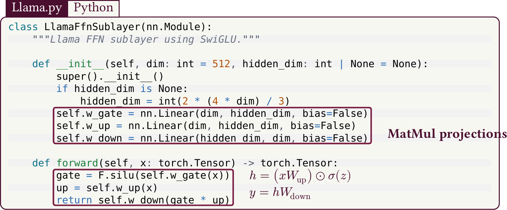
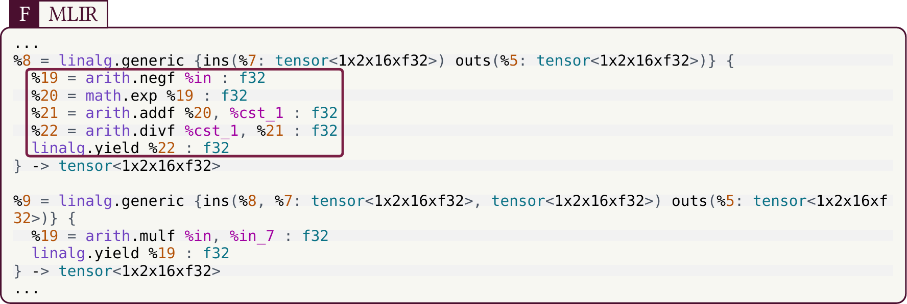
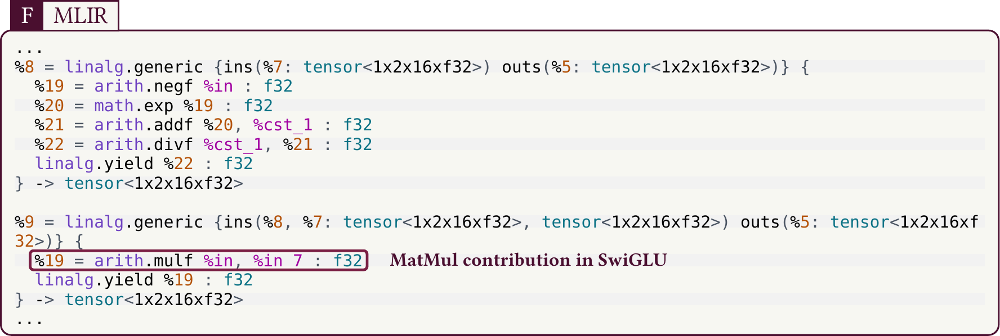
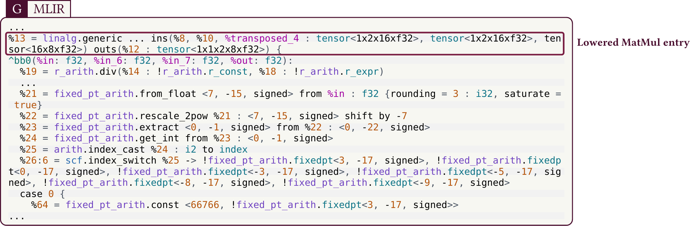
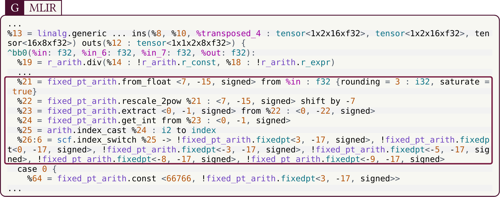
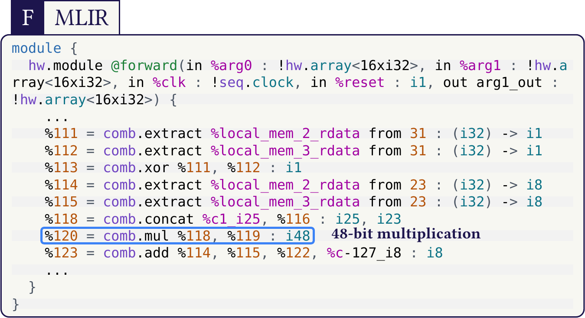
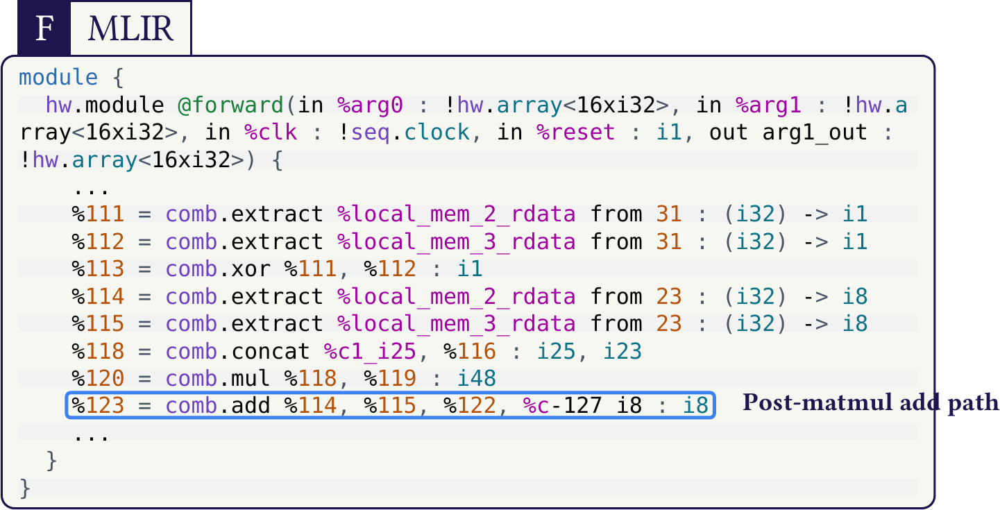
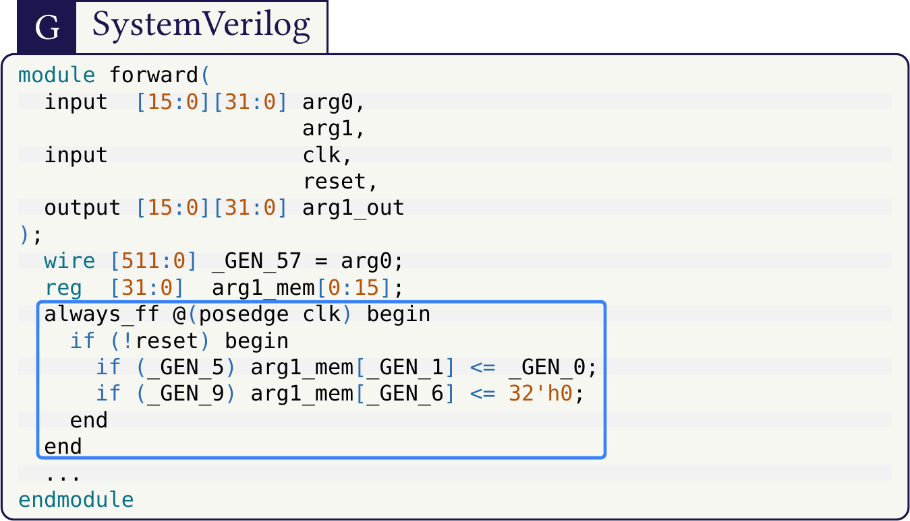

## codez

Text highlights that render inside CeTZ figures, enabling beautiful and complex code explanations for posters and slides.

`codez` is built for workflows where code is a visual object. It solves a limitation of many other package approaches that do not render properly inside CeTZ-based figures.

### Install

```typ
#import "@preview/codez:0.1.0": *
#show: init.with()
```

### Llama.py Panel Snippet

```typ
#import "@preview/cetz:0.3.4"
#import "@preview/codez:0.1.0": mark as codez-mark, parse as codez-parse, cetz-block as codez-cetz-block

#let anno-color = rgb("#4a0f2f")
#let anno-bbox-stroke = 1.6pt + rgb("#7a1f44")

#let codez-block(..args) = codez-cetz-block(
  stroke: 1pt + anno-color,
  mark-inset: (x: 4pt, y: 2pt),
  badge-tag-fill: anno-color,
  badge-tag-text: white,
  badge-lang-fill: rgb("#f7f7f2"),
  badge-lang-text: anno-color,
  badge-stroke: 1pt + anno-color,
  badge-radius: 6pt,
  badge-size: 14pt,
  badge-offset: (6pt, 0pt),
  badge-anchor: "south-west",
  badge-pad-x: 6pt,
  badge-pad-y: 4pt,
  ..args,
)

#let py-lines = (
  "class LlamaFfnSublayer(nn.Module):",
  "    def __init__(self, dim: int = 512, hidden_dim: int | None = None):",
  "        super().__init__()",
  "        self.w_gate = nn.Linear(dim, hidden_dim, bias=False)",
  "        self.w_up = nn.Linear(dim, hidden_dim, bias=False)",
  "        self.w_down = nn.Linear(hidden_dim, dim, bias=False)",
  "",
  "    def forward(self, x: torch.Tensor) -> torch.Tensor:",
  "        gate = F.silu(self.w_gate(x))",
  "        up = self.w_up(x)",
  "        return self.w_down(gate * up)",
)

#let py = codez-parse(py-lines.join("\n"))
#let m-py-linear = codez-mark("m_py_linear", start: 4, end: 6, trim-left: true)
#let m-py-swiglu = codez-mark("m_py_swiglu", start: 9, end: 11, trim-left: true)

#cetz.canvas(length: 1pt, {
  import cetz.draw: *
  codez-block(
    name: "py",
    at: (0, 0),
    width: 520pt,
    wrap: true,
    code: py.code,
    lang: "python",
    badge-tag: "Llama.py",
    badge-lang: "Python",
    marks: (m-py-linear, m-py-swiglu),
    text-size: 13pt,
    line-gap: 5pt,
    mark-stroke: none,
  )
  rect("py.m_py_linear.north-west", "py.m_py_linear.south-east", stroke: anno-bbox-stroke, radius: 2pt)
  rect("py.m_py_swiglu.north-west", "py.m_py_swiglu.south-east", stroke: anno-bbox-stroke, radius: 2pt)
  content((rel: (16pt, -10pt), to: "py.m_py_linear.east"), text("MatMul projections", size: 11pt, weight: "bold", fill: anno-color), anchor: "west")
  content((rel: (16pt, 0pt), to: "py.m_py_swiglu.east"), [$z = xW_"gate"$#linebreak()$h = (xW_"up") ⊙ sigma(z)$#linebreak()$y = hW_"down"$], anchor: "west")
})
```

[](docs/previews/mlir-swiglu-matmul.pdf)

### Public API

- `init`
- `mark`, `bbox-mark`, `mark-char`
- `parse`, `pick`
- `block`, `cetz-block`
- `bbox-info`, `anchor`, `bbox`
- `canvas`, `overlay`, `dot`, `arc`

### Feature Gallery

#### Python SwiGLU panel with math annotation

[](examples/mlir-swiglu-matmul.typ)

#### MLIR sigmoid region focus

[](examples/mlir-swiglu-matmul.typ)

#### MLIR SwiGLU MatMul contribution

[](examples/mlir-swiglu-matmul.typ)

#### MLIR lowered MatMul entry

[](examples/mlir-swiglu-matmul.typ)

#### MLIR fixed-point conversion chunk with wrap

[](examples/mlir-swiglu-matmul.typ)

#### Comb IR 48-bit multiplication highlight

[](examples/mlir-to-systemverilog-poster.typ)

#### Comb IR post-matmul add path

[](examples/mlir-to-systemverilog-poster.typ)

#### SystemVerilog always_ff extraction

[](examples/mlir-to-systemverilog-poster.typ)

### Reference Examples

- [SwiGLU + MatMul with Python math annotation](examples/mlir-swiglu-matmul.typ)
- [MLIR to SystemVerilog (Poster)](examples/mlir-to-systemverilog-poster.typ)

### Syntax Theme

MLIR color style used in these examples is bundled in:
- [`syntaxes/codez-light.tmTheme`](syntaxes/codez-light.tmTheme)
- [`syntaxes/mlir.sublime-syntax`](syntaxes/mlir.sublime-syntax)

### Publish Workflow

- [Publishing checklist](docs/PUBLISHING.md)
- Local validation: `./scripts/check.sh`
- Regenerate previews: `./scripts/generate-previews.sh`

### Credits

`codez` vendors and extends parts of `codly` (MIT), adapted for geometry-aware overlays.
See [THIRD_PARTY_NOTICES.md](THIRD_PARTY_NOTICES.md).
