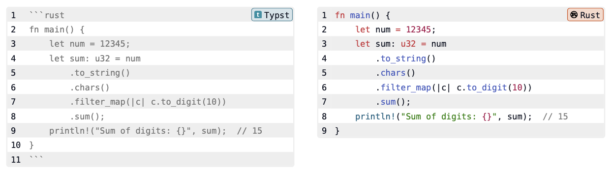

# `codly-languages` - Language configurations for `codly`

Provides a set of predefined language configurations for use with the `codly`
code listing package. For each supported language, this package defines a
name, icon, and color to use when displaying code.

## Usage

Pretty simple. Import `codly`. Initialize it. Import `codly-languages`.
Configure `codly` with the languages. Like this:

```typst
#import "@preview/codly:1.0.0": *
#show: codly-init

#import "@preview/codly-languages:0.1.0": *
#codly(languages: codly-languages)
```

Then use code blocks as you normally would and the output, for supported
languages, should look like this:



## Contributing

The following languages are still missing. All contributions welcome.

- ASP
- ActionScript
- Ada
- AppleScript
- AsciiDoc
- Batch File
- CFML
- CSV
- Cabal
- Crontab
- D
- Diff
- DotENV
- Email
- Fish
- Fstab
- GLSL
- Graphviz
- Groff
- Group
- INI
- Jinja2
- Jsonnet
- Lean
- Lisp
- LiveScript
- Makefile
- MediaWiki
- NSIS
- Ninja
- Org mode
- Pascal
- Passwd
- Protobuf
- Puppet
- QML
- Racket
- Rego
- Regular Expressions
- Resolv
- RestructuredText
- Robot
- SLS
- SML
- Slim
- Strace
- SublimeEthereum
- SublimeJQ
- SystemVerilo
- TCL
- TOML
- Textile
- TodoTxt
- Verilog
- WGSL
- cmd-help
- gnuplot
- hosts
- http-request-response
- varlink
- vscode-wgsl

## Icon Attribution

The `typst-small.png` icon included in this package came from the MIT-licensed
[codly](https://github.com/Dherse/codly) project.

All other icons included here came from the MIT-licensed
[devicon](https://github.com/devicons/devicon/) project.

## License

This package is released under the MIT License.
