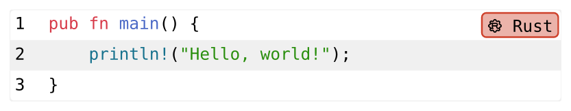

# Codly: simple and beautiful code blocks for Typst

Codly is a package that lets you easily create beautiful code blocks for your Typst documents.
It uses the newly added [`raw.line`](https://typst.app/docs/reference/text/raw/#definitions-line)
function to work across all languages easily. You can customize the icons, colors, and more to
suit your document's theme. By default it has zebra striping, line numbers, for ease of reading.

````typ
#let icon(codepoint) = { ... }
#show: codly.with(languages: (
  rust: (name: "Rust", icon: icon("\u{fa53}"), color: rgb("#CE412B")),
))

```rust
pub fn main() {
    println!("Hello, world!");
}
```
````

Which renders to:



You can find all of the documentation in the [example](https://github.com/Dherse/codly/tree/main/example/main.typ) file.