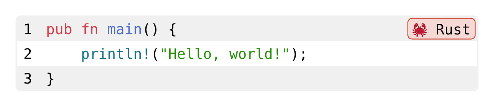

# Codly: simple yet beautiful and powerful code blocks

<p align="center">
  <a href="https://github.com/Dherse/codly/blob/main/docs.pdf">
    
  </a>
  <a href="https://github.com/Dherse/codly/blob/main/LICENSE">
    
  </a>
  
</p>

Codly superchargescode blocks for your Typst documents. It allows you to add annotations, skip lines, customize numberings, add language icons, and much more. Codly is even better with its companion package [`codly-languages`](https://typst.app/universe/package/codly-languages) which provides a wide range of language icons and colors to choose from.

A full set of documentation can be found [in the repo](https://raw.githubusercontent.com/Dherse/codly/main/docs.pdf).


````typ
#import "@preview/codly:1.1.1": *
#import "@preview/codly-languages:0.1.1": *
#show: codly-init.with()

#codly(languages: codly-languages)
```rust
pub fn main() {
    println!("Hello, world!");
}
```
````

### Setup

To start using codly, you need to initialize codly using a show rule, this need only be done once per document:

```typ
#show: codly-init.with()
```

Then you *can* configure codly with your parameters:

```typ
#codly(
  languages: (
    rust: (name: "Rust", icon: "🦀", color: rgb("#CE412B")),
  )
)
```

---
**Note**: Any parameter that you leave blank will use the previous values (or the default value if never set) similar to a `set` rule in regular typst. But the changes are always global unless you use the provided `codly.local` function. To get a full list of all settings, see the [documentation](https://raw.githubusercontent.com/Dherse/codly/main/docs.pdf).

---

Then you just need to add a code block and it will be automatically displayed correctly:

````
```rust
pub fn main() {
    println!("Hello, world!");
}
```
````



### Disabling & Enabling

To locally disable codly, you can just do the following, you can then later re-enable it using the `codly` configuration function.

```typ
#codly-disable()
```


Alternatively, you can use the `no-codly` function to achieve the same effect locally:

````typ
#no-codly[
  ```typ
  I will be displayed using the normal raw blocks.
  ```
]
````

### Smart indentation

By default Codly ships with `smart-indent` enabled, this means that Codly will automatically detect the indentation of your code block and adjust the horizontal offset on line wrapping accordingly. This can be disabled using the `smart-indent` parameter.

```typ
#codly(smart-indent: false)
```


### Referencing code blocks

Codly offers a wide range of features for referencing code blocks, lines, highlights, and annotations. This is done using:
- the line shorthand `@<label>:<line>`
- the highlight or annotation label `@<highlight>`


### Setting an offset

If you wish to add an offset to your code block, but without selecting a subset of lines, you can use the `codly-offset` function:

```typ
// Sets a 5 line offset
#codly-offset(5)
```


### Setting an offset relative to another code block

This is done by using the `offset-from` argument and by specifying a Typst `label` to the "parent" code block:

````typ
#codly(offset-from: <parent>)
````


### Selecting a subset of lines

If you wish to select a subset of lines, you can use the `codly-range` function. By setting the start to 1 and the end to `none` you can select all lines from the start to the end of the code block.

```typ
#codly-range(start: 5, end: 10)
```


### Adding a "skip"

You can add a "fake" skip between lines using the `skips` parameters:

```typ
// Before the 5th line (indexing start at 0), insert a 32 line jump.
#codly(skips: ((4, 32), ))
```
The code inside your block will be the same (except for the added line containing the … character), but the line numbers will be adjusted to reflect the skip. 

This can be customized using the `skip-line` and `skip-number` to customize what it looks like.

### Adding highlights

You can highlight part of lines using the `highlights` parameters:

````typ
#codly(highlights: (
  (line: 3, start: 2, end: none, fill: red),
  (line: 4, start: 13, end: 19, fill: green, tag: "(a)"),
  (line: 4, start: 26, fill: blue, tag: "(b)"),
))
```py
def fib(n):
  if n <= 1:
    return n
  else:
    return fib(n - 1) + fib(n - 2)
print(fib(25))
```
````


### Adding annotations

You can annotate a line/group of lines using the `annotations` parameters :

```typ
// Add an annotation from the second line (0 indexing) to the 5th line included.
#codly(
  annotations: (
    (
      start: 1,
      end: 4,
      content: block(
        width: 2em,
        // Rotate the element to make it look nice
        rotate(
          -90deg,
          align(center, box(width: 100pt)[Function body])
        )
      )
    ), 
  )
)
```


### Disabling line numbers

You can configure this with the `codly` function:

```typ
#codly(number-format: none)
```

### Disabling zebra striping

You disable zebra striping by setting the `zebra-fill` to white or none.

```typ
#codly(zebra-fill: none)
```

### Customize the stroke

You can customize the stroke surrounding the figure using the `stroke` parameter of the `codly` function:

```typ
#codly(stroke: 1pt + red)
```

### Misc

You can also disable the icon by setting the `display-icon` parameter to `false`:

```typ
#codly(display-icon: false)
```

This applies to:
- the name
- the radius
- whether the block is breakable
- the padding
- the width of the numbers columns 

and so many more.

For more detailed information check out the [documentation](https://raw.githubusercontent.com/Dherse/codly/main/docs.pdf).
