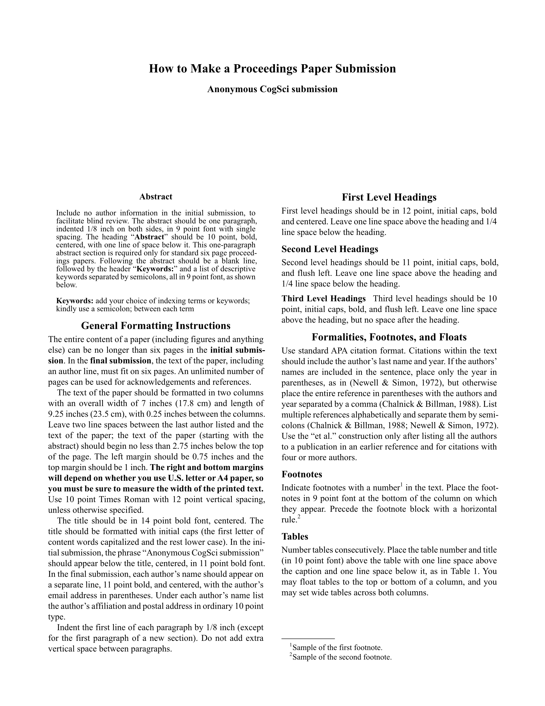

# CogSci Template

A [Typst](https://typst.app/) template for submissions to the _Annual Conference of the [Cognitive Science Society](https://cognitivesciencesociety.org/) (**CogSci**)_.

This template aims to be a visual clone of the official LaTeX template.

|                     Anonymized                     |                      Final                      |
| :------------------------------------------------: | :---------------------------------------------: |
|  |  |

## Usage

You will typically want to use this template by initializing a project with the CogSci boilerplate. The CogSci boilerplate (shown in the thumbnails) will give you the formatting specifications and examples of how to make citations, figures, tables, footnotes, and acknowledgments. You can generate the boilerplate (*a*) in the Typst web app or (*b*) locally. If you don't need the boilerplate, you can also just (*c*) import the template functions in any Typst document.

### (*a*) Initialize the boilerplate in the Typst web app

In the [Typst web app](https://typst.app/), click "Start from template" on the dashboard and search for `cogsci-conference`.

### (*b*) Initialize the boilerplate locally

You can use the [Typst CLI](https://github.com/typst/typst) to initialize the template locally:

```shell
typst init @preview/cogsci-conference
cd cogsci-conference
```

### (*c*) Import the template functions

The API is described in the [Parameters](#parameters) section below.

```typst
#import "@preview/cogsci-conference:0.1.0": cogsci, format-authors

#show: cogsci.with(
  title: [CogSci Typst Template],
  authors: format-authors(
    (name: [Author One], email: "a1@university.edu", affiliation: [Department Details]),
    (name: [Author Two], email: "a2@university.edu", affiliation: [Department Details]),
  ),
  abstract: [The abstract.],
  keywords: ("kw1", "kw2", "kw3",),
  anonymize: true,
  hyphenate: true,
)

// Document content goes here...

#bibliography("bibliography.bib")
```

### Local usage notes

#### Composition

If you're using Typst locally, I highly recommend trying the [Tinymist](https://myriad-dreamin.github.io/tinymist/) extension for [Visual Studio Code](https://code.visualstudio.com/): [**Tinymist Typst VS Code Extension**](https://marketplace.visualstudio.com/items?itemName=myriad-dreamin.tinymist). It makes for a superb writing experience.

#### Compilation

To generate the PDF using the Typst CLI:

```shell
typst compile main.typ main.pdf
```

**NB: It's recommended that you use a [PDF standard](https://www.adobe.com/uk/acrobat/resources/document-files/pdf-types.html) to ensure that the PDF is searchable, e.g. `a-3u`:**

```shell
typst compile --pdf-standard a-3u main.typ main.pdf
```

## TWO IMPORTANT NOTES

1. DOUBLE-BLIND REVIEWING

   - Starting in 2019, 6-page paper submissions are reviewed double-blind, so submissions must be anonymized.

   - You can toggle the author details in your submission using the [`anonymize`](#submission-control) flag (this also prevents author info from being stored in the PDF metadata).

2. CC-BY LICENSING

   - An online proceedings will be published by the Cognitive Science Society. At the time of final (camera-ready) submission authors will be required to agree to release of their proceedings contribution under a CC-BY license. This means that authors allow free reuse of their work provided the original authors are attributed. Please see the submissions website for more details.

## Parameters

The `cogsci()` template function accepts the following parameters:

### Document Metadata

- **`title`** (content): The paper title.

- **`authors`** (content): Pre-formatted author information. The template exports a `format-authors()` helper function that accepts an array of author dictionaries with keys `name`, `email`, and `affiliation`. You can pass your own custom formatted content to `authors` if you need different styling.

- **`abstract`** (content): The paper abstract.

- **`keywords`** (array): Array of keyword strings, e.g., `("Bayesian model", "function learning", "emotion")`.

### Bibliography

Call `bibliography()` at the end of your document:

```typst
#bibliography("bibliography.bib")
```

Typst's `bibliography()` function accepts a BibLaTeX `.bib` file or a Hayagriva `.yaml`/`.yml` file.

**Note:** If passing a `.bib` file, use the Bib***La***TeX format, not BibTeX.

### Submission Control

- **`anonymize`** (boolean): Set to `true` for double-blind review submissions (hides author information and uses "Anonymous CogSci submission" placeholder). Set to `false` for final camera-ready submissions with author details. Default is `false`.

### Formatting Options

- **`hyphenate`** (boolean): Set to `false` to disable hyphenation throughout the document (useful for proofreading). Default is `true`.

### Manual Overrides

The template exposes manual overrides for `text()`, `page()`, and `document()`. It's advised that you not use these. But if you absolutely need to change the region, paper size, or document metadata, then you can override the defaults by supplying a dictionary.

- **`text-kwargs`** (dictionary): expands into `set text(..text-kwargs)`
- **`page-kwargs`** (dictionary): expands into `set page(..page-kwargs)`
- **`document-kwargs`** (dictionary): expands into `set document(..document-kwargs)`

## Preparing an anonymized submission

Set `#let anonymize = true`.

Remember that you need to leave at least 2.75 inches between the top of the first page and the abstract and text of your paper. Since the top margin needs to be 1 inch on all pages, this means that there needs to be at least 1.75 inches of space on page 1 in which nothing but your paper title and **Anonymous CogSci submission** appears. Additionally, please remember not to include acknowledgments in the anonymized version of your paper.

## Preparing the de-anonymized final version of your accepted paper

Set `#let anonymize = false`.

In the final version of the paper, the title, author, abstract, and text of the paper must fit within six pages. Unlimited additional pages can be used for acknowledgments and references. In the final version of the paper for the proceedings (but not the initial anonymized submission), be sure to include any acknowledgments that may be appropriate.

Once again, make sure that you adhere to the general formatting instructions, including that there are at least 2.75 inches between the top of page 1 and the start of the abstract and text.

## Requirements

- Typst `v0.14.0` or later (use the [web app](https://typst.app/play/) or [install locally](https://github.com/typst/typst?tab=readme-ov-file#installation), e.g. with `brew install typst`)

## License

This template is distributed under the MIT License.

## Author

**Dae Houlihan**, based on the LaTeX template by Ashwin Ram, Johanna Moore, David Noelle, Pat Langley, Ramin Charles Nakisa, Tina Eliassi-Rad, Trisha Yannuzzi, Mary Ellen Foster, Ken Forbus, Eli M. Silk, Niels Taatgen and Roger Levy.

[](https://github.com/daeh) [](https://daeh.info) [](https://bsky.app/profile/dae.bsky.social)
