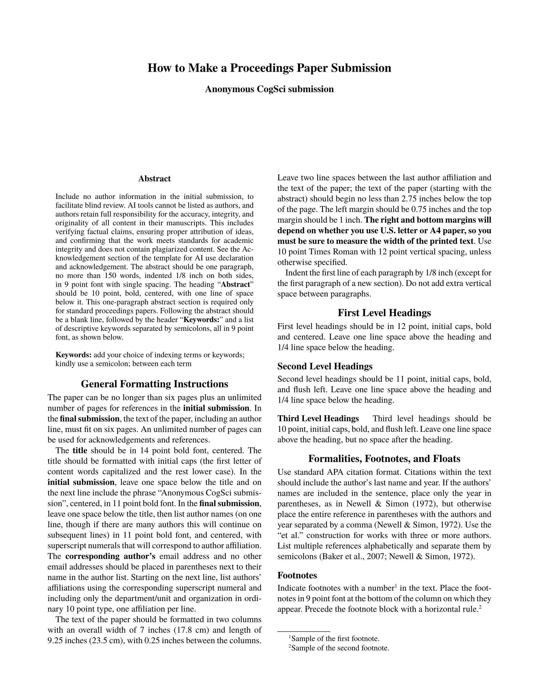

# CogSci Template

A [Typst](https://typst.app/) template for submissions to the _Annual Conference of the [Cognitive Science Society](https://cognitivesciencesociety.org/) (**CogSci**)_.

This template aims to be a visual clone of the official LaTeX template.

|                     Anonymized                     |                      Final                      |
| :------------------------------------------------: | :---------------------------------------------: |
|  |  |

## Usage

You will typically want to use this template by initializing a project with the CogSci template. The CogSci template (shown in the thumbnails) will give you the formatting specifications and examples of how to make citations, figures, tables, footnotes, and acknowledgments. You can generate the boilerplate (*a*) in the Typst web app or (*b*) locally. If you don't need the template, you can also just (*c*) import the template functions in any Typst document.

### (*a*) Initialize the template in the Typst web app

In the [Typst web app](https://typst.app/), click "Start from template" on the dashboard and search for `cogsci-conference`.

### (*b*) Initialize the template locally

You can use the [Typst CLI](https://github.com/typst/typst) to initialize the template locally:

```shell
typst init @preview/cogsci-conference
cd cogsci-conference
```

### (*c*) Import the template functions

The API is described in the [Parameters](#parameters) section below.

```typst
#import "@preview/cogsci-conference:0.1.1": cogsci, format-authors

#show: cogsci.with(
  title: [How to Make a Proceedings Paper Submission],
  author-info: format-authors(
    authors: (
      (name: [Author One], email: "a1@uni.edu", super: [1]),
      (name: [Author Two], super: [2]),
    ),
    affiliations: (
      (super: [1], affil: [Department A, University A]),
      (super: [2], affil: [Department B, University B]),
    ),
  ),
  abstract: [The abstract.],
  keywords: ("keyword1", "keyword2", "keyword3"),
  anonymize: true,
  hyphenate: true,
)

// Document content goes here...

#bibliography("bibliography.bib")
```

### Fonts

The template uses [TeX Gyre Termes](https://www.gust.org.pl/projects/e-foundry/tex-gyre) (a Times New Roman clone) for body text and [TeX Gyre Termes Math](https://www.gust.org.pl/projects/e-foundry/tg-math/index_html) for equations. These fonts are distributed under the [GUST Font License (GFL)](https://tug.org/fonts/licenses/GUST-FONT-LICENSE.txt).

- **Typst web app**: These fonts are included automatically.
- **Local usage**: Install the fonts system-wide or use the `--font-path` flag to point to a directory containing the OTF files.

### Local usage notes

#### Composition

If you're using Typst locally, I recommend trying the [Tinymist](https://myriad-dreamin.github.io/tinymist/) extension for [Visual Studio Code](https://code.visualstudio.com/): [**Tinymist Typst VS Code Extension**](https://marketplace.visualstudio.com/items?itemName=myriad-dreamin.tinymist). It makes for a superb writing experience.

#### Compilation

To generate the PDF using the Typst CLI:

```shell
typst compile main.typ main.pdf
```

**NB: It's recommended that you use a [PDF standard](https://www.adobe.com/uk/acrobat/resources/document-files/pdf-types.html) to ensure that the PDF is searchable, e.g. `a-3u`:**

```shell
typst compile --pdf-standard a-3u main.typ main.pdf
```

If you have the fonts in a local directory (e.g. `./fonts`) rather than installed system-wide:

```shell
typst compile --font-path ./fonts/ --pdf-standard a-3u main.typ main.pdf
```

## Important Notes

### Double-Blind Reviewing

Beginning in 2019, 6-page paper submissions are reviewed double-blind, so submissions must be anonymized. **The policy for double-blind reviews is strictly enforced.**

You can toggle the author details in your submission using the [`anonymize`](#submission-control) parameter (this also prevents author info from being stored in the PDF metadata).

### Page Limits

- **Initial submission**: The paper can be no longer than six pages plus an unlimited number of pages for references.
- **Final submission**: The text of the paper, including the title, authors, abstract, and all figures and tables, must fit on six pages. An unlimited number of pages can be used for acknowledgments and references.

The text of the paper should be formatted in two columns with an overall width of 7 inches and length of 9.25 inches, with 0.25 inches between the columns. The text of the paper (starting with the abstract) should begin no less than 2.75 inches below the top of the page.

### AI Tools

AI tools cannot be listed as authors. Authors retain full responsibility for the accuracy, integrity, and originality of all content in their manuscripts. Authors may use AI tools when developing their projects and preparing their manuscripts, but such use must be described transparently and in detail in either the Methods or Acknowledgments section. Tools used to improve spelling, grammar, and general editing are not included in the scope of these guidelines.

### CC-BY Licensing

An online proceedings will be published by the Cognitive Science Society. At the time of final (camera-ready) submission, authors will be required to agree to the release of their proceedings contribution under a CC-BY license. This means that authors allow free reuse of their work provided the original authors are attributed.

## Parameters

The `cogsci()` template function accepts the following parameters:

### Document Metadata

- **`title`** (content): The paper title.

- **`author-info`** (content): Pre-formatted author information. Use the `format-authors()` helper function (see below). You can pass your own custom formatted content to `authors` if you need different styling. Ignored when `anonymize` is `true`.

- **`abstract`** (content): The paper abstract.

- **`keywords`** (array): Array of keyword strings.

### Author Formatting

The `format-authors()` function accepts authors and affiliations in several formats:

**Named parameters with full dictionary structure:**

```typst
#format-authors(
  authors: (
    (name: [Author One], email: "a1@uni.edu", super: [1]),
    (name: [Author Two], super: [2]),
  ),
  affiliations: (
    (super: [1], affil: [Department A, University A]),
    (super: [2], affil: [Department B, University B]),
  ),
)
```

**Positional arguments with tuple affiliations:**

```typst
#format-authors(
  (
    (name: [Author One], email: "a1@uni.edu", super: [1]),
    (name: [Author Two], super: [2]),
  ),
  (
    ([1], [Department A, University A]),
    ([2], [Department B, University B]),
  ),
)
```

**Single shared affiliation:**

```typst
#format-authors(
  (
    (name: [Author One], email: "a1@uni.edu"),
    (name: [Author Two]),
  ),
  [Department of Psychology, University Name],
)
```

Each author dictionary must contain:
- `name` (content, required): Author's full name
- `email` (str, optional): Email address (only include for corresponding author)
- `super` (content, optional): Superscript linking to affiliation

### Bibliography

Call `bibliography()` at the end of your document:

```typst
#bibliography("bibliography.bib")
```

Typst's `bibliography()` function accepts a BibLaTeX `.bib` file or a Hayagriva `.yaml`/`.yml` file. The template uses APA citation style.

**Note:** If passing a `.bib` file, use the Bib***La***TeX format, not BibTeX.

### Submission Control

- **`anonymize`** (boolean): Set to `true` for double-blind review submissions (hides author information and uses "Anonymous CogSci submission" placeholder). Set to `false` for final camera-ready submissions with author details. Default is `false`.

### Formatting Options

- **`hyphenate`** (boolean): Set to `false` to disable hyphenation throughout the document (useful for proofreading). Default is `true`.

### Manual Overrides

The template exposes manual overrides for `text()`, `page()`, and `document()`. It's advised that you not use these. But if you absolutely need to change the region, paper size, or document metadata, then you can override the defaults by supplying a dictionary.

- **`text-kwargs`** (dictionary): expands into `set text(..text-kwargs)`
- **`page-kwargs`** (dictionary): expands into `set page(..page-kwargs)`
- **`document-kwargs`** (dictionary): expands into `set document(..document-kwargs)`

## Preparing an anonymized submission

Set `anonymize` to `true`.

Remember that you need to leave at least 2.75 inches between the top of the first page and the abstract and text of your paper. Since the top margin needs to be 1 inch on all pages, this means that there needs to be at least 1.75 inches of space on page 1 in which nothing but your paper title and **Anonymous CogSci submission** appears.

In the initial submission, please only include acknowledgments of AI use and no other acknowledgments to preserve anonymity.

The entire content of your anonymized paper can be no longer than six pages, plus unlimited space for references.

## Preparing the de-anonymized final version of your accepted paper

Set `anonymize` to `false`.

In the final version of the paper, the title, author, abstract, and text of the paper must fit within six pages. Unlimited additional pages can be used for acknowledgments and references. In the final version, be sure to include any acknowledgments that may be appropriate (including human and AI contributions, and funding information).

## Requirements

- Typst `v0.14.0` or later (use the [web app](https://typst.app/) or [install locally](https://github.com/typst/typst?tab=readme-ov-file#installation), e.g. with `brew install typst`)
- TeX Gyre Termes and TeX Gyre Termes Math fonts (included in Typst web app; for local use, install system-wide or provide via `--font-path`)

## License

This template is distributed under the MIT License.

## Author

**Dae Houlihan**, based on the LaTeX template by Ashwin Ram, Johanna Moore, David Noelle, Pat Langley, Ramin Charles Nakisa, Tina Eliassi-Rad, Trisha Yannuzzi, Mary Ellen Foster, Ken Forbus, Eli M. Silk, Niels Taatgen and Roger Levy.

[](https://github.com/daeh) [](https://daeh.info) [](https://bsky.app/profile/dae.bsky.social)
