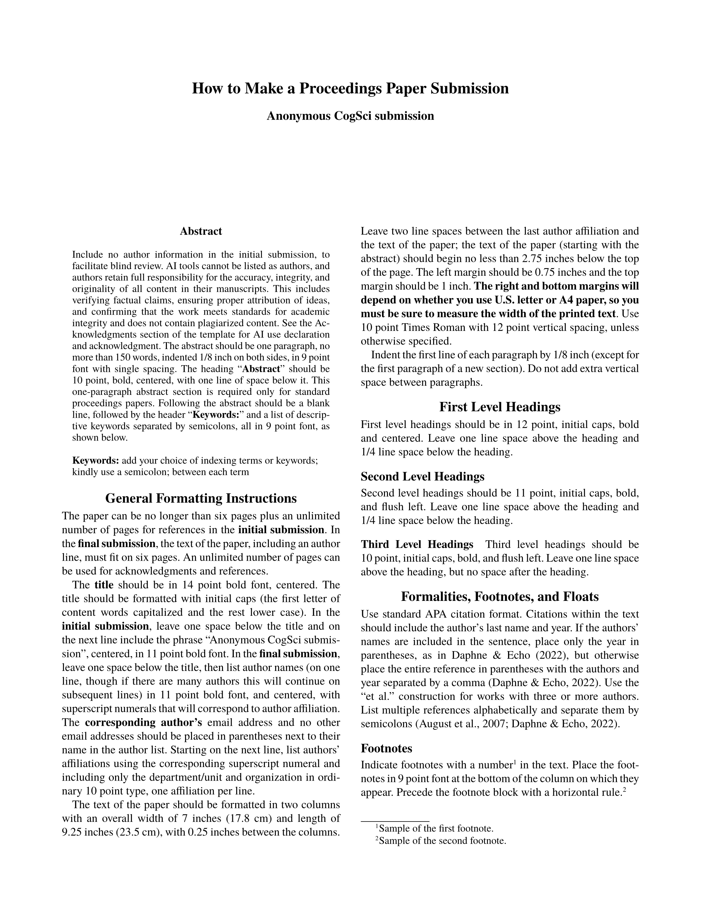
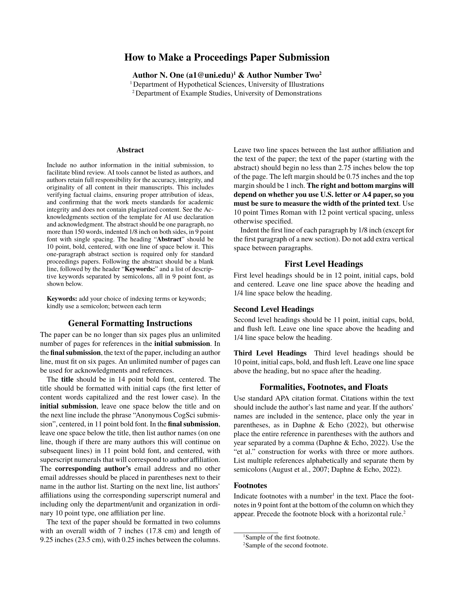

# CogSci Template

A [Typst](https://typst.app/) template for submissions to the _Annual Conference of the [Cognitive Science Society](https://cognitivesciencesociety.org/) (**CogSci**)_.

|                     Anonymized                     |                      Final                      |
| :------------------------------------------------: | :---------------------------------------------: |
|  |  |

## Usage

You will typically want to use this template by initializing a project with the 6-page full paper example. The example document (previewed in the thumbnails) provides formatting specifications and examples of citations, figures, tables, footnotes, and acknowledgments. You can generate the example (*a*) in the Typst web app or (*b*) locally. If you don't need the example, you can also just (*c*) import the template functions in any Typst document.

### (*a*) Initialize the template in the Typst web app

In the [Typst web app](https://typst.app/) dashboard, click "Start from template" and search for `cogsci-conference`. 

**Note**: If you don't see the dashboard when you visit <https://typst.app/>, you need to create and/or log in to an account.

### (*b*) Initialize the template locally

You can use the [Typst CLI](https://github.com/typst/typst) to initialize the template locally:

```shell
typst init @preview/cogsci-conference
cd cogsci-conference
```

See [Local Usage](#local-usage) notes below.

### (*c*) Import the template functions

The API is described in the [Parameters](#parameters) section below.

```typst
#import "@preview/cogsci-conference:0.1.2": cogsci, format-authors

#show: cogsci.with(
  title: [CogSci Typst Template],
  author-info: format-authors(
    authors: (
      (name: [Author N. One], email: "a1@uni.edu", super: [1]),
      (name: [Author Number Two], super: [2]),
    ),
    affiliations: (
      (super: [1], affil: [Department of Hypothetical Sciences, University of Illustrations]),
      (super: [2], affil: [Department of Example Studies, University of Demonstrations]),
    ),
  ),
  abstract: [The abstract.],
  keywords: ("keyword1", "keyword2", "keyword3"),
  anonymize: true,
  hyphenate: true,
)

// Document content...

#bibliography("bibliography.bib")
```

### Local Usage

#### Word processing with [Tinymist](https://myriad-dreamin.github.io/tinymist/)

If you're using Typst locally, I recommend the [Tinymist Typst VS Code Extension](https://marketplace.visualstudio.com/items?itemName=myriad-dreamin.tinymist) for [Visual Studio Code](https://code.visualstudio.com/), which provides live preview, syntax highlighting, and error diagnostics.

#### Fonts

This template requires the fonts [TeX Gyre Termes](https://www.gust.org.pl/projects/e-foundry/tex-gyre) and [TeX Gyre Termes Math](https://www.gust.org.pl/projects/e-foundry/tg-math/index_html), which are distributed under the [GUST Font License (GFL)](https://tug.org/fonts/licenses/GUST-FONT-LICENSE.txt). The Typst web app includes these fonts automatically. To use this template locally, download the OTF files from:

- [TeX Gyre Termes](https://www.gust.org.pl/projects/e-foundry/tex-gyre/termes)
- [TeX Gyre Termes Math](https://www.gust.org.pl/projects/e-foundry/tg-math/download)

You can either install these fonts system-wide or pass the path to a directory containing the OTF files to the compiler. See the [Typst documentation on fonts](https://typst.app/docs/reference/text/text/#parameters-font) for details.

#### Compilation

To compile a PDF using the Typst CLI:

```shell
typst compile --font-path <path-to-fonts-dir> --pdf-standard a-3u main.typ output.pdf
```

If the fonts are installed system-wide, you can omit `--font-path`. Otherwise, use `--font-path <path-to-fonts-dir>` to specify a directory containing the OTF files. With the [Tinymist Typst VS Code Extension](https://marketplace.visualstudio.com/items?itemName=myriad-dreamin.tinymist), specify the font directory with the `tinymist.fontPaths` setting (see the Tinymist [documentation](https://myriad-dreamin.github.io/tinymist/config/vscode.html) for details).

Specifying a [PDF standard](https://typst.app/docs/reference/pdf/#pdf-standards) like `--pdf-standard a-3u` is optional but ensures that the PDF text is searchable and accessible.

For continuous compilation during editing, use watch mode: `typst watch --font-path <path-to-fonts-dir> main.typ`

## Parameters

The `cogsci()` template function accepts the following parameters:

### Document Metadata

- **`title`** (content): The paper title.

- **`author-info`** (content): Formatted author information (ignored when `anonymize` is `true`). The template exports the [`format-authors()`](#author-formatting) helper function, which formats author information automatically. If you wish to format the author information manually, pass content directly to `author-info`. 

- **`abstract`** (content): The paper abstract.

- **`keywords`** (array): Array of keyword strings.

### Author Formatting

The `format-authors()` function accepts authors and affiliations in several formats, e.g.,

keyword arguments with arrays of dictionaries:

```typst
#show: cogsci.with(
  author-info: format-authors(
    authors: (
      (name: [Author N. One], email: "a1@uni.edu", super: [1]),
      (name: [Author Number Two], super: [2]),
    ),
    affiliations: (
      (super: [1], affil: [Department of Hypothetical Sciences, University of Illustrations]),
      (super: [2], affil: [Department of Example Studies, University of Demonstrations]),
    ),
  ),
  ...
)
```

positional arguments without superscripts:

```typst
#show: cogsci.with(
  author-info: format-authors(
    (
      (name: [Author N. One], email: "a1@uni.edu"),
      (name: [Author Number Two]),
    ),
    [Shared Affiliation Details],
  ),
  ...
)
```

You can also bypass `format-authors()` and pass formatted content directly:

```typst
#show: cogsci.with(
  author-info: [
    #text(size: 11pt)[*Author N. One (a1\@uni.edu)#super[1] \& Author Number Two#super[2]*] \
    #super[1~]Department of Hypothetical Sciences, University of Illustrations \
    #super[2~]Department of Example Studies, University of Demonstrations
  ],
  ...
)
```

### Bibliography

Call `bibliography()` at the end of your document:

```typst
#bibliography("bibliography.bib")
```

Typst's `bibliography()` function accepts a BibLaTeX `.bib` file or a Hayagriva `.yaml`/`.yml` file. The template uses the APA citation style.

**Note:** If passing a `.bib` file, use the Bib***La***TeX format (not BibTeX).

### Submission Control

- **`anonymize`** (boolean): Set to `true` for double-blind review submissions (hides author information and uses "Anonymous CogSci submission" placeholder). Set to `false` for final camera-ready submissions with author details. Default is `false`.

### Formatting Options

- **`hyphenate`** (boolean): Set to `false` to disable hyphenation throughout the document (useful for proofreading). Default is `true`.

### Manual Overrides

The template exposes manual overrides for `text()`, `page()`, and `document()`. It's advised that you not use these. If you absolutely need to change the region, paper size, or document metadata, you can override the defaults by supplying a dictionary.

- **`text-kwargs`** (dictionary): expands into `set text(..text-kwargs)`
- **`page-kwargs`** (dictionary): expands into `set page(..page-kwargs)`
- **`document-kwargs`** (dictionary): expands into `set document(..document-kwargs)`


## Requirements

- Typst `v0.14.0` or later (use the [web app](https://typst.app/) or [install locally](https://github.com/typst/typst?tab=readme-ov-file#installation), e.g. with `brew install typst`)
- [TeX Gyre Termes](https://www.gust.org.pl/projects/e-foundry/tex-gyre/termes) and [TeX Gyre Termes Math](https://www.gust.org.pl/projects/e-foundry/tg-math/download) fonts.
  - The Typst web app includes these fonts automatically. For local compilation, download the OTF files from the links above and either install them system-wide or pass the directory containing the OTF files to the compiler.

## License

This template is distributed under the MIT License.

## Author

[](https://github.com/daeh) [](https://daeh.info) [](https://bsky.app/profile/dae.bsky.social)
