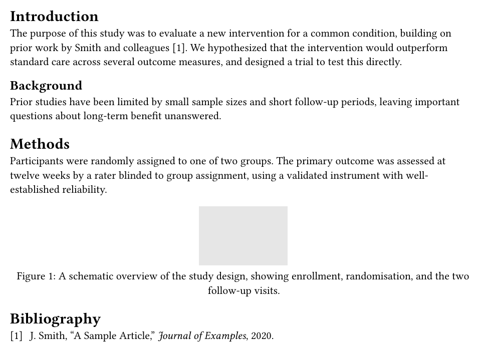
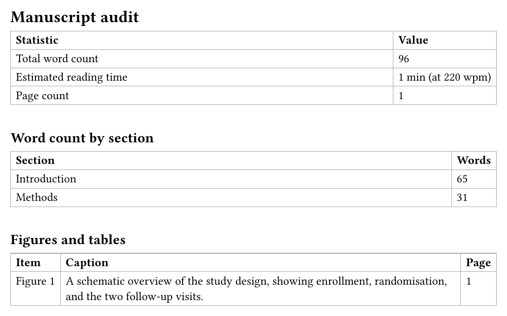

<p align="center">
  
</p>

# Colophon

**Colophon** audits your manuscript *as actually composed* — word count (total and per section), reading time, page count, a figure/table inventory, labels never referenced, bibliography entries never cited — in a companion PDF, produced from the same compile as the manuscript itself. Unlike its sibling packages, it needs no per-passage markup: no `check()`, no `passage()` — an auditor, not an annotator.

<table align="center">
<tr>
<td align="center"></td>
<td align="center">→</td>
<td align="center"></td>
</tr>
</table>

## The problem

"How many words is this?", "does this figure have a caption?", "did I ever reference that equation I labelled?" — answered today by opening a PDF and counting, or by trusting whatever a word processor's own status bar says about a completely different source format. None of it reflects the *real*, composed document: a word count taken from source text is wrong the moment a citation resolves into a bracketed number, and a page count doesn't exist at all until the document has actually been laid out.

This works because Typst's experimental **bundle export** lets a single compile produce several documents that share one introspection space — the audit is a genuinely separate document, built in the very same compile that laid the manuscript out, not a second tool run afterward against a stale copy.

## Key features

- **Word count, total and by section** — `word-counts-by-section` buckets prose by heading, with the reference/citation machinery already stripped out (a resolved citation's own bracketed number is never counted as a word). Excludes table cells and, by default, figure captions (`count-captions: true` to opt them in).
- **Works through `@preview/palimpsest`'s own marks.** `add`/`del`/`rep`/`passage` all render through a `context` block, even in clean mode — colophon reads their own metadata directly instead, so the word count matches exactly what the *clean*, submitted manuscript shows: the added text counted, the deleted text not, the replacement's new wording only.
- **An abstract, counted on its own.** `abstract(body)` — an invisible marker, placed once, wherever you already write your abstract (a template's own `abstract:` parameter, or a section in the manuscript) — reports its word count separately, excluded from the body total, since it's routinely capped by its own, independent limit.
- **A figure/table inventory with the real numbering.** Kind, caption, and real page for every figure and table — the displayed number comes from `ref(...)`, the same mechanism that already prints it correctly in the manuscript, so it's right even for a template with its own exotic numbering scheme (by section, roman numerals, ...), not recomputed by hand.
- **Labels never referenced, and bibliography entries never cited.** Every labelled heading/figure/equation with no `ref` anywhere in the bundle; every `.bib` entry (given a root-relative path) that no `@key` in the manuscript ever cites.
- **Reports facts, never enforces them.** No per-journal word or page limits, no `strict`/diagnostic machinery — an orphan label or an unused reference is often deliberate, so colophon lists it and leaves the judgment to you.

## Installation

Import the package, plus `contexture` — the small, package-agnostic dependency that actually assembles the bundle compile (colophon itself never calls Typst's own `document(...)`):

```typ
#import "@preview/colophon:0.1.0": *
#import "@preview/contexture:0.1.0": bundle
```

Requires **Typst 0.15** or later, specifically its `--features bundle` export (still experimental — Typst prints a warning about this on every compile, which is expected).

## Quick start

```typ
#import "@preview/colophon:0.1.0": *
#import "@preview/contexture:0.1.0": bundle

#show: bundle.with(
  template: instrument(template: my-journal-template),
  documents: (report(),),
)

#include "manuscript.typ"
```

```sh
typst compile --features bundle --format bundle main.typ
```

produces `manuscript.pdf` — completely unaffected, since nothing here touches the manuscript's own rendering — and `audit.pdf`, the report. `instrument(...)` is the one wrapping step this package asks for: it lets `report()` find the manuscript's real page span, and (for the word count) its content before layout, where a citation is still a real, ignorable reference rather than a rendered bracket.

Counting an abstract separately, and flagging never-cited references, both need one more small, deliberate step each:

```typ
#let my-template = some-journal-template.with(
  abstract: abstract(lorem(150)),   // wrap wherever you already write it
  // ...other template args unchanged
)

#show: bundle.with(
  template: instrument(template: my-template),
  documents: (report(bib: "/manuscript.bib"),),
)
```

## Documentation

No `docs/manual.typ` yet — in the meantime, `lib.typ` and each `src/*.typ` file carry full doc comments, and [`tests/`](https://github.com/eusebe/typst-colophon/tree/0.1.0/tests) has one focused example per feature (word counts, a figure/table inventory, orphan labels and uncited references, a real Typst Universe template, combining with `@preview/palimpsest` and `@preview/checkitoff` in the same bundle).

## Examples

Two complete, working projects live under [`examples/`](https://github.com/eusebe/typst-colophon/tree/0.1.0/examples) — the same two full-length fake articles `@preview/palimpsest` uses for its own examples (`ivana-snackwell`-grade mock studies, not toy manuscripts), each with `colophon` added alongside palimpsest's own reviewer letter:

- [**`fridge-study/`**](https://github.com/eusebe/typst-colophon/tree/0.1.0/examples/fridge-study) — against `@preview/unequivocal-ams`, with real figures built from `@preview/lilaq`. (⇒ pdf: [manuscript](https://github.com/eusebe/typst-colophon/blob/0.1.0/examples/fridge-study/main/manuscript.pdf), [response](https://github.com/eusebe/typst-colophon/blob/0.1.0/examples/fridge-study/main/response.pdf), [audit](https://github.com/eusebe/typst-colophon/blob/0.1.0/examples/fridge-study/main/audit.pdf))
- [**`emoji-email/`**](https://github.com/eusebe/typst-colophon/tree/0.1.0/examples/emoji-email) — against `@preview/charged-ieee`'s two-column layout, same real-figure treatment. (⇒ pdf: [manuscript](https://github.com/eusebe/typst-colophon/blob/0.1.0/examples/emoji-email/main/manuscript.pdf), [response](https://github.com/eusebe/typst-colophon/blob/0.1.0/examples/emoji-email/main/response.pdf), [audit](https://github.com/eusebe/typst-colophon/blob/0.1.0/examples/emoji-email/main/audit.pdf))

## Part of the `contexture` ecosystem

Built on [`@preview/contexture`](https://eusebe.github.io/typst-contexture-site/contexture/), the small shared engine behind every multi-document compile in this ecosystem. Combines cleanly with:

- [`@preview/palimpsest`](https://eusebe.github.io/typst-contexture-site/palimpsest/) — manuscript revisions and a reviewer response letter that cites the real pages.
- [`@preview/checkitoff`](https://eusebe.github.io/typst-contexture-site/checkitoff/) — reporting-guideline checklists (CONSORT, PRISMA, SPIRIT, STARD, STROBE) filled in with the real pages.

## License

MIT
