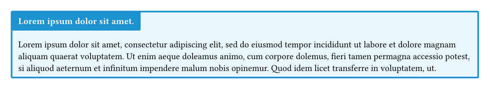
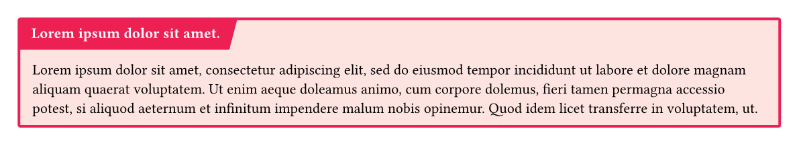
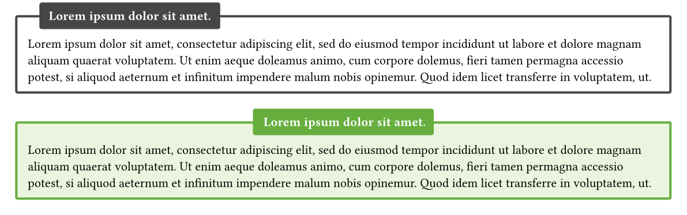
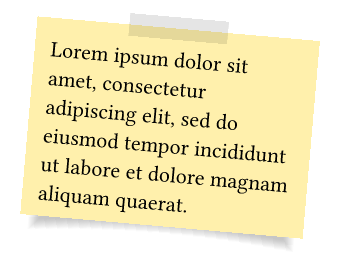

# typst-boxes

Colorful boxes in [Typst](https://github.com/typst/typst).

Check out [the example project](https://typst.app/project/rp9q3upfc69bPUCbv0BjzX) to see all boxes in action

Current features include:

- a colorful box is in four different colors (black, red, blue, green)
- a colorful box with a slanted headline
- a box with a simple outline
- a rotateable stickynote

## Colorbox



### Usage

```
#colorbox(
  title: lorem(5),
  color: "blue",
  radius: 2pt,
  width: auto
)[
  #lorem(50)
]
```

## Slanted Colorbox



### Usage

```
#slanted-colorbox(
  title: lorem(5),
  color: "red",
  radius: 0pt,
  width: auto
)[
  #lorem(50)
]
```

## Outlinebox



### Usage

```
#outlinebox(
  title: lorem(5),
  width: auto,
  radius: 2pt,
  centering: false
)[
  #lorem(50)
]

#outlinebox(
  title: lorem(5),
  color: "green",
  width: auto,
  radius: 2pt,
  centering: true
)[
  #lorem(50)
]
```

## Stickybox



### Usage

```
#stickybox(
  rotation: 5deg,
  width: 5cm
)[
  #lorem(20)
]
```
