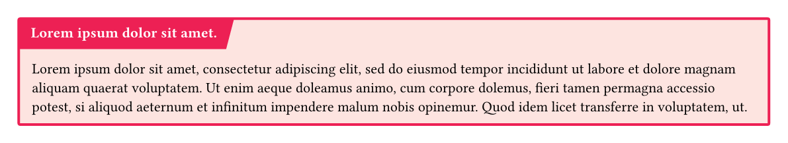
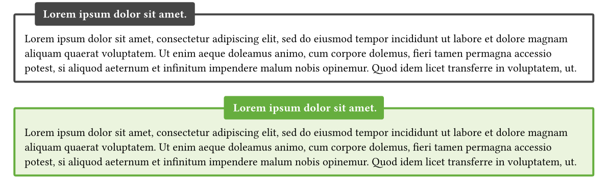
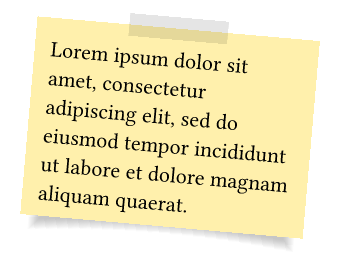

# Typst Boxes

**Typst Boxes** is a package for creating colorful and customizable boxes in [Typst](https://github.com/typst/typst). It's perfect for enhancing your documents with visually appealing components.

[➡️ Check out the example project](https://typst.app/project/rp9q3upfc69bPUCbv0BjzX) to see all the boxes in action!

---

## Features

- Colorful boxes in four predefined colors: **black**, **red**, **blue**, and **green**.
- A **slanted headline colorbox** for dynamic designs.
- A **simple outline box** for clean layouts.
- A **rotateable sticky note** for fun or informal content.

---

## Examples and Usage

### Colorbox


A versatile colorful box with a title and customizable design.

#### Code:

```typst
#colorbox(
  title: lorem(5),
  color: "blue",
  radius: 2pt,
  width: auto
)[
  #lorem(50)
]
```

### Slanted Colorbox



Add some flair with a slanted headline.

#### Code

```typst
#slanted-colorbox(
  title: lorem(5),
  color: "red",
  radius: 0pt,
  width: auto
)[
  #lorem(50)
]
```

### Outline Colorbox



A clean and simple box with an outline. Titles can be aligned to the center or the left.

#### Code

```typst
#outline-colorbox(
  title: lorem(5),
  width: auto,
  radius: 2pt,
  centering: false
)[
  #lorem(50)
]

#outline-colorbox(
  title: lorem(5),
  color: "green",
  width: auto,
  radius: 2pt,
  centering: true
)[
  #lorem(50)
]
```

### Stickybox



A fun and rotateable sticky note for informal or highlight content.

#### Code

```typst
#stickybox(
  rotation: 5deg,
  width: 5cm
)[
  #lorem(20)
]
```

## Contributing

We welcome contributions to improve this package! Here's how you can help:

1. Fork the repository.
2. Create a new branch for your feature or fix.
3. Submit a pull request with a clear description.

## License

This project is licensed under the **MIT License**.

You are free to use, modify, and distribute this project under the terms of the license. See the [LICENSE](LICENSE) file for detailed information.
