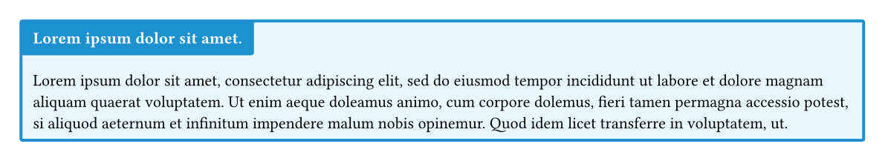
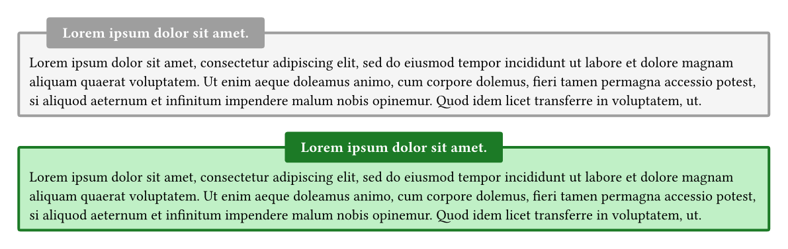
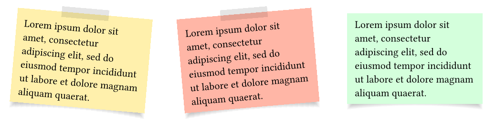

# Typst Boxes

**Typst Boxes** is a Typst package for adding colorful, customizable boxes to your documents.

[➡️ Explore the live example project](https://typst.app/project/rp9q3upfc69bPUCbv0BjzX)

---

## Table of Contents

1. [Features](#features)  
2. [Examples & Usage](#examples--usage)  
   - [Colorbox](#colorbox)  
   - [Slanted Colorbox](#slanted-colorbox)  
   - [Outline Colorbox](#outline-colorbox)  
   - [Stickybox](#stickybox)  
3. [Contributing](#contributing)  
4. [License](#license)  

---

## Features

- Predefined color themes: **black**, **red**, **blue**, **green**, **purple**, **gold**, and more  
- `slanted-colorbox` for angled headlines  
- `outline-colorbox` for simple bordered layouts  
- `stickybox` for rotatable notes  
- Custom color support via `color` parameter (string or dictionary)  
- Disable sticky tape with `tape: false`  

---

## Examples & Usage

### Colorbox



```typst
#colorbox(
  title: lorem(5),
  color: "blue",
  radius: 2pt,
  width: auto,
)[
  #lorem(50)
]
```

Use other built‑in colors:  
`"red"`, `"green"`, `"purple"`, `"gold"`, `"gray"`, `"cyan"`, etc.

Custom color via dictionary:

```typst
#colorbox(
  title: "Custom Theme",
  color: (
    fill: rgb("#f0f8ff"),
    stroke: rgb("#00bfff"),
    title: rgb("#002366")
  ),
  radius: 4pt,
  width: auto
)[
  "This box uses a custom color dictionary."
]
```

---

### Slanted Colorbox


```typst
#slanted-colorbox(
  title: lorem(5),
  color: "red",
  radius: 0pt,
  width: auto,
)[
  #lorem(50)
]
```

---

### Outline Colorbox



```typst
#outline-colorbox(
  title: lorem(5),
  width: auto,
  radius: 2pt,
  centering: false,
)[
  #lorem(50)
]

#outline-colorbox(
  title: lorem(5),
  color: "green",
  width: auto,
  radius: 2pt,
  centering: true,
)[
  #lorem(50)
]
```

Custom colors via dictionary:

```typst
#outline-colorbox(
  title: "Soft Green",
  color: (
    fill: green.lighten(70%),
    stroke: green.darken(40%)
  ),
  width: auto,
  radius: 2pt,
  centering: false,
)[
  #lorem(20)
]
```

---

### Stickybox



#### Basic

```typst
#stickybox(
  rotation: 5deg,
  width: 5cm,
)[
  #lorem(20)
]
```

#### Custom Background Color

```typst
#stickybox(
  width: 5cm,
  rotation: -5deg,
  fill: rgb("#ffb6a6"),
)[
  #lorem(20)
]
```

#### Disable Tape

```typst
#stickybox(
  width: 8cm,
  fill: rgb("#33ff57"),
  tape: false,
)[
  "No tape here!"
]
```

---

## Contributing

We welcome contributions!  
1. Fork this repository  
2. Create a feature branch  
3. Open a pull request with a clear description  

---

## License

This project is licensed under the **MIT License**. See [LICENSE](LICENSE) for details.
