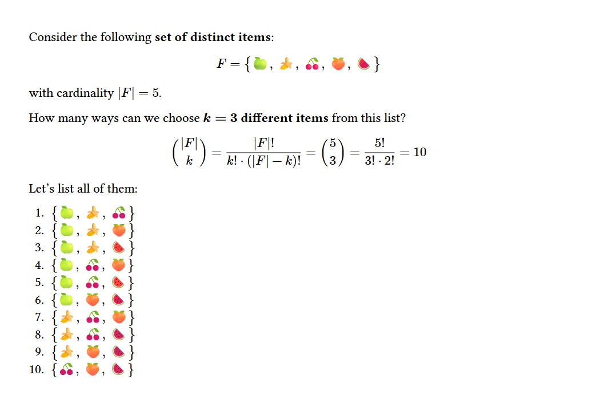
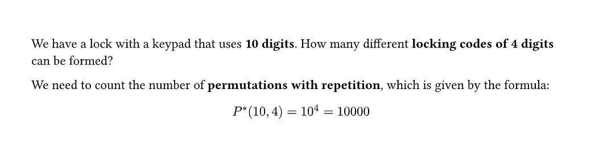
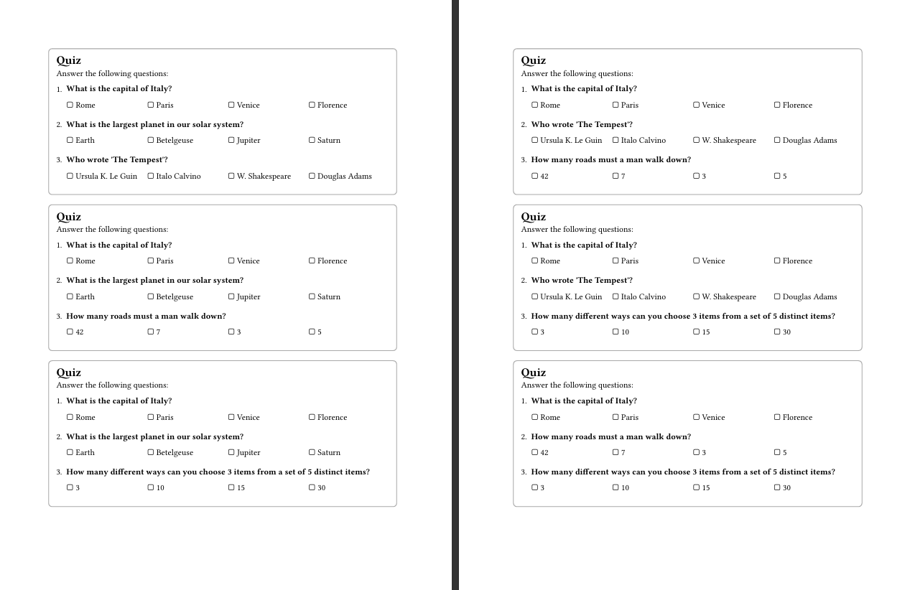
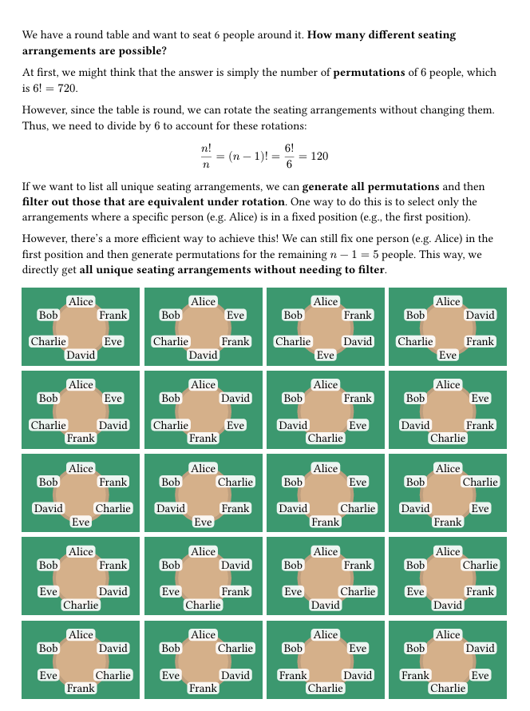

# Combo

<a href="https://github.com/typst/packages/tree/main/packages/preview/combo" style="text-decoration: none;"></a>
<a href="https://www.gnu.org/licenses/gpl-3.0.en.html" style="text-decoration: none;"></a>

A package for computing **combinatorial operations** in [Typst](https://typst.app/).


<details>
  <summary><i><u>See the code for this example</u></i></summary>

```typ
#import "@preview/combo:0.1.0"

#let items = (
  emoji.apple, 
  emoji.banana, 
  emoji.cherries, 
  emoji.peach, 
  emoji.watermelon,
)
#let n = items.len()

Consider the following *set of distinct items*: 
$ F = {#items.join(", ")} $
with cardinality $|F|=#n$. 

#let k = 3
How many ways can we choose *$k=#k$ different items* from this list?

$ binom(|F|, k) = (|F|!)/(k! dot (|F|-k)!) = binom(#[#n], #k) = #n!/(#k! dot #(n - k)!) = #combo.count-combinations(n, k) $

Let's list all of them:

#for c in combo.get-combinations(items, k) {
  [ + ${#c.join(", ")}$ ]
}
```
</details>

## Quick Start 📦
To start using Combo in your Typst project, add the following line to your file:
```typ
#import "@preview/combo:0.1.0"
```

You can then access the functions provided by the package calling the `combo` namespace.

## *Combo* Tools 🧰
A simple way to think about the functions provided by this package is to consider that they are defined by 3 *choices*:
- **Which _action_ to perform: `count` or `get` groups?**
  - `count` functions return the number of possible groups.
  - `get` functions return the actual groups as a list of lists.
- **Which type of _groups_ to consider: `combinations` or `permutations`?**
  - `combinations` are groups where the order of items does not matter. E.g. the group `(a, b)` is the same as `(b, a)`.
  - `permutations` are groups where the order of items does matter. E.g. the group `(a, b, c)` is different from `(b, a, c)`, from `(c, b, a)`, etc.
- **Whether _repetition_ of items is allowed: `with-repetition` or `no-repetition`?**
  - `with-repetition` means that the same item can be chosen multiple times in the same group.
  - `no-repetition` means that each item can be chosen only once in the same group.

According to this structure, _Combo_ functions are named following this **pattern**:

`combo.`{`count`|`get`}-{`combinations`|`permutations`}-{`with-repetition`|`no-repetition`}(_...parameters..._)

For example, the following function **counts** the number of **combinations** **without repetition** of 3 items from a list of 5 items (*5 choose 3*):

```typ
#combo.count-combinations-no-repetition(5, 3) // returns 10
```

### Parameters

*Combo* functions (usually) take the following **parameters**:
- `items`, which represents **the pool of items to choose from**. It can be either an `array` of such items, or an `integer` representing the cardinality.
  - If `items` is an `array`, the items in the array can be of any type. Such items will be used *as-is* in the returned groups.
  - If `items` is an `integer`, it must be a non-negative integer `n`, and the items will be considered as the integers from `0` to `n-1`.
- `k`: the **number of items to choose in each group**, which must be a non-negative `integer`. Depending on which type of groups is considered, the parameter `k` may have a default value:
  - For **combinations**, `k` has no default value (i.e. it must be provided).
  - For **permutations**, `k` defaults to `auto`, which means that `k` will be set to the cardinality of `items` (i.e. all items will be used in each group). This is because permutations are usually considered as arrangements of all items.

Here's an example of different function calls:

```typ
#combo.count-combinations-with-repetition(("a", "b", "c", "d"), 2) 
// returns binom(4 + 2 - 1, 2) = 10

#combo.count-permutations-no-repetition(4) 
// returns perm(4, 4) = 24

#combo.count-permutations-with-repetition(("x", "y"), k: 3) 
// returns 2^3 = 8
// Notice that `k` is specified using a named argument
```

### Return Values

*Combo* have two types of **return values**, depending on the type of function:
- `count` functions, i.e. those that **count the number of groups**, return a single `integer`.
- `get` functions, i.e. those that **list the actual groups**, return an `array` of `arrays`, where each inner array represents a group of items.

```typ
#combo.count-combinations-no-repetition(("a", "b", "c", "d"), 2) 
// returns 6

#combo.get-combinations-no-repetition(("a", "b", "c", "d"), 2)
// returns an array of arrays:
// (
//   ("a", "b"),
//   ("a", "c"),
//   ("a", "d"),
//   ("b", "c"),
//   ("b", "d"),
//   ("c", "d"),
// )
```

### List of Functions
Here is the complete list of functions provided by *Combo*:

| Name | Description | Return type |
|---|---|---|
| `count-combinations-no-repetition` | **Counts** the number of **combinations** (groups where order doesn't matter) **without** repetition (no items duplicated). In mathematical terms, it computes the *binomial coefficient* for *n items, choose k* by calling the `calc.binom(n, k)` Typst native function. | `int` |
| `count-combinations-with-repetition` | **Counts** the number of **combinations** (groups where order doesn't matter) **with** repetition (items can be duplicated). It's computed using the formula `calc.binom(n + k - 1, k)`, where `n` is the cardinality of `items` and `k` is the number of items to choose. | `int` |
| `count-combinations` | **Wrapper** for the two functions above, with an additional parameter `repetition` that can be either `true` or `false` (default). | `int` |
| `count-permutations-no-repetition` | **Counts** the number of **permutations** (groups where order matters) **without** repetition (no items duplicated). This is computed using the formula `n! / (n - k)!`, where `n` is the cardinality of `items` and `k` is the number of items to choose. If `k` is not provided, it defaults to `n`, and the function returns `n!`. | `int` |
| `count-permutations-with-repetition` | **Counts** the number of **permutations** (groups where order matters) **with** repetition (items can be duplicated). The result is the cardinality of `items` raised to the power of `k`, i.e. `n^k`. If `k` is not provided, it defaults to `n`, and the function returns `n^n`. | `int` |
| `count-permutations` | **Wrapper** for the two functions above, with an additional parameter `repetition` that can be either `true` or `false` (default). | `int` |
| `get-combinations-no-repetition` | **Gets** all the possible **combinations** (groups where order doesn't matter) **without** repetition (no items duplicated). | `array` of `arrays` |
| `get-combinations-with-repetition` | **Gets** all the possible **combinations** (groups where order doesn't matter) **with** repetition (items can be duplicated). | `array` of `arrays` | |
| `get-combinations` | **Wrapper** for the two functions above, with an additional parameter `repetition` that can be either `true` or `false` (default). | `array` of `arrays` |
| `get-permutations-no-repetition` | **Gets** all the possible **permutations** (groups where order matters) **without** repetition (no items duplicated). | `array` of `arrays` |
| `get-permutations-with-repetition` | **Gets** all the possible **permutations** (groups where order matters) **with** repetition (items can be duplicated). | `array` of `arrays` |
| `get-permutations` | **Wrapper** for the two functions above, with an additional parameter `repetition` that can be either `true` or `false` (default). | `array` of `arrays` |
| `cartesian-product` | **Gets** the **Cartesian product** of multiple input arrays. This is an auxiliary utility function that may be needed when dealing with combinatorial problems. | `array` of `arrays` |

## Important Notes ⚠️

- All functions are **pure** (i.e. they have no side effects) and **deterministic** (i.e. they always return the same output for the same input).
- All functions return results in **lexicographic order**. For example, the combinations of `("a", "b", "c")` taken 2 at a time are returned in the order: `(("a", "b"), ("a", "c"), ("b", "c"))`.
  - Lexicographic order is determined by the **order of items in the input array**: this means that, for example, given the array `("zzz", "aaa")` as input, the string `"zzz"` comes before `"aaa"`.
  - This choice prioritizes **consistency** and **predictability** over efficiency, based on the assumption that Typst will not be used in performance-critical scenarios.
- All items in the input array `items` are assumed  **distinct**. If the input array contains duplicates, they will be treated as different items. 
  - For example, the combinations of `("a", "b", "a")` taken 2 at a time are: `(("a", "b"), ("a", "a"), ("a", "b"))`.
- The functions that **get groups** may return a _very large number_ of groups, depending on the input parameters. For example, the number of _permutations with repetition of 10 items_ is `10^10 = 10_000_000_000`. Be careful when using such functions with large inputs, as they may lead to performance issues or even crash Typst.

## Examples 📚

### Counting the number of permutations for a lock
This simple document is rendered programmatically based on the values of `total-digits` and `digits-to-choose`, which can be changed to see how the number of possible locking codes changes.


<details>
  <summary><i><u>See the code for this example</u></i></summary>
  
```typ
#import "@preview/combo:0.1.0"

#let total-digits = 10
#let digits-to-choose = 4

We have a lock with a keypad that uses *#total-digits digits*. How many different *locking codes of #digits-to-choose digits* can be formed?

We need to count the number of *permutations with repetition*, which is given by the formula:
$ P^*(#total-digits, #digits-to-choose) 
= #total-digits^#digits-to-choose 
= #combo.count-permutations-with-repetition(total-digits, k: digits-to-choose) $
```
</details>

### Creating different tests for a class of students

In this example, we create a simple three-question **quiz** by selecting **unique combinations of answers** from a pool of possible answers.


<details>
  <summary><i><u>See the code for this example</u></i></summary>
  
```typ
#import "@preview/combo:0.1.0"

// Let's assume you have a dataset of questions and answers
// The objective is to create a quiz with a subset of these questions
#let questions = (
  (
    question: "What is the capital of Italy?",
    answers: ("Rome", "Paris", "Venice", "Florence"),
    correct: "Rome",
  ),
  (
    question: "What is the largest planet in our solar system?",
    answers: ("Earth", "Betelgeuse", "Jupiter", "Saturn"),
    correct: "Jupiter",
  ),
  (
    question: "Who wrote 'The Tempest'?",
    answers: ("Ursula K. Le Guin", "Italo Calvino", "W. Shakespeare", "Douglas Adams"),
    correct: "W. Shakespeare",
  ),
  (
    question: "How many roads must a man walk down?",
    answers: ("42", "7", "3", "5"),
    correct: "42",
  ),
  (
    question: "How many different ways can you choose 3 items from a set of 5 distinct items?",
    answers: ("3", "10", "15", "30"),
    correct: "10",
  ),
)

// It's easy to create differentiated versions of the same quiz by selecting different combinations of questions.
#for quiz-questions in combo.get-combinations(questions, 3) [
  // Here we have our 3-question test, we can build a template around it.
  #block(breakable: false, stroke: 1pt + gray, inset: 10pt, radius: 5pt)[

    = Quiz
    Answer the following questions:

    #for q in quiz-questions [
      + *#q.question*
        #stack(dir: ltr,
          ..q.answers.map(a => box(width: 25%)[
            ▢ #a
          ])
        )
        #v(1em)
    ]

  ]
]

```
</details>

### Placing people around a table
This example shows how to use _Combo_ to solve a classic combinatorial problem: **how many ways can $n$ people be seated around a table?**


_(The image shows only some of the possible arrangements; the original document continues for other pages.)_
<details>
  <summary><i><u>See the code for this example</u></i></summary>
  
```typ
#import "@preview/combo:0.1.0"
#import "@preview/cetz:0.4.2"

#let people = (
	"Alice",
	"Bob",
	"Charlie",
	"David",
	"Eve",
	"Frank",
)
#let n = people.len()

We have a round table and want to seat #n people around it. *How many different seating arrangements are possible?*

At first, we might think that the answer is simply the number of *permutations* of $#n$ people, which is $#n! = #combo.count-permutations(n, repetition: false)$.

However, since the table is round, we can rotate the seating arrangements without changing them. Thus, we need to divide by $#n$ to account for these rotations:
$ n! / n = (n - 1)! = #n!/#n = #(combo.count-permutations(n, repetition: false) / n) $

If we want to list all unique seating arrangements, we can *generate all permutations* and then *filter out those that are equivalent under rotation*. One way to do this is to select only the arrangements where a specific person (e.g. #people.at(0)) is in a fixed position (e.g., the first position).

However, there's a more efficient way to achieve this! We can still fix one person (e.g. #people.at(0)) in the first position and then generate permutations for the remaining $n - 1 =#(n - 1)$ people. This way, we directly get *all unique seating arrangements without needing to filter*.

#let placements = combo.get-permutations-no-repetition(people.slice(1)).map(p => (people.at(0),) + p)


// Function to visualize a seating arrangement
#let show-table(seating) = {
	cetz.canvas({
		import cetz.draw: *
		rect((-55pt, -35pt), (55pt, 38pt), fill: olive, stroke: none)

		// Draw table
		let r = 25pt
		circle((0, 0), radius: r, fill: rgb("#d6b18b"), stroke: rgb("#bfa080") + 3pt)

		// Draw people 
		let angle = 360deg / seating.len()
		scale(x: 1.4)
		for person in seating {
			content(
				(0, r),
				box(inset: 2pt, radius: 3pt, fill: white.transparentize(10%))[#person],
			)
			rotate(angle)
		}
	})
}

#grid(
	..placements.map(show-table), 
	columns: 4,
	gutter: 5pt,
)
```
</details>


## Contributing 🧩
Found a bug, have an idea, or want to contribute?
Feel free to open an **issue** or **pull request** on the [GitHub repository](https://github.com/micheledusi/Combo).

Made something cool with _Combo_? Let me know — I’d love to feature your work!

### Credits
This package is created by [Michele Dusi](https://github.com/micheledusi) and is licensed under the [GNU General Public License v3.0](https://www.gnu.org/licenses/gpl-3.0.en.html).

Don't forget to read the [*Combo Manual*](/docs/manual-combo.pdf) for the complete documentation!