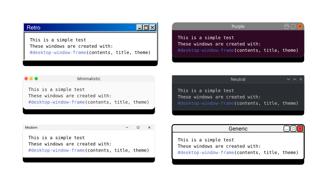
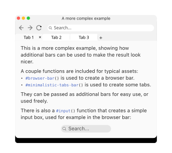
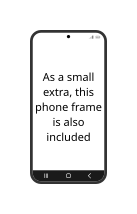

# computer-framer

A library for placing content inside desktop-like windows, with a variety of themes and styles.

  

## Main function

The main function is `desktop-window-frame`, which takes content and places it inside a window frame. Its arguments are:

desktop-window-frame arguments

* `content`: the content to be placed inside the window frame.
* `title`: the title of the window, which will be displayed in the title bar. Keep in mind that the frame will not adapt to the title length, since it is placed in the center without affecting the flow.
* `theme`: the theme of the windows frame. It consists of a dictionary with certain keys (detailed below). Several functions are provided to create default themes easily with a certain level of customization.
* `additional-bars`: a list of additional bars to be placed below the title bar. Each element in the list should be the content corresponding to the bar.
* `show-buttons`: Whether to show the window buttons or not. Defaults to true.
* `width` and `height`: the dimensions of the window frame. If not provided, the dimensions will be the dimensions of the content.

## Themes

The keys of a theme dictionary are:

Theme keys

* `background-color`: the overall background color of the window frame. Is not used to draw the frame, but is stored in case the user wants to have it at hand for other purposes.
* `stroke`: similar to `background-color`, but for the stroke color of the window frame.
* `buttons`: the content to place as buttons at a corner of the title bar.
* `windows-frame`: callback function that will be used to draw the overall window frame from the content it surrounds.
* `content-frame`: callback function that will be used to draw the content frame from the content it surrounds.
* `header-bar`: callback function that will be used to draw the header bar, for example by putting it into a grid cell. It should receive as arguments:
  * `content`: the content to be placed inside the header bar.
  * `i`: the index of the header bar being drawn, starting from 0 for the title bar. Can be used for different styling.
  * `total-bars`: the total number of header bars in the window. Can also be used for different styling.
* `title-wrapper`: callback function that will be used to draw the title of the window. It should receive as argument the title string, and return content that has processed it in some way (e.g. applying a certain font, color size, etc.).
* `title-align`: the alignment of the title bar. It should be an alignment such as `center` or `left`.
* `buttons-align`: the alignment of the buttons in the title bar. It should be an alignment such as `left` or `right`.

## Predefined themes

Several functions are provided to create predefined themes with a certain level of customization. They are:

Predefined themes

* `retro-theme`: Classic desktop style with strong bevels.
* `purple-theme`: Purple-accented theme with rounded controls.
* `minimalistic-theme`: Minimal theme with green/orange/red buttons.
* `neutral-theme`: Neutral minimal theme. Can use light or dark mode, or fully custom colors.
* `modern-theme`: Modern rounded theme.
* `rounded-window-theme`: Generic, highly customizable theme. Used by all the other themes except for `retro-theme`, instanced in different ways. By defult it offers a mockup-like style with strong strokes. 

## Included assets

A couple of functions are included to provide typical assets for the windows. They are:

Included assets

* `minimalistic-tabs-bar`: a minimalistic tabs bar with optional active tab and options for styling. Offers optional close button, tab separators, and add tab button.
* `input`: a simple input field with optional placeholder and icon to the left. For the moment, icon can only be "search", with no icon being drawn for any other value.
* `browser-bar`: a simple browser bar with typical elements (back, forward, and refresh buttons) and a search input.

  

## Phone frame

As a little extra, the `phone-frame` function is provided, which takes content and places it inside a phone-like frame. Some of its arguments refer to the placing of a couple small icons, whose functions are also available: `battery-icon-modern`, `battery-icon-classic`, and `signal-icon`.

  

