# conch

A shell simulator that renders interactive terminal sessions in [Typst](https://typst.app), powered by a Rust WASM plugin.

Type shell commands in your Typst document. Conch executes them against a virtual filesystem and renders a realistic terminal window — complete with colored output, syntax highlighting, and animation support.

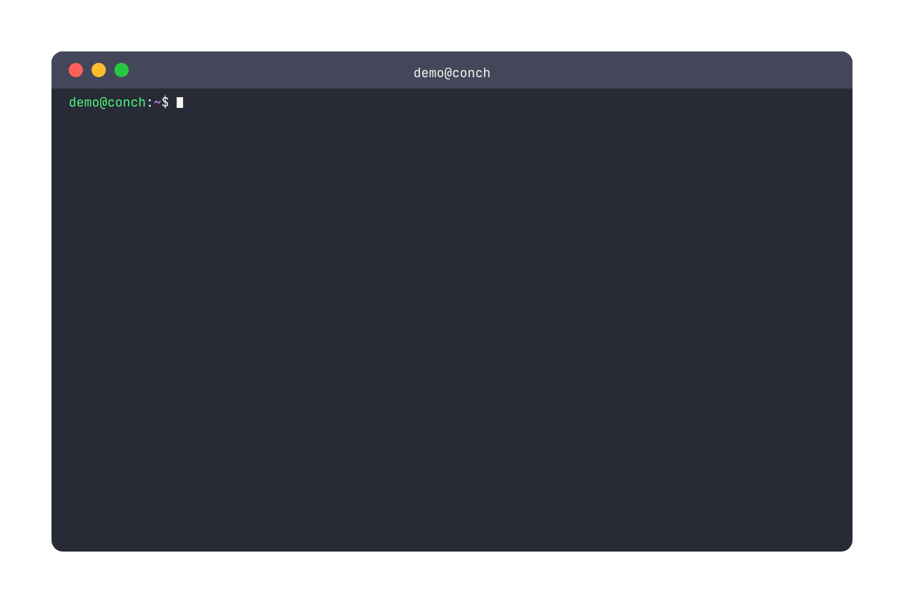

## Quick Start

````typst
#import "@preview/conch:0.1.0": system, terminal

#show: terminal.with(
  system: system(
    hostname: "conch",
    files: (
      "hello.txt": "Hello, World!",
      "src/main.rs": "fn main() {\n    println!(\"hi\");\n}",
    ),
  ),
  user: "demo",
)

```
ls
cat hello.txt
cat src/main.rs
echo "Welcome to $SHELL!"
```
````

## Three Reusable Layers

Conch is built as three independent layers. Use only what you need.

### Layer 1: Terminal Frame

A themed terminal window chrome. No WASM, no shell — just the visual frame around any content.

```typst
#import "@preview/conch:0.1.0": terminal-frame

#terminal-frame(title: "cargo build", theme: "dracula")[
  \$ cargo build --release \
  Compiling my-app v0.1.0 \
  Finished release target(s) in 3.2s
]
```

### Layer 2: ANSI Renderer

Render text with ANSI escape sequences. Works standalone or inside a frame.

```typst
#import "@preview/conch:0.1.0": terminal-frame, render-ansi

#terminal-frame(title: "test results", theme: "catppuccin")[
  #render-ansi(
    "\u{1b}[1;32mPASSED\u{1b}[0m test_new\n\u{1b}[1;31mFAILED\u{1b}[0m test_pipe",
    theme: "catppuccin",
  )
]
```

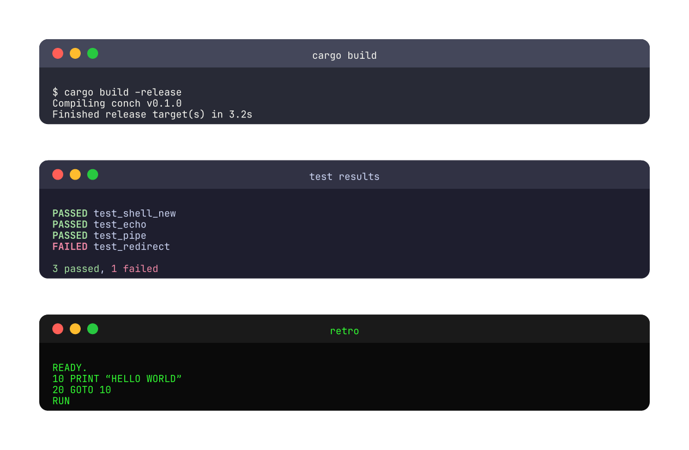

### Layer 3: Shell Simulator

The full experience — execute commands, pipe output, write files, run scripts.

**As a standalone page** (show rule — sets page dimensions automatically):

````typst
#import "@preview/conch:0.1.0": system, terminal

#show: terminal.with(
  system: system(),
  user: "dev",
)

```
ls | grep ".rs" | wc -l
cat data.csv | cut -d , -f 1,3 | sort | uniq
echo "done" > log.txt && cat log.txt
```
````

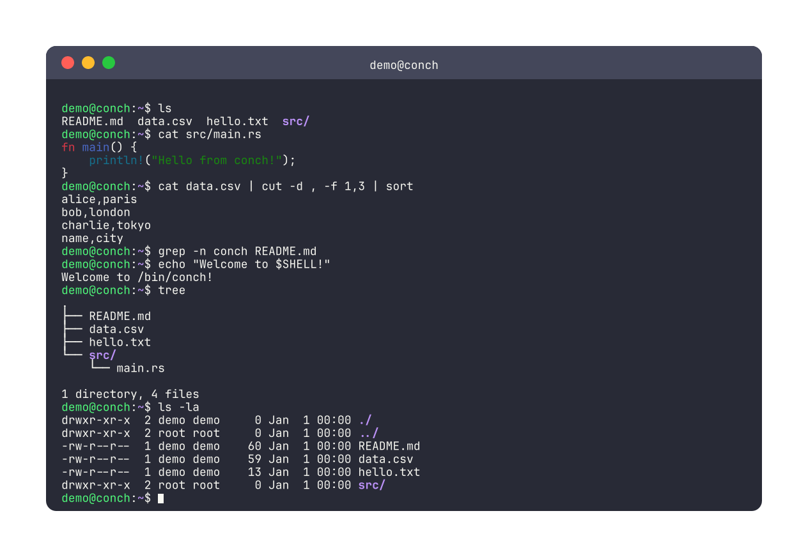

**Embedded in a document** (no page side effects):

````typst
#import "@preview/conch:0.1.0": system, terminal-block

= Build Log

#terminal-block(
  system: system(files: (
    "src/main.rs": "fn main() {}",
  )),
  user: "ci",
)[```
ls
cat src/main.rs
echo "Build complete"
```]
````

Use `terminal` for standalone terminal documents and screenshots. Use `terminal-block` to embed a terminal inside a larger document alongside other content.

## Supported Commands

100+ commands across 9 categories:

| Category       | Commands                                                                                                                                                                                                                                                                                                                                  |
| -------------- | ----------------------------------------------------------------------------------------------------------------------------------------------------------------------------------------------------------------------------------------------------------------------------------------------------------------------------------------- |
| **Filesystem** | `ls` (`-alRht1`), `cat` (`-n`, `-`), `mkdir` (`-p`), `rmdir`, `touch`, `mktemp` (`-d`), `rm` (`-rf`), `cp` (`-rnp`), `mv`, `ln` (`-sf`), `readlink` (`-f`), `find` (`-name`, `-iname`, `-type`, `-path`, `-maxdepth`, `-exec`, `-delete`), `tee` (`-a`), `chmod` (`-R`, octal + symbolic), `chown` (`-R`), `chgrp` (`-R`), `id`, `groups` |
| **Text**       | `echo` (`-en`), `printf` (width/precision/float), `head`/`tail` (`-n`, `+N`), `wc` (`-lwc`), `grep` (`-EivncloqwABC`), `sort` (`-rnukt`), `uniq` (`-cdu`), `cut` (`-dcf`), `tr` (`-ds`, ranges, POSIX classes), `rev`, `seq` (`-sw`, float), `tac`, `nl`, `paste` (`-ds`), `column` (`-t`), `xargs`                                       |
| **Transform**  | `sed` (`-inE`, `s///`, `d`, `p`, `a\`/`i\`/`c\`, addresses, regex, backrefs), `diff` (`-uq`, LCS), `xxd`, `base64` (`-d`)                                                                                                                                                                                                                 |
| **Inspect**    | `stat` (`-c`), `test`/`[` (`-efdrwxsLzn`, `-eq`/`-nt`/`-ot`, `-a`/`-o`, `!`), `[[ ]]` (`=~`, glob, `&&`/`\|\|`), `du` (`-shcd`), `tree` (`-La`, summary)                                                                                                                                                                                  |
| **Navigation** | `cd` (`-`), `pushd`, `popd`, `dirs`, `pwd`, `basename`, `dirname`, `realpath`, `whoami`, `hostname`, `date` (`+FORMAT`), `which`, `type` (`-t`), `env`, `printenv`, `export`, `unset` (`-f`), `sleep` (suffixes)                                                                                                                          |
| **User mgmt**  | `useradd`/`adduser`, `groupadd`/`addgroup`, `userdel`/`deluser`, `usermod` (`-aG`, `-G`), `su` (`-`, `-c`), `sudo` (`-u`), `passwd`                                                                                                                                                                                                       |
| **Scripting**  | `bash`/`sh` (`-cex`), `source`/`.`, `./script.sh`, functions, `return`                                                                                                                                                                                                                                                                    |
| **Process**    | `jobs`, `wait` (`-n`), `kill` (`-l`, signals), `ps`, `time`, `timeout`                                                                                                                                                                                                                                                                    |
| **Builtins**   | `set` (`-euxoCf`), `declare`/`local` (`-piaAnrxfF`), `readonly`, `read` (`-rpadn`), `trap` (7 signals), `alias`/`unalias`, `eval`, `exec`, `command` (`-vV`), `let`, `getopts`, `mapfile`, `shift`, `true`, `false`, `shopt`, `umask`, `history`                                                                                          |

## Shell Features

### Pipes

Chain commands with `|`. Output flows from left to right.

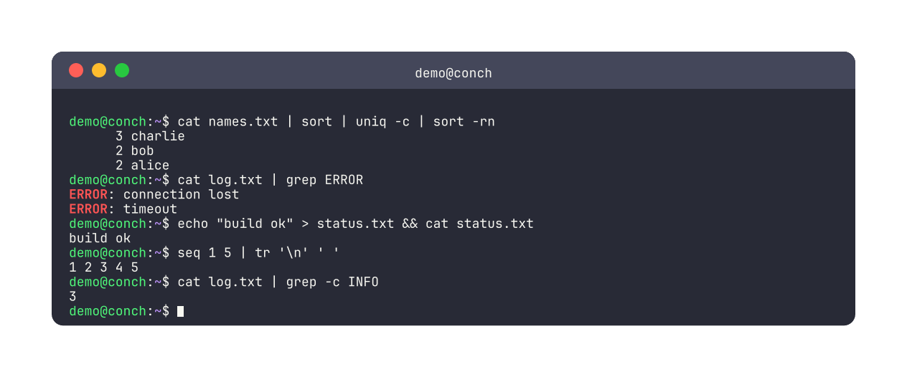

```shell
cat data.csv | grep alice | cut -d , -f 2
ls | sort -r | head -n 5
```

### Redirects

Write output to files with `>` (overwrite) or `>>` (append).

```shell
echo "hello" > greeting.txt
date >> log.txt
```

### Command Chaining

```shell
mkdir build && echo "ok"        # run second only if first succeeds
rm missing.txt || echo "skip"   # run second only if first fails
echo "a"; echo "b"; echo "c"   # always run all
```

### Variable Expansion

```shell
echo "Hello, $USER!"
echo "Shell: $SHELL"
export MY_VAR=hello && echo $MY_VAR
```

### Background Jobs

```shell
sleep 10 &              # run in background
jobs                    # list background jobs
wait                    # wait for all background jobs
kill %1                 # terminate job 1
```

### Functions & Control Flow

```shell
greet() { echo "Hello, $1!"; }
greet world

for i in 1 2 3; do echo $i; done
for (( i=0; i<5; i++ )); do echo $i; done

case "$1" in
  start) echo "Starting";;
  stop)  echo "Stopping";;
  *)     echo "Unknown";;
esac
```

### Arrays

```shell
arr=(a b c)
echo ${arr[1]}          # b
echo ${#arr[@]}         # 3
declare -A map
map[key]=value
```

### Arithmetic

```shell
echo $(( 2 + 3 ))      # 5
(( x = 10 * 2 ))
let "y = x + 1"
```

### Heredocs

```shell
cat <<EOF
Hello, $USER!
EOF
```

### Command History

Navigate previous commands with Up/Down arrows in per-char animations. View history with the `history` builtin.

```shell
history
\x1b[A          # recall previous command
```

### Tilde & Glob Expansion

```shell
cd ~
cat ~/README.md
ls *.txt
cat src/*.typ
```

### Quoting

```shell
echo "hello world"         # double quotes (variables expanded)
echo 'hello $USER'         # single quotes (literal)
echo "it's a \"test\""     # backslash escapes
```

## Virtual Filesystem

### Inline Files

```typst
#let sys = system(
  files: (
    "hello.txt": "Hello, World!",
    "src/main.rs": "fn main() {}",
  ),
)
```

### Real Files

Read actual project files using Typst's `read()`:

```typst
#let sys = system(
  files: (
    "src/main.rs": read("src/main.rs"),
    "README.md": read("README.md"),
  ),
)
```

### File Permissions

Set Unix-style permissions. Default: `644` for files, `755` for directories. Read and write operations are enforced — `cat` on an unreadable file or `>` redirect to a read-only file returns "Permission denied", just like a real shell.

```typst
#let sys = system(
  files: (
    "secret.txt": (content: "top secret data", mode: 000),
    "readonly.txt": (content: "do not modify", mode: 444),
    "setup.sh": (content: "#!/bin/bash\necho 'Ready!'", mode: 644),
  ),
)
```

Use `chmod` to change permissions at runtime:

```shell
chmod 755 setup.sh
./setup.sh
```

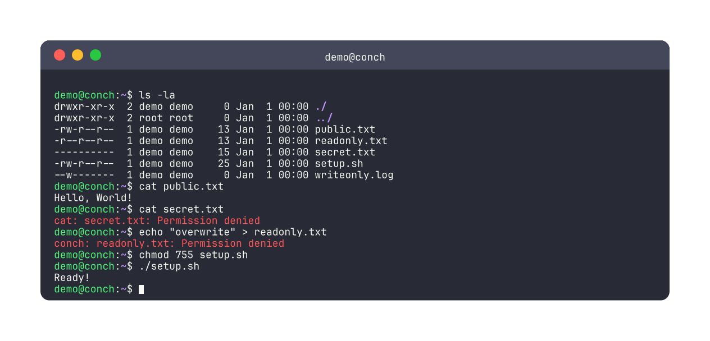

## Users & Groups

Define users and groups within the virtual system:

```typst
#let sys = system(
  hostname: "dev",
  users: (
    (name: "alice", groups: ("sudo",)),
    (name: "bob"),
  ),
  groups: (
    (name: "docker", members: ("alice",)),
  ),
  files: (:),
)
```

Users can run commands with `su` to switch identity, and group membership affects `sudo` permissions and file access control. Use `usermod`, `useradd`, `groupadd` commands at runtime to modify users and groups.

## Script Execution

Create executable scripts and run them:

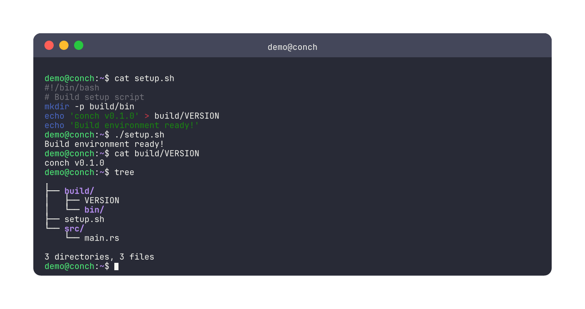

```typst
#let sys = system(
  files: (
    "deploy.sh": (content: "#!/bin/bash\nmkdir -p dist\necho 'built' > dist/status\necho 'Deploy complete!'", mode: 755),
  ),
)
```

```shell
./deploy.sh
cat dist/status
```

Scripts support the full shell feature set: pipes, redirects, chaining, variables.

## Plugins

### Typst Function Plugins

Define custom commands as plain Typst functions — no compilation needed:

````typst
#import "@preview/conch:0.1.0": system, terminal

#let cowsay(args, stdin, files) = {
  let msg = if stdin != "" { stdin.trim("\n", at: end) } else { args.join(" ") }
  (stdout: "< " + msg + " >\n", exit-code: 0)
}

#show: terminal.with(
  system: system(plugins: (("cowsay", cowsay),)),
  user: "demo",
)

```
cowsay "Hello from a plugin!"
echo "piped input" | cowsay
```
````

### WASM Plugins

Compile a command to WebAssembly and run it inside conch via the embedded wasmi interpreter. WASM plugins work in any pipeline position, just like built-in commands.

````typst
#import "@preview/conch:0.1.0": system, terminal

#let upper = read("upper.wasm", encoding: none)

#show: terminal.with(
  system: system(wasm-plugins: (("upper", upper),)),
  user: "demo",
)

```
echo "hello" | upper | head -1
cat file.txt | upper
```
````

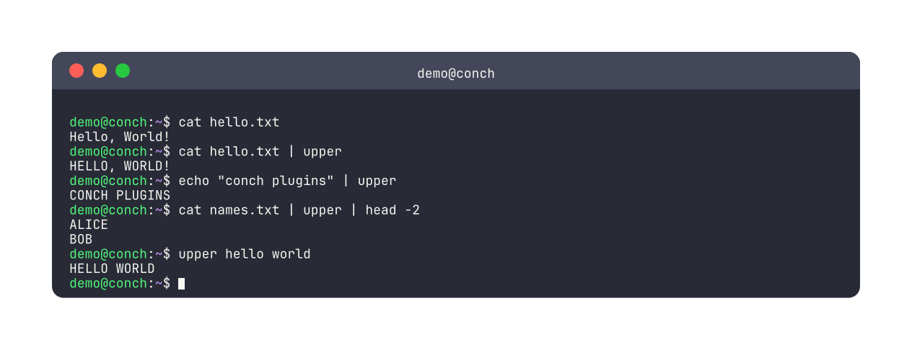
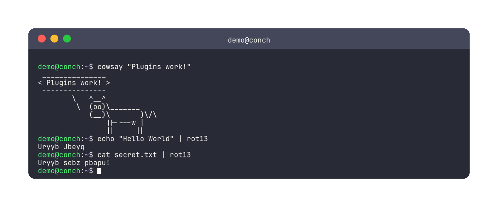

WASM plugins follow the `wasm-minimal-protocol` and exchange JSON:

- Input: `{"args": [...], "stdin": "...", "files": {"name": "content"}}`
- Output: `{"stdout": "...", "exit-code": 0}`

See `wasm/demo-plugin/` for a complete example.

## Syntax Highlighting

`cat` automatically detects file extensions and applies Typst's native syntax highlighting:

```shell
cat main.rs      # Rust highlighting
cat app.py        # Python highlighting
cat index.html    # HTML highlighting
cat lib.typ       # Typst highlighting
```

Supported: `rs`, `py`, `js`, `ts`, `html`, `css`, `json`, `toml`, `yaml`, `md`, `sh`, `c`, `cpp`, `java`, `go`, `rb`, `xml`, `sql`, `r`, `typ`.

## ANSI Colors

Commands emit ANSI color codes rendered natively:

- **`ls`**: directories in bold blue
- **`tree`**: directories in bold blue
- **`grep`**: filenames in magenta, line numbers in green, matches in bold red

## Themes

Six built-in themes, each with matching ANSI color palettes:

`dracula` (default), `catppuccin`, `monokai`, `retro`, `solarized`, `gruvbox`

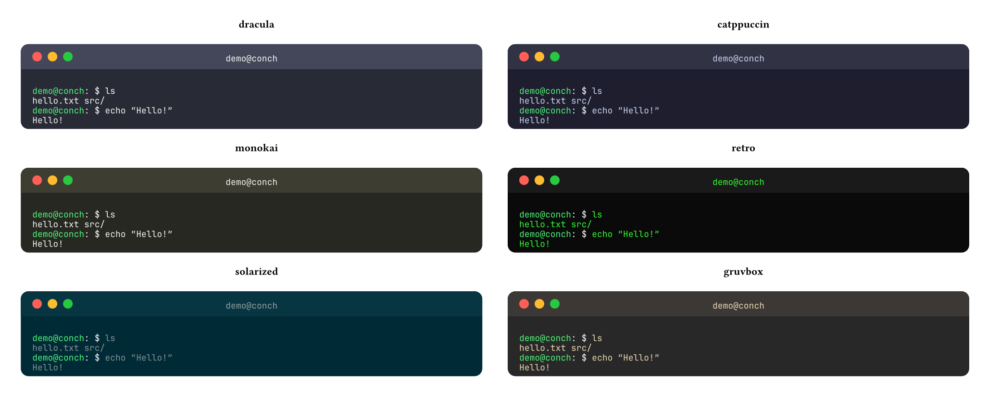

```typst
#import "@preview/conch:0.1.0": system, terminal
#show: terminal.with(system: system(), theme: "retro", user: "demo")
```

### Custom Themes

Pass a dictionary instead of a name:

```typst
#import "@preview/conch:0.1.0": system, terminal
#show: terminal.with(
  system: system(),
  user: "demo",
  theme: (
    bg: rgb("#1a1b26"), fg: rgb("#c0caf5"),
    prompt-user: rgb("#9ece6a"), prompt-path: rgb("#7aa2f7"), prompt-sym: rgb("#c0caf5"),
    title-bg: rgb("#24283b"), title-fg: rgb("#c0caf5"),
    error: rgb("#f7768e"), cursor: rgb("#c0caf5"),
    ansi: (
      red: rgb("#f7768e"), green: rgb("#9ece6a"), yellow: rgb("#e0af68"),
      blue: rgb("#7aa2f7"), magenta: rgb("#bb9af7"), cyan: rgb("#7dcfff"), white: rgb("#c0caf5"),
      bright-red: rgb("#f7768e"), bright-green: rgb("#9ece6a"), bright-yellow: rgb("#e0af68"),
      bright-blue: rgb("#7aa2f7"), bright-magenta: rgb("#bb9af7"), bright-cyan: rgb("#7dcfff"), bright-white: rgb("#ffffff"),
    ),
  ),
)
```

## Window Chrome

Five built-in window decoration styles. Chrome and theme are independent — mix any chrome with any color theme.

```typst
#import "@preview/conch:0.1.0": system, terminal
#show: terminal.with(system: system(), user: "demo", chrome: "windows", theme: "dracula")
```

`macos` (default), `windows`, `windows-terminal`, `gnome`, `plain`

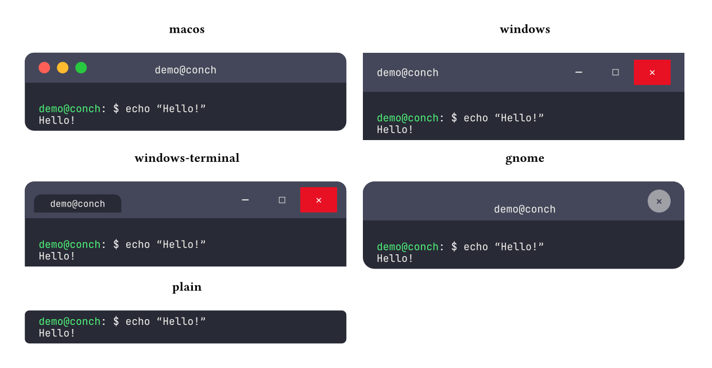

Pass a custom function for fully custom title bars:

```typst
#terminal-frame(
  chrome: (title, t, f) => block(fill: t.title-bg, width: 100%, inset: 8pt, {
    text(..f, fill: t.title-fg)[#title]
  }),
)[...]
```

Available on all functions: `terminal`, `terminal-block`, `terminal-frame`, `terminal-per-line`, `terminal-per-char`.

## Font

The `font` parameter accepts a dictionary of Typst [`text()`](https://typst.app/docs/reference/text/text/) properties. Only specify what you want to change — unset keys use the defaults (JetBrains Mono, 9pt).

```typst
#import "@preview/conch:0.1.0": system, terminal

// Change size only
#show: terminal.with(system: system(), user: "demo", font: (size: 12pt))

// Change family
#show: terminal.with(system: system(), user: "demo", font: (font: ("Fira Code",)))

// Full customization — any text() property works
#show: terminal.with(
  system: system(),
  user: "demo",
  font: (
    font: ("IBM Plex Mono",),
    size: 11pt,
    weight: "bold",
    ligatures: false,
    tracking: 0.5pt,
  ),
)
```

Available on all functions: `terminal`, `terminal-block`, `terminal-frame`, `terminal-per-line`, `terminal-per-char`.

## Style

The `style` parameter controls layout spacing. Override any key — unset keys use defaults.

```typst
#import "@preview/conch:0.1.0": system, terminal

// Tighter body padding
#show: terminal.with(system: system(), user: "demo", style: (inset: (x: 8pt, y: 4pt)))

// Wider line spacing
#show: terminal.with(system: system(), user: "demo", style: (leading: 0.6em))

// Both
#show: terminal.with(
  system: system(),
  user: "demo",
  style: (inset: (x: 16pt, y: 8pt), leading: 0.5em)
)
```

| Key       | Default             | Description                            |
| --------- | ------------------- | -------------------------------------- |
| `inset`   | `(x: 12pt, y: 6pt)` | Body padding (horizontal and vertical) |
| `leading` | `0.4em`             | Line spacing (Typst `par.leading`)     |

Available on all functions: `terminal`, `terminal-block`, `terminal-frame`, `terminal-per-line`, `terminal-per-char`.

## Animation

Generate frames for GIF creation. Each page = one animation frame.

### Per-Line Animation

One frame per command execution:

````typst
#import "@preview/conch:0.1.0": system, terminal-per-line

#terminal-per-line(
  system: system(),
  user: "demo",
  height: 350pt,
  width: 560pt,
)[```
ls
cat hello.txt
echo "done"
```]
````

### Per-Char Animation

Typing effect — one frame per keystroke:

````typst
#import "@preview/conch:0.1.0": system, terminal-per-char

#terminal-per-char(
  system: system(),
  user: "demo",
  height: 350pt,
  width: 560pt,
)[```
ls
cat hello.txt
echo "done"
```]
````

The last command is always typed but **not executed** — for a natural "in progress" ending.

Pass `show-cursor: false` to `terminal`, `terminal-block`, `terminal-per-line`, or `terminal-per-char` to hide the cursor block (`terminal-frame` has no cursor).

### Keyboard Operations

Simulate typing corrections and cursor movement in per-char animations using `\xNN` escape notation. Lines without escapes use the fast default path (zero overhead).

| Escape    | Key       | Effect                            |
| --------- | --------- | --------------------------------- |
| `\x7f`    | Backspace | Delete character before cursor    |
| `\x1b[C`  | Right     | Move cursor right                 |
| `\x1b[D`  | Left      | Move cursor left                  |
| `\x1b[H`  | Home      | Move cursor to start of line      |
| `\x1b[F`  | End       | Move cursor to end of line        |
| `\x1b[3~` | Delete    | Delete character at cursor        |
| `\x1b[A`  | Up        | Recall previous command (history) |
| `\x1b[B`  | Down      | Recall next command (history)     |
| `\x03`    | Ctrl+C    | Interrupt (emits `^C` marker)     |
| `\\`      | `\`       | Literal backslash                 |

Example — backspace correction and mid-line cursor editing:

````typst
#import "@preview/conch:0.1.0": system, terminal-per-char

#terminal-per-char(
  system: system(files: ("hello.txt": "Hello!")),
  user: "demo",
)[```
cat helo\x7flo.txt
eco\x1b[Dh\x1b[F "done"
```]
````

The first line types `cat helo`, backspaces the `o`, then types `lo.txt` — executing `cat hello.txt`. The second line types `eco`, moves left, inserts `h` to make `echo`, jumps to end, and finishes `echo "done"`.

### Frame Pacing (`hold`)

Control how many duplicate pages are emitted at key moments — useful for GIF/video timing:

````typst
#import "@preview/conch:0.1.0": system, terminal-per-char, terminal-per-line

// Per-char: hold 20 extra frames at the end, with cursor blinking
#terminal-per-char(
  system: system(),
  user: "demo",
  hold: (after-final: 20, final-cursor-blink: true, final-blink-hold: 3),
)[```
ls
echo "done"
```]

// Per-line: hold 5 extra frames after each command
#terminal-per-line(
  system: system(),
  user: "demo",
  hold: (after-frame: 5),
)[```
ls
echo "done"
```]
````

| Key                  | Applies to | Default | Description                                       |
| -------------------- | ---------- | ------- | ------------------------------------------------- |
| `after-frame`        | per-line   | `0`     | Extra duplicate pages after each command step     |
| `after-output`       | per-char   | `0`     | Extra pages after command output appears          |
| `after-final`        | per-char   | `0`     | Extra pages after the last command is fully typed |
| `final-cursor-blink` | per-char   | `false` | Toggle cursor on/off during `after-final` hold    |
| `final-blink-hold`   | per-char   | `2`     | Pages per blink phase (higher = slower blink)     |

### Creating GIFs

From a clone of this repo (after `just build`), render a multi-page Typst file (e.g. `#terminal-per-char` / `#terminal-per-line`) to GIF:

```bash
just gif                                    # default: demo/demo.typ → demo/demo.gif
just gif --src path/to/session.typ          # → path/to/session.gif
just gif --src foo.typ -o bar.gif -f 12
just gif --hold-after-final 40              # overrides `hold` in Typst via sys.inputs (see `src/terminal.typ`)
just --usage gif                            # all flags (requires just ≥ 1.46)
```

Requirements: [just](https://github.com/casey/just) (≥ 1.46 for `just --usage gif`), `ffmpeg`, and run commands from the **package root** so `#import "lib.typ": …` resolves. Use `--frames-dir` to keep PNG frames in a fixed folder instead of a temp directory.

#### CLI hold overrides (`sys.inputs`)

All `hold` keys can be overridden from the command line without editing the `.typ` file, via Typst's `--input` flag. This is what `just gif --hold-after-final 40` does under the hood:

```bash
typst compile anim.typ 'frames/f-{0p}.png' --input conch_hold_after_final=40
```

| Input key                       | Overrides                                     |
| ------------------------------- | --------------------------------------------- |
| `conch_hold_after_frame`        | `hold.after-frame` (per-line)                 |
| `conch_hold_after_output`       | `hold.after-output` (per-char)                |
| `conch_hold_after_final`        | `hold.after-final` (per-char)                 |
| `conch_hold_final_cursor_blink` | `hold.final-cursor-blink` (per-char, `0`/`1`) |
| `conch_hold_final_blink_hold`   | `hold.final-blink-hold` (per-char)            |

CLI inputs take highest priority: defaults < `hold:` parameter < `sys.inputs`.

Manual pipeline (same idea):

```bash
typst compile anim.typ 'frames/f-{0p}.png' --root .
ffmpeg -framerate 10 -i 'frames/f-%02d.png' \
  -vf "split[s0][s1];[s0]palettegen[p];[s1][p]paletteuse" \
  demo.gif
# Or with ImageMagick (variable timing)
magick -delay 8 frames/f-*.png -delay 120 frames/f-04.png -loop 0 demo.gif
```

### Fixed-Height Terminal

Set `height` for consistent frame sizes. Content scrolls like a real terminal — old lines clip off the top, snapped to whole line boundaries.

```typst
#terminal-per-char(height: 350pt, width: 560pt)
```

### Pagination

When a fixed-height terminal overflows, set `overflow: "paginate"` to automatically continue onto new pages instead of clipping old lines. Each page renders a complete terminal window.

````typst
#import "@preview/conch:0.1.0": system, terminal

#show: terminal.with(
  system: system(
    files: (
      "hello.txt": "Hello, World!",
      "data.csv": "name,age,city\nalice,30,paris\nbob,25,london",
      "src/main.rs": "fn main() {\n    println!(\"Hello!\");\n}",
    ),
  ),
  user: "demo",
  height: 300pt,
  overflow: "paginate",
)

```
ls
cat src/main.rs
cat data.csv
grep -n conch README.md
echo "Welcome to conch!"
tree
ls -la
```
````

| Page 1                                    | Page 2                                    |
| ----------------------------------------- | ----------------------------------------- |
| 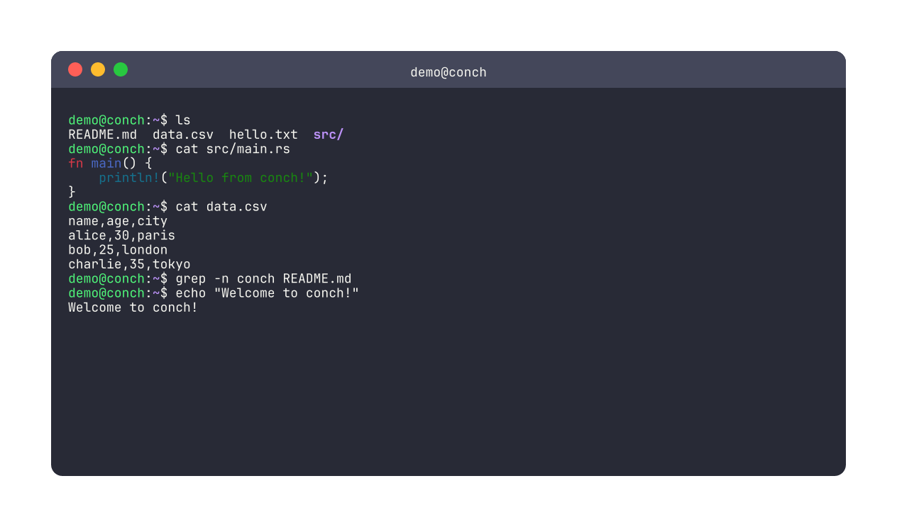 | 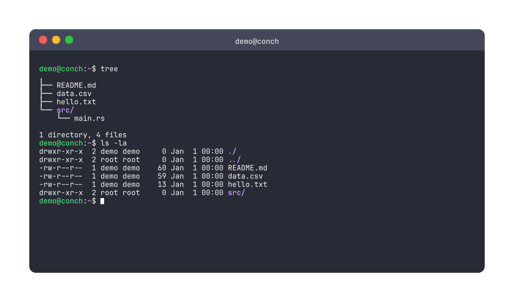 |

Content splits at command boundaries — each entry (prompt + output) stays together on the same page. The final prompt with cursor appears on the last page.

## Touying Integration

Use `terminal-frames()` to generate an array of frame content for slide frameworks like [touying](https://github.com/touying-typ/touying). Each frame is a self-contained terminal block.

```typst
#import "@preview/touying:0.7.1": *
#import "@preview/conch:0.1.0": system, terminal-frames

#import themes.simple: simple-theme, slide, title-slide
#show: simple-theme.with(aspect-ratio: "16-9")

#let frames = terminal-frames(
  mode: "per-line",  // or "key-frames", "per-char"
  system: system(files: ("hello.txt": "Hello!")),
  user: "demo",
  commands: ("ls", "cat hello.txt", "echo done"),
  width: 480pt,
  height: 200pt,
)

#slide(repeat: frames.len(), self => [
  == Demo
  #frames.at(self.subslide - 1)
])
```

| Mode           | Frames                  | Best for           |
| -------------- | ----------------------- | ------------------ |
| `"per-line"`   | One per command step    | Most presentations |
| `"key-frames"` | Pre/post execution only | Dense sessions     |
| `"per-char"`   | One per keystroke       | Short demos        |

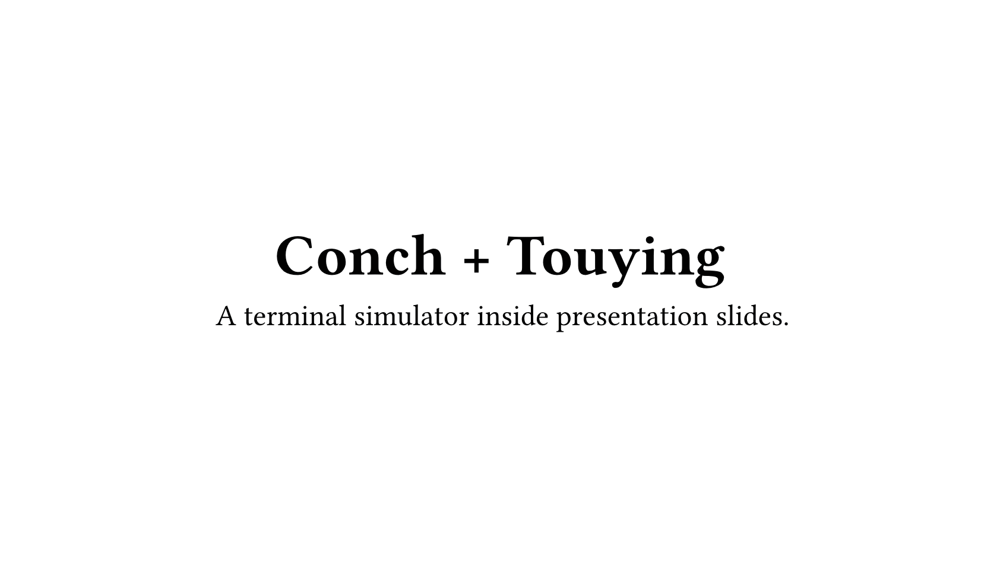

See `demo/touying.typ` for a full working example.

## Raw Execution

Execute commands and retrieve raw session data without rendering. Useful for programmatic access to command output and exit codes.

```typst
#import "@preview/conch:0.1.0": execute, system

#let result = execute(
  system: system(files: ("hello.txt": "world")),
  user: "alice",
  commands: ("whoami", "cat hello.txt"),
)

// Access raw output data
#result.entries.at(0).output  // "alice"
#result.entries.at(1).output  // "world"
#result.entries.at(0).exit-code  // 0
```

The `execute()` function returns a dictionary with:

- `entries`: array of command results, each with `user`, `hostname`, `path`, `command`, `output`, `exit-code`, and optionally `lang` (detected language for syntax highlighting)
- `final-path`: the working directory after all commands
- `files`: (only when `include-files: true`) dictionary mapping each path to its type, content, and mode

### Filesystem Extraction

Pass `include-files: true` to capture the filesystem state after execution. Use it to extract generated files into your document:

```typst
#let result = execute(
  system: system(files: ("data.csv": "name,score\nalice,95\nbob,82")),
  user: "demo",
  commands: ("sort -t, -k2 -rn data.csv > ranked.csv",),
  include-files: true,
)

// Use the generated file in prose
Top scorer: #result.files.at("/home/demo/ranked.csv").content
```

Each entry in `files` is tagged by type:

- **file**: `(type: "file", content: "...", mode: 644)`
- **dir**: `(type: "dir", mode: 755)`
- **symlink**: `(type: "symlink", target: "...")`

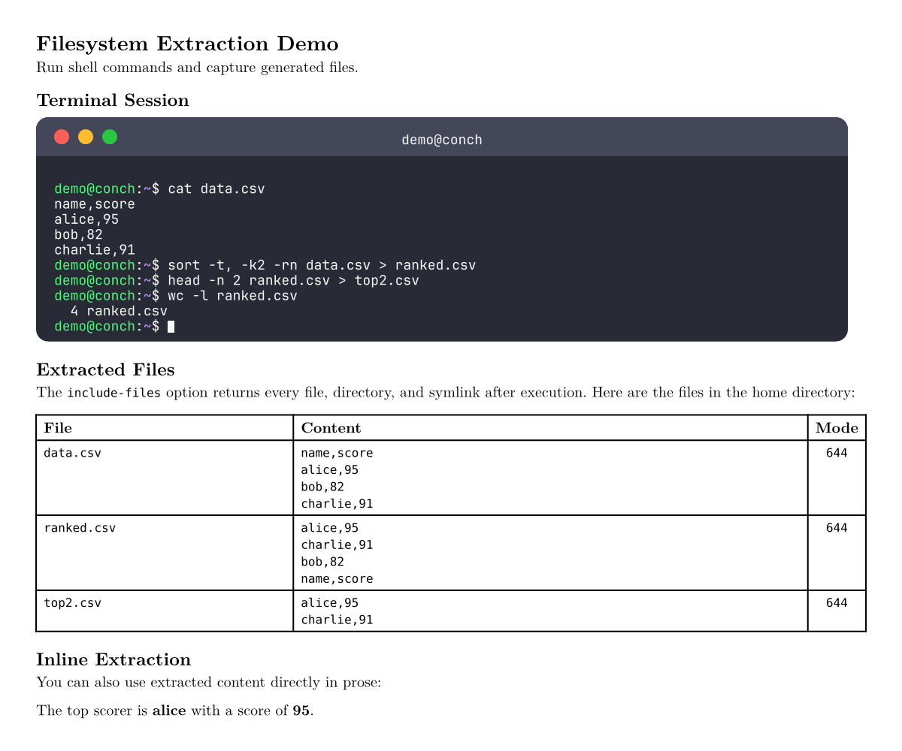

## API Reference

### Functions

| Function                                                                                                   | Description                                                                                                                       |
| ---------------------------------------------------------------------------------------------------------- | --------------------------------------------------------------------------------------------------------------------------------- |
| `system(hostname, users, groups, files, plugins, wasm-plugins)`                                            | Define a virtual system configuration                                                                                             |
| `execute(system, user, commands)`                                                                          | Execute commands and return raw session data (no rendering)                                                                       |
| `terminal-frame(body, title, theme, font, chrome, style, width, height)`                                   | Themed terminal window chrome                                                                                                     |
| `render-ansi(body, theme)`                                                                                 | ANSI escape sequence renderer                                                                                                     |
| `terminal(body, system, user, theme, font, chrome, width, height, show-cursor, overflow)`                  | Standalone page shell simulator (show rule; sets page dimensions)                                                                 |
| `terminal-block(body, system, user, theme, font, chrome, width, height, show-cursor, overflow)`            | Embeddable shell simulator (no page settings; composable with other content)                                                      |
| `terminal-per-line(body, system, user, theme, font, chrome, width, height, overflow, hold)`                | Per-command animation frames; `hold` sets extra duplicate pages per step (`after-frame`)                                          |
| `terminal-per-char(body, system, user, theme, font, chrome, width, height, overflow, hold)`                | Per-keystroke animation frames; `hold` sets tail pacing (`after-output`, `after-final`, `final-cursor-blink`, `final-blink-hold`) |
| `terminal-frames(mode, system, user, theme, font, chrome, width, height, show-cursor, overflow, commands)` | Returns array of frame content; `mode`: `"per-line"`, `"per-char"`, `"key-frames"`                                                |

### Exports

```typst
#import "@preview/conch:0.1.0": (
  system,             // virtual system constructor
  execute,            // raw command execution (no rendering)
  terminal,           // standalone page shell (show rule)
  terminal-block,     // embeddable shell block
  terminal-frames,    // frame array for slide frameworks
  terminal-frame,     // standalone frame (no shell)
  terminal-per-line,  // per-command animation
  terminal-per-char,  // per-keystroke animation
  render-ansi,        // ANSI renderer
  themes,             // built-in theme definitions
)
```

## Development

See [CONTRIBUTING_GUIDE.md](CONTRIBUTING_GUIDE.md) for building the WASM plugin, maintainer `just` recipes, and publishing to Typst Universe.

## License

See [LICENSE](LICENSE).
