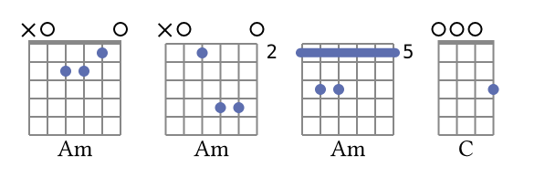

# Conchord

`conchord` (concise chord) is a [Typst](https://github.com/typst/typst) package for string instruments.

What can you do with this package?

+ Write up a song with chords into Typst format in quite a pretty and simple way.

+ Explore all the possible chord variants with your special tuning of your special string instrument (like ukulele, bass guitar, mandolin or anything else).

  > Conchord embeds a [simple music theory engine](https://github.com/sitandr/conchord-gen) through WASM to interpret chord names and dynamically generate all possible chord tablatures. It also uses some simple heuristics to find the best ones. _Sometimes they may be not the most popular ones._

  > That means conchord doesn't predefine anything, it can come up with any chords for any tuning and instrument!

+ Use this exploration of chord variants to come up with the best way to play your song. Of course, you can also define your own chords without using the engine.

+ Quickly write tabs for your music with compact special tab "language". There are some limitations, but it's possible to write basically anything tab-related with some effort.

+ Easily transpose anything in your songs, change the tuning and instrument and get an instant update of your song chord library (the place where the diagrams are displayed).

+ Write "a book" of compositions with their individual chord libraries.
+ And many more!

# Overview

<!-- toc -->
1. [Conchord](#conchord)
2. [Overview](#overview)
   1. [Chord generation](#chord-generation)
      1. [Under the hood](#under-the-hood)
      2. [Ukulele (and many other tunings) moment](#ukulele-and-many-other-tunings-moment)
   2. [Drawing chords](#drawing-chords)
      1. [Chordgens and custom chords](#chordgens-and-custom-chords)
      2. [Song sheets](#song-sheets)
      3. [Chords styles](#chords-styles)
3. [Reference](#reference)
   1. [Chord naming reference](#chord-naming-reference)
4. [Notes about features and decisions](#notes-about-features-and-decisions)
   1. [Chord-drawing features](#chord-drawing-features)
      1. [Think about frets, not layout](#think-about-frets-not-layout)
      2. [Shadow barre](#shadow-barre)
      3. [Name auto-scaling](#name-auto-scaling)
      4. [Customizing text](#customizing-text)
5. [Tabs](#tabs)
      1. [Duration](#duration)
      2. [Bars and repetitions](#bars-and-repetitions)
      3. [Linebreaks](#linebreaks)
      4. [Ties and slides](#ties-and-slides)
   1. [Bends and vibratos](#bends-and-vibratos)
      1. [Custom content](#custom-content)
   2. [Rhythm section](#rhythm-section)
6. [Plans](#plans)

<!-- tocstop -->

## Chord generation

It's quite simple to use, see yourself[*](## "Boxing is required to put them in one line. By default the chords are blocks"):

```typ
#import "@preview/conchord:0.3.0": smart-chord

#box(smart-chord("Am"))
// at what fret to play the chord
#box(smart-chord("Am", at: 5)) // chord at fifth fret
// what variant number to select
#box(smart-chord("Am", n: 4)) // forth "best" chord
// what tuning to use; note first, then octave (1-9)
#box(smart-chord("C", tuning: "G1 C1 E1 A1")) // ukulele
```


### Under the hood

Under the hood, this `smart-chord` uses `get-chord` function with very similar syntax. This function returns chord tabstring like `x03320`, and then it gets rendered with some [`chordgen`](## "A function that renders the chord by it's tabstring, displayed name and scale size").

`get-chord`, in turn, uses `get-chords`, a function that asks WASM to create all possible tabstrings. We can use `get-chords` to draw all possible chords, or use [`n-best`](## "This is just a slice of given length that doesn't panic if given number is bigger than length") to select n best chords:

```typ
#import "@preview/conchord:0.3.0": n-best, get-chords, red-missing-fifth

= `Am`
// select first 18 chords (empirically fine default)
#for c in n-best(get-chords("Am")) {
  box(red-missing-fifth(c))
}

Notice: the further, the worse are the variants. Okay, now let's take only five for C7.

= `C7`
#for c in n-best(get-chords("C7"), n: 5) {
  box(red-missing-fifth(c))
}
```


You may have noticed that some chords are _red_. This means it's not "true" chord, but very close: on most instruments the perfect fifth in this chord can be created by overtones. They are marked by `?` in the end of tabstring. The `red-missing-fifth` function is a `chordgen` that displays such chords in red.

`smart-chord` uses this `red-missing-fifth` as default `chordgen` too, so don't panic if you got red chord. You can use your own `chordgen` with specifying `smart-chord(chordgen: ...)`.


### Ukulele (and many other tunings) moment

There is another "music theory" important note. By default generator requires the lowest note (bass) in your chord to be the "root" note. This is very common for guitar, but may give quite unpleasant chords for ukulele and similar instruments. That's why there is an option to disable it:

```typ
= `Am`
`true-bass = true`, default:

#for c in n-best(get-chords("Am", tuning: "G1 C1 E1 A1"), n: 5) {
  box(red-missing-fifth(c))
}

`true-bass = false`:

#for c in n-best(get-chords("Am", tuning: "G1 C1 E1 A1", true-bass: false), n: 5) {
  box(red-missing-fifth(c))
}
```


## Drawing chords

### Chordgens and custom chords

`conchord` works with very simple tab chord representation. That means for custom chords you don't need to think about layout and pass all parameters of drawing barres. `Conchord` will do this for you. Just pass a string with held frets and it will work:

```typst
#import "@preview/conchord:0.3.0": new-chordgen

// creating new chordgen without any parameters
#let chord = new-chordgen()

#box(chord("x32010", name: "C"))
#box(chord("x33222", name: "F#m/C#"))
#box(chord("x,9,7,8,9,9"))
```


> `x` means closed string, `0` is open, other number is a fret. In case of frets larger than `9` frets should be separated with commas, otherwise you can list them without any separators.

> Chord diagram works like a usual block, so to put them into one line you need to wrap them into boxes. In real code it is recommended to create a wrapper function to customize box margins etc (see larger example below).

It is easy to customize the colors and styles of chords with `colors` argument and `show` rules for text. You can also put `!` and `*` marks in the end of the string to force diagram generation. `!` forces barre, `*` removes it:

```typst
#let crazy-chord = new-chordgen(string-number: 3,
    colors: (shadow-barre: orange,
        grid: gray.darken(30%),
        hold: red,
        barre: purple,),
    // bar number displayed to left
    number-to-left: true,
    // disable thick first line when chord played without shift
    thick-nut: false
)

#set text(fill: purple)
#box(crazy-chord("320", name: "C"))
#box(crazy-chord("2,4,4,*", name: "Bm"))
#box(crazy-chord("2,2,2, *"))
#box(crazy-chord("x,3,2, !"))
#box(crazy-chord("12,12,12, !"))
```


> NOTE: be careful when using **!**, if barre cannot be used, it will result into nonsense.

Brief comparison to chordx may be seen there, some concepts explained below:


### Song sheets

For songs with lyrics, `conchord` provides a bunch of methods for convenient formatting. For the full list and description see the documentation section.

Here is the document you can easily get with these commands:


> Complete code of the example [see there](examples/zombie.typ)

Let's start with something simple. `Conchord` provides a very simple `overchord` method that displays a given chord above the text (and attaches `<chord>` label for other methods), so you can just write:

```typst
#let och(it) = overchord

#och[Em] Another head 
#och[C] hangs lowly \
#och[G] Child is slowly
#och[D] taken
```

However, it's not very convenient. That could be replaced with special `show rule` and "square" syntax for chords and use _two squares_ for square braces instead (this "squarification" can be disabled). This show rule also adds a rule for chords to change chord tonality automatically:

```typ
#show: chordify

[Em] Another [C] head hangs lowly \
[G]  Child is slowly [D] taken \
#change-tonality(1)
[Em] And the violence [C] caused such silence \
[G]  Who are we [D] mistaken?
```

To create a chord library widget, use `chordlib` or `sized-chordlib` in a place you want. `chordlib` just gives you a sequence of chord images, while `sized-chord` packs them into pretty box and scales them to match the specified number in row. So we can put this box somewhere to left at song start with `place`:

```typ
#place(right, dx: -1em, {
    set align(left)
    // Make all text in chord graph bold
    show text: strong
    // List of used chords there
    sized-chordlib(heading-level: 2, width: 100pt,
      switch: (D: 2), at: (A: 5)) // can specify what exact chord versions we want there
})

```

If you have many songs in one document, set `heading-level` of `chordlib` and `chordify.with(...)` to mark where to reset your chords and tonality.

See the full code [there](examples/zombie.typ).


### Chords styles

`overchord` is not the only chord display method you can use. There are also built-in functions `inlinechord` and `fulloverchord` that display chord names inline and draw full chord diagram above line correspondingly:

```typ
= Another Brick in the wall, Pink Floyd

#[
  #show: chordify.with(heading-reset-tonality: 2)

  // in fact, heading-reset just adds change-tonality(0) there
  == Default `overchord`
  [Dm] We dоn't need nо еduсаtiоn, \
  [Dm] We dоn't need nо thоught соntrоl, \
  #change-tonality(1)
  [Dm] Nо dark sarcasm in the сlаssrооm.   \
  [Dm] Teacher leave them kids [G] аlоnе.   \
  [G] Hey, Teacher!  Leave them kids аlоnе.
]

#[
  #show: chordify.with(line-chord: inlinechord, heading-reset-tonality: 2)
  == `inlinechord`
  [Dm] We dоn't need nо еduсаtiоn, \
  [Dm] We dоn't need nо thоught соntrоl, \
  #change-tonality(1)
  [Dm] Nо dark sarcasm in the сlаssrооm. \
  [Dm] Teacher leave them kids [G] аlоnе. \
  [G] Hey, Teacher!  Leave them kids аlоnе. \
]


#[
  #show: chordify.with(line-chord: fulloverchord, heading-reset-tonality: 2)
  == `fulloverchord`
  // chordlib still works!
  #sized-chordlib(width: 150pt, N: 3, prefix: [_Chord library_ #linebreak()])

  [Dm] We dоn't need nо еduсаtiоn, \
  [Dm] We dоn't need nо thоught соntrоl, \
  #change-tonality(1)
  [Dm] Nо dark sarcasm in the сlаssrооm. \
  // every function can be also used directly
  #fulloverchord("Dm", n: 1) Teacher leave them kids #inlinechord[Dm] аlоnе. \
  [G] Hey, Teacher!  Leave them kids аlоnе.
]
```


# Reference

See the full function reference [there](reference/reference.pdf).

## Chord naming reference

I use [kord](https://github.com/twitchax/kord) as library for WASM library to parse chords and generate notes, so the naming requirements are tied to it's naming rules. In future, we can preprocess the names to match `kord`'s.

For now the chord can consist of:

```
* The root note (e.g., `C`, `D#`, `Eb`, `F##`, `Gbb`, `A♯`, `B♭`, etc.).

* Any modifiers (e.g., `7`, `9`, `m7b5`, `sus4`, `dim`, `+`, `maj7`, `-maj7`, `m7b5#9`, etc.).

* Any extensions (e.g., `add9`, `add11`, `add13`, `add2`, etc.).

* Zero or one slash notes (e.g., `/E`, `/G#`, `/Fb`, etc.).

* Zero or one inversions (e.g., `^1`, `^2`, `^3`, etc.).

* Zero or one "crunchy" modifiers, which moves "higher notes" into the same octave frame as the root (i.e., `!`).
```

_Sometimes it may be not obvious how to convert your chord name into kord's specification._

For example, `Cmaj7-5` or `Cmaj7` converts into `Cmaj7b5` or `Cmaj7(b5)`. The same applies for `+5` to `#5`.

Chords with `no5` are not supported for now. They are not "correct" chords, after all. But if someone requests the support, it will be probably done.

# Notes about features and decisions

## Chord-drawing features
### Think about frets, not layout
Write frets for chord as you hold it, like a string "123456" (see examples above). You don't need to think about layouting and subtracting frets, `conchord` does it for you.

> NOTE: I can't guarantee that will be the best chord layout. Moreover, the logic is quite simple: e.g., barre can't be multiple and can't be put anywhere except first bar in the image. However, surprisingly, it works well in almost all of the common cases. The exceptions are really rare.

If you need to create something too _custom/complex_ ~~(but not _concise_)~~, maybe it is worth to try [chordx](https://github.com/ljgago/typst-chords). You can also try using core function `render-chord` for more manual control, but it is still limited by one barre starting from one (but that barre may be shifted). If you think that feature should be supported, you can create an issue.

### Shadow barre

Some chord generators put barre only where it _ought to_ be (any less will not hold some strings). Others put it where it can be (sometimes maximal size, sometimes some other logic). I use simple barre where it **ought to** be, and add _shadow barre_ where it **could** maximally be. You can easily disable it by either setting `use-shadow-barre: false` on `new-chordgen` (only necessary part of barre rendered) or by setting color of `shadow-barre` the same as `barre` (maximal possible barre).


### Name auto-scaling
Chord name font size is _reduced_ for _large_ chord names, so the name fits well into chord diagram (see example above). That makes it much more pretty to stack several chords together. To achieve chordx-like behavior, you can always use `#figure(chord("…"), caption: …)`.

### Customizing text

**Important**: _frets_ are rendered using `raw` elements. So if you want to customize their font or color, please use `#show raw: set text(fill: ...)` or similar things.

The chord's name, on the other hand, uses default font, so to set it, just use `#set text(font: ...)` in the corresponding scope.

# Tabs

> Everything there is experimental and probably unstable


```typst
#let chord = new-chordgen(scale-length: 0.6pt)

#let ending(n) = {
    rect(stroke: (left: black, top: black), inset: 0.2em, n + h(3em))
    v(0.5em)
}
*This thing doesn't follow musical notation rules, it is used just for demonstration purposes*:

#tabs.new(```
2/4 2/4-3 2/4-2 2/4-3 |
2/4-2 2/4-3 2/4 2/4 2/4 |
2/4-2 p 0/2-3 3/2-2 
|:

0/1+0/6 0/1 0/1-3 2/1 | 3/1+3/5-2 3/1 3/1-3 5/1 | 2/1+0/4-2 2/1 0/1-3 3/2-3 | \ \
3/2-2 `5/2-3
p-2
##
  chord("022000", name: "Em")
##south
0/2-3 3/2 | | ## [...] ## p-4. | | 7/1-3 0/1-2 p-3 0/1 3/1 

##
    ending[1.]
##west

|
2/1-3
2/1
3/1 0/1 2/1-2 p-3 0/2-3 3/2-3 
##
  ending[2.]
##west
|
2/1-2 2/1 0/1-3 3/2 :| 0/6-2 | ^0/6-2 || \
1/1 2/1 2/2 2/2 2/3 2/3 4/4 4/4 4/4 4/4 4/4 4/4 2/3 2/3 2/3 2/3  2/3 2/3 2/3 2/3 2/3 2/3 2/3 2/3 2/3
##
[notice there is no manual break]
##east
| rep(2/3 2/3 8/3 7/3 6/3 5/3 4/3 2/3  5/3 8/3 9/3  7/3 2/3 |, 2) 2/3 2/2 2/3 2/4 |
10/1-3 10/1-3 10/1-3 10/1-4 10/1-4 10/1-4 10/1-4 10/1-5. 10/1-5. 10/1-5 10/1-5 10/1-2 \
1/3bfullr+2/5-2 1/2b1/2-1 2/3v-1 rep(x/3, 3)
```, eval-scope: (chord: chord, ending: ending), draw-rhythm: true
 )


Not a lot customization is available yet, but something is already possible:

#show raw: set text(red.darken(30%), font: "Comic Sans MS")

#tabs.new("0/1+2/5-1 ^0/1+`3/5-2.. 2/3 |: 2/3-1 2/3 2/3 | 3/3 ||",
  scale-length: 0.2cm,
  one-beat-length: 12,
  s-num: 5, // number of strings
  colors: (
    lines: gradient.linear(yellow, blue),
    bars: green,
    connects: red
  ),
  enable-scale: false
)
```

As you can see from example, you can use raw strings or code blocks to write tabs, there is no real difference.

The general idea is very simple: to write a number on some line, write `<fret number>/<string>`.

**Spaces are important!** All notes and special symbols work well only if properly separated.

### Duration

By default they will be quarter notes. To change that, you have to specify the duration: [`<fret>/<string>-<duration>`](## "Fret may be x there to show deaf note"), where duration is $log_2$ from note duration. So a whole note will be `-0`, a half: `-1` and so on. You can also use as many dots as you want to multiply duration by 1.5, e.g. `-2.`

Once you change the duration, all the following notes will use it, so you have to specify duration every time it is changed (basically, always, but it really depends on composition). Of course, you can just ignore all that duration staff.

### Bars and repetitions

To add simple bar, just add `|`. To add double bar line, use `| |`. To add end movement/composition, add `||`. To add repetitions, use `|:` and `:|` respectively.

There is also `rep()` "macro" that can repeat arbitrary content arbitrary number of times. However, I recommend using symbols to show repetitions instead.

### Linebreaks

Notes and bars that don't fit in line will be automatically moved to next. However, sometimes it isn't ideal and may be a bit bugged, so it is recommended to do that manually, using `\`.

The line is autoscaled if it is possible and not too ugly. You can change the maximum and minimum scaling size with `scale-max` and `scale-min`. It is also possible to completely disable scaling with `enable-scale: false`.

### Ties and slides

You can _tie_ notes or _slide_ between them. To use ties, you have to add `^` in front of _second_ tied note, like `1/1 ^3/1`. To use slides you have to do the same, but with \`.

_Current limitation:_ tying and sliding works only on the same string and may work really bad if tied/slided through line break.

## Bends and vibratos

Add `b` after note, but before the duration (e.g. `2/3b-2`) to add a bend. After `b` you can write custom text to be written on top (for example, `b1/2`). Add `r` to the end to add a release.

Adding vibratos works the same way, via adding `v` to the note. The length of vibrato will be the same as the length of the note.

Unfortunately, they are all supported things for now. But wait, there is still one cool thing left!

### Custom content

Add any typst code you want between `## … ##`. It will be rendered with `cetz` on top of the line where you wrote it. That means you can write _lyrics, chords, add complex things like endings_, even **draw the elements that are still missing** (well, it is still worth to create issue there, I will try to do something).

That code is evaluated with `eval`, so you will need to pass dictionary to `eval-scope` with all things you want to use.

You can set align of these elements by writing cetz anchors after the second (e.g., `west`, `south` and their combinations, like `west-south`).

Additionally, if you enjoy drawing missing things, you can also use `preamble` and `extra` arguments in `tabs.new` where you can put any `cetz` inner things (tabs uses canvas, and that allow you drawing on it) before or after the tabs are drawn.

## Rhythm section

Can be enabled or disabled with `rhythm: true`. It's far from ideal now, but may be useful for some basic purposes.

# Plans

There are lots of possible things to add to this package. With power of WASM engine quite anything is possible.

1. Improve chord complexity evaluation for WASM
2. Improve chord names interpretation, add `no` chords, chord variants
3. Add fingering rendering (contributions welcome!) and generation.
4. Add piano chords
5. Add chord detection (generate names from tab strings).
6. Further development of tabs. Add more built-in things to use, improve language, rendering, rhythm section and so on.

If you are interested in any of this, please create an issue or "vote" with reactions on existing one. That would make me more interested in working on this.

In general, I will be very glad to receive _any feedback_, both issues and PR-s are very welcome! Though I can't promise I will be able to work on it immediately, it can take me a few weeks to react.
