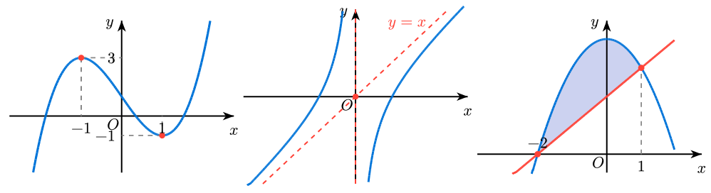
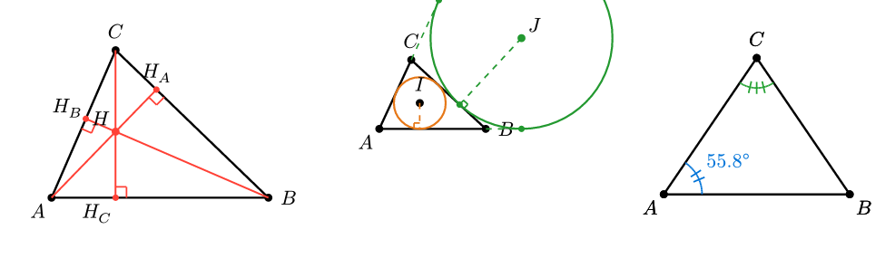
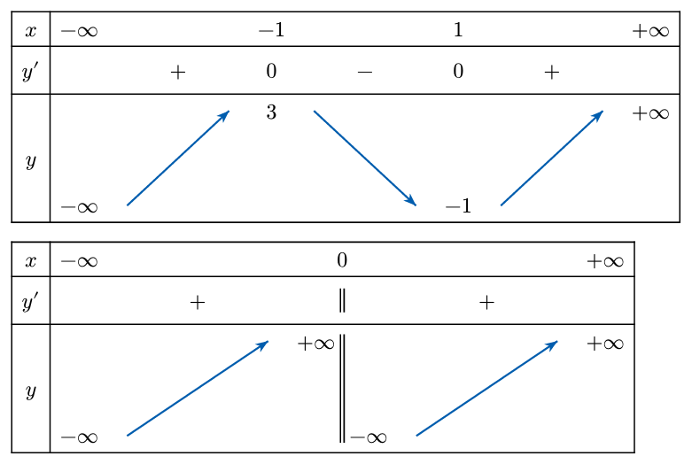
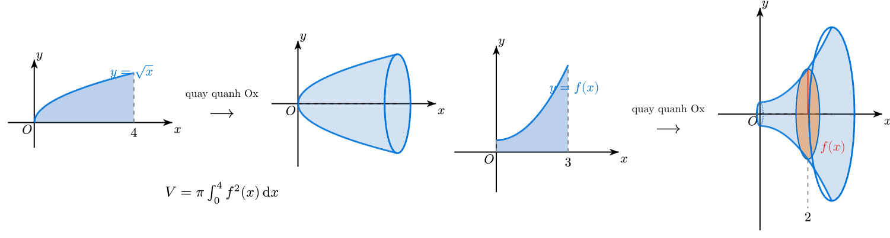
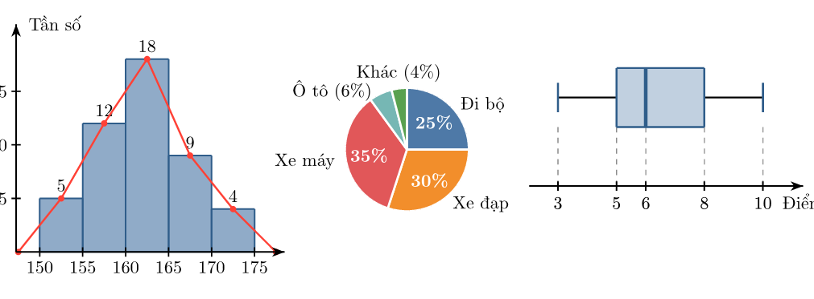
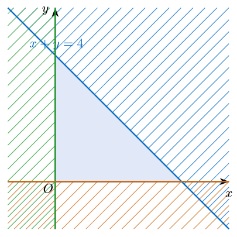
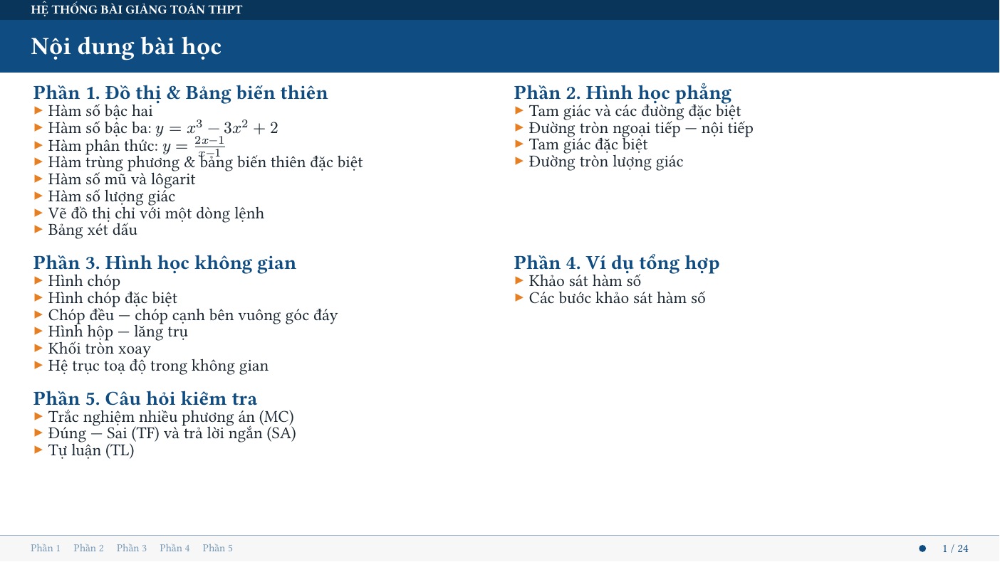
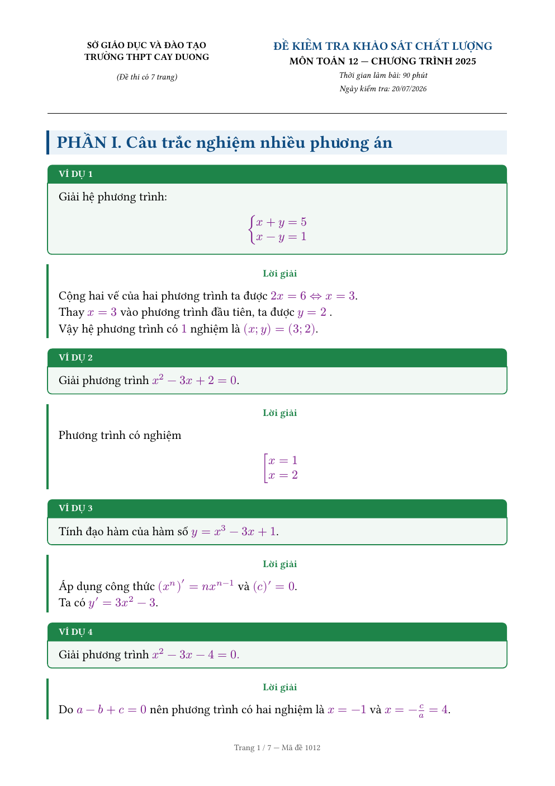

<h1 align="center">conic-toan</h1>

<p align="center">
  <em>Draw math figures, graphs and variation tables — and build exam papers.</em><br>
  A dependency-free Typst library for Vietnamese high-school mathematics.
</p>

<p align="center">
  
</p>

## English overview

`conic-toan` is a pure Typst library — **no external packages, no CeTZ** — for
authoring Vietnamese high-school mathematics material. Everything below is drawn
by the library itself and compiles offline.

**What it does**

- **Plane and solid geometry.** Triangles with their notable points and circles
  (incircle, circumcircle, orthocentre, excircles), pyramids, prisms, frustums,
  cones, cylinders and spheres, with hidden edges dashed automatically.
- **Function graphs.** Quadratic through rational functions, exponentials,
  logarithms, trigonometry, conics, tangent lines, areas between curves and
  feasible regions of linear systems. Labels carry *exact* values — a cubic's
  extremum prints as a surd, not as `10.48`.
- **Variation tables from coefficients.** `bbt-bac-ba(1, 0, -3, 1)` produces the
  full table for *y = x³ − 3x + 1*, covering every discriminant case.
- **Full worked solutions.** `khao-sat-ve-do-thi-ham-bac-ba(1, 0, -3, 1)` emits
  the domain, derivative, limits, monotonicity, extrema, variation table and
  graph — the entire textbook analysis from five numbers.
- **Statistics for the 2018 curriculum.** Frequency tables, histograms, ogives,
  bar charts, box plots and pie charts, plus fourteen summary statistics for raw
  and grouped data.
- **Solids of revolution.** A plane region, the rotation arrow, the resulting
  solid and its volume integral, side by side.
- **One source, three PDFs.** The same question file renders as a printable exam,
  a solution key, or 16:9 lecture slides. Eight question types, automatic answer
  keys and answer tables.

Function and parameter names are in unaccented Vietnamese (`doan`, `duong-tron`,
`bbt-bac-ba`), and the documentation below is in Vietnamese.

**Quick start**

```typst
#import "@preview/conic-toan:0.3.0": *

#do-thi-bac-ba(1, 0, -3, 1)          // graph with exact extrema
#bbt-bac-ba(1, 0, -3, 1)             // matching variation table
#hinh-chop-luc-giac-deu()            // hexagonal pyramid
```

<table>
  <tr>
    <td></td>
    <td></td>
  </tr>
  <tr>
    <td></td>
    <td></td>
  </tr>
  <tr>
    <td></td>
    <td></td>
  </tr>
</table>

One question source, rendered as lecture slides and as an exam paper:

<p align="center">
  <br>
  
</p>

Licensed under MIT. Full documentation in Vietnamese follows.

---

# Hệ thống bài giảng trình chiếu Toán THPT bằng Typst

Thuần Typst, **không phụ thuộc package nào** — biên dịch offline được ngay.

## Cài đặt

```typst
#import "@preview/conic-toan:0.3.0": *
```

Không cần tải gì thêm — Typst tự tải gói về khi biên dịch lần đầu.
Mã nguồn và các file mẫu: https://github.com/Thutran1891/conic-toan

## Yêu cầu & biên dịch

- Typst **0.13 trở lên** (cài trên Windows: `winget install --id Typst.Typst`).
- Biên dịch: `typst compile main.typ` — Xem trực tiếp khi soạn: `typst watch main.typ`.
- Khuyến nghị dùng VS Code + extension **Tinymist Typst** để xem trước tức thì.

## Cấu trúc

```
baigiang.typ            ← import MỘT file này là dùng được tất cả
main.typ                ← bài giảng demo trình diễn toàn bộ tính năng
lib/
  slide.typ             ← engine trình chiếu 16:9
  ve.typ                ← engine vẽ hình lõi (hệ toạ độ, điểm, đoạn, cung, góc…)
  hinh-phang.typ        ← hình học phẳng
  hinh-khong-gian.typ   ← hình học không gian
  do-thi.typ            ← đồ thị hàm số
  bang.typ              ← bảng biến thiên, bảng xét dấu
```

Tạo bài giảng mới: copy `main.typ` thành `bai-1.typ` rồi sửa nội dung.

## 1. Trình chiếu

```typst
#import "@preview/conic-toan:0.3.0": *

#show: bai-giang.with(
  tieu-de: [CHƯƠNG I. KHẢO SÁT HÀM SỐ],
  tieu-de-ngan: [Chương I. Khảo sát hàm số],  // tên bài rút gọn — LUÔN hiện
                    // trên dải đầu trang mọi slide (none => dùng nguyên tieu-de)
  phu-de: [Tiết 1: Sự đồng biến, nghịch biến],
  gv: "Kim Thu",
  ngay: "12/07/2026",
  lop: "Lớp 12A1",             // (tuỳ chọn) hiện trên TRANG BÌA
  mon: "Giải tích",            // (tuỳ chọn) môn/chương hiện trên TRANG BÌA
  logo: image("logo.png"),     // (tuỳ chọn) logo trường — PHẢI bọc image(...)
                               //   Đặt ảnh CÙNG thư mục file .typ này. KHÔNG
                               //   truyền chuỗi "logo.png" (image() chạy trong
                               //   package sẽ tìm ảnh cạnh package -> không thấy).
                               //   none = không có logo.
  kieu-bia: 1,                 // KIỂU TRANG BÌA — 1..5 hoặc tên:
                               //   1 "toi-gian"      Tối giản & Thanh lịch
                               //   2 "tre-trung"     Trẻ trung & Sáng tạo
                               //   3 "co-dien"       Chuẩn mực Học thuật Cổ điển
                               //   4 "chuyen-nghiep" Chuyên nghiệp & Khoa học
                               //   5 "ky-thuat"      Tiêu chuẩn Tài liệu Kỹ thuật
                               // Mỗi kiểu có TÔNG MÀU riêng; đặt mau-chinh/
                               // mau-nhan để GHI ĐÈ tông đó (đồng bộ cả bài).
  mau-chinh: rgb("#0f4c81"),   // đổi màu chủ đạo tuỳ ý (auto = theo kieu-bia)
  nen: "kem",                  // nền slide: "trang" (mặc định) | "kem"
                               // | "xanh-nhat" | "luc-nhat" | "xam"
                               // hoặc màu TUỲ Ý, ví dụ các tông sáng đẹp:
                               //   rgb("#fdf3e7")  cam nhạt
                               //   rgb("#fdf0f0")  hồng nhạt
                               //   rgb("#f6f0fb")  tím nhạt
                               //   rgb("#eefaf6")  bạc hà
                               //   rgb("#fbfbe8")  vàng chanh nhạt
  ti-le-chu: 1.0,              // HỆ SỐ PHÓNG CỠ CHỮ THÂN NỘI DUNG (toàn file):
                               // 1.0 giữ nguyên; 1.1 to hơn 10%; 0.9 nhỏ đi 10%.
                               // Chỉ co giãn thân + khung (định nghĩa/ví dụ/lời
                               // giải…); thanh tiêu đề, header, footer giữ nguyên.
  mau-cong-thuc: auto,         // MÀU MỌI CÔNG THỨC trong $...$ (toàn file):
                               // auto (mặc định) = thừa kế màu chữ — thân đen,
                               // tiêu đề/bìa trắng. Đặt màu, vd rgb("#0f4c81"),
                               // để nhuộm TẤT CẢ công thức theo màu đó.
)

#muc[1. Định nghĩa]                     // slide chuyển phần
#slide(tieu-de: [Khái niệm])[ ... ]     // slide thường
#trang-cam-on()
```

Khung nội dung (tự đánh số ví dụ/luyện tập):
`#dinh-nghia[...]`, `#dinh-ly[...]`, `#tinh-chat[...]`, `#vi-du[...]`,
`#loi-giai[...]`, `#chu-y[...]`, `#ghi-nho[...]`, `#nhan-xet[...]`, `#luyen-tap[...]`.

Bố cục: `#chia-cot(trai, phai)` hoặc `#chia-cot(a, b, c, ti-le: (2fr, 1fr, 1fr))`.
Các bước giải: `#buoc([Bước 1...], [Bước 2...])`.

## 2. Vẽ hình tự do (ve.typ)

Mọi hình vẽ nằm trong `#hinh(...)` với hệ toạ độ toán học (y hướng lên).
Để `h: auto` thì hai trục cùng tỉ lệ (nên giữ khi vẽ hình hình học).

```typst
#hinh(w: 7cm, xmin: -1, xmax: 6, ymin: -1, ymax: 5, ctx => {
  doan(ctx, (0, 0), (5, 0))                       // đoạn thẳng
  doan(ctx, (1, 1), (4, 3), dut: true, mau: red)  // nét đứt
  duong-gap-khuc(ctx, ((0,0), (1,2), (3,1), (5,4)), mau: blue, dut: true) // gấp khúc A-B-C-D, đứt thật từng đoạn
  diem(ctx, (2, 3), ten: $M$, huong: "tren")      // điểm + nhãn
  mui-ten(ctx, (0, 0), (3, 2))                    // mũi tên
  vecto(ctx, (0, 0), (2, 3), ten: $arrow(u)$)     // vectơ có tên
  vecto(ctx, (0, 0), (2, 3), dut: true)           // vectơ nét đứt (cạnh khuất), đầu mũi tên vẫn liền
  duong-tron(ctx, (3, 2), 1.5)                    // đường tròn
  cung(ctx, (0, 0), 2, tu: 0deg, den: 90deg)      // cung tròn
  goc(ctx, (0,0), (5,0), (3,4), ten: $alpha$)     // đánh dấu góc (cung + nhãn)
  goc(ctx, (0,0), (5,0), (3,4), so-do: true,      // tự ghi số đo góc (vd 60°)
      to: rgb(255, 170, 0, 70))                   // + tô màu hình quạt
  goc(ctx, (0,0), (5,0), (3,4), vach: 2)          // 2 vạch cắt ngang cung
  goc-vuong(ctx, (0,0), (5,0), (0,4))             // ký hiệu vuông góc
  danh-dau(ctx, (0,0), (5,0), so: 2)              // vạch "bằng nhau"
  ve-ham(ctx, x => x*x/4, mau: blue)              // đồ thị hàm bất kỳ
  to-vung(ctx, x => x*x/4, 0, 3)                  // tô miền dưới đồ thị
  nhan(ctx, (3, 4), [chú thích], huong: "phai")
})
```

Hướng nhãn: `"tren" | "duoi" | "trai" | "phai" | "tren-trai" | "tren-phai" | "duoi-trai" | "duoi-phai" | "giua"`.

### `cac-doan` — vẽ nhiều nét trong MỘT lệnh (kiểu `\draw` của TikZ) (07/2026)

```typst
cac-doan(A, B)                    // một đoạn
cac-doan(A, B, C, D)              // các điểm liền nhau -> gấp khúc A-B-C-D
cac-doan((A, B), (C, D))          // mỗi MẢNG điểm là một nét rời
cac-doan(
  duong(B, C, D, S, dong: true),               // nét khép kín
  duong(A, B, dut: true), duong(A, D, dut: true),
  duong(B, D, mau: red, dut: true, ten: $d$, tai: 0.35),
  day: 1.1pt,                                  // kiểu CHUNG cho mọi nét
)
```

`duong(...)` khai báo một nét có kiểu riêng (đè lên kiểu chung). Tuỳ chọn dùng
được ở cả `duong(...)` lẫn `cac-doan(...)`: `mau`, `day`, `dut`, `dong` (khép
kín), `to` (tô màu — tự khép kín), `mui-ten` (đầu mũi tên ở điểm cuối), và bộ
nhãn `ten`/`tai`/`huong`/`cach`/`ten-quay`/`mau-ten` (nhãn đặt tại tỉ lệ `tai`
tính theo TỔNG chiều dài nét).

### `cac-diem` — chấm và đặt tên nhiều điểm trong MỘT lệnh (07/2026)

```typst
cac-diem(
  (A, $A$, "below-left"), (B, $B$, "below-right"), (C, $C$, "above"),
  mau: blue, bk: 2.2pt,
)
```

Mỗi đối số là một điểm, viết theo một trong bốn dạng:

- `A` — chỉ chấm, không nhãn;
- `(A, $A$)` — chấm + nhãn, hướng lấy theo `huong` chung;
- `(A, $A$, "left")` — thêm hướng riêng;
- `(A, $A$, "left", red)` — thêm màu riêng (áp cho cả chấm lẫn chữ).

Tuỳ chọn chung: `mau`, `bk` (bán kính chấm), `huong`, `cach` (nhãn cách chấm),
`mau-ten` (`auto` = theo màu chấm). Lệnh `diem` cũng nhận thêm `cach` và
`mau-ten` như trên.

### Tiếp tuyến của đồ thị tại một điểm (07/2026)

```typst
tiep-tuyen(f, 1.5)                                  // tiếp tuyến tại x = 1,5
tiep-tuyen(f, 1.5, ten: auto, ten-diem: $M$, giong: true)   // + phương trình
tiep-tuyen(f, (-1, 2), mau: green, dut: true)       // nhiều tiếp điểm một lệnh
tiep-tuyen(f, 0, dai: 1.4, ten: $Delta$)            // đoạn ngắn quanh tiếp điểm
let k = dao-ham(f, 1.5)                             // chỉ lấy hệ số góc
```

Hệ số góc tính bằng **đạo hàm số** nên dùng được cho mọi hàm viết bằng closure
(kể cả hàm hợp, hàm căn, lượng giác). Tuỳ chọn: `dai` (`auto` = kéo hết khung,
tự cắt gọn theo cửa sổ; hoặc nửa độ dài theo trục Ox), `cham`/`mau-cham` (chấm
tiếp điểm), `ten-diem`/`huong-diem`, `ten` (`auto` = tự ghi `y = kx + m` rút
gọn), `tai`/`huong-ten`/`cach`/`ten-quay` (vị trí & kiểu nhãn), `giong` (kẻ
đường gióng đứt từ tiếp điểm về hai trục), `mau`, `day`, `dut`.

### Nhãn chú thích ngay trên đoạn (`doan`) (07/2026)

```typst
doan(A, B, ten: [6 cm])                          // giữa đoạn, tự đặt vuông góc
doan(A, B, ten: $h$, tai: 0.7, huong: "right", cach: 4pt)
doan(B, C, ten: [cạnh huyền], ten-quay: true)    // chữ nằm dọc theo đoạn
```

- `tai`: vị trí nhãn theo tỉ lệ từ A đến B (0 = tại A, 1 = tại B, mặc định 0.5).
- `huong`: `auto` (mặc định) = vuông góc, phía trên đoạn — đoạn thẳng đứng thì
  ra bên trái; hoặc tên hướng như trên, hoặc vectơ `(dx, dy)` tự chọn.
- `ten-quay: true`: chữ xoay theo đoạn và luôn đọc xuôi (không lộn ngược).
- `mau-ten`: mặc định lấy theo màu đoạn.

File thử: `thu-cac-doan.typ`.

Hàm tính toán: `trung-diem`, `khoang-cach`, `chia(A, B, t)` (t = tỉ lệ AM/AB,
ngoài [0, 1] là điểm trên đường kéo dài), `hinh-chieu(P, A, B)`,
`tam-ngoai-tiep`, `tam-noi-tiep`, `truc-tam(A, B, C)` (giao ba đường cao),
`tam-bang-tiep(A, B, C)` → `(J, r)` (tâm + bán kính đường tròn bàng tiếp
**trong góc A**; muốn góc B thì gọi `tam-bang-tiep(B, C, A)`),
`tiep-diem`, `giao-hai-duong-tron`,
`giao-duong-thang(A, B, C, D)` (giao 2 đường thẳng AB, CD).

Giao với đường cong (07/2026): `giao-ham(f, g, tu, den)` trả về MẢNG giao điểm
của 2 đồ thị y = f(x), y = g(x) trên [tu, den]; đường thẳng qua 2 điểm đổi thành
hàm bằng `ham-qua-2-diem(A, B)`; đường đứng x = k thì giao là `(k, f(k))`.
Ví dụ đầy đủ: `vi-du-ve-tu-do.typ`.

### KHÔNG cần gõ `ctx` nữa (07/2026)

Trong thân `#hinh(...)` và trong `them: ctx => ...` của **mọi** hình/đồ thị
dựng sẵn, các lệnh vẽ tự lấy khung hình đang vẽ — **bỏ hẳn `ctx`**:

```typst
them: ctx => {
  doan(M, N, mau: blue, dut: true)
  ve-ham(g, mau: red)
  diem(A, mau: red, ten: $A$)
}
```

- Lối cũ `doan(ctx, M, N)` **vẫn chạy y nguyên** (đối số đầu là `ctx` thì gọi
  thẳng) — bài soạn cũ không phải sửa một chữ nào.
- **Ngoại lệ vẫn phải truyền `ctx`**: các hàm TRẢ VỀ GIÁ TRỊ chứ không vẽ —
  `toa`, `toa-pt`, `toa-nguoc`, `goc-truc`, `ctx-quay`, `ctx-tinh-tien`.
  Ví dụ nhãn nghiêng: `nhan(P, $d$, quay: goc-truc(ctx, A, B))`.
- Gọi lệnh vẽ ở NGOÀI khung hình sẽ báo lỗi rõ ràng: *"Hàm vẽ cần khung
  hình: đặt lệnh trong thân #hinh(...) hoặc trong them: ctx => ..."*.
- Vẫn giữ `ve-voi(ctx)` (bộ hàm gắn sẵn ctx, lấy bằng
  `let (doan, diem) = ve-voi(ctx)`) cho ai muốn đặt tên riêng, hoặc khi vẽ
  trên khung đã quay: `ve-voi(ctx-quay(ctx, 30deg))`.

Danh sách 49 lệnh được gọi ngầm: nguyên thuỷ của `ve.typ`
(`doan`, `diem`, `nhan`, `mui-ten`, `vecto`, `duong-cong`, `duong-tron`,
`elip`, `cung`, `goc`, `goc-vuong`, `danh-dau`, `ve-ham`, `to-vung`,
`gach-mien`, `gach-vung`, `ve-mien`, `mui-ten`, `dau-mui-ten`…),
hệ trục của `do-thi.typ` (`truc`, `luoi`, `vach-chia`, `he-truc`, `giong`,
`nhan-pi`), toàn bộ `hinh-phang.typ` (`tam-giac`, `duong-cao`, `tu-giac`…)
và nhóm Oxyz (`diem-oxyz`, `doan-oxyz`, `vecto-oxyz`, `giong-oxyz`).

Các hàm KHÔNG cần `ctx` từ trước (`trung-diem`, `chia`, `hinh-chieu`,
`giao-ham`, `ham-qua-2-diem`, `so-toan`, `mien-tron`, `giao`/`hop`/`bu`…)
vẫn gọi thẳng như cũ.

> `giao-ham` chỉ **TÍNH**, không vẽ ⇒ **không truyền `ctx`**; kết quả đem cho
> `diem`/`nhan` mới ra hình. Cận nhận cả 2 lối viết: `giao-ham(f, g, -3, 2)`
> hoặc `giao-ham(f, g, tu: -3, den: 2)`. Lỡ gõ `giao-ham(ctx, f, g, ...)` thì
> `ctx` được bỏ qua chứ không báo lỗi. Quét qua tiệm cận đứng cũng an toàn:
> chỗ hàm "nhảy" bị loại khỏi kết quả.
>
> ```typst
> them: ctx => {
>   let f = x => (x + 2)/(x + 1)
>   let g = x => x + 1
>   ve-ham(g, mau: red)
>   for P in giao-ham(f, g, -3, 2) { diem(P, mau: red, bk: 2.2pt) }
> }
> ```

## 3. Hình phẳng (hinh-phang.typ)

```typst
#hinh(w: 7cm, xmin: -1, xmax: 6, ymin: -1, ymax: 5, ctx => {
  let (A, B, C) = ((0.5, 0), (5.5, 0), (3.5, 4))
  tam-giac(ctx, A, B, C)                          // nhãn đỉnh tự đặt
  duong-cao(ctx, C, A, B, ten-chan: $H$)
  trung-tuyen(ctx, A, B, C, ten-chan: $M$)
  phan-giac(ctx, B, C, A, ten-chan: $D$)
  trung-truc(ctx, A, B)
  duong-tron-ngoai-tiep(ctx, A, B, C)             // tâm O tự tính
  duong-tron-noi-tiep(ctx, A, B, C)
})
```

Sẵn có thêm: `tu-giac`, `hinh-binh-hanh` (biết 3 đỉnh), `hinh-chu-nhat`,
`hinh-thang`, `tiep-tuyen-tu-diem(ctx, O, r, M)` (hai tiếp tuyến + góc vuông),
`duong-tron-luong-giac(so-do: 55deg)` (hình hoàn chỉnh, tự tạo khung).

**Trực tâm & đường tròn bàng tiếp (07/2026)** — trọn bộ công cụ tam giác:

```typst
ve-truc-tam(A, B, C)                  // 3 đường cao + ký hiệu vuông góc + H
ve-truc-tam(A, B, C, canh: false,     // không vẽ lại cạnh tam giác
  ten: $H$, ten-chan: ($H_A$, $H_B$, $H_C$))
duong-tron-bang-tiep(A, B, C)                    // bàng tiếp TRONG GÓC A
duong-tron-bang-tiep(A, B, C, ban-kinh: true,    // + bán kính tới BC
  ten-tam: $J_A$, ten-tiep: ($X$, $Y$, $Z$))
duong-tron-bang-tiep(B, C, A)                    // bàng tiếp trong góc B
```

`ve-truc-tam` tự kéo dài cạnh bằng nét đứt khi tam giác tù (chân đường cao rơi
ra ngoài cạnh); `duong-tron-bang-tiep` tự kéo dài AB, AC tới tiếp điểm
(`keo-dai: false` để tắt).

Tam giác đặc biệt (tự vẽ ký hiệu vuông góc, vạch cạnh bằng nhau):

```typst
tam-giac-deu(ctx, A, canh)              // đều
tam-giac-vuong(ctx, A, a, b)            // vuông tại A, hai cạnh a × b
tam-giac-can(ctx, A, canh-day, chieu-cao)   // cân tại C
tam-giac-vuong-can(ctx, A, canh)        // vuông cân tại A
```

## 4. Hình không gian (hinh-khong-gian.typ)

Các hình hoàn chỉnh, nét khuất tự vẽ đứt theo quy ước SGK:

```typst
#hinh-chop-tam-giac()                        // S.ABC
#hinh-chop-tu-giac(duong-cao: "tam", duong-cheo: true)   // chóp đều S.ABCD
#hinh-chop-tu-giac-thuong(duong-cheo: true)  // chóp tứ giác thường (góc nhìn khác)
#hinh-chop-day-hinh-thang(duong-cheo: true)  // chóp đáy hình thang
#hinh-chop-tu-giac(duong-cao: "dinh-a")      // SA ⊥ đáy
#hinh-hop(duong-cheo: true)                  // hộp + đường chéo AC′ (nghieng: độ xiên)
#hinh-hop-chu-nhat(duong-cheo: true)         // hộp chữ nhật dài (nhìn thẳng, nghieng: 0)
#hinh-lap-phuong()
#hinh-lang-tru-tam-giac()
#hinh-non()  #hinh-tru()  #hinh-cau()
#truc-oxyz(don-vi: true)

// Hình chóp đặc biệt
#hinh-chop-tam-giac-deu(trung-tuyen: true)  // S.ABC đều, SO ⊥ đáy tại trọng tâm
#hinh-chop-tu-giac-deu()                    // S.ABCD đều, 2 đường chéo + SO
#hinh-chop-tam-dien-vuong()                 // O.ABC: OA, OB, OC đôi một vuông góc
#hinh-chop-day-tam-giac-vuong()             // ABC vuông tại B, SA ⊥ (ABC)
#hinh-chop-day-chu-nhat()                   // đáy chữ nhật, SA ⊥ đáy
```

**Vẽ thêm lên hình có sẵn** bằng `them` — nhận `ctx` và từ điển đỉnh `d`
(`d.S`, `d.A`, `d.B`, `d.C`, `d.D`, hình hộp/lăng trụ có `d.A1` = A′…):

```typst
#hinh-chop-tu-giac(them: (ctx, d) => {
  let M = trung-diem(d.S, d.C)
  diem(ctx, M, ten: $M$, huong: "phai", mau: blue)
  doan(ctx, d.B, M, mau: blue, dut: true)
  da-giac(ctx, (d.A, M, d.B), to: rgb(30,100,200,40))   // thiết diện mờ
})
```

## 5. Đồ thị hàm số (do-thi.typ)

**Vẽ nhanh nhất** — chỉ cần công thức và màu, cửa sổ tự chọn:

```typst
#ve-do-thi(x => x*x*x - 3*x, mau: red)
#ve-do-thi(x => calc.sin(2*x) + x/2, mau: purple, ten: $y = sin 2x + x/2$)
#ve-do-thi(x => calc.exp(x) - 2, mau: blue, xmin: -3, xmax: 2)
```

(Hàm cần xác định trên đoạn vẽ; hàm có tiệm cận đứng dùng `do-thi-phan-thuc`.)

Đồ thị dựng sẵn (tự chọn cửa sổ đẹp, gióng điểm đặc biệt):

```typst
#do-thi-bac-nhat(2, -1)                      // y = 2x − 1
#do-thi-bac-hai(1, -2, -1)                   // parabol, gióng đỉnh
#do-thi-bac-ba(1, -3, 0, 2)                  // gióng 2 cực trị
#do-thi-trung-phuong(1, -2, 0)
#do-thi-phan-thuc(2, -1, 1, -1)              // y=(2x−1)/(x−1), 2 tiệm cận đứt đỏ
#do-thi-mu(2)   #do-thi-log(2)
#do-thi-sin()   #do-thi-cos()   #do-thi-tan()   // nhãn π/2, π, 2π
#do-thi-can()
```

Mọi đồ thị dựng sẵn đều nhận `luoi-o: true` (lưới ô vuông mờ) và `vach: true`
(vạch chia + số trên hai trục; riêng sin/cos/tan chỉ có `luoi-o` vì trục hoành
đã ghi theo π). Khi bật `vach`, nên đặt `giao-ox: none, giao-oy: none` để nhãn
giao trục không chồng lên số vạch.

Vẽ tay trong `#hinh`: `he-truc(ctx)` gộp lưới + trục + vạch chia + số một lệnh:

```typst
#hinh(xmin: -4, xmax: 4, ymin: -3, ymax: 3, ctx => {
  he-truc(ctx)               // tuỳ chọn: luoi-o, vach, so, buoc-x, buoc-y, ten-x...
  ve-ham(ctx, x => x*x - 2, mau: blue)
})
```

Hàm bất kỳ + vẽ chồng qua `them`:

```typst
#do-thi-ham(x => calc.abs(x*x - 2*x), xmin: -2, xmax: 4, ymin: -1, ymax: 4,
  ten: $y = |x^2 - 2x|$, luoi-o: true, vach: true,
  them: ctx => {
    ve-ham(ctx, x => 1.5, mau: red, dut: true)   // đường y = m
    giong(ctx, (3, 3))                            // gióng điểm về 2 trục
  })
```

### Nhiều đồ thị trên cùng một hệ trục

Mỗi hàm gói bằng `ham(...)`; `giao-diem: auto` chấm đỏ giao điểm từng cặp:

```typst
#do-thi-nhieu-ham(
  ham(x => x*x - 2, mau: blue, ten: $y = x^2 - 2$),
  ham(x => x, mau: red, ten: $y = x$, dut: true, tai: -2),  // tai: hoành độ đặt nhãn
  xmin: -3, xmax: 3, ymin: -3, ymax: 4,
  giao-diem: auto,
)
```

### Miền nghiệm BPT / hệ BPT bậc nhất hai ẩn

Quy ước SGK: gạch phần **không** là miền nghiệm; biên nét đứt nếu BPT ngặt.
Mỗi BPT `a·x + b·y (dau) c` khai báo bằng `bpt(a, b, c, dau: "<=")`:

```typst
#mien-nghiem(bpt(4, 5, -8, dau: "<"), giao-truc: auto)   // 4x + 5y < −8
#mien-nghiem(                                            // hệ BPT + tô miền
  bpt(3, -2, -9, mau: red, ten: $3x - 2y = -9$, ten-tai: 0.7, huong-ten: "left"),
  bpt(-3, 5, 18, mau: green.darken(25%)),
  to-mien: rgb(40, 90, 200, 35),
  xmin: -7.5, xmax: 2.5, ymin: -1.5, ymax: 5,
)
```

### Diện tích hình phẳng giới hạn bởi 2 đồ thị

`g` mặc định là trục hoành; `a, b: auto` = tự lấy giao điểm ngoài cùng
(trong phạm vi `tu..den`); miền tô tự tách tại giao điểm ở giữa:

```typst
#dien-tich-2-ham(x => x*x, g: x => x + 2)              // tự tìm giao điểm
#dien-tich-2-ham(x => calc.sin(x), a: 0.5, b: 2.6)     // trên đoạn [a, b]
#dien-tich-2-ham(x => x*x - 1, g: x => -x - 1, a: -2, b: 1.5,
  ten-f: $y = x^2 - 1$, ten-g: $y = -x - 1$, mau-to: rgb(200, 60, 60, 60))
```

Cần vẽ tay trong `them` của đồ thị khác: `to-vung-2-ham(ctx, f, g, a, b)`
(và `to-vung(ctx, f, a, b)` với trục hoành); gạch chéo đa giác lồi:
`gach-mien(ctx, cac-dinh)`.

### Khối tròn xoay (07/2026)

`#khoi-tron-xoay(f, a, b)` vẽ **hai hình cạnh nhau**: trái là miền phẳng đã tô
màu (giới hạn bởi `y = f(x)`, trục hoành, `x = a`, `x = b`), phải là khối tròn
xoay sinh ra khi quay miền đó quanh `Ox` — nét khuất tự vẽ đứt.

```typst
#khoi-tron-xoay(x => calc.sqrt(x), 0, 4, ten-ham: $y = sqrt(x)$, the-tich: true)
#khoi-tron-xoay(x => 0.35*x*x + 0.5, 0, 3, mat-cat: 2)   // thiết diện tại x = 2
#khoi-tron-xoay(x => 1.6, 0, 3, g: x => 0.7)             // khối rỗng (vành khăn)
#khoi-tron-xoay(y => 0.6 + 0.5*y, 0, 3, truc: "Oy")      // quay quanh Oy
#khoi-tron-xoay(f, a, b, hien: "khoi")                   // chỉ lấy khối 3D
#khoi-tron-xoay(f, a, b, hien: "mien")                   // chỉ lấy miền phẳng
```

Tham số: `truc` (`"Ox"` mặc định | `"Oy"` — khi đó `f` là bán kính theo `y`),
`hien` (`"ca-hai"` | `"mien"` | `"khoi"`), `g` (bán kính trong → vành khăn),
`mat-cat: c` (vẽ đĩa/vành thiết diện tại `c` + bán kính, kèm `ten-ban-kinh`,
`ten-mat-cat`), `the-tich: true` (ghi công thức `V = π∫f²dx` dưới hình),
`w` (bề rộng hình khối), `k` (độ "dẹt" của elip, mặc định 0.26), `ten-ham`,
`ten-ham-trong`, `ten-a`, `ten-b`, `ten-goc`, `nhan-giua`, `mau`, `mau-to`,
`mau-mien`, `them` / `them-mien` (vẽ chồng vào hình khối / hình miền).

Vẽ riêng vào một khung `#hinh` có sẵn: `ve-khoi-xoay(f, a, b, ...)` và
`ve-mien-xoay(f, a, b, ...)` (thêm `ngang: false` cho trục quay thẳng đứng).

Gạch chéo **miền bất kì** (biên cong, hợp/giao/hiệu tuỳ ý): khai báo mỗi hình
đúng MỘT lần bằng `mien-tron(O, r)` / `mien-elip(O, a, b, quay:)`, vẽ biên bằng
`ve-mien(ctx, m)`, gạch bằng `gach-vung` + phép tập hợp `giao`/`hop`/`bu` —
đổi tâm/bán kính một chỗ là vẽ và gạch tự khớp. Ví dụ Ven $(A sect B) without C$:

```typst
#hinh(w: 4.5cm, xmin: -2, xmax: 2, ymin: -2, ymax: 2, ctx => {
  let A = mien-tron((-0.5, 0.3), 0.9)
  let B = mien-tron((0.5, 0.3), 0.9)
  let C = mien-tron((0, -0.5), 0.5)      // bán kính khác nhau thoải mái
  ve-mien(ctx, A)
  ve-mien(ctx, B)
  ve-mien(ctx, C)
  gach-vung(ctx, giao(A, B, bu(C)), mau: black, day: 0.4pt, buoc: 4.5pt)
})
```

`giao`/`hop`/`bu` lồng nhau tuỳ ý: `hop(A, B)`, `giao(A, hop(B, C))`,
`bu(hop(A, B))`... Miền không phải tròn/elip thì `gach-vung` vẫn nhận hàm
`P => true/false` như cũ; helper điểm: `trong(P, m)` (nhận miền hoặc hàm),
`trong-tron(P, O, r)`, `trong-elip(P, O, a, b, quay:)`.

Tuỳ chọn: `goc:` (hướng vạch, mặc định 45°), `buoc:` (khoảng cách vạch),
`n:` (số mẫu mỗi vạch — biên càng mịn).

### Phép quay & tịnh tiến (ve.typ)

Elip xoay: `elip(ctx, O, a, b, quay: 30deg)` (dương = ngược chiều kim đồng hồ,
xoay quanh tâm O); kiểm tra điểm cùng góc: `trong-elip(P, O, a, b, quay: 30deg)`.
`cung` và `cung-elip` cũng nhận `quay:` (xoay cung quanh tâm).

Quay/tịnh tiến **cả cụm hình** — mọi hàm vẽ theo điểm (doan, da-giac, tam-giac,
duong-tron, diem, nhan, vecto...) đều tự biến đổi khi vẽ bằng ctx đã bọc:

```typst
#hinh(w: 7cm, xmin: -1, xmax: 8, ymin: -1, ymax: 4, ctx => {
  let ve-hinh = c => {
    tam-giac(c, (0, 0), (2, 0), (0.6, 1.6))
    duong-tron(c, (1, 0.55), 0.4, mau: blue)
  }
  ve-hinh(ctx)                                  // hình gốc
  ve-hinh(ctx-quay(ctx, 35deg, tam: (0, 0)))    // ảnh quay quanh O
  ve-hinh(ctx-tinh-tien(ctx-quay(ctx, 35deg, tam: (0, 0)), (4.5, 0.5)))
})                                              // quay trước, tịnh tiến sau
```

Biến đổi điểm lẻ: `quay-diem(P, tam, goc)`, `tinh-tien-diem(P, v)`.

Toạ độ CỰC kiểu TikZ — `toa-cuc(tam, bk, goc)` trả về điểm cách `tam` một
khoảng `bk`, quay góc `goc` (số trần = ĐỘ, nhận cả `30deg`; dương = ngược
kim đồng hồ). TikZ `(30:2)` ⇔ `toa-cuc((0,0), 2, 30)`. Ví dụ lục giác đều:

```typst
#hinh(w: 6cm, xmin: -3, xmax: 3, ymin: -3, ymax: 3, ctx => {
  let dinh = range(6).map(k => toa-cuc((0, 0), 2.6, 60 * k))
  duong-gap-khuc(ctx, dinh, dong: true)
})
```
Lưu ý: `gach-vung` mô tả miền theo toạ độ GỐC của khung (không qua ctx-quay);
riêng elip xoay đã có `trong-elip(..., quay:)` tương ứng.

### Sơ đồ cây xác suất (so-do-cay.typ)

Cây sâu tuỳ ý; nút lá có ô kết quả bên phải; màu ô tự đổi theo cấp:

```typst
#so-do-cay(
  goc: $1$,
  nhanh: (
    nut($A$, xs: $1/6$, con: (
      nut($B$, xs: $1/2$, kq: $A B: 1/12$),
      nut($overline(B)$, xs: $1/2$, kq: $A overline(B): 1/12$),
    )),
    nut($overline(A)$, xs: $5/6$, con: (
      nut($B$, xs: $1/3$, kq: $overline(A) B: 5/18$),
      nut($overline(B)$, xs: $2/3$, kq: $overline(A) overline(B): 5/9$),
    )),
  ),
)
```

### Hệ trục Oxyz theo đơn vị thật (hinh-khong-gian.typ)

`oxyz` vẽ 3 trục + vectơ đơn vị $arrow(i), arrow(j), arrow(k)$; `them`
nhận `(ctx, t3)` với `t3` đổi toạ độ $(x, y, z)$ thành điểm 2D — dùng
được với mọi hàm vẽ phẳng:

```typst
#oxyz(x: 5, y: 8, z: 8, them: (ctx, t3) => {
  giong-oxyz(ctx, t3, (5, 8, 8))                       // hộp gióng nét đứt
  vecto-oxyz(ctx, t3, (0, 0, 0), (5, 8, 8), mau: red)
  diem-oxyz(ctx, t3, (5, 8, 8), ten: $B$, huong: "above-right")
})
```

Kèm `doan-oxyz(ctx, t3, A, B)`; điểm nằm trong (Oxy) chỉ vẽ hình gióng phẳng.
Xem `thu-ve-moi.typ` để có ví dụ đầy đủ của cả 6 định nghĩa.

Mới (07/2026): `vach: true` vạch chia đơn vị trên 3 trục, `so: true` ghi số
tại các vạch, `buoc:` bước chia, `luoi:` lưới trên mặt phẳng toạ độ —
`"xy"` | tuple `("xy", "xz", "yz")` | `true` (cả 3), màu chỉnh bằng `mau-luoi`:

```typst
#oxyz(x: 3, y: 4, z: 3, vach: true, so: true, luoi: "xy")
```

## 6. Bảng biến thiên & bảng xét dấu (bang.typ)

**BBT tự động từ hệ số** (07/2026) — chỉ nhập hệ số (positional), thuật toán
tự tìm cực trị/tiệm cận/chiều biến thiên, phủ mọi trường hợp, nhãn số đẹp
(phân số, căn, `(m ± k√n)/q`):

```typst
#bbt-bac-hai(1, -3, 1)          // y = x² − 3x + 1
#bbt-bac-ba(1, 0, -3, 1)        // y = x³ − 3x + 1: 2 cực trị / Δ'=0 / đơn điệu
#bbt-trung-phuong(1, -2, 0)     // y = x⁴ − 2x²: 3 hoặc 1 cực trị
#bbt-phan-thuc(2, -1, 1, -1)    // y = (2x−1)/(x−1): tự xét dấu ad − bc
#bbt-huu-ti(1, -1, 1, 1, -1)    // y = (x²−x+1)/(x−1): 2 cực trị / đơn điệu
#bbt-can-bac-hai-ham-bac-hai(1, 0, -4)  // y = √(x²−4): tự phân 3 TH theo a, Δ
```

`bbt-can-bac-hai-ham-bac-hai(a, b, c)` — BBT hàm $y = sqrt(a x^2 + b x + c)$,
đỉnh $x_0 = -b\/(2a)$, giá trị đỉnh $sqrt((4 a c - b^2)\/(4a))$ (in căn thức
chính xác). Ba trường hợp: **a > 0, Δ > 0** (2 nghiệm) → TXĐ $(-oo, x_1] union
[x_2, +oo)$, khoảng giữa gạch chéo (ngoài TXĐ), giá trị 2 nghiệm $= 0$;
**a > 0, Δ ≤ 0** (nghiệm kép / vô nghiệm) → TXĐ $RR$, cực tiểu tại đỉnh
(Δ = 0 → min $= 0$, $y'$ không xác định tại đỉnh, ghi ‖); **a < 0, Δ > 0**
(2 nghiệm) → TXĐ $[x_1, x_2]$, cực đại tại đỉnh (a < 0 mà Δ ≤ 0 → TXĐ rỗng, báo lỗi).

Form cũ (named) vẫn chạy: `bbt-bac-hai(a: 1, xd:, yd:)`, `bbt-bac-ba(a: -1, x1: $-1$, ...)`,
`bbt-bac-ba-don-dieu(a: 1)`, `bbt-trung-phuong(a: 1, x0:, yc:, y0:)`,
`bbt-phan-thuc(x0: $1$, y0: $2$, dong-bien: false)`, `xet-dau-tam-thuc(a: 1, x1: $1$, x2: $2$)`.

**Khảo sát & vẽ đồ thị tự động** (07/2026, `khao-sat.typ`) — chỉ nhập hệ số là
xổ ra TRỌN lời giải (tập xác định, đạo hàm, giới hạn, chiều biến thiên, cực trị
/ tiệm cận, bảng biến thiên) **kèm đồ thị**, phủ mọi trường hợp của mỗi hàm:

```typst
#khao-sat-ve-do-thi-ham-bac-hai(1, -2, -3)        // y = x² − 2x − 3 (a>0/a<0, Δ mọi dấu)
#khao-sat-ve-do-thi-ham-bac-ba(1, 0, -3, 1)       // y = x³ − 3x + 1 (2 cực trị / Δ'=0 / đơn điệu)
#khao-sat-ve-do-thi-ham-trung-phuong(1, -2, 0)    // y = x⁴ − 2x²    (3 hoặc 1 cực trị)
#khao-sat-ve-do-thi-ham-phan-thuc(2, -1, 1, -1)   // y = (2x−1)/(x−1) (đồng/nghịch biến)
#khao-sat-ve-do-thi-ham-huu-ti(1, 4, 20, 1, 2)    // y = (x²+4x+20)/(x+2) (2 cực trị / đơn điệu)
```

Tham số chung: `tieu-de:` (auto = dòng đậm "Khảo sát… y = …"; `none` = bỏ; hoặc
nội dung tuỳ ý), `w:` bề rộng đồ thị (mặc định 7.6cm), `giua: true` canh giữa
BBT + đồ thị. Đặt thẳng trong thân câu hoặc trong `loi-giai:` của `#tl(...)`.

Bảng tuỳ ý — quy ước: `dau` dài `2n−1` xen kẽ *[tại mốc, trên khoảng, …]*;
tại điểm gián đoạn thêm chỉ số vào `kep` và cho `gia-tri` một **cặp** (trái, phải):

```typst
// y = x³ − 3x² + 2
#bbt(
  x: ($-oo$, $0$, $2$, $+oo$),
  dau: ("", "+", "0", "-", "0", "+", ""),
  gia-tri: ($-oo$, $2$, $-2$, $+oo$),
  huong: ("len", "xuong", "len"),
)

// y = (2x−1)/(x−1): tiệm cận đứng x = 1 (kẹp ‖)
#bbt(
  x: ($-oo$, $1$, $+oo$),
  dau: ("", "-", "||", "-", ""),
  gia-tri: ($2$, ($-oo$, $+oo$), $2$),
  huong: ("xuong", "xuong"),
  kep: (1,),
)

// Bảng xét dấu nhiều dòng
#bang-xet-dau(
  x: ($-oo$, $1$, $3$, $+oo$),
  dong: (
    ($x - 1$, ("", "-", "0", "+", "", "+", "")),
    ($x - 3$, ("", "-", "", "-", "0", "+", "")),
    ($f(x)$,  ("", "+", "0", "-", "0", "+", "")),
  ),
)
```

Ký hiệu dấu: `"+"`, `"-"`, `"0"`, `"||"` (kẹp), `""` (trống); `huong`: `"len" | "xuong" | "ngang"`.

**Mũi tên nửa ô** (07/2026) — khi hàm đơn điệu qua mốc y′ = 0 (nghiệm kép),
để 2 mũi tên cùng chiều nằm **trên 1 đường thẳng** đi qua giá trị đặt giữa ô:
`"len-duoi"` (đáy→giữa) rồi `"len-tren"` (giữa→đỉnh); nghịch biến dùng
`"xuong-tren"` (đỉnh→giữa) rồi `"xuong-duoi"` (giữa→đáy). Giá trị tại mốc kề
đầu mút "giữa" tự đặt chính giữa ô — không cần box thủ công:

```typst
// y = x³ − 3x² + 3x: y' = 0 kép tại x = 1, vẫn đồng biến
#bbt(
  x: ($-oo$, $1$, $+oo$),
  dau: ("", "+", "0", "+", ""),
  gia-tri: ($-oo$, $1$, $+oo$),
  huong: ("len-duoi", "len-tren"),
)
```

`bbt-bac-ba(a, b, c, d)` (và `khao-sat-ve-do-thi-ham-bac-ba`) trường hợp
Δ′ = 0 tự dùng kiểu này.

## 7. Câu hỏi định dạng đề thi 2025 (cau-hoi.typ)

Bảy dạng: MC/TF/SA/TL đánh số "Câu N" liên tục chung; **HĐ** (hoạt động)
đánh "HĐ1, HĐ2...", **Luyện tập** đánh "Luyện tập 1, 2..." (chung bộ đếm
với khung `#luyen-tap`) và **Vận dụng** đánh "Vận dụng 1, 2..." — mỗi loại
bộ đếm riêng. **Một công tắc** đổi giữa bản giáo viên
(hiện đáp án, tô xanh) và bản chiếu cho học sinh: `#bat-dap-an()` / `#tat-dap-an()`.
Ở chế độ **beamer**, công tắc tự BẬT sẵn (kể cả khi dùng `bai-giang` trực tiếp,
không qua `de-toan`) — đáp án được đánh dấu ở bước `lo-da` (bước cuối) của mỗi câu;
muốn ẩn thì gọi `#tat-dap-an()`.
Sang đề mới đánh số lại: `#dat-lai-cau()` (hoặc `#dat-lai-cau(0)`) đặt lại
**cả 8 dạng câu** — Câu (tn/ds/tln/tl), Ví dụ, Hoạt động, Luyện tập, Vận dụng
thực tế — về 1; `#dat-lai-cau(3)` đánh tiếp từ 4 (tổng quát `n` → từ n + 1).

```typst
// MC — 4 phương án, cot: 1 | 2 | 4
#cau-mc([Câu hỏi...?], ($1$, $2$, $3$, $4$), dap-an: "B", cot: 4,
  loi-giai: [Hướng dẫn giải...])

// TF — 4 ý đúng/sai
#cau-tf([Đề bài...], ([ý a], [ý b], [ý c], [ý d]),
  dap-an: (true, true, false, false), loi-giai: [...])

// SA — trả lời ngắn (khi ẩn đáp án sẽ hiện 4 ô điền như phiếu TLĐ)
#cau-sa([Tính ...?], dap-an: $12$, loi-giai: [...])

// TL — tự luận; lời giải chỉ hiện khi bật đáp án
#cau-tl([Đề bài...], diem: 2, loi-giai: [Hướng dẫn...], cho-trong: 3cm)

// HĐ — hoạt động (khởi động/khám phá): thẻ "HĐ1" cam, hình thức như TL;
// nhiều ý hỏi thì dùng #cot-item trong thân câu
#cau-hd([Cho hàm số... #cot-item([Tìm GTLN...], [Tìm GTNN...])],
  loi-giai: [a) ... \ b) ...])

// LT — luyện tập (củng cố lý thuyết): thẻ "Luyện tập 1" vàng đậm,
// chung bộ đếm với khung #luyen-tap
#cau-lt([Tìm GTLN — GTNN của $y = sqrt(2x - x^2)$.], loi-giai: [...])

// VDTT — vận dụng thực tế: thẻ "Vận dụng 1" tím, hình thức như TL
#cau-vdtt([Một chiếc hộp...], loi-giai: [Gọi $x$... \ Vậy...])
```

Cả 7 dạng đều có `loi-giai:`; trong slide hoạt hình dùng thêm
`lo-da:` (bước lộ đáp án) và `lo-giai:` (bước lộ lời giải, mặc định
cùng bước với đáp án). Số thứ tự câu/ví dụ/luyện tập **không đổi**
qua các bước hoạt hình.

Khung công thức: `#cong-thuc[$S = pi r^2$]` (cùng họ với `#dinh-nghia`, `#dinh-ly`).

## 8. Hoạt hình xuất hiện từng bước

Nguyên lý như Beamer: slide có `so-buoc: n` được in thành `n` trang PDF —
khi trình chiếu, bấm phím chuyển trang là nội dung "hiện dần".
Chân trang đánh số theo slide (không tăng theo bước).

```typst
#slide(tieu-de: [Ví dụ], so-buoc: 3)[
  Nội dung luôn hiển thị.
  #lo(2)[Hiện từ bước 2 — khi chưa hiện KHÔNG chiếm chỗ (như \pause của LaTeX
         beamer; nhờ vậy slide dài không sinh trang trắng đệm).]
  #lo(2, giu-cho: true)[Ẩn nhưng giữ chỗ — chỉ dùng khi slide chắc chắn gọn 1 trang.]
  #chi(2)[Chỉ hiện đúng ở bước 2 (mặc định giữ chỗ).]
  #chi(3, giu-cho: false)[Chỉ hiện ở bước 3, không giữ chỗ.]
  #tung-buoc([ý 1 — bước 2], [ý 2 — bước 3])   // danh sách hiện dần
  #buoc(hien-dan: true, [Bước giải 1...], [Bước giải 2...])
]
```

Với câu hỏi, dùng `lo-da` để **đề hiện trước, đáp án lộ sau**:

```typst
#slide(tieu-de: [Kiểm tra], so-buoc: 2)[
  #cau-mc([Đề...?], ($1$, $2$, $3$, $4$), dap-an: "B", lo-da: 2)
]
```

Bước 1 chiếu đề cho học sinh làm, bấm một cái → phương án đúng được tô xanh.
(Ở beamer công tắc đáp án đã bật sẵn; chỉ cần `#bat-dap-an()` cho bản in A4.)

`#lo` dùng được với MỌI nội dung — ví dụ hiện dần lời giải khảo sát:

```typ
#slide(tieu-de: [Khảo sát hàm số], so-buoc: 4)[
  #vi-du[Khảo sát $y = -x^3 + 3x$.]        // bước 1: đề
  #lo(2)[#loi-giai[$y' = -3x^2 + 3$]]       // bước 2: đạo hàm
  #lo(3)[
    #bbt(
      x: ($-oo$, $-1$, $1$, $+oo$),
      dau: ("", "-", "0", "+", "0", "-", ""),
      gia-tri: ($+oo$, $-2$, $2$, $-oo$),
      huong: ("xuong", "len", "xuong"),
    )
  ]                                          // bước 3: bảng biến thiên
  #lo(4)[#figure(do-thi-bac-ba(-1, 0, 3, 0))] // bước 4: đồ thị
]
```

## 9. Thanh điều hướng & mục lục

- **Đầu trang mỗi slide** (beamer): dải màu đậm phía trên thanh tiêu đề luôn
  hiện **tên bài học** (`tieu-de-ngan`, mặc định là `tieu-de`) bên trái và
  tên mục hiện tại bên phải.
- **Chân trang mỗi slide** là thanh điều hướng: bên trái là tên các phần
  (bấm để nhảy tới đầu phần; phần hiện tại in đậm), giữa là dãy **chấm tròn**
  — mỗi chấm một slide của phần hiện tại, chấm đặc là slide đang xem,
  bấm chấm nào nhảy tới slide đó.
- `#muc(ngan: [Phần 1])[Phần 1. Tên đầy đủ...]` — `ngan` là nhãn rút gọn
  hiển thị trên thanh điều hướng.
- `#muc-luc()` (đặt sau trang bìa) — slide mục lục tự động liệt kê mọi phần
  và tiêu đề mọi slide, bấm vào tiêu đề nào nhảy thẳng tới slide đó.

Liên kết hoạt động trong mọi PDF reader (SumatraPDF, Edge, Adobe...).

## 10. Một file nguồn — ba kiểu PDF (hồ sơ hiển thị)

Soạn đề MỘT LẦN trong file kiểu `de-mau.typ`, xuất được 3 bản:

| Hồ sơ | Kết quả |
|---|---|
| `"dethi"` | Đề thi A4: MC/TF/SA/TL **ẩn** đáp án + lời giải; ví dụ vẫn hiện lời giải; phần Họ tên / Số báo danh (hoặc Lớp) / Mã đề **chỉ hiện khi khai báo** `hien-ho-ten` / `sbd` / `hien-ma-de` |
| `"loigiai"` | Bản A4 đáp án: mọi câu **hiện** lời giải, tô đáp án đúng |
| `"beamer"` | Trình chiếu: **mỗi câu một slide** — hiện đề → lời giải hiện dần theo từng dấu `\` → cuối cùng đánh dấu đáp án |

```typst
#import "@preview/conic-toan:0.3.0": *
#let ho-so = sys.inputs.at("ho-so", default: "dethi")

#show: de-toan.with(ho-so: ho-so, tieu-de: [ĐỀ KIỂM TRA...],
  mon: [MÔN TOÁN 12], thoi-gian: "90 phút", truong: [...], ma-de: "101",
  ngay: "30/12/2026",  // bản dethi in "Ngày kiểm tra: ..." dưới dòng thời gian
  hien-ho-ten: true,   // 3 dòng thông tin thí sinh CHỈ hiện khi khai báo:
  sbd: "sbd",          //   sbd: "sbd"=Số báo danh | "lop"=Lớp | none=ẩn
  hien-ma-de: true,    //   hien-ho-ten / hien-ma-de: bật ô tương ứng
  ti-le-chu: 1.0,   // hệ số phóng cỡ chữ thân — dùng chung cho cả 3 hồ sơ
  mau-cong-thuc: auto)  // màu công thức $...$; auto = đen (thừa kế). Đặt màu để nhuộm cả bài

// Gọi thẳng #vd/#tn/#ds/#tln/#tl/#hd/#lt/#vdtt/#phan — các hàm tự nhận
// biết chế độ, không cần khai báo tao-cau-hoi (dòng cũ vẫn chạy được).

#phan([PHẦN I. Trắc nghiệm], ngan: [Phần I])
#tn([Đề...?], ($1$,$2$,$3$,$4$), dap-an: "B",
  loi-giai: [Bước 1... \ Bước 2... \ Chọn *B*.],
  tieu-de: [Cực trị])        // tiêu đề slide, chỉ dùng ở beamer

#hd([Hoạt động khám phá...], loi-giai: [a) ... \ b) ...],
  tieu-de: [HĐ1: Nhận biết])   // câu hoạt động — thẻ "HĐ1"
#lt([Bài luyện tập...], loi-giai: [$y' = ...$ \ Vậy...],
  tieu-de: [Luyện tập 1])      // câu luyện tập — thẻ "Luyện tập 1"
#vdtt([Bài toán thực tế...], loi-giai: [Gọi $x$... \ Vậy...],
  tieu-de: [Vận dụng])         // câu vận dụng — thẻ "Vận dụng 1"
```

Xuất cả 3 bản không cần sửa file:

```
typst compile --input ho-so=dethi de-mau.typ de-thi.pdf
typst compile --input ho-so=loigiai de-mau.typ dap-an.pdf
typst compile --input ho-so=beamer de-mau.typ trinh-chieu.pdf
```

Quy ước: trong `loi-giai:` của câu hỏi, **mỗi dấu `\` (xuống dòng) là một
bước xuất hiện** khi trình chiếu; ở bản A4 chúng chỉ là xuống dòng thường.

### Kết thúc đề & bảng đáp án (`#het`, `#bang-dap-an`)

Hai hàm này CHỈ dựng ở bản in A4 (`dethi`/`loigiai`); ở `beamer` tự bỏ qua
(không sinh slide thừa). Đặt ở CUỐI file, sau câu cuối cùng:

```
#het()                       // dòng "––––– HẾT –––––" + 2 dòng ghi chú (căn giữa)
#het(chu: [THE END],         // tuỳ chỉnh chữ giữa
  ghi-chu: [Không được dùng tài liệu.])   // ghi-chu: none = ẩn 2 dòng dưới

#bang-dap-an()               // 3 bảng đáp án: tn (1.C 2.A…), ds (Đ/S vòng tròn),
                             //   tln (mỗi ký tự một ô, như phiếu TLN)
```

`#bang-dap-an` **tự thu thập đáp án MỌI câu `tn`/`ds`/`tln`** trong tài liệu
(kể cả form cũ `dap-an:` lẫn form mới `True(...)`) — không cần khai báo lại;
mỗi loại đánh số `1..n` độc lập theo thứ tự xuất hiện. Tham số:

- `ma-de`: `auto` (mặc định) = **tự lấy mã đề khai ở `de-toan(ma-de: …)`** nên
  gọi `#bang-dap-an()` là đủ, luôn đồng bộ; `none` = tiêu đề "BẢNG ĐÁP ÁN"
  (không mã đề); hoặc giá trị cụ thể để ghi đè.
- `tieu-de`: `auto` (theo `ma-de`) | nội dung tuỳ ý | `none` (ẩn tiêu đề).
- `so-o-tln`: số ô mỗi đáp án trả lời ngắn (mặc định 4; tự nới nếu đáp án dài hơn).
- `ngat-trang`: `true` (mặc định) = sang trang mới trước bảng.

Đáp án `tln` truyền dạng chuỗi (`"60,7"`), số, hoặc nội dung (`[1160]`) đều
được — hàm tự tách thành từng ký tự để điền vào ô; nếu không tách được thì in
nguyên nội dung vào một ô. Để in bảng có điều kiện, bọc trong `#if`:
`#if muon-in-dap-an { bang-dap-an(ma-de: ma-de) }`.

### Form mới của tn/ds/tln — đáp án gắn liền nội dung (khuyến nghị)

Đáp án đúng bọc `True(...)` (bí danh `Dung(...)`) ngay trong danh sách,
nên **hoán vị phương án không bao giờ lệch đáp án** — nền tảng cho việc
xáo trộn tạo mã đề. Form cũ (`dap-an:`, `hinh:`, `loi-giai:`, `cot:`)
vẫn dùng được song song.

```typst
#tn(
  [Nội dung đề bài],
  ( [$A$], True([$B$]), [$C$], [$D$] ),   // đáp án đúng bọc True(...)
  loigiai: [Lời giải chi tiết],
  // Tuỳ chọn:
  fig: none, fig-pos: "right", fig-width: 35%,  // hình: vị trí right/left/top/bottom,
                                                // bề rộng cột hình (auto = ôm hình)
  cols: 0,           // 0 = tự chia cột; 1/2/4 = cố định
  lines: 0,          // số dòng chừa làm bài (chỉ bản in đề)
  num: auto,         // auto = đánh số tự động; số cụ thể = ghi đè (không tăng bộ đếm)
  prefix: "Câu",     // chữ trên thẻ đầu câu
  boxed: false,      // true = đóng khung cả câu
)

#ds(
  [Thân câu chung — nêu tình huống / bài toán],
  (
    [Phát biểu a — SAI],
    True([Phát biểu b — ĐÚNG]),
    True([Phát biểu c — ĐÚNG]),
    [Phát biểu d — SAI],
  ),
  loigiai: [Phân tích từng ý.],
)

#tln(
  [Nội dung đề bài],
  [$6$],                            // đáp án đặt NGAY SAU đề
  loigiai: [Lời giải.],
  show-boxes: true, box-count: 4,   // ô điền trên phiếu (bản in đề)
)
```

`loigiai:`/`fig:` cũng dùng được cho `#vd/#tl/#hd/#lt/#vdtt` (bí danh của
`loi-giai:`/`hinh:`).

### Lời giải gắn từng ý của `#ds` — an toàn khi trộn đề hoán vị ý

Khối `loigiai:` viết cứng "a) … b) … c) … d) …" sẽ **sai** nếu công cụ trộn
xáo thứ tự các ý. Đặt lời giải ngay cạnh ý bằng `giai:` thì lời giải đi theo
ý, và nhãn a) b) c) d) được đánh lại theo thứ tự **sau** hoán vị:

```typst
#ds([Cho hàm số $y = x^3 - 3x$.],
  (
    True([$y' = 3x^2 - 3$], giai: [Đạo hàm của $x^n$ là $n x^(n-1)$.]),
    False([Hàm số không có cực trị], giai: [$y' = 0$ có hai nghiệm phân biệt.]),
    True([Đồ thị nhận điểm uốn $I(0; 0)$ làm tâm đối xứng]),  // không cần giải riêng
    [Hàm số đồng biến trên $RR$],                              // ý sai, viết trần
  ),
)
```

- `True(nd, giai: ...)` — ý ĐÚNG; `False(nd, giai: ...)` — ý SAI có lời giải.
- Ý sai không cần lời giải thì viết trần `[...]` như cũ; `giai:` là tuỳ chọn,
  ý nào không khai thì phần lời giải bỏ qua ý đó.
- Dùng chung với `loigiai:` được: phần chung in **trước** làm dẫn nhập
  (tập xác định, đạo hàm…), rồi mới tới phần theo từng ý.
- `khoa-y: true` (và `khoa-pa: true` cho `#tn`) đánh dấu câu **không được
  hoán vị** — dùng khi ý sau dựa vào kết quả ý trước, hoặc có phương án kiểu
  "Cả A và B đều đúng". Cờ này được ghi vào metadata `<bg-da>` để công cụ
  trộn đọc.

Form cũ (khối `loigiai:` chung, ý bọc `True(...)` không có `giai:`) vẫn chạy
nguyên vẹn — `giai:`/`False`/`khoa-y` chỉ là bổ sung.
File thử: `thu-ds-giai.typ`.

### Hình ở LỜI GIẢI và trong PHƯƠNG ÁN/Ý (mọi dạng câu)

Hình không chỉ đặt ở đề bài — cả 8 dạng (`vd/tn/ds/tln/tl/hd/lt/vdtt`) đều
nhận thêm:

```typst
fig-giai: do-thi-ham(...),   // hình kèm LỜI GIẢI (bí danh: hinh-giai)
fig-giai-pos: "right",       // right | left | top | bottom
fig-giai-width: auto,        // auto = ôm hình; hoặc 35%, 5cm...
```

Bố cục 2 cột giống hình kèm đề; ở beamer hình hiện cùng bước đầu tiên của
lời giải. Màn `#sang-man` sau muốn có hình thì chèn thẳng trong nội dung màn.

Hình trong PHƯƠNG ÁN (tn) hoặc Ý (ds): phương án là content nên nhúng trực
tiếp, thường kèm `cols:` cố định:

```typ
#tn([Đồ thị nào là của $y = x^2$?], (
  [#do-thi-ham(x => x*x*x, w: 3.2cm)],
  True([#do-thi-ham(x => x*x, w: 3.2cm)]),
  [#do-thi-ham(x => -x*x, w: 3.2cm)],
  [#do-thi-ham(x => 2*x, w: 3.2cm)],
), cols: 4, loigiai: [Đồ thị hàm bậc hai $y = x^2$ có đỉnh tại gốc toạ độ, bề lõm hướng lên.])
```

## 11. Giao diện câu hỏi (theme tiền tố)

- Thẻ "Câu X" và thẻ phương án "A.", ý "a)" dùng **chung một màu và một
  hình dáng**; đổi một lệnh là đồng bộ toàn bài (đặt đầu file, hoặc giữa
  chừng để đổi từ vị trí đó):

```typst
#kieu-cau-hoi(mau: rgb("#e67e22"), hinh: "luc-giac", hien-o: true)
// hinh: "bo-tron" (mặc định) | "chu-nhat" | "luc-giac" | "khong-to"
//   "khong-to": không tô nền, chỉ viền + chữ màu (tiết kiệm mực);
//   riêng hồ sơ DETHI: bỏ luôn viền — "Câu 1." / "A." (ý ds: "a)")
//   in đậm cùng màu, dấu liền kề (kiểu LaTeX).
// hien-o: false = ẩn ô tick Đ/S (ds có o-tick) và ô điền "Trả lời" (tln)
//   đồng bộ toàn bài — dùng khi HS làm thẳng vào phiếu trả lời.
```

- **MC tự chia cột**: mặc định `cot: auto` — đo phương án dài nhất rồi tự
  chọn 4 / 2 / 1 cột; vẫn ép được `cot: 2`.
- **TF hai kiểu**: mặc định nhãn Đ/S hiện sau mỗi ý; thêm `o-tick: true`
  để có 2 ô vuông Đ | S dóng thẳng hàng sát lề phải (bản đề thi: ô trống
  cho học sinh tick; bản đáp án/trình chiếu: tự tick ✓ xanh/đỏ).

### Tự thêm dấu chấm cuối phương án / ý hỏi (07/2026)

Phương án của `#tn` và ý của `#ds` là một CÂU nên phải kết bằng dấu chấm.
Thư viện tự dò và **thêm `.` khi còn thiếu** (bật sẵn), gõ nhanh không cần
nhớ:

```typst
#tn([...], ([$(-oo; 0)$], True([$(-oo; -2)$]), [$(-2; 0)$], [$(-2; +oo)$]))
// in ra:  A (−∞; 0).   B (−∞; −2).   C (−2; 0).   D (−2; +∞).
```

Quy tắc dò (duyệt ngược nội dung, tìm ký tự có nghĩa cuối cùng):

- đã kết bằng `.` `!` `?` `…` `:` `;` → **giữ nguyên**, kể cả khi có dấu
  nháy/ngoặc bọc ngoài: `"đúng rồi!"`, `(đã có chấm.)`;
- kết bằng khối — danh sách `-`/`+`, bảng, hình, `\` xuống dòng, công thức
  trình bày giữa dòng `$ ... $` → **bỏ qua** (dấu chấm sẽ rơi xuống dòng);
- còn lại (chữ, số, công thức trong dòng, dấu ngoặc đóng) → **thêm `.`**

Tắt/bật:

```typ
#kieu-cau-hoi(cham-cuoi: false)          // tắt toàn bài (từ vị trí này)
#tn([Đề bài], ([A], True([B]), [C], [D]), cham: false)   // tắt riêng một câu
#ds([Đề bài], ([ý a], True([ý b])), cham: true)          // ép bật riêng một câu
```

File thử: `thu-cham-cau.typ` (đủ 5 nhóm ca).

## Mẹo

- Font: mặc định Libertinus Serif (có sẵn trong Typst, đủ dấu tiếng Việt).
  Đổi font: `#show: bai-giang.with(phong: ("Times New Roman",))`.
- Xuất PowerPoint không hỗ trợ; trình chiếu trực tiếp file PDF (PDF reader
  chế độ full screen, hoặc trình chiếu bằng Sumatra/Okular).
- Mỗi hàm vẽ đều có `mau`, `day` (độ dày), `dut` (nét đứt) để tuỳ biến.

## Giá trị cực trị dạng căn thức (07/2026)

BBT và lời giải khảo sát (`bbt-bac-ba`, `bbt-trung-phuong`, `bbt-huu-ti`,
`khao-sat-ve-do-thi-ham-*`) nay hiển thị CẢ GIÁ TRỊ cực trị dạng chính xác
(căn thức/phân số) thay vì số thập phân — ví dụ `y = x³ − 4x² − x + 6` cho
`x = (4 ± √19)/3` và `y = (−2 ∓ 38√19)/27`. Tính thẳng từ hệ số (không
nhận dạng số thập phân) nên đúng với mọi mẫu số lớn:

- `so-can-thuc(P, K, n, Q)` (do-thi.typ): in `(P + K√n)/Q` đã rút gọn
  (gcd, rút thừa số chính phương √96 → 4√6, chuẩn hoá n hữu tỉ
  √(2/3) → √6/3); hệ số không "đẹp" thì tự rơi về `so-toan` như cũ.
- `cuc-tri-bac-ba(a, b, c, d)` / `cuc-tri-huu-ti(a, b, c, d, e)`: trả
  `(x1:, y1:, x2:, y2:)` chính xác (x1 < x2) — dùng thẳng trong bài soạn.

**Cập nhật:** nhãn trên ĐỒ THỊ cũng chính xác như vậy. Đường gióng cực trị,
đỉnh parabol, điểm uốn, tâm đối xứng, tiệm cận và giao Ox của
`do-thi-bac-hai`, `do-thi-bac-ba`, `do-thi-trung-phuong`, `do-thi-huu-ti`,
`do-thi-phan-thuc` lấy nhãn thẳng từ hệ số (hết cảnh `10.48` — nay là
`283/27`). Muốn ghi khác thì vẫn đặt `cuc-tri: (ten-x: .., ten-y: ..)`.
Ngoài ra `so-toan` nhận thêm phân số mẫu lớn (tới 400, khớp chặt 1e-9)
nên các giá trị như `283/27`, `−13/12` hiện đúng ở mọi chỗ.

## Trục số, conic, côtang & hình lục giác/chóp cụt (07/2026)

### Trục số — biểu diễn đoạn/khoảng (`truc-so`)

Vẽ một hoặc NHIỀU đoạn/khoảng/nửa khoảng trên cùng một trục. Mỗi khoảng là
một tuple `(a, b, kieu)` (hoặc thêm màu: `(a, b, kieu, mau)`):

- `a`, `b`: số, hoặc `"-oo"` / `"+oo"` cho vô cực (a < b).
- `kieu`: chuỗi 2 kí tự đầu mút — `"[]"` đoạn, `"()"` khoảng, `"[)"` / `"(]"`
  nửa khoảng. `[ ]` = lấy đầu mút, `( )` = không lấy.

Mặc định GẠCH CHÉO phần loại bỏ (bù của hợp các khoảng) đúng kiểu SGK, kèm
ngoặc tại đầu mút.

```typ
#truc-so((-2, 3, "[)"))                      // [−2; 3)
#truc-so((-2, 1, "()"), (3, "+oo", "[)"))    // hai khoảng, +∞
#truc-so(("-oo", 0, "(]"), (2, 5, "[]"), dau: "cham")  // chấm đặc/rỗng
```

Tham số: `w`, `h` (1.5cm — chiều cao khung cố định trên trang), `min`/`max`
(auto), `ten` (nhãn trục, mặc định `$x$`), `mau`, `gach`/`mau-gach`,
`cao-gach` (2mm — chiều cao dải gạch chéo trên trang), `dau: "ngoac" | "cham"`,
`moc-phu:` (ghi thêm số), `so`, `co-chu` (13pt — cỡ chữ số tại mốc).

### Conic: hyperbol & parabol

- `hyperbol(a, b)` — vẽ `x²/a² − y²/b² = 1`; kèm sẵn 2 tiệm cận
  `y = ±(b/a)x` (nét đứt), đỉnh `A₁A₂`, tiêu điểm `F₁F₂` (c = √(a²+b²)).
  Tắt phần phụ bằng `tiem-can: false`, `dinh: false`, `tieu-diem: false`;
  đổi tên qua `ten-dinh`, `ten-tieu`.
- `parabol(p)` — vẽ `y² = 2px` (p > 0 mở phải, p < 0 mở trái); kèm đỉnh O,
  tiêu điểm `F(p/2; 0)`, đường chuẩn `Δ: x = −p/2` (nét đứt). Tắt qua
  `tieu-diem: false`, `duong-chuan: false`.
- `duong-elip(a, b)` — vẽ `x²/a² + y²/b² = 1` (nhập 2 bán trục như hyperbol);
  kèm 4 đỉnh `A₁A₂B₁B₂` và 2 tiêu điểm trên trục lớn (a ≥ b: `F(±c; 0)`;
  b > a: `F(0; ±c)`, `c = √|a²−b²|`); `a = b` cho đường tròn. Tên là
  `duong-elip` (không phải `elip` — `elip` là hàm vẽ elip cơ bản trong `ve.typ`).

```typ
#duong-elip(4, 2.5)   // elip nằm ngang, tiêu điểm trên Ox
#duong-elip(2, 3.2)   // elip đứng, tiêu điểm trên Oy
```

Nhãn tên hàm nay có **nền trắng** nên đường cong không xuyên qua; vị trí nhãn
(`goc-ten: auto`) tự né đồ thị. Cơ số mũ/lôgarit hiển thị **số đẹp** (phân số,
căn): `#do-thi-mu(1/3)` → `y = (1/3)^x`, `#do-thi-log(1/3)` → `y = log_(1/3) x`.

```typ
#hyperbol(3, 2)     // x²/9 − y²/4 = 1
#parabol(2)         // y² = 4x
#parabol(-1.5)      // y² = −3x (mở trái)
```

### Đồ thị côtang (`do-thi-cot`)

`#do-thi-cot()` — `y = cot x`, tiệm cận đứng tại `x = kπ` (nét đứt tại ±π,
riêng x = 0 trùng trục Oy). Cùng bộ tham số như `do-thi-tan`
(`w`, `mau`, `ten`, `goc-ten`, `luoi-o`, `them`). (`do-thi-mu`, `do-thi-log`
đã có sẵn cho `y = aˣ`, `y = logₐx`.)

### Hình lục giác đều & chóp cụt đều

Nét khuất (đáy sau, cạnh bên/đứng tới đỉnh sau) TỰ vẽ đứt theo hình chiếu.

- `hinh-chop-luc-giac-deu()` — chóp lục giác đều `S.ABCDEF`, có đường cao `SO`.
- `hinh-lang-tru-luc-giac-deu()` — lăng trụ lục giác đều `ABCDEF.A'B'C'D'E'F'`.
- `hinh-chop-cut-deu(n: 3 | 4 | 6)` — chóp cụt đều tam/tứ/lục giác. `R` bán
  kính đáy dưới, `r` đáy trên, `cao` chiều cao; `truc: true` vẽ trục `OO'`.
  Tên đỉnh tự sinh (A, B, … cho đáy dưới; phẩy cho đáy trên) hoặc truyền
  `ten:` là mảng 2n nội dung.
- Bí danh gọn (cùng bộ tham số): `hinh-chop-cut-tam-giac-deu()` (ABC.A'B'C'),
  `hinh-chop-cut-tu-giac-deu()` (ABCD.A'B'C'D'),
  `hinh-chop-cut-luc-giac-deu()` (tên gốc, `n: 6` mặc định).

```typ
#hinh-chop-luc-giac-deu(w: 6.5cm)
#hinh-lang-tru-luc-giac-deu(w: 6.5cm)
#hinh-chop-cut-tam-giac-deu()
#hinh-chop-cut-tu-giac-deu(truc: true)
#hinh-chop-cut-deu(n: 6)
```

### Bảng tần số & biểu đồ thống kê (bang-thong-ke.typ + bieu-do-thong-ke.typ)

Dữ liệu vào của bảng và biểu đồ KHỚP NHAU: cùng `moc:` (n+1 mốc số → n nhóm)
và `tan-so:` — một nguồn số liệu dùng cho cả bảng lẫn biểu đồ. Mọi biểu đồ
đều có `them: ctx => ...` để vẽ chồng như các hình khác.

```typ
// 4 bảng tần số bố cục NGANG đúng SGK (don-vi: hiện «tên (đơn vị)» ô góc)
#bang-tan-so(gia-tri: (0, 1, 2, 3), tan-so: (4, 3, 4, 7), ten-gia-tri: [Số con])
#bang-ghep-nhom(moc: (150, 155, 160, 165, 170, 175), tan-so: (5, 12, 18, 9, 4),
  ten-nhom: [Chiều cao], don-vi: [cm])
// (kèm bang-tan-so-doi / bang-ghep-nhom-doi cho 2 dòng tần số)

// HISTOGRAM — cột dính sát nhau (tần số ghép nhóm, Toán 11–12)
#bieu-do-tan-so(moc: (150, 155, 160, 165, 170, 175), tan-so: (5, 12, 18, 9, 4),
  ten-x: [Chiều cao (cm)])
#bieu-do-tan-so(moc: .., tan-so: .., gap-khuc: true)  // + gấp khúc tần số chồng lên

// ĐƯỜNG GẤP KHÚC TẦN SỐ đứng riêng (nối trung điểm, kéo dài về 0 hai đầu)
#da-giac-tan-so(moc: .., tan-so: .., keo-dai: true)

// BIỂU ĐỒ CỘT RỜI — giá trị rời rạc: số (đặt đúng hoành độ) hoặc chữ
#bieu-do-cot(gia-tri: (0, 1, 2, 3, 4), tan-so: (4, 9, 13, 6, 2), ten-x: [Số con])
#bieu-do-cot(gia-tri: ([Đỏ], [Xanh], [Vàng]), tan-so: (10, 7, 5))

// BIỂU ĐỒ HỘP (box plot) — tứ phân vị Toán 10, gióng nét đứt xuống trục số
#bieu-do-hop(du-lieu: (3, 4, 4, 5, 6, 7, 8, 9, 10), ten: [Điểm])  // tự tính
#bieu-do-hop(tom-tat: (150, 158, 163, 168, 175))  // (min, Q1, Q2, Q3, max)

// BIỂU ĐỒ QUẠT TRÒN — chia góc theo %, bắt đầu 12 giờ, chiều kim đồng hồ
#bieu-do-quat(([Đi bộ], 25), ([Xe đạp], 30), ([Xe máy], 35), ([Khác], 10))
```

Tham số chung biểu đồ cột/gấp khúc: `w`, `h`, `mau`, `vien`, `ten-x`/`ten-y`,
`so-dinh` (số trên đỉnh cột), `so-truc`, `buoc-y` (auto = bước đẹp 1/2/5·10ᵏ),
`luoi-ngang` (lưới ngang mờ), `co-chu`, `them`. Quạt: mỗi mục `(tên, số)` hoặc
`(tên, số, màu)`; `phan-tram: true` ghi % trong quạt (quạt < 8% ghi gộp bên ngoài).

Hai hàm TRẢ GIÁ TRỊ (không vẽ, dùng thẳng trong lời giải):

- `tu-phan-vi(du-lieu)` → `(min:, q1:, q2:, q3:, max:)` — SGK Toán 10
  (n lẻ KHÔNG kể Q₂ vào hai nửa).
- `tu-phan-vi-ghep-nhom(moc, tan-so)` → `(q1:, q2:, q3:)` — nội suy SGK Toán 11.

### Số đặc trưng mẫu số liệu (bieu-do-thong-ke.typ)

Tất cả TRẢ GIÁ TRỊ (không vẽ) — dùng thẳng trong lời giải, in đẹp bằng
`so-toan`/`so-dep`. KHÔNG ghép nhóm nhận mảng thô HOẶC `gia-tri + tan-so:`
(bảng tần số); GHÉP NHÓM nhận `(moc, tan-so)` như biểu đồ.

```typ
// KHÔNG ghép nhóm — thô hoặc bảng tần số (thêm tan-so:)
#so-trung-binh((1, 2, 2, 3))            // 2
#so-trung-binh((0, 1, 2), tan-so: (4, 3, 4))
#mot((1, 1, 2, 3))                      // MẢNG các mốt: (1,) — có thể nhiều mốt
#trung-vi(d)      #tu-phan-vi(d)        // tu-phan-vi -> (min:, q1:, q2:, q3:, max:)
#phuong-sai(d)    #do-lech-chuan(d)     // s² chia n; hieu-chinh: true -> chia n−1
#khoang-bien-thien(d)  #khoang-tu-phan-vi(d)

// GHÉP NHÓM — trung bình/phương sai theo giá trị đại diện, còn lại nội suy SGK
#so-trung-binh-ghep-nhom(moc, tan-so)   #mot-ghep-nhom(moc, tan-so)
#trung-vi-ghep-nhom(moc, tan-so)        #tu-phan-vi-ghep-nhom(moc, tan-so)
#phuong-sai-ghep-nhom(moc, tan-so)      #do-lech-chuan-ghep-nhom(moc, tan-so)
#khoang-bien-thien-ghep-nhom(moc, tan-so)  // mốc phải nhóm cuối − mốc trái nhóm đầu CÓ dữ liệu
#khoang-tu-phan-vi-ghep-nhom(moc, tan-so)
```
