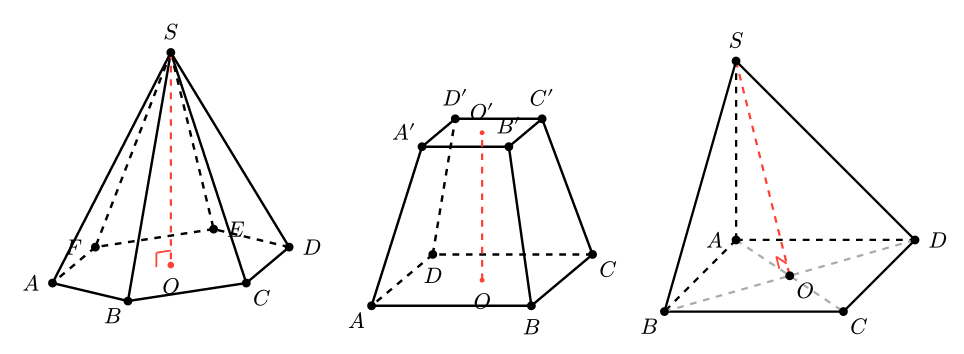

<h1 align="center">conic-toan</h1>

<p align="center">
  <em>Draw math figures, graphs and variation tables — and build exam papers.</em><br>
  A dependency-free Typst library for Vietnamese high-school mathematics.
</p>

<p align="center">
  
</p>

## English overview

`conic-toan` is a pure Typst library — **no external packages, no CeTZ** — for
authoring Vietnamese high-school mathematics material. Everything below is drawn
by the library itself and compiles offline.

**What it does**

- **Plane and solid geometry.** Triangles with their notable points and circles
  (incircle, circumcircle, orthocentre, excircles), pyramids, prisms, frustums,
  cones, cylinders and spheres, with hidden edges dashed automatically.
- **Function graphs.** Quadratic through rational functions, exponentials,
  logarithms, trigonometry, conics, tangent lines, areas between curves and
  feasible regions of linear systems. Labels carry *exact* values — a cubic's
  extremum prints as a surd, not as `10.48`.
- **Variation tables from coefficients.** `bbt-bac-ba(1, 0, -3, 1)` produces the
  full table for *y = x³ − 3x + 1*, covering every discriminant case.
- **Full worked solutions.** `khao-sat-ve-do-thi-ham-bac-ba(1, 0, -3, 1)` emits
  the domain, derivative, limits, monotonicity, extrema, variation table and
  graph — the entire textbook analysis from five numbers.
- **Statistics for the 2018 curriculum.** Frequency tables, histograms, ogives,
  bar charts, box plots and pie charts, plus fourteen summary statistics for raw
  and grouped data.
- **Solids of revolution.** A plane region, the rotation arrow, the resulting
  solid and its volume integral, side by side.
- **One source, three PDFs.** The same question file renders as a printable exam,
  a solution key, or 16:9 lecture slides. Eight question types, automatic answer
  keys and answer tables.

Function and parameter names are in unaccented Vietnamese (`doan`, `duong-tron`,
`bbt-bac-ba`), and the documentation below is in Vietnamese.

**Quick start**

```typst
#import "@preview/conic-toan:0.3.5": *

#do-thi-bac-ba(1, 0, -3, 1)          // graph with exact extrema
#bbt-bac-ba(1, 0, -3, 1)             // matching variation table
#hinh-chop-luc-giac-deu()            // hexagonal pyramid
```

<table>
  <tr>
    <td></td>
    <td></td>
  </tr>
  <tr>
    <td></td>
    <td></td>
  </tr>
  <tr>
    <td></td>
    <td></td>
  </tr>
</table>

One question source, rendered as lecture slides and as an exam paper:

<p align="center">
  <br>
  
</p>

Licensed under MIT. Full documentation in Vietnamese follows.

---

# Hệ thống bài giảng trình chiếu Toán THPT bằng Typst

Thuần Typst, **không phụ thuộc package nào** — biên dịch offline được ngay.

## Cài đặt

```typst
#import "@preview/conic-toan:0.3.5": *
```

Không cần tải gì thêm — Typst tự tải gói về khi biên dịch lần đầu.
Mã nguồn và các file mẫu: https://github.com/Thutran1891/conic-toan

## Yêu cầu & biên dịch

- Typst **0.13 trở lên** (cài trên Windows: `winget install --id Typst.Typst`).
- Biên dịch: `typst compile main.typ` — Xem trực tiếp khi soạn: `typst watch main.typ`.
- Khuyến nghị dùng VS Code + extension **Tinymist Typst** để xem trước tức thì.

## Cấu trúc

```
baigiang.typ            ← import MỘT file này là dùng được tất cả
main.typ                ← bài giảng demo trình diễn toàn bộ tính năng
lib/
  slide.typ             ← engine trình chiếu 16:9
  ve.typ                ← engine vẽ hình lõi (hệ toạ độ, điểm, đoạn, cung, góc…)
  hinh-phang.typ        ← hình học phẳng
  hinh-khong-gian.typ   ← hình học không gian
  do-thi.typ            ← đồ thị hàm số
  oxyz-toan.typ         ← TÍNH TOÁN trong Oxyz (vectơ, mặt phẳng, đường, mặt cầu)
  bang.typ              ← bảng biến thiên, bảng xét dấu
```

Tạo bài giảng mới: copy `main.typ` thành `bai-1.typ` rồi sửa nội dung.

## 1. Trình chiếu

```typst
#import "@preview/conic-toan:0.3.5": *
#show math.equation.where(block: false): it => math.display(it)

#show: bai-giang.with(
  tieu-de: [CHƯƠNG I. KHẢO SÁT HÀM SỐ],
  tieu-de-ngan: [Chương I. Khảo sát hàm số],  // tên bài rút gọn — LUÔN hiện
                    // trên dải đầu trang mọi slide (none => dùng nguyên tieu-de)
  phu-de: [Tiết 1: Sự đồng biến, nghịch biến],
  gv: "Kim Thu",
  ngay: "12/07/2026",
  lop: "Lớp 12A1",             // (tuỳ chọn) hiện trên TRANG BÌA
  mon: "Giải tích",            // (tuỳ chọn) môn/chương hiện trên TRANG BÌA
  logo: image("logo.png"),     // (tuỳ chọn) logo trường — PHẢI bọc image(...)
                               //   Đặt ảnh CÙNG thư mục file .typ này. KHÔNG
                               //   truyền chuỗi "logo.png" (image() chạy trong
                               //   package sẽ tìm ảnh cạnh package -> không thấy).
                               //   none = không có logo.
  kieu-bia: 1,                 // KIỂU TRANG BÌA — 1..5 hoặc tên:
                               //   1 "toi-gian"      Tối giản & Thanh lịch
                               //   2 "tre-trung"     Trẻ trung & Sáng tạo
                               //   3 "co-dien"       Chuẩn mực Học thuật Cổ điển
                               //   4 "chuyen-nghiep" Chuyên nghiệp & Khoa học
                               //   5 "ky-thuat"      Tiêu chuẩn Tài liệu Kỹ thuật
                               // Mỗi kiểu có TÔNG MÀU riêng; đặt mau-chinh/
                               // mau-nhan để GHI ĐÈ tông đó (đồng bộ cả bài).
  mau-chinh: rgb("#0f4c81"),   // đổi màu chủ đạo tuỳ ý (auto = theo kieu-bia)
  nen: "kem",                  // nền slide: "trang" (mặc định) | "kem"
                               // | "xanh-nhat" | "luc-nhat" | "xam"
                               // hoặc màu TUỲ Ý, ví dụ các tông sáng đẹp:
                               //   rgb("#fdf3e7")  cam nhạt
                               //   rgb("#fdf0f0")  hồng nhạt
                               //   rgb("#f6f0fb")  tím nhạt
                               //   rgb("#eefaf6")  bạc hà
                               //   rgb("#fbfbe8")  vàng chanh nhạt
  ti-le-chu: 1.0,              // HỆ SỐ PHÓNG CỠ CHỮ THÂN NỘI DUNG (toàn file):
                               // 1.0 giữ nguyên; 1.1 to hơn 10%; 0.9 nhỏ đi 10%.
                               // Chỉ co giãn thân + khung (định nghĩa/ví dụ/lời
                               // giải…); thanh tiêu đề, header, footer giữ nguyên.
  gian-dong: 1.0,              // HỆ SỐ GIÃN DÒNG — khoảng cách giữa các dòng
                               // (toàn file): 1.0 = mốc mặc định (trình chiếu
                               // 0.62em · A4 bài giảng 0.6em · A4 đề thi 0.65em);
                               // 1.25 giãn thêm 25%; 0.9 thu lại 10%. TĂNG khi
                               // phân số / căn thức / chỉ số nhiều tầng làm hai
                               // dòng liền nhau dính (thậm chí chồng) vào nhau.
  mau-cong-thuc: auto,         // MÀU MỌI CÔNG THỨC trong $...$ (toàn file):
                               // auto (mặc định) = thừa kế màu chữ — thân đen,
                               // tiêu đề/bìa trắng. Đặt màu, vd rgb("#0f4c81"),
                               // để nhuộm TẤT CẢ công thức theo màu đó.
)

#muc[1. Định nghĩa]                     // slide chuyển phần
#slide(tieu-de: [Khái niệm])[ ... ]     // slide thường
#trang-cam-on()
```

Khung nội dung (tự đánh số ví dụ/luyện tập):
`#dinh-nghia[...]`, `#dinh-ly[...]`, `#tinh-chat[...]`, `#vi-du[...]`,
`#loi-giai[...]`, `#chu-y[...]`, `#ghi-nho[...]`, `#nhan-xet[...]`, `#luyen-tap[...]`.

Bố cục: `#chia-cot(trai, phai)` hoặc `#chia-cot(a, b, c, ti-le: (2fr, 1fr, 1fr))`.
Các bước giải: `#buoc([Bước 1...], [Bước 2...])`.

## 2. Vẽ hình tự do (ve.typ)

Mọi hình vẽ nằm trong `#hinh(...)` với hệ toạ độ toán học (y hướng lên).
Để `h: auto` thì hai trục cùng tỉ lệ (nên giữ khi vẽ hình hình học).

```typst
#hinh(w: 7cm, xmin: -1, xmax: 6, ymin: -1, ymax: 5, ctx => {
  doan(ctx, (0, 0), (5, 0))                       // đoạn thẳng
  doan(ctx, (1, 1), (4, 3), dut: true, mau: red)  // nét đứt
  duong-gap-khuc(ctx, ((0,0), (1,2), (3,1), (5,4)), mau: blue, dut: true) // gấp khúc A-B-C-D, đứt thật từng đoạn
  diem(ctx, (2, 3), ten: $M$, huong: "tren")      // điểm + nhãn
  mui-ten(ctx, (0, 0), (3, 2))                    // mũi tên
  mui-ten-2-dau(ctx, (0, -0.6), (5, -0.6),        // mũi tên HAI ĐẦU: ghi số đo
      ten: [5 cm], vach: true)                    // chữ nằm giữa thân
  vecto(ctx, (0, 0), (2, 3), ten: $arrow(u)$)     // vectơ có tên
  vecto(ctx, (0, 0), (2, 3), dut: true)           // vectơ nét đứt (cạnh khuất), đầu mũi tên vẫn liền
  duong-tron(ctx, (3, 2), 1.5)                    // đường tròn
  cung(ctx, (0, 0), 2, tu: 0deg, den: 90deg)      // cung tròn
  goc(ctx, (0,0), (5,0), (3,4), ten: $alpha$)     // đánh dấu góc (cung + nhãn)
  goc(ctx, (0,0), (5,0), (3,4), so-do: true,      // tự ghi số đo góc (vd 60°)
      to: rgb(255, 170, 0, 70))                   // + tô màu hình quạt
  goc(ctx, (0,0), (5,0), (3,4), vach: 2)          // 2 vạch cắt ngang cung
  goc-vuong(ctx, (0,0), (5,0), (0,4))             // ký hiệu vuông góc
  ve-goc(ctx, (5,0), (0,0), (3,4), ten: $alpha$)  // = goc, nhưng ĐỈNH ở GIỮA (lối TikZ)
  ve-goc-vuong(ctx, (5,0), (0,0), (0,4))          // = goc-vuong, ĐỈNH ở GIỮA (lối TikZ)
  danh-dau(ctx, (0,0), (5,0), so: 2)              // 2 vạch "bằng nhau"
  danh-dau(ctx, (0,0), (5,0), so: 2, nghieng: 25deg) // vạch CHÉO "//"
  danh-dau(ctx, (0,0), (5,0), cheo: true)         // dấu ✕ (chéo nhau)
  ve-ham(ctx, x => x*x/4, mau: blue)              // đồ thị hàm bất kỳ
  to-vung(ctx, x => x*x/4, 0, 3)                  // tô miền dưới đồ thị
  nhan(ctx, (3, 4), [chú thích], huong: "phai")
})
```

Hướng nhãn: `"tren" | "duoi" | "trai" | "phai" | "tren-trai" | "tren-phai" | "duoi-trai" | "duoi-phai" | "giua"`.

**Mũi tên hai đầu — ghi số đo (`mui-ten-2-dau`)**

Kiểu đường ghi kích thước trong bản vẽ: hai đầu đều có mũi tên, số đo đặt ở
GIỮA thân (thân tự cắt chừa chỗ cho chữ, có nền lót nên nét không cắt qua chữ).

```typst
mui-ten-2-dau(A, B, ten: [5 cm])                  // chữ giữa thân
mui-ten-2-dau(A, B, ten: $2a$, vach: true)        // + vạch chặn hai đầu
mui-ten-2-dau(A, B, ten: $sqrt(29)$, trong: false)  // chữ đặt NGOÀI, trên đoạn
mui-ten-2-dau(A, B, ten: [dài], trong: false, ten-quay: true)  // chữ nằm dọc
mui-ten-2-dau(A, B, ten: $h$, le: 3pt)            // lùi hai đầu, hở khỏi vật đo
```

Đoạn ngắn không đủ chỗ chứa chữ thì hàm TỰ đưa chữ ra ngoài thân — không bao
giờ đè lên mũi tên. `nen: none` để bỏ nền lót, `dem:` nới chỗ hở quanh chữ.

**Nhãn có phân số / căn không còn bị nét vẽ cắt ngang**

Typst tính HỤT khung của công thức trong dòng: `measure($1/2$)` chỉ cho chiều
cao MỘT DÒNG CHỮ trong khi phân số vẽ ra cao gấp đôi và tràn cả trên lẫn dưới.
`nhan` (và mọi hàm gọi qua nó: nhãn đoạn, nhãn góc, nhãn sơ đồ cây, nhãn biểu
đồ…) nay đo thêm theo BIÊN NÉT CHỮ rồi bù đúng phần tràn đó. Chữ thường không
tràn nên bù 0 — bố cục các hình cũ giữ nguyên.

> **Vị trí ĐỈNH góc — hai lối viết.** `goc`/`goc-vuong` đặt đỉnh làm đối số
> **ĐẦU**: `goc-vuong(O, A, B)` là góc vuông **tại O**. TikZ thì viết đỉnh ở
> **GIỮA** (`pic angle = A--O--B`), nên có thêm `ve-goc(A, O, B)` và
> `ve-goc-vuong(A, O, B)` cho ai quen lối đó — cùng vẽ góc **tại O**, cùng bộ
> tuỳ chọn (`r`, `ten`, `so-do`, `so-cung`, `vach`, `to`, `mau`, `day`,
> `cach-nhan`), dùng lẫn nhau trong một hình cũng được. Viết nhầm thứ tự sẽ
> KHÔNG báo lỗi, chỉ vẽ ký hiệu sai đỉnh — nên chọn một lối rồi giữ nguyên.

### Đường xoắn ốc & góc lượng giác (07/2026)

`xoan-oc` vẽ xoắn ốc Archimedes (bán kính tăng đều theo góc), quét được **nhiều
vòng**; `goc-luong-giac` là lối gọi tắt cho hình góc lượng giác $(OA, OM)$ của
SGK 11 — tự tính chiều quay và số vòng.

```typst
#hinh(xmin: -3, xmax: 3, ymin: -3, ymax: 3, w: 6cm, ctx => {
  let O = (0, 0)
  let A = (2.2, 0)
  let M = toa-cuc(O, 2.2, -70)
  cac-doan((O, A), (O, M))
  cac-diem((O, $O$, "above-left"), (A, $A$, "above"), (M, $M$, "right"))
  goc-luong-giac(O, A, M, chieu: "am", vong: 1)   // (OA, OM) = -430°
})
```

`goc-luong-giac(O, A, M, ...)`

| Tham số                            | Ý nghĩa                                                                                         |
| ----------------------------------- | ------------------------------------------------------------------------------------------------- |
| `chieu`                           | `"duong"` (ngược kim đồng hồ, mặc định) · `"am"` (cùng kim đồng hồ)              |
| `vong`                            | số vòng quay THÊM trước khi dừng ở tia OM (0, 1, 2, …)                                    |
| `so-do`                           | `true` = tự ghi số đo (vd −430°) cạnh mũi tên; `ten:` được ưu tiên               |
| `r`, `buoc`, `r-cuoi`         | bán kính đầu, khoảng cách 2 vòng, bán kính cuối (`auto` = tính theo chiều dài tia) |
| `mau`, `day`, `dut`, `kich` | màu (mặc định`blue`), độ dày, nét đứt, cỡ đầu mũi tên                            |
| `huong`, `cach`, `mau-ten`    | vị trí nhãn số đo quanh điểm cuối                                                         |

`xoan-oc(O, tu: 0deg, den: 1080deg, r: 0.1, buoc: 0.85, mau: blue)` — dùng khi
cần xoắn ốc thuần: `den > tu` quay ngược kim đồng hồ, `den < tu` quay cùng kim
đồng hồ, `r-cuoi:` đặt bán kính cuối (nhỏ hơn `r` thì xoắn vào trong),
`mui-ten:` nhận `true`/`"cuoi"`/`"dau"`/`"ca-hai"`/`false`, `ten:` ghi nhãn ở
điểm cuối.

### `cac-doan` — vẽ nhiều nét trong MỘT lệnh (kiểu `\draw` của TikZ) (07/2026)

```typst
cac-doan(A, B)                    // một đoạn
cac-doan(A, B, C, D)              // các điểm liền nhau -> gấp khúc A-B-C-D
cac-doan((A, B), (C, D))          // mỗi MẢNG điểm là một nét rời
cac-doan(
  duong(B, C, D, S, dong: true),               // nét khép kín
  duong(A, B, dut: true), duong(A, D, dut: true),
  duong(B, D, mau: red, dut: true, ten: $d$, tai: 0.35),
  day: 1.1pt,                                  // kiểu CHUNG cho mọi nét
)
```

`duong(...)` khai báo một nét có kiểu riêng (đè lên kiểu chung). Tuỳ chọn dùng
được ở cả `duong(...)` lẫn `cac-doan(...)`: `mau`, `day`, `dut`, `dong` (khép
kín), `to` (tô màu — tự khép kín), `mui-ten` (đầu mũi tên ở điểm cuối), và bộ
nhãn `ten`/`tai`/`huong`/`cach`/`ten-quay`/`mau-ten` (nhãn đặt tại tỉ lệ `tai`
tính theo TỔNG chiều dài nét).

### `duong-luon` — đường cong uốn lượn (kiểu `.. controls ..` của TikZ) (07/2026)

```typst
duong-luon(A, B, C, D)                            // trơn TỰ ĐỘNG qua các điểm neo
duong-luon(A, dieu-khien(c1, c2), B)              // Bézier bậc ba: 2 điểm điều khiển
duong-luon(
  (0,0), dieu-khien((1,2),(2,2)),
  (3,0), dieu-khien((4,-2),(5,-2)), (6,0),        // nhiều đoạn nối tiếp (sóng)
  mau: teal, day: 1.4pt, mui-ten: true,
)
duong-luon(A, B, C, dong: true, to: blue.lighten(85%))   // khép kín + tô
```

Liệt kê các **điểm neo**; xen `dieu-khien(c1, c2)` giữa hai neo để đặt điểm điều
khiển như `.. controls (c1) and (c2) ..` của TikZ. Đoạn KHÔNG có `dieu-khien` thì
tự làm mềm bằng Catmull-Rom (đường trơn đi qua đúng các neo — khỏi tính tay).
`dieu-khien(c1)` = một điểm điều khiển (c₂ = c₁); để `auto` một thành phần thì
thành phần đó tự tính. Tuỳ chọn: `mau`, `day`, `dut`, `dong` (khép kín), `to`
(tô), `mui-ten`, `kich`, bộ nhãn `ten`/`tai`/`huong`/`cach`/`ten-quay`/`mau-ten`
(đặt theo tỉ lệ độ dài, như `cac-doan`), `n` (số mẫu mỗi đoạn — tăng cho mượt).
`diem-luon(...)` TRẢ VỀ mảng điểm mẫu (không vẽ) để tái dùng — ví dụ đưa vào
`nhan-cong` cho chữ bám đúng đường.

### `nhan-cong` — nhãn chữ bám theo một đường cong (07/2026)

```typst
// chữ chạy dọc nửa trên đường tròn lượng giác
nhan-cong(diem-cung((0,0), 2.2, 2.2, 160deg, 20deg),
          "DUONG TRON LUONG GIAC", co: 13pt, mau: blue, can: "giua", tu: 0.5)
// chữ bám sóng Bézier (lấy đúng mẫu của đường đã vẽ)
let s = diem-luon((0,0), dieu-khien((1,2),(2,2)), (3,0), n: 24)
nhan-cong(s, "song song", co: 12pt, phia: "duoi")
```

Đặt từng ký tự dọc theo `duong` (mảng điểm toạ độ toán — lấy từ `diem-luon`,
`diem-cung`, `lay-mau`, hay bất kỳ dãy điểm nào), tự xoay tiếp tuyến và canh theo
độ dài cung. `chu` nên là chuỗi `"..."`. Tuỳ chọn: `tu` (vị trí bắt đầu theo tỉ
lệ 0..1), `can` (`"trai"`/`"giua"`/`"phai"`), `khoang` (giãn ký tự), `co` (cỡ
chữ), `mau`, `phia` (`"tren"`/`"duoi"`/`"giua"` so với đường), `cach` (hở chữ↔đường),
`dao: true` (đảo chiều khi đường vẽ từ phải sang trái, để chữ đọc xuôi).

### `cac-diem` — chấm và đặt tên nhiều điểm trong MỘT lệnh (07/2026)

```typst
cac-diem(
  (A, $A$, "below-left"), (B, $B$, "below-right"), (C, $C$, "above"),
  mau: blue, bk: 2.2pt,
)
```

Mỗi đối số là một điểm, viết theo một trong bốn dạng:

- `A` — chỉ chấm, không nhãn;
- `(A, $A$)` — chấm + nhãn, hướng lấy theo `huong` chung;
- `(A, $A$, "left")` — thêm hướng riêng;
- `(A, $A$, "left", red)` — thêm màu riêng (áp cho cả chấm lẫn chữ).

Tuỳ chọn chung: `mau`, `bk` (bán kính chấm), `huong`, `cach` (nhãn cách chấm),
`mau-ten` (`auto` = theo màu chấm). Lệnh `diem` cũng nhận thêm `cach` và
`mau-ten` như trên.

### Tiếp tuyến của đồ thị tại một điểm (07/2026)

```typst
tiep-tuyen(f, 1.5)                                  // tiếp tuyến tại x = 1,5
tiep-tuyen(f, 1.5, ten: auto, ten-diem: $M$, giong: true)   // + phương trình
tiep-tuyen(f, (-1, 2), mau: green, dut: true)       // nhiều tiếp điểm một lệnh
tiep-tuyen(f, 0, dai: 1.4, ten: $Delta$)            // đoạn ngắn quanh tiếp điểm
let k = dao-ham(f, 1.5)                             // chỉ lấy hệ số góc
```

Hệ số góc tính bằng **đạo hàm số** nên dùng được cho mọi hàm viết bằng closure
(kể cả hàm hợp, hàm căn, lượng giác). Tuỳ chọn: `dai` (`auto` = kéo hết khung,
tự cắt gọn theo cửa sổ; hoặc nửa độ dài theo trục Ox), `cham`/`mau-cham` (chấm
tiếp điểm), `ten-diem`/`huong-diem`, `ten` (`auto` = tự ghi `y = kx + m` rút
gọn), `tai`/`huong-ten`/`cach`/`ten-quay` (vị trí & kiểu nhãn), `giong` (kẻ
đường gióng đứt từ tiếp điểm về hai trục), `mau`, `day`, `dut`.

### Nhãn chú thích ngay trên đoạn (`doan`) (07/2026)

```typst
doan(A, B, ten: [6 cm])                          // giữa đoạn, tự đặt vuông góc
doan(A, B, ten: $h$, tai: 0.7, huong: "right", cach: 4pt)
doan(B, C, ten: [cạnh huyền], ten-quay: true)    // chữ nằm dọc theo đoạn
```

- `tai`: vị trí nhãn theo tỉ lệ từ A đến B (0 = tại A, 1 = tại B, mặc định 0.5).
- `huong`: `auto` (mặc định) = vuông góc, phía trên đoạn — đoạn thẳng đứng thì
  ra bên trái; hoặc tên hướng như trên, hoặc vectơ `(dx, dy)` tự chọn.
- `ten-quay: true`: chữ xoay theo đoạn và luôn đọc xuôi (không lộn ngược).
- `mau-ten`: mặc định lấy theo màu đoạn.

File thử: `thu-cac-doan.typ`.

Hàm tính toán: `trung-diem`, `khoang-cach`, `chia(A, B, t)` (t = tỉ lệ AM/AB,
ngoài [0, 1] là điểm trên đường kéo dài), `hinh-chieu(P, A, B)`,
`tam-ngoai-tiep`, `tam-noi-tiep`, `truc-tam(A, B, C)` (giao ba đường cao),
`tam-bang-tiep(A, B, C)` → `(J, r)` (tâm + bán kính đường tròn bàng tiếp
**trong góc A**; muốn góc B thì gọi `tam-bang-tiep(B, C, A)`),
`tiep-diem`, `giao-hai-duong-tron`,
`giao-duong-thang(A, B, C, D)` (giao 2 đường thẳng AB, CD),
`giao-duong-thang-duong-tron((A, B), (O, r))` (giao đường thẳng AB với đường
tròn (O; r) → MẢNG điểm: rỗng nếu không cắt, 1 điểm nếu tiếp xúc, 2 điểm nếu
cắt), `dung-diem(A, B, goc, r)` (dựng điểm M: tia AM là tia AB quay quanh A một
góc lượng giác `goc` (độ, dương ngược kim đồng hồ) và AM = `r`).

Giao với đường cong (07/2026): `giao-ham(f, g, tu, den)` trả về MẢNG giao điểm
của 2 đồ thị y = f(x), y = g(x) trên [tu, den]; đường thẳng qua 2 điểm đổi thành
hàm bằng `ham-qua-2-diem(A, B)`; đường đứng x = k thì giao là `(k, f(k))`.
Ví dụ đầy đủ: `vi-du-ve-tu-do.typ`.

### KHÔNG cần gõ `ctx` nữa (07/2026)

Trong thân `#hinh(...)` và trong `them: ctx => ...` của **mọi** hình/đồ thị
dựng sẵn, các lệnh vẽ tự lấy khung hình đang vẽ — **bỏ hẳn `ctx`**:

```typst
them: ctx => {
  doan(M, N, mau: blue, dut: true)
  ve-ham(g, mau: red)
  diem(A, mau: red, ten: $A$)
}
```

- Lối cũ `doan(ctx, M, N)` **vẫn chạy y nguyên** (đối số đầu là `ctx` thì gọi
  thẳng) — bài soạn cũ không phải sửa một chữ nào.
- **Ngoại lệ vẫn phải truyền `ctx`**: các hàm TRẢ VỀ GIÁ TRỊ chứ không vẽ —
  `toa`, `toa-pt`, `toa-nguoc`, `goc-truc`, `ctx-quay`, `ctx-tinh-tien`.
  Ví dụ nhãn nghiêng: `nhan(P, $d$, quay: goc-truc(ctx, A, B))`.
- Gọi lệnh vẽ ở NGOÀI khung hình sẽ báo lỗi rõ ràng: *"Hàm vẽ cần khung
  hình: đặt lệnh trong thân #hinh(...) hoặc trong them: ctx => ..."*.
- Vẫn giữ `ve-voi(ctx)` (bộ hàm gắn sẵn ctx, lấy bằng
  `let (doan, diem) = ve-voi(ctx)`) cho ai muốn đặt tên riêng, hoặc khi vẽ
  trên khung đã quay: `ve-voi(ctx-quay(ctx, 30deg))`.

Danh sách 49 lệnh được gọi ngầm: nguyên thuỷ của `ve.typ`
(`doan`, `diem`, `nhan`, `mui-ten`, `vecto`, `duong-cong`, `duong-tron`,
`elip`, `cung`, `goc`, `goc-vuong`, `ve-goc`, `ve-goc-vuong`, `danh-dau`, `ve-ham`, `to-vung`,
`gach-mien`, `gach-vung`, `ve-mien`, `mui-ten`, `dau-mui-ten`…),
hệ trục của `do-thi.typ` (`truc`, `luoi`, `vach-chia`, `he-truc`, `giong`,
`nhan-pi`), toàn bộ `hinh-phang.typ` (`tam-giac`, `duong-cao`, `tu-giac`…)
và nhóm Oxyz (`diem-oxyz`, `doan-oxyz`, `vecto-oxyz`, `giong-oxyz`).

Các hàm KHÔNG cần `ctx` từ trước (`trung-diem`, `chia`, `hinh-chieu`,
`giao-ham`, `ham-qua-2-diem`, `so-toan`, `mien-tron`, `giao`/`hop`/`bu`…)
vẫn gọi thẳng như cũ.

> `giao-ham` chỉ **TÍNH**, không vẽ ⇒ **không truyền `ctx`**; kết quả đem cho
> `diem`/`nhan` mới ra hình. Cận nhận cả 2 lối viết: `giao-ham(f, g, -3, 2)`
> hoặc `giao-ham(f, g, tu: -3, den: 2)`. Lỡ gõ `giao-ham(ctx, f, g, ...)` thì
> `ctx` được bỏ qua chứ không báo lỗi. Quét qua tiệm cận đứng cũng an toàn:
> chỗ hàm "nhảy" bị loại khỏi kết quả.
>
> ```typst
> them: ctx => {
>   let f = x => (x + 2)/(x + 1)
>   let g = x => x + 1
>   ve-ham(g, mau: red)
>   for P in giao-ham(f, g, -3, 2) { diem(P, mau: red, bk: 2.2pt) }
> }
> ```

## 3. Hình phẳng (hinh-phang.typ)

```typst
#hinh(w: 7cm, xmin: -1, xmax: 6, ymin: -1, ymax: 5, ctx => {
  let (A, B, C) = ((0.5, 0), (5.5, 0), (3.5, 4))
  tam-giac(ctx, A, B, C)                          // nhãn đỉnh tự đặt
  duong-cao(ctx, C, A, B, ten-chan: $H$)
  trung-tuyen(ctx, A, B, C, ten-chan: $M$)
  phan-giac(ctx, B, C, A, ten-chan: $D$)
  phan-giac(ctx, B, C, A, vach: 1)                // 1 vạch: hai góc BẰNG NHAU
  phan-giac(ctx, B, C, A, so-cung: 2)             // hoặc 2 cung đồng tâm
  trung-truc(ctx, A, B)
  duong-tron-ngoai-tiep(ctx, A, B, C)             // tâm O tự tính
  duong-tron-noi-tiep(ctx, A, B, C)
})
```

**Đường tròn ngoại tiếp ĐA GIÁC** — `duong-tron-ngoai-tiep` nhận cả một MẢNG
đỉnh, không chỉ tam giác. Từ 4 đỉnh trở lên, tâm và bán kính khớp theo bình
phương bé nhất (đa giác nội tiếp được vẫn cho ĐÚNG đường tròn của nó).

```typst
#let P = range(5).map(i => toa-cuc((0, 0), 1, 90 + i * 72))    // ngũ giác đều
#duong-tron-ngoai-tiep(P, canh: true, ban-kinh: true, ten-r: $R$)
#let (O, R) = tron-qua-diem(P)    // TRẢ VỀ (tâm, bán kính), không vẽ
```

Nhãn tâm tự chọn phía THOÁNG nhất nên không rơi lên cạnh đa giác (`huong-tam:`
để chỉ định tay). `ban-kinh: true` cũng tự chọn đỉnh mà bán kính không nằm đè
lên cạnh — vd tam giác vuông có tâm ở giữa cạnh huyền thì bán kính vẽ tới đỉnh
góc vuông chứ không trùng cạnh huyền.

**Khung vừa khít hình (`khung-vua`)** — đường tròn ngoại tiếp thường chìa ra
ngoài đa giác nên rất dễ tràn khỏi `#hinh`. `khung-vua` trả về cửa sổ toạ độ
vừa khít, rải thẳng vào `#hinh`:

```typst
#let (O, R) = tron-qua-diem((A, B, C))
#hinh(w: 5cm, ..khung-vua((A, B, C), (O, R)), ctx => {
  tam-giac(ctx, A, B, C)
  duong-tron-ngoai-tiep(ctx, A, B, C, ban-kinh: true, ten-r: $R$)
})
```

Mỗi đối số là một ĐIỂM `(x, y)`, một ĐƯỜNG TRÒN `(tâm, bán kính)`, hoặc một
MẢNG gồm các thứ đó; `le:` chừa lề theo tỉ lệ cạnh lớn (mặc định `0.12`).

Sẵn có thêm: `tu-giac`, `hinh-binh-hanh` (biết 3 đỉnh), `hinh-chu-nhat`,
`hinh-thang`, `tiep-tuyen-tu-diem(ctx, O, r, M)` (hai tiếp tuyến + góc vuông),
`tiep-tuyen-tai-diem(O, r, M, dai: auto, dut: false)` (tiếp tuyến TẠI điểm M
trên đường tròn — đoạn qua M vuông góc OM; `dai` = nửa độ dài đoạn),
`duong-tron-luong-giac(so-do: 55deg)` (hình hoàn chỉnh, tự tạo khung).

Nhãn theo GÓC LƯỢNG GIÁC — `nhan-goc(..muc)` đặt nhãn nhiều điểm, phía đặt nhãn
xác định bằng góc (thay tên hướng): mỗi mục `(P, nội-dung, goc)` /
`(P, nội-dung, goc, ban-kinh)` / `(P, nội-dung, goc, ban-kinh, mau)`, `goc` số
trần = độ (dương ngược kim đồng hồ), `ban-kinh` là độ dài trang (điểm→nhãn).
Ví dụ `nhan-goc((A, $A$, 0), (B, $B$, 120, 8pt), (C, $C$, 240, 8pt, red))`.

`duong-tron-ngoai-tiep` và `duong-tron-noi-tiep` nhận thêm `dut: true` để vẽ
đường tròn bằng NÉT ĐỨT. File thử các hàm này: `thu-hinh-tron-moi.typ`.

**Trực tâm & đường tròn bàng tiếp (07/2026)** — trọn bộ công cụ tam giác:

```typst
ve-truc-tam(A, B, C)                  // 3 đường cao + ký hiệu vuông góc + H
ve-truc-tam(A, B, C, canh: false,     // không vẽ lại cạnh tam giác
  ten: $H$, ten-chan: ($H_A$, $H_B$, $H_C$))
duong-tron-bang-tiep(A, B, C)                    // bàng tiếp TRONG GÓC A
duong-tron-bang-tiep(A, B, C, ban-kinh: true,    // + bán kính tới BC
  ten-tam: $J_A$, ten-tiep: ($X$, $Y$, $Z$))
duong-tron-bang-tiep(B, C, A)                    // bàng tiếp trong góc B
```

`ve-truc-tam` tự kéo dài cạnh bằng nét đứt khi tam giác tù (chân đường cao rơi
ra ngoài cạnh); `duong-tron-bang-tiep` tự kéo dài AB, AC tới tiếp điểm
(`keo-dai: false` để tắt).

Tam giác đặc biệt (tự vẽ ký hiệu vuông góc, vạch cạnh bằng nhau):

```typst
tam-giac-deu(ctx, A, canh)              // đều
tam-giac-vuong(ctx, A, a, b)            // vuông tại A, hai cạnh a × b
tam-giac-can(ctx, A, canh-day, chieu-cao)   // cân tại C
tam-giac-vuong-can(ctx, A, canh)        // vuông cân tại A
```

## 4. Hình không gian (hinh-khong-gian.typ)

Các hình hoàn chỉnh, nét khuất tự vẽ đứt theo quy ước SGK:

```typst
#hinh-chop-tam-giac()                        // S.ABC
#hinh-chop-tu-giac(duong-cao: "tam", duong-cheo: true)   // chóp đều S.ABCD
#hinh-chop-tu-giac-thuong(duong-cheo: true)  // chóp tứ giác thường (góc nhìn khác)
#hinh-chop-day-hinh-thang(duong-cheo: true)  // chóp đáy hình thang
#hinh-chop-tu-giac(duong-cao: "dinh-a")      // SA ⊥ đáy
#hinh-hop(duong-cheo: true)                  // hộp + đường chéo AC′ (nghieng: độ xiên)
#hinh-hop-chu-nhat(duong-cheo: true)         // hộp chữ nhật dài (nhìn thẳng, nghieng: 0)
#hinh-lap-phuong()
#hinh-lang-tru-tam-giac()
#hinh-non()  #hinh-tru()  #hinh-cau()
#truc-oxyz(don-vi: true)

// Hình chóp đặc biệt
#hinh-chop-tam-giac-deu(trung-tuyen: true)  // S.ABC đều, SO ⊥ đáy tại trọng tâm
#hinh-chop-tu-giac-deu()                    // S.ABCD đều, 2 đường chéo + SO
#hinh-chop-tam-dien-vuong()                 // O.ABC: OA, OB, OC đôi một vuông góc
#hinh-chop-day-tam-giac-vuong()             // ABC vuông tại B, SA ⊥ (ABC)
#hinh-chop-day-chu-nhat()                   // đáy chữ nhật, SA ⊥ đáy
```

**Vẽ thêm lên hình có sẵn** bằng `them` — nhận `ctx` và từ điển đỉnh `d`
(`d.S`, `d.A`, `d.B`, `d.C`, `d.D`, hình hộp/lăng trụ có `d.A1` = A′…):

```typst
#hinh-chop-tu-giac(them: (ctx, d) => {
  let M = trung-diem(d.S, d.C)
  diem(ctx, M, ten: $M$, huong: "phai", mau: blue)
  doan(ctx, d.B, M, mau: blue, dut: true)
  da-giac(ctx, (d.A, M, d.B), to: rgb(30,100,200,40))   // thiết diện mờ
})
```

## 5. Đồ thị hàm số (do-thi.typ)

**Vẽ nhanh nhất** — chỉ cần công thức và màu, cửa sổ tự chọn:

```typst
#ve-do-thi(x => x*x*x - 3*x, mau: red)
#ve-do-thi(x => calc.sin(2*x) + x/2, mau: purple, ten: $y = sin 2x + x/2$)
#ve-do-thi(x => calc.exp(x) - 2, mau: blue, xmin: -3, xmax: 2)
```

(Hàm cần xác định trên đoạn vẽ; hàm có tiệm cận đứng dùng `do-thi-phan-thuc`.)

Đồ thị dựng sẵn (tự chọn cửa sổ đẹp, gióng điểm đặc biệt):

```typst
#do-thi-bac-nhat(2, -1)                      // y = 2x − 1
#do-thi-bac-hai(1, -2, -1)                   // parabol, gióng đỉnh
#do-thi-bac-ba(1, -3, 0, 2)                  // gióng 2 cực trị
#do-thi-trung-phuong(1, -2, 0)
#do-thi-phan-thuc(2, -1, 1, -1)              // y=(2x−1)/(x−1), 2 tiệm cận đứt đỏ
#do-thi-mu(2)   #do-thi-log(2)
#do-thi-sin()   #do-thi-cos()   #do-thi-tan()   // nhãn π/2, π, 2π
#do-thi-can()
```

Mọi đồ thị dựng sẵn đều nhận `luoi-o: true` (lưới ô vuông mờ) và `vach: true`
(vạch chia + số trên hai trục; riêng sin/cos/tan chỉ có `luoi-o` vì trục hoành
đã ghi theo π). Khi bật `vach`, nên đặt `giao-ox: none, giao-oy: none` để nhãn
giao trục không chồng lên số vạch.

Vẽ tay trong `#hinh`: `he-truc(ctx)` gộp lưới + trục + vạch chia + số một lệnh:

```typst
#hinh(xmin: -4, xmax: 4, ymin: -3, ymax: 3, ctx => {
  he-truc(ctx)               // tuỳ chọn: luoi-o, vach, so, buoc-x, buoc-y, ten-x...
  ve-ham(ctx, x => x*x - 2, mau: blue)
})
```

Hàm bất kỳ + vẽ chồng qua `them`:

```typst
#do-thi-ham(x => calc.abs(x*x - 2*x), xmin: -2, xmax: 4, ymin: -1, ymax: 4,
  ten: $y = |x^2 - 2x|$, luoi-o: true, vach: true,
  them: ctx => {
    ve-ham(ctx, x => 1.5, mau: red, dut: true)   // đường y = m
    giong(ctx, (3, 3))                            // gióng điểm về 2 trục
  })
```

### Nhiều đồ thị trên cùng một hệ trục

Mỗi hàm gói bằng `ham(...)`; `giao-diem: auto` chấm đỏ giao điểm từng cặp:

```typst
#do-thi-nhieu-ham(
  ham(x => x*x - 2, mau: blue, ten: $y = x^2 - 2$),
  ham(x => x, mau: red, ten: $y = x$, dut: true, tai: -2),  // tai: hoành độ đặt nhãn
  xmin: -3, xmax: 3, ymin: -3, ymax: 4,
  giao-diem: auto,
)
```

### Miền nghiệm BPT / hệ BPT bậc nhất hai ẩn

Quy ước SGK: gạch phần **không** là miền nghiệm; biên nét đứt nếu BPT ngặt.
Mỗi BPT `a·x + b·y (dau) c` khai báo bằng `bpt(a, b, c, dau: "<=")`:

Nhãn `ten:` mặc định **NẰM NGHIÊNG theo chiều đường thẳng** (tự đọc xuôi, không
lộn ngược); đặt tại điểm `ten-tai:` (0..1 dọc đoạn nhìn thấy). `huong-ten:` chọn
**phía** đặt nhãn so với đường: `"above"` (trên) hoặc `"below"` (dưới). Muốn chữ
nằm ngang như cũ thì `nghieng-ten: false` (khi đó `huong-ten` nhận mọi hướng
`"above"/"below"/"left"/"right"/…`). Khoảng cách tới đường: `cach-ten:`.

Kiểu gạch chéo đặt được RIÊNG cho từng BPT (giống `mau-gach`): `goc-gach:` (góc)
và `buoc-gach:` (bước) trong `bpt(...)` — `auto` = theo giá trị chung khai ở
`mien-nghiem`.

```typst
#mien-nghiem(bpt(4, 5, -8, dau: "<"), giao-truc: auto)   // 4x + 5y < −8
#mien-nghiem(                                            // hệ BPT + tô miền
  bpt(3, -2, -9, mau: red, ten: $3x - 2y = -9$, ten-tai: 0.7, huong-ten: "above"),
  bpt(-3, 5, 18, mau: green.darken(25%), ten: $-3x + 5y = 18$, huong-ten: "below",
    goc-gach: 135deg),                                   // gạch riêng đường này
  to-mien: rgb(40, 90, 200, 35),
  xmin: -7.5, xmax: 2.5, ymin: -1.5, ymax: 5,
)
```

### Diện tích hình phẳng giới hạn bởi 2 đồ thị

`g` mặc định là trục hoành; `a, b: auto` = tự lấy giao điểm ngoài cùng
(trong phạm vi `tu..den`); miền tô tự tách tại giao điểm ở giữa:

```typst
#dien-tich-2-ham(x => x*x, g: x => x + 2)              // tự tìm giao điểm
#dien-tich-2-ham(x => calc.sin(x), a: 0.5, b: 2.6)     // trên đoạn [a, b]
#dien-tich-2-ham(x => x*x - 1, g: x => -x - 1, a: -2, b: 1.5,
  ten-f: $y = x^2 - 1$, ten-g: $y = -x - 1$, mau-to: rgb(200, 60, 60, 60))
```

Cần vẽ tay trong `them` của đồ thị khác: `to-vung-2-ham(ctx, f, g, a, b)`
(và `to-vung(ctx, f, a, b)` với trục hoành); gạch chéo đa giác lồi:
`gach-mien(ctx, cac-dinh)`.

### Khối tròn xoay (07/2026)

`#khoi-tron-xoay(f, a, b)` vẽ **hai hình cạnh nhau**: trái là miền phẳng đã tô
màu (giới hạn bởi `y = f(x)`, trục hoành, `x = a`, `x = b`), phải là khối tròn
xoay sinh ra khi quay miền đó quanh `Ox` — nét khuất tự vẽ đứt.

```typst
#khoi-tron-xoay(x => calc.sqrt(x), 0, 4, ten-ham: $y = sqrt(x)$, the-tich: true)
#khoi-tron-xoay(x => 0.35*x*x + 0.5, 0, 3, mat-cat: 2)   // thiết diện tại x = 2
#khoi-tron-xoay(x => 1.6, 0, 3, g: x => 0.7)             // khối rỗng (vành khăn)
#khoi-tron-xoay(y => 0.6 + 0.5*y, 0, 3, truc: "Oy")      // quay quanh Oy
#khoi-tron-xoay(f, a, b, hien: "khoi")                   // chỉ lấy khối 3D
#khoi-tron-xoay(f, a, b, hien: "mien")                   // chỉ lấy miền phẳng
```

Tham số: `truc` (`"Ox"` mặc định | `"Oy"` — khi đó `f` là bán kính theo `y`),
`hien` (`"ca-hai"` | `"mien"` | `"khoi"`), `g` (bán kính trong → vành khăn),
`mat-cat: c` (vẽ đĩa/vành thiết diện tại `c` + bán kính, kèm `ten-ban-kinh`,
`ten-mat-cat`), `the-tich: true` (ghi công thức `V = π∫f²dx` dưới hình),
`w` (bề rộng hình khối), `k` (độ "dẹt" của elip, mặc định 0.26), `ten-ham`,
`ten-ham-trong`, `ten-a`, `ten-b`, `ten-goc`, `nhan-giua`, `mau`, `mau-to`,
`mau-mien`, `them` / `them-mien` (vẽ chồng vào hình khối / hình miền).

Vẽ riêng vào một khung `#hinh` có sẵn: `ve-khoi-xoay(f, a, b, ...)` và
`ve-mien-xoay(f, a, b, ...)` (thêm `ngang: false` cho trục quay thẳng đứng).

Gạch chéo **miền bất kì** (biên cong, hợp/giao/hiệu tuỳ ý): khai báo mỗi hình
đúng MỘT lần bằng `mien-tron(O, r)` / `mien-elip(O, a, b, quay:)`, vẽ biên bằng
`ve-mien(ctx, m)`, gạch bằng `gach-vung` + phép tập hợp `giao`/`hop`/`bu` —
đổi tâm/bán kính một chỗ là vẽ và gạch tự khớp. Ví dụ Ven $(A sect B) without C$:

```typst
#hinh(w: 4.5cm, xmin: -2, xmax: 2, ymin: -2, ymax: 2, ctx => {
  let A = mien-tron((-0.5, 0.3), 0.9)
  let B = mien-tron((0.5, 0.3), 0.9)
  let C = mien-tron((0, -0.5), 0.5)      // bán kính khác nhau thoải mái
  ve-mien(ctx, A)
  ve-mien(ctx, B)
  ve-mien(ctx, C)
  gach-vung(ctx, giao(A, B, bu(C)), mau: black, day: 0.4pt, buoc: 4.5pt)
})
```

`giao`/`hop`/`bu` lồng nhau tuỳ ý: `hop(A, B)`, `giao(A, hop(B, C))`,
`bu(hop(A, B))`... Miền không phải tròn/elip thì `gach-vung` vẫn nhận hàm
`P => true/false` như cũ; helper điểm: `trong(P, m)` (nhận miền hoặc hàm),
`trong-tron(P, O, r)`, `trong-elip(P, O, a, b, quay:)`.

Tuỳ chọn: `goc:` (hướng vạch, mặc định 45°), `buoc:` (khoảng cách vạch),
`n:` (số mẫu mỗi vạch — biên càng mịn).

### Phép quay & tịnh tiến (ve.typ)

Elip xoay: `elip(ctx, O, a, b, quay: 30deg)` (dương = ngược chiều kim đồng hồ,
xoay quanh tâm O); kiểm tra điểm cùng góc: `trong-elip(P, O, a, b, quay: 30deg)`.
`cung` và `cung-elip` cũng nhận `quay:` (xoay cung quanh tâm).

Quay/tịnh tiến **cả cụm hình** — mọi hàm vẽ theo điểm (doan, da-giac, tam-giac,
duong-tron, diem, nhan, vecto...) đều tự biến đổi khi vẽ bằng ctx đã bọc:

```typst
#hinh(w: 7cm, xmin: -1, xmax: 8, ymin: -1, ymax: 4, ctx => {
  let ve-hinh = c => {
    tam-giac(c, (0, 0), (2, 0), (0.6, 1.6))
    duong-tron(c, (1, 0.55), 0.4, mau: blue)
  }
  ve-hinh(ctx)                                  // hình gốc
  ve-hinh(ctx-quay(ctx, 35deg, tam: (0, 0)))    // ảnh quay quanh O
  ve-hinh(ctx-tinh-tien(ctx-quay(ctx, 35deg, tam: (0, 0)), (4.5, 0.5)))
})                                              // quay trước, tịnh tiến sau
```

Biến đổi điểm lẻ: `quay-diem(P, tam, goc)`, `tinh-tien-diem(P, v)`.

Toạ độ CỰC kiểu TikZ — `toa-cuc(tam, bk, goc)` trả về điểm cách `tam` một
khoảng `bk`, quay góc `goc` (số trần = ĐỘ, nhận cả `30deg`; dương = ngược
kim đồng hồ). TikZ `(30:2)` ⇔ `toa-cuc((0,0), 2, 30)`. Ví dụ lục giác đều:

```typst
#let dinh = range(6).map(k => toa-cuc((0, 0), 2.6, 60 * k))
#duong-gap-khuc(ctx, dinh, dong: true)
```

Lưu ý: `gach-vung` mô tả miền theo toạ độ GỐC của khung (không qua ctx-quay);
riêng elip xoay đã có `trong-elip(..., quay:)` tương ứng.

### Sơ đồ cây xác suất (so-do-cay.typ)

Cây sâu tuỳ ý; nút lá có ô kết quả bên phải; màu ô tự đổi theo cấp:

```typst
#so-do-cay(
  goc: $1$,
  nhanh: (
    nut($A$, xs: $1/6$, con: (
      nut($B$, xs: $1/2$, kq: $A B: 1/12$),
      nut($overline(B)$, xs: $1/2$, kq: $A overline(B): 1/12$),
    )),
    nut($overline(A)$, xs: $5/6$, con: (
      nut($B$, xs: $1/3$, kq: $overline(A) B: 5/18$),
      nut($overline(B)$, xs: $2/3$, kq: $overline(A) overline(B): 5/9$),
    )),
  ),
)
```

### Hệ trục Oxyz theo đơn vị thật (hinh-khong-gian.typ)

`oxyz` vẽ 3 trục + vectơ đơn vị $arrow(i), arrow(j), arrow(k)$; `them`
nhận `(ctx, t3)` với `t3` đổi toạ độ $(x, y, z)$ thành điểm 2D — dùng
được với mọi hàm vẽ phẳng:

```typst
#oxyz(x: 5, y: 8, z: 8, them: (ctx, t3) => {
  giong-oxyz(ctx, t3, (5, 8, 8))                       // hộp gióng nét đứt
  vecto-oxyz(ctx, t3, (0, 0, 0), (5, 8, 8), mau: red)
  diem-oxyz(ctx, t3, (5, 8, 8), ten: $B$, huong: "above-right")
})
```

Kèm `doan-oxyz(ctx, t3, A, B)`; điểm nằm trong (Oxy) chỉ vẽ hình gióng phẳng.
Xem `thu-ve-moi.typ` để có ví dụ đầy đủ của cả 6 định nghĩa.

Mới (07/2026): `vach: true` vạch chia đơn vị trên 3 trục, `so: true` ghi số
tại các vạch, `buoc:` bước chia, `luoi:` lưới trên mặt phẳng toạ độ —
`"xy"` | tuple `("xy", "xz", "yz")` | `true` (cả 3), màu chỉnh bằng `mau-luoi`:

```typst
#oxyz(x: 3, y: 4, z: 3, vach: true, so: true, luoi: "xy")
```

## 6. Bảng biến thiên & bảng xét dấu (bang.typ)

**BBT tự động từ hệ số** (07/2026) — chỉ nhập hệ số (positional), thuật toán
tự tìm cực trị/tiệm cận/chiều biến thiên, phủ mọi trường hợp, nhãn số đẹp
(phân số, căn, `(m ± k√n)/q`):

```typst
#bbt-bac-hai(1, -3, 1)          // y = x² − 3x + 1
#bbt-bac-ba(1, 0, -3, 1)        // y = x³ − 3x + 1: 2 cực trị / Δ'=0 / đơn điệu
#bbt-trung-phuong(1, -2, 0)     // y = x⁴ − 2x²: 3 hoặc 1 cực trị
#bbt-phan-thuc(2, -1, 1, -1)    // y = (2x−1)/(x−1): tự xét dấu ad − bc
#bbt-huu-ti(1, -1, 1, 1, -1)    // y = (x²−x+1)/(x−1): 2 cực trị / đơn điệu
#bbt-can-bac-hai-ham-bac-hai(1, 0, -4)  // y = √(x²−4): tự phân 3 TH theo a, Δ
```

`bbt-can-bac-hai-ham-bac-hai(a, b, c)` — BBT hàm $y = sqrt(a x^2 + b x + c)$,
đỉnh $x_0 = -b\/(2a)$, giá trị đỉnh $sqrt((4 a c - b^2)\/(4a))$ (in căn thức
chính xác). Ba trường hợp: **a > 0, Δ > 0** (2 nghiệm) → TXĐ $(-oo, x_1] union
[x_2, +oo)$, khoảng giữa gạch chéo (ngoài TXĐ), giá trị 2 nghiệm $= 0$;
**a > 0, Δ ≤ 0** (nghiệm kép / vô nghiệm) → TXĐ $RR$, cực tiểu tại đỉnh
(Δ = 0 → min $= 0$, $y'$ không xác định tại đỉnh, ghi ‖); **a < 0, Δ > 0**
(2 nghiệm) → TXĐ $[x_1, x_2]$, cực đại tại đỉnh (a < 0 mà Δ ≤ 0 → TXĐ rỗng, báo lỗi).

Form cũ (named) vẫn chạy: `bbt-bac-hai(a: 1, xd:, yd:)`, `bbt-bac-ba(a: -1, x1: $-1$, ...)`,
`bbt-bac-ba-don-dieu(a: 1)`, `bbt-trung-phuong(a: 1, x0:, yc:, y0:)`,
`bbt-phan-thuc(x0: $1$, y0: $2$, dong-bien: false)`, `xet-dau-tam-thuc(a: 1, x1: $1$, x2: $2$)`.

**Khảo sát & vẽ đồ thị tự động** (07/2026, `khao-sat.typ`) — chỉ nhập hệ số là
xổ ra TRỌN lời giải (tập xác định, đạo hàm, giới hạn, chiều biến thiên, cực trị
/ tiệm cận, bảng biến thiên) **kèm đồ thị**, phủ mọi trường hợp của mỗi hàm:

```typst
#khao-sat-ve-do-thi-ham-bac-hai(1, -2, -3)        // y = x² − 2x − 3 (a>0/a<0, Δ mọi dấu)
#khao-sat-ve-do-thi-ham-bac-ba(1, 0, -3, 1)       // y = x³ − 3x + 1 (2 cực trị / Δ'=0 / đơn điệu)
#khao-sat-ve-do-thi-ham-trung-phuong(1, -2, 0)    // y = x⁴ − 2x²    (3 hoặc 1 cực trị)
#khao-sat-ve-do-thi-ham-phan-thuc(2, -1, 1, -1)   // y = (2x−1)/(x−1) (đồng/nghịch biến)
#khao-sat-ve-do-thi-ham-huu-ti(1, 4, 20, 1, 2)    // y = (x²+4x+20)/(x+2) (2 cực trị / đơn điệu)
```

Tham số chung: `tieu-de:` (auto = dòng đậm "Khảo sát… y = …"; `none` = bỏ; hoặc
nội dung tuỳ ý), `w:` bề rộng đồ thị (mặc định 7.6cm), `giua: true` canh giữa
BBT + đồ thị. Đặt thẳng trong thân câu hoặc trong `loi-giai:` của `#tl(...)`.

Bảng tuỳ ý — quy ước: `dau` dài `2n−1` xen kẽ *[tại mốc, trên khoảng, …]*;
tại điểm gián đoạn thêm chỉ số vào `kep` và cho `gia-tri` một **cặp** (trái, phải):

```typst
// y = x³ − 3x² + 2
#bbt(
  x: ($-oo$, $0$, $2$, $+oo$),
  dau: ("", "+", "0", "-", "0", "+", ""),
  gia-tri: ($-oo$, $2$, $-2$, $+oo$),
  huong: ("len", "xuong", "len"),
)

// y = (2x−1)/(x−1): tiệm cận đứng x = 1 (kẹp ‖)
#bbt(
  x: ($-oo$, $1$, $+oo$),
  dau: ("", "-", "||", "-", ""),
  gia-tri: ($2$, ($-oo$, $+oo$), $2$),
  huong: ("xuong", "xuong"),
  kep: (1,),
)

// Bảng xét dấu nhiều dòng
#bang-xet-dau(
  x: ($-oo$, $1$, $3$, $+oo$),
  dong: (
    ($x - 1$, ("", "-", "0", "+", "", "+", "")),
    ($x - 3$, ("", "-", "", "-", "0", "+", "")),
    ($f(x)$,  ("", "+", "0", "-", "0", "+", "")),
  ),
)
```

Ký hiệu dấu: `"+"`, `"-"`, `"0"`, `"||"` (kẹp), `""` (trống); `huong`: `"len" | "xuong" | "ngang"`.

**Tự bù ô trống hai đầu** (08/2026) — dãy `dau` phải dài `2n−1` nên **hai đầu
luôn là ô trống `""`**; AI sinh bài rất hay quên đúng hai ô đó. Nay `bbt` và
`bang-xet-dau` **tự chèn thêm** (chỉ chèn ở ĐẦU/CUỐI, không bao giờ chèn vào
giữa; thiếu 1 ô thì tự đoán đầu nào thiếu theo quy ước `"+"`/`"-"` nằm trên
khoảng, `"0"`/`"||"` nằm tại mốc). Thiếu quá 2 ô hoặc thừa ô thì báo lỗi bằng
tiếng Việt nói rõ cần bao nhiêu phần tử — thay cho `array index out of bounds`.
Kèm theo: `dau` nhận cả số trần (`0` thay vì `"0"`), còn `x` và `gia-tri` nhận
chuỗi `"-oo"`/`"+oo"` và số trần (`-5/3`) rồi tự quy về nội dung toán. Nghĩa là
đoạn dưới đây chạy đúng y như bản viết đủ:

```typst
#bbt(                                  // thiếu 2 ô trống + "-oo" dạng chuỗi
  x: ("-oo", -3, -1, "+oo"),
  dau: ("+", 0, "-", 0, "+"),
  gia-tri: ("-oo", 5, -5/3, "+oo"),
  huong: ("len", "xuong", "len"),
)
```

File thử: `thu-bbt-bu-dau.typ`.

**Mũi tên nửa ô** (07/2026) — khi hàm đơn điệu qua mốc y′ = 0 (nghiệm kép),
để 2 mũi tên cùng chiều nằm **trên 1 đường thẳng** đi qua giá trị đặt giữa ô:
`"len-duoi"` (đáy→giữa) rồi `"len-tren"` (giữa→đỉnh); nghịch biến dùng
`"xuong-tren"` (đỉnh→giữa) rồi `"xuong-duoi"` (giữa→đáy). Giá trị tại mốc kề
đầu mút "giữa" tự đặt chính giữa ô — không cần box thủ công:

```typst
// y = x³ − 3x² + 3x: y' = 0 kép tại x = 1, vẫn đồng biến
#bbt(
  x: ($-oo$, $1$, $+oo$),
  dau: ("", "+", "0", "+", ""),
  gia-tri: ($-oo$, $1$, $+oo$),
  huong: ("len-duoi", "len-tren"),
)
```

`bbt-bac-ba(a, b, c, d)` (và `khao-sat-ve-do-thi-ham-bac-ba`) trường hợp
Δ′ = 0 tự dùng kiểu này.

## 7. Câu hỏi định dạng đề thi 2025 (cau-hoi.typ)

Bảy dạng: MC/TF/SA/TL đánh số "Câu N" liên tục chung; **HĐ** (hoạt động)
đánh "HĐ1, HĐ2...", **Luyện tập** đánh "Luyện tập 1, 2..." (chung bộ đếm
với khung `#luyen-tap`) và **Vận dụng** đánh "Vận dụng 1, 2..." — mỗi loại
bộ đếm riêng. Ngoài ra có 3 hình thức hoạt động SGK **KHÔNG đánh số**:
`#kham-pha` (Khám phá, xanh lục), `#trai-nghiem` (Trải nghiệm, xanh lá),
`#thao-luan` (Thảo luận, xanh dương) — thân giống `#hd` (dùng được `loi-giai:`,
`hinh:`, `lo-da:`, `cot-item`…). **Một công tắc** đổi giữa bản giáo viên
(hiện đáp án, tô xanh) và bản chiếu cho học sinh: `#bat-dap-an()` / `#tat-dap-an()`.
Ở chế độ **beamer**, công tắc tự BẬT sẵn (kể cả khi dùng `bai-giang` trực tiếp,
không qua `de-toan`) — đáp án được đánh dấu ở bước `lo-da` (bước cuối) của mỗi câu;
muốn ẩn thì gọi `#tat-dap-an()`.
Đánh số lại — MỖI thể loại có bộ đếm & hàm đặt lại RIÊNG (không còn đặt lại
tất cả cùng lúc): `#dat-lai-cau()` chỉ nhóm **Câu** (tn/ds/tln/tl);
`#dat-lai-cau-vd()` Ví dụ, `#dat-lai-cau-hd()` Hoạt động, `#dat-lai-cau-lt()`
Luyện tập, `#dat-lai-cau-vdtt()` Vận dụng thực tế; `#dat-lai-cau-tat-ca()` đặt
lại cả 5 nhóm cùng lúc (hành vi cũ). Không tham số hoặc `(0)` → về 1;
`(3)` → đánh tiếp từ 4 (tổng quát `n` → từ n + 1).

```typst
// MC — 4 phương án, cot: 1 | 2 | 4
#cau-mc([Câu hỏi...?], ($1$, $2$, $3$, $4$), dap-an: "B", cot: 4,
  loi-giai: [Hướng dẫn giải...])

// TF — 4 ý đúng/sai
#cau-tf([Đề bài...], ([ý a], [ý b], [ý c], [ý d]),
  dap-an: (true, true, false, false), loi-giai: [...])

// SA — trả lời ngắn (khi ẩn đáp án sẽ hiện 4 ô điền như phiếu TLĐ)
#cau-sa([Tính ...?], dap-an: $12$, loi-giai: [...])

// TL — tự luận; lời giải chỉ hiện khi bật đáp án
#cau-tl([Đề bài...], diem: 2, loi-giai: [Hướng dẫn...], cho-trong: 3cm)

// HĐ — hoạt động (khởi động/khám phá): thẻ "HĐ1" cam, hình thức như TL;
// nhiều ý hỏi thì dùng #cot-item trong thân câu
#cau-hd([Cho hàm số... #cot-item([Tìm GTLN...], [Tìm GTNN...])],
  loi-giai: [a) ... \ b) ...])

// LT — luyện tập (củng cố lý thuyết): thẻ "Luyện tập 1" vàng đậm,
// chung bộ đếm với khung #luyen-tap
#cau-lt([Tìm GTLN — GTNN của $y = sqrt(2x - x^2)$.], loi-giai: [...])

// VDTT — vận dụng thực tế: thẻ "Vận dụng 1" tím, hình thức như TL
#cau-vdtt([Một chiếc hộp...], loi-giai: [Gọi $x$... \ Vậy...])
```

Cả 7 dạng đều có `loi-giai:`; trong slide hoạt hình dùng thêm
`lo-da:` (bước lộ đáp án) và `lo-giai:` (bước lộ lời giải, mặc định
cùng bước với đáp án). Số thứ tự câu/ví dụ/luyện tập **không đổi**
qua các bước hoạt hình.

Khung công thức: `#cong-thuc[$S = pi r^2$]` (cùng họ với `#dinh-nghia`, `#dinh-ly`).

## 8. Hoạt hình xuất hiện từng bước

Nguyên lý như Beamer: slide có `so-buoc: n` được in thành `n` trang PDF —
khi trình chiếu, bấm phím chuyển trang là nội dung "hiện dần".
Chân trang đánh số theo slide (không tăng theo bước).

```typst
#slide(tieu-de: [Ví dụ], so-buoc: 3)[
  Nội dung luôn hiển thị.
  #lo(2)[Hiện từ bước 2 — khi chưa hiện KHÔNG chiếm chỗ (như \pause của LaTeX
         beamer; nhờ vậy slide dài không sinh trang trắng đệm).]
  #lo(2, giu-cho: true)[Ẩn nhưng giữ chỗ — chỉ dùng khi slide chắc chắn gọn 1 trang.]
  #chi(2)[Chỉ hiện đúng ở bước 2 (mặc định giữ chỗ).]
  #chi(3, giu-cho: false)[Chỉ hiện ở bước 3, không giữ chỗ.]
  #an(3)[Hiện từ đầu rồi BIẾN MẤT ở bước 3 (hiệu ứng "thoát" của PowerPoint;
         mặc định không giữ chỗ, nội dung dưới dồn lên).]
  #hien-khoang(2, 4)[Chỉ hiện ở bước 2–3, biến mất từ bước 4.]
  #tung-buoc([ý 1 — bước 2], [ý 2 — bước 3])   // danh sách hiện dần
  #buoc(hien-dan: true, [Bước giải 1...], [Bước giải 2...])
]
```

`#an(n)` là bản đối xứng của `#lo(n)`: `#lo` cho nội dung **hiện ra**, `#an`
cho nội dung **biến mất**. Ghép hai lệnh để **thay thế** phần tử tại chỗ — hiện
nội dung tạm rồi xoá đi, cho nội dung mới hiện lên cùng bước:

```typst
#slide(tieu-de: [Thay thế], so-buoc: 3)[
  #an(3)[$x = 1$ (giá trị tạm)]     // biến mất ở bước 3
  #lo(3)[$x = 2$ (giá trị đúng)]    // hiện lên ở bước 3
]
```

Bản in (`dethi`/`loigiai`) hiện hết như `#lo`; muốn bản in chỉ giữ trạng thái
cuối thì đặt phần biến mất trong `#chi`.

Với câu hỏi, dùng `lo-da` để **đề hiện trước, đáp án lộ sau**:

```typst
#slide(tieu-de: [Kiểm tra], so-buoc: 2)[
  #cau-mc([Đề...?], ($1$, $2$, $3$, $4$), dap-an: "B", lo-da: 2)
]
```

Bước 1 chiếu đề cho học sinh làm, bấm một cái → phương án đúng được tô xanh.
(Ở beamer công tắc đáp án đã bật sẵn; chỉ cần `#bat-dap-an()` cho bản in A4.)

`#lo` dùng được với MỌI nội dung — ví dụ hiện dần lời giải khảo sát:

```typst
#slide(tieu-de: [Khảo sát hàm số], so-buoc: 4)[
  #vi-du[Khảo sát $y = -x^3 + 3x$.]        // bước 1: đề
  #lo(2)[#loi-giai[$y' = -3x^2 + 3$]]       // bước 2: đạo hàm
  #lo(3)[
    #bbt(
      x: ($-oo$, $-1$, $1$, $+oo$),
      dau: ("", "-", "0", "+", "0", "-", ""),
      gia-tri: ($+oo$, $-2$, $2$, $-oo$),
      huong: ("xuong", "len", "xuong"),
    )
  ]                                          // bước 3: bảng biến thiên
  #lo(4)[#figure(do-thi-bac-ba(-1, 0, 3, 0))] // bước 4: đồ thị
]
```

### Lời giải dài — `#sang-man` và tự ngắt màn

Trong `loi-giai:` của 8 dạng câu hỏi, đặt `#sang-man` trên **một dòng riêng**
để đẩy phần sau đó sang một slide mới mang nhãn "Hướng dẫn giải (tiếp)".
Nhớ dấu `\` ở **cuối dòng chữ ngay trước** dấu này. Bản in A4 bỏ qua nó.

```typst
loi-giai: [
  a) Hàm số đồng biến trên $(0; 2)$. \
  Cực đại tại $x = 2$. \
  #sang-man \
  b) Xét $f'(x) = 0 <=> x = 1$.
],
```

Quên chèn mà lời giải vẫn cao hơn thân slide thì thư viện **tự đo và tự
ngắt**: dòng nào làm tràn sẽ được đẩy sang màn "(tiếp)". Nhờ vậy đề bài không
còn bị in lại xen giữa các trang lời giải — mỗi bước hoạt hình vốn in slide
lại từ đầu, nên một slide tràn trang sẽ đẻ ra trang "đề" lặp. Đề dài tới mức
không dòng lời giải nào lọt thì slide đầu chỉ hiện đề.

```typst
#tu-ngat-man(false)
```

### Hình kèm lời giải hiện ở MỌI màn

Lời giải dài hơn một slide thì trước đây hình `fig-giai:` chỉ nằm ở màn đầu,
các màn "(tiếp)" trắng hình — đang chiếu phải nhớ lại hình vừa xem. Nay hình
được **lặp lại ở mọi màn của cùng một câu**, cả màn tự ngắt lẫn màn do
`#sang-man`. Phép đo chia màn cũng tính luôn chỗ của hình nên màn "(tiếp)"
không bị tràn.

Tắt cho cả tài liệu, hoặc tắt riêng một câu:

```typst
#hinh-moi-man(false)
```

```typst
#tl([Đề bài...], fig-giai: hinh-tam-giac, fig-giai-moi-man: false,
  loi-giai: [...])
```

### Mỗi ý một hình — `fig-giai:` nhận MẢNG

Câu nhiều ý mà mỗi ý một hình thì truyền cả **mảng** hình: hình thứ i dành cho
màn thứ i, hết mảng thì các màn sau giữ hình **cuối**. Đặt `#sang-man` ở ranh
giới giữa các ý là mỗi màn hiện đúng hình của ý đang giải.

```typst
#tl([Biểu diễn miền nghiệm của mỗi hệ sau...],
  fig-giai: (hinh-y-a, hinh-y-b),
  fig-giai-width: 36%,
  loi-giai: [
    *a)* ... \
    #sang-man \
    *b)* ...
  ],
)
```

Ở hai bản A4 (không có khái niệm màn), lời giải được cắt theo `#sang-man` rồi
**ghép từng ý với hình của ý đó** thành một khối hai cột riêng — nhờ vậy hình ý
b) nằm ngang tầm lời giải ý b), không bị dồn lên cạnh ý a). Ý nào vượt quá số
hình trong mảng thì không có hình.

⚠️ **Đừng tự dựng `#grid` để đặt hình bên trong `loi-giai:`** — làm thế thư
viện không biết là có hình, nên (a) hình không lặp lại được ở các màn sau, và
(b) cả lời giải trở thành **một** phần tử nên bộ tự-ngắt-màn không cắt được:
slide tràn thì Typst đẩy phần dư sang trang sau còn hình nằm lại trang trước.
Hãy đưa hình ra `fig-giai:`.

Chỉ ảnh hưởng bản trình chiếu; hai bản A4 không có khái niệm màn nên bố cục
giữ nguyên. ⚠️ File cũ nào đã tự chèn hình vào nội dung màn `#sang-man` thì nay
thành **hai hình** — bỏ hình chèn tay đó đi, hoặc đặt `fig-giai-moi-man: false`
cho câu đó.

## 9. Thanh điều hướng & mục lục

- **Đầu trang mỗi slide** (beamer): dải màu đậm phía trên thanh tiêu đề luôn
  hiện **tên bài học** (`tieu-de-ngan`, mặc định là `tieu-de`) bên trái và
  tên mục hiện tại bên phải.
- **Chân trang mỗi slide** là thanh điều hướng: bên trái là tên các phần
  (bấm để nhảy tới đầu phần; phần hiện tại in đậm), giữa là dãy **chấm tròn**
  — mỗi chấm một slide của phần hiện tại, chấm đặc là slide đang xem,
  bấm chấm nào nhảy tới slide đó.
- `#muc(ngan: [Phần 1])[Phần 1. Tên đầy đủ...]` — `ngan` là nhãn rút gọn
  hiển thị trên thanh điều hướng.
- `#muc-luc()` (đặt sau trang bìa) — slide mục lục tự động liệt kê mọi phần
  và tiêu đề mọi slide, bấm vào tiêu đề nào nhảy thẳng tới slide đó.

Liên kết hoạt động trong mọi PDF reader (SumatraPDF, Edge, Adobe...).

## 10. Một file nguồn — ba kiểu PDF (hồ sơ hiển thị)

Soạn đề MỘT LẦN trong file kiểu `de-mau.typ`, xuất được 3 bản:

| Hồ sơ       | Kết quả                                                                                                                                                                                                                         |
| ------------- | --------------------------------------------------------------------------------------------------------------------------------------------------------------------------------------------------------------------------------- |
| `"dethi"`   | Đề thi A4: MC/TF/SA/TL**ẩn** đáp án + lời giải; ví dụ vẫn hiện lời giải; phần Họ tên / Số báo danh (hoặc Lớp) / Mã đề **chỉ hiện khi khai báo** `hien-ho-ten` / `sbd` / `hien-ma-de` |
| `"loigiai"` | Bản A4 đáp án: mọi câu**hiện** lời giải, tô đáp án đúng                                                                                                                                                      |
| `"beamer"`  | Trình chiếu:**mỗi câu một slide** — hiện đề → lời giải hiện dần theo từng dấu `\` → cuối cùng đánh dấu đáp án                                                                                    |

```typst
#import "@preview/conic-toan:0.3.5": *
#let ho-so = sys.inputs.at("ho-so", default: "dethi")

#show: de-toan.with(ho-so: ho-so, tieu-de: [ĐỀ KIỂM TRA...],
  mon: [MÔN TOÁN 12], thoi-gian: "90 phút", truong: [...], ma-de: "101",
  ngay: "30/12/2026",  // bản dethi in "Ngày kiểm tra: ..." dưới dòng thời gian
  hien-ho-ten: true,   // 3 dòng thông tin thí sinh CHỈ hiện khi khai báo:
  sbd: "sbd",          //   sbd: "sbd"=Số báo danh | "lop"=Lớp | none=ẩn
  hien-ma-de: true,    //   hien-ho-ten / hien-ma-de: bật ô tương ứng
  ti-le-chu: 1.0,   // hệ số phóng cỡ chữ thân — dùng chung cho cả 3 hồ sơ
  gian-dong: 1.0,   // hệ số GIÃN DÒNG — dùng chung cho cả 3 hồ sơ (xem §Giãn dòng)
  mau-cong-thuc: auto)  // màu công thức $...$; auto = đen (thừa kế). Đặt màu để nhuộm cả bài

// Gọi thẳng #vd/#tn/#ds/#tln/#tl/#hd/#lt/#vdtt/#phan — các hàm tự nhận
// biết chế độ, không cần khai báo tao-cau-hoi (dòng cũ vẫn chạy được).

#phan([PHẦN I. Trắc nghiệm], ngan: [Phần I])
#tn([Đề...?], ($1$,$2$,$3$,$4$), dap-an: "B",
  loi-giai: [Bước 1... \ Bước 2... \ Chọn *B*.],
  tieu-de: [Cực trị])        // tiêu đề slide, chỉ dùng ở beamer

#hd([Hoạt động khám phá...], loi-giai: [a) ... \ b) ...],
  tieu-de: [HĐ1: Nhận biết])   // câu hoạt động — thẻ "HĐ1"
#lt([Bài luyện tập...], loi-giai: [$y' = ...$ \ Vậy...],
  tieu-de: [Luyện tập 1])      // câu luyện tập — thẻ "Luyện tập 1"
#vdtt([Bài toán thực tế...], loi-giai: [Gọi $x$... \ Vậy...],
  tieu-de: [Vận dụng])         // câu vận dụng — thẻ "Vận dụng 1"
#kham-pha([Từ định lí côsin, hãy viết công thức tính $cos A$...])   // thẻ "Khám phá" (không số)
#trai-nghiem([Vẽ một tam giác $A B C$, đo các cạnh và góc $A$...])  // thẻ "Trải nghiệm"
#thao-luan([Liệu $sin A$ và diện tích $S$ có tính được theo các cạnh?])  // thẻ "Thảo luận"
```

Xuất cả 3 bản không cần sửa file:

```
typst compile --input ho-so=dethi de-mau.typ de-thi.pdf
typst compile --input ho-so=loigiai de-mau.typ dap-an.pdf
typst compile --input ho-so=beamer de-mau.typ trinh-chieu.pdf
```

Quy ước: trong `loi-giai:` của câu hỏi, **mỗi dấu `\` (xuống dòng) là một
bước xuất hiện** khi trình chiếu; ở bản A4 chúng chỉ là xuống dòng thường.

### Giãn dòng — `gian-dong`

Khi một dòng có phân số, căn thức hoặc chỉ số **nhiều tầng**
(`$-(11 pi)/5 = -(11 pi)/5 dot (180/pi) degree$`), tử số của dòng dưới dễ
dính — thậm chí chồng — vào dòng trên. `gian-dong` là **hệ số nhân** vào
khoảng cách dòng: `1.0` = mốc mặc định, `1.3` = giãn thêm 30%, `0.9` = thu
lại 10%. Bốn cách dùng, phạm vi từ rộng đến hẹp:

```typst
// 1) TOÀN TÀI LIỆU — khai ở dòng #show
#show: bai-giang.with(tieu-de: [CHƯƠNG I], gian-dong: 1.25)
#show: de-toan.with(ho-so: ho-so, ma-de: "0101", gian-dong: 1.25)

// 2) ĐỔI GIỮA BÀI — áp cho các slide + khung lời giải PHÍA SAU
#gian-dong(1.4)
...          // phần này giãn 1.4
#gian-dong(1.0)   // trả về mốc mặc định

// 3) RIÊNG MỘT CÂU — tham số gian-dong: của #vd/#tn/#ds/#tln/#tl/#hd/#lt/#vdtt
#tn([Đề...?], ($1$, True($2$), $3$, $4$),
  gian-dong: 1.5,
  loigiai: [$-(11 pi)/5 = -396 degree$. \ Vậy...])

// 4) RIÊNG MỘT KHỐI nội dung bất kì
#voi-gian-dong(1.7)[
  Đoạn này giãn 1.7; phần trước và sau không đổi.
]
```

Mốc `1.0` ứng với leading gốc của từng hồ sơ (trình chiếu `0.62em` · A4 bài
giảng `0.6em` · A4 đề thi `0.65em`) nên **một hệ số dùng chung được cho cả 3
bản PDF**, và đặt `1.0` thì bố cục/số trang y như trước.

Hệ số này giãn **cả hai** loại khoảng cách: giữa các dòng trong cùng một đoạn
(nối bằng `\`) và giữa hai đoạn (chỗ để **dòng trống**, mốc `1.2em`). Trước
08/2026 chỉ giãn loại thứ nhất, nên nội dung có dòng trống trông như
`voi-gian-dong` "chỉ ăn đoạn đầu rồi mất tác dụng".

Khung lời giải hiện dần ở beamer (`giai-buoc`) vốn đã rộng hơn thân slide
(mốc `0.95em`); hệ số `gian-dong` nhân thêm vào mốc đó. Muốn ấn định độ dài
tuyệt đối thì dùng `giai-buoc(..., gian: 1.2em)`.

Từ 08/2026 hệ số này còn giãn **khoảng cách giữa các hàng phương án** của
`#tn`, giữa các ý của `#ds`, giữa các item của `cot-item`, và **khoảng cách từ
đề xuống phương án** — trước đây nó không với tới những chỗ đó (chúng nằm trong
ô của `grid` hoặc là khoảng trắng cố định, không phải khoảng cách dòng). Hệ số
`1.0` vẫn cho đúng số cũ nên bài cũ không đổi bố cục.

Lưu ý về vai trò: từ khi có `cao-that` (mục dưới), **`gian-dong` không còn là
thứ để chữa dính chữ** — chữ dính đã được lib tự lo. `gian-dong` nay chỉ để
làm cả bài thoáng hơn hoặc chặt lại theo ý người soạn.

File thử: `thu-gian-dong.typ`.

### Chiều cao thật của công thức trong dòng — `cao-that`

Typst đóng khung công thức **trong dòng** theo số đo phông chữ (cap-height →
đường chân chữ) chứ không theo nét vẽ: `measure($1/2$)` và `measure($0,5$)`
cho **cùng** một chiều cao, trong khi phân số vẽ ra cao gần gấp đôi và tràn cả
trên lẫn dưới khung. Vì thế phân số hay dính vào dòng trên, và trong ô của
`grid` (phương án `#tn`, ý `#ds`, `cot-item`) thì đè hẳn sang hàng trên —
`gian-dong` không chữa được vì nó chỉ chạm khoảng cách dòng.

Lib so nét vẽ thật với **nét chữ thường** (chữ thường cũng tràn khỏi khung mà
không ai kêu, vì `leading` đã chừa chỗ), rồi chèn một **cột chống vô hình rộng
0pt** đúng bằng phần còn thiếu. Dòng và ô tự nới **đúng chỗ cần**; chữ thường
và công thức thấp (`$x$`, `$0,5$`) không đổi một pt nào. Cơ chế **bật sẵn**
trong `bai-giang` và `de-toan`, và đúng cả khi tài liệu bật kiểu LaTeX
`#show math.equation.where(block: false): it => math.display(it)` (phân số to
đẹp — cũng chính là cách viết làm dính chữ nặng nhất).

```typst
#cao-that(false)          // tắt từ đây trở đi
#cao-that()               // bật lại
#cao-that(them: 1pt)      // nới thêm 1pt mỗi phía cho công thức có tràn
#kieu-cau-hoi(cao-that: false)   // tắt cho cả bài, khai cùng chỗ mau/hinh

// Tài liệu KHÔNG đi qua bai-giang/de-toan thì áp cho một khối:
#voi-cao-that[
  Giá trị $11 pi/3$ và $17 pi/4$ trên hai dòng liền nhau. \
  Dòng này không còn chạm vào dòng trên.
]
```

Nhờ nó mà `gian-dong` để `1.0` là đủ; chỉ dùng `gian-dong` khi muốn cả bài
thoáng hơn, chứ không phải để chữa dính chữ nữa.

File thử: `thu-cao-that.typ`; bảng số đo đối chiếu: `thu-cao-that-chan-doan.typ`.

### Kết thúc đề & bảng đáp án (`#het`, `#bang-dap-an`)

Hai hàm này CHỈ dựng ở bản in A4 (`dethi`/`loigiai`); ở `beamer` tự bỏ qua
(không sinh slide thừa). Đặt ở CUỐI file, sau câu cuối cùng:

```
#het()                       // dòng "––––– HẾT –––––" + 2 dòng ghi chú (căn giữa)
#het(chu: [THE END],         // tuỳ chỉnh chữ giữa
  ghi-chu: [Không được dùng tài liệu.])   // ghi-chu: none = ẩn 2 dòng dưới

#bang-dap-an()               // 3 bảng đáp án: tn (1.C 2.A…), ds (Đ/S vòng tròn),
                             //   tln (mỗi ký tự một ô, như phiếu TLN)
```

`#bang-dap-an` **tự thu thập đáp án MỌI câu `tn`/`ds`/`tln`** trong tài liệu
(kể cả form cũ `dap-an:` lẫn form mới `True(...)`) — không cần khai báo lại;
mỗi loại đánh số `1..n` độc lập theo thứ tự xuất hiện. Tham số:

- `ma-de`: `auto` (mặc định) = **tự lấy mã đề khai ở `de-toan(ma-de: …)`** nên
  gọi `#bang-dap-an()` là đủ, luôn đồng bộ; `none` = tiêu đề "BẢNG ĐÁP ÁN"
  (không mã đề); hoặc giá trị cụ thể để ghi đè.
- `tieu-de`: `auto` (theo `ma-de`) | nội dung tuỳ ý | `none` (ẩn tiêu đề).
- `so-o-tln`: số ô mỗi đáp án trả lời ngắn (mặc định 4; tự nới nếu đáp án dài hơn).
- `ngat-trang`: `true` (mặc định) = sang trang mới trước bảng.

Đáp án `tln` truyền dạng chuỗi (`"60,7"`), số, hoặc nội dung (`[1160]`) đều
được — hàm tự tách thành từng ký tự để điền vào ô; nếu không tách được thì in
nguyên nội dung vào một ô. Để in bảng có điều kiện, bọc trong `#if`:
`#if muon-in-dap-an { bang-dap-an(ma-de: ma-de) }`.

### Chia cột phần câu hỏi — `#chia-2-cot`, `#chia-2-cot-lech` (08/2026)

Hai lệnh bố cục dùng như **show-rule**: *đặt ở đâu thì áp dụng từ dòng đó trở
xuống*, đúng lối `#show: de-toan.with(...)` đã quen.

```
#show: de-toan.with(ho-so: ho-so, tieu-de: [ĐỀ KIỂM TRA])

#show: chia-2-cot            // từ đây trở xuống: câu hỏi xếp 2 cột ĐỀU nhau
#show: chia-2-cot-lech       // hoặc: trái = câu hỏi, phải = chỗ HS làm bài
```

`#chia-2-cot(so: 2, khoang: 18pt, can: true)` — chia phần câu hỏi thành hai cột
bằng nhau (đặt `so: 3` nếu muốn ba cột), chữ chảy từ cột trái sang cột phải.
Hai cột được **tự cân bằng chiều cao** (`can: false` để tắt): Typst vốn rót
đầy cột 1 tới hết chiều cao trang rồi mới sang cột 2, nên đề ngắn sẽ nằm gọn
một cột và cột 2 để trống — thư viện tự chèn dấu ngắt cột để hai bên đều nhau.

`#chia-2-cot-lech(...)` — cột **trái** chứa câu hỏi, cột **phải** để trống có
hàng kẻ ngang mờ cho học sinh làm bài (kèm vạch dọc mờ ngăn hai cột). Số hàng
kẻ tự tính theo chiều cao thật của phần câu hỏi nên không thừa/thiếu giấy.

| Tham số | Mặc định | Ý nghĩa |
|---|---|---|
| `rong-trai` | `70%` | **bề rộng cột trái** — nhận tỉ lệ (`60%`) hoặc độ dài (`11cm`) |
| `khoang` | `10pt` | khe giữa hai cột |
| `cao-dong` | `9mm` | khoảng cách giữa hai hàng kẻ |
| `mau` / `day` | `luma(65%)` / `0.4pt` | màu và độ dày hàng kẻ |
| `ke` | `true` | `false` = cột phải trắng trơn (không kẻ dòng) |
| `vach-ngan` | `true` | vạch dọc mờ ngăn hai cột |
| `tieu-de-phai` | `none` | vd `[Bài làm]` — in nhạt ở đầu cột phải |

**Ngừng chia cột** bằng `#thoi-cot()`: phần sau dấu này trở lại nguyên khổ
giấy. **Bắt buộc** đặt `#thoi-cot()` trước `#het()`/`#bang-dap-an()` — hàm
`#bang-dap-an` có `#pagebreak` mà lệnh ngắt trang không chạy được bên trong
cột.

```typst
#show: chia-2-cot-lech.with(rong-trai: 65%, tieu-de-phai: [Bài làm])
#tl([Giải phương trình $x^2 - 5x + 6 = 0$.])
#tl([Tính đạo hàm của hàm số $y = x^3 - 3x + 1$.])
#thoi-cot()          // trở lại nguyên khổ giấy
#het()
#bang-dap-an()
```

Cả hai lệnh cũng dùng được **dạng khối** cho một đoạn: `#chia-2-cot[ ... ]`,
`#chia-2-cot-lech(rong-trai: 55%)[ ... ]`.

Ghi chú: hai lệnh chỉ tác dụng ở bản in A4 (`dethi`/`loigiai`); bản trình
chiếu `beamer` tự bỏ qua (mỗi câu vốn đã là một slide riêng). Khi bật hoán vị
(trộn đề), các câu nằm trong cột **vẫn được trộn** bình thường và bản `dethi`
với bản `loigiai` vẫn trộn giống hệt nhau. File thử: `thu-chia-cot.typ`.

### Kẻ dòng lấp đầy trang — `#ke-het-trang` (08/2026)

Đặt ở đâu thì kẻ dòng từ chỗ đó xuống **hết trang đó** — số dòng tự tính theo
chỗ trống còn lại, không phải đếm tay.

```
#ke-het-trang()                              // nét chấm, cách 9mm
#ke-het-trang(cao-dong: 7mm, kieu: none)     // nét liền, dòng dày hơn
#ke-het-trang(chua: 3cm)                     // chừa 3cm cuối trang
#ke-het-trang(dai: 50%, them-trang: 1)       // nửa bề ngang + kẻ trọn 1 trang nữa
```

| Tham số | Mặc định | Ý nghĩa |
|---|---|---|
| `cao-dong` | `9mm` | khoảng cách giữa hai dòng kẻ |
| `mau` / `day` | `luma(65%)` / `0.4pt` | màu và độ dày nét |
| `kieu` | `"dotted"` | `"dashed"`, `"dash-dotted"`, hoặc `none` = nét liền |
| `dai` | `100%` | bề dài dòng kẻ (`50%` = nửa bề ngang) |
| `chua` | `0pt` | chừa thêm khoảng trắng ở đáy trang |
| `them-trang` | `0` | kẻ thêm bấy nhiêu **trang đầy** nữa sau trang hiện tại |
| `le-tren` / `le-duoi` | `auto` | tự đọc từ lề trang; chỉ đặt tay khi lề khai kiểu lạ |

Chỉ dựng ở bản in A4 (`dethi`/`loigiai`); bản `beamer` tự bỏ qua. File thử:
`thu-ke-het-trang.typ`.

### Hoán vị — trộn đề (08/2026)

Bật **một công tắc ở đầu file** là trộn được đề: thứ tự câu và thứ tự phương
án tự đảo, đáp án + bảng đáp án tự chạy theo.

```typst
#let ho-so = sys.inputs.at("ho-so", default: "dethi")
#let hoan-vi = false        // <- ĐỔI THÀNH true LÀ TRỘN (mặc định false)

#show: de-toan.with(ho-so: ho-so, ma-de: "0101", hoan-vi: hoan-vi)
```

Nguyên tắc:

- Hoán vị các **câu** trong cùng một **nhóm thể loại**: nhóm `tn` xáo với nhau,
  nhóm `ds` xáo với nhau, nhóm `tln` xáo với nhau. Câu `tl` **giữ nguyên** thứ tự.
- "Nhóm" = dãy câu **cùng loại đứng liền nhau** (chỉ cách nhau bằng dòng trống).
  Gặp `#phan`, một đoạn văn xen giữa hay một câu khác loại là hết nhóm ⇒ câu
  **không bao giờ nhảy qua tiêu đề phần**.
- Hoán vị **4 phương án A/B/C/D** của câu `tn`. Các **ý a/b/c/d của câu `ds`
  giữ nguyên**, không hoán vị (ý sau thường dựa vào ý trước).
- Chỉ chạy ở bản in A4 (`dethi` / `loigiai`); trình chiếu `beamer` không trộn.

| Tham số của `de-toan` | Ý nghĩa |
| --- | --- |
| `hoan-vi: false` | mặc định — giữ nguyên thứ tự soạn |
| `hoan-vi: true` | trộn cả thứ tự câu lẫn phương án |
| `hoan-vi: "cau"` | chỉ trộn thứ tự câu |
| `hoan-vi: "pa"` | chỉ trộn phương án |
| `mam: auto` | **mã trộn** — `auto` băm từ `ma-de`, nên `0101` và `0102` tự cho hai thứ tự khác nhau; hoặc đặt tay `mam: 7` |

Bộ trộn là **tất định** (LCG có mầm, không dùng ngẫu nhiên thật): cùng một mầm
luôn cho cùng một thứ tự, nên bản `dethi` và bản `loigiai` biên dịch hai lần
vẫn trộn **giống hệt nhau** — bảng đáp án luôn khớp.

```sh
typst compile --input ho-so=dethi   de-mau.typ de-0101.pdf
typst compile --input ho-so=loigiai de-mau.typ dapan-0101.pdf   # cùng thứ tự
```

Muốn ra nhiều mã đề từ MỘT file: đọc mã đề qua `sys.inputs` rồi đổi lúc biên dịch.

```typst
#let ma = sys.inputs.at("ma", default: "0101")
#show: de-toan.with(ho-so: ho-so, ma-de: ma, hoan-vi: true)
```

Hai điều **phải nhớ**:

- Câu `tn` viết theo **form cũ** `dap-an: "B"` (đáp án là chữ cái) **không được
  trộn phương án** — trộn sẽ lệch. Muốn trộn thì bọc phương án đúng bằng
  `True(...)`. Lib tự kiểm: câu nào không có `True(...)` thì bỏ qua, không xáo.
- `khoa-pa: true` ở một câu `tn` ⇒ riêng câu đó giữ nguyên thứ tự phương án
  (dùng cho câu kiểu "Cả A, B, C đều đúng").

Tài liệu nào không đi qua `de-toan` thì dùng show-rule riêng:
`#show: hoan-vi-de.with(true)` (hoặc `.with(true, mam: "0102")`).

File thử: `thu-hoan-vi.typ`.

### Form mới của tn/ds/tln — đáp án gắn liền nội dung (khuyến nghị)

Đáp án đúng bọc `True(...)` (bí danh `Dung(...)`) ngay trong danh sách,
nên **hoán vị phương án không bao giờ lệch đáp án** — nền tảng cho việc
xáo trộn tạo mã đề. Form cũ (`dap-an:`, `hinh:`, `loi-giai:`, `cot:`)
vẫn dùng được song song.

```typst
#tn(
  [Nội dung đề bài],
  ( [$A$], True([$B$]), [$C$], [$D$] ),   // đáp án đúng bọc True(...)
  loigiai: [Lời giải chi tiết],
  // Tuỳ chọn:
  fig: none, fig-pos: "right", fig-width: 35%,  // hình: vị trí right/left/center/top/bottom
                                                // ("center" = canh giữa, nằm giữa phần đề
                                                //  và các phương án),
                                                // bề rộng cột hình (auto = ôm hình)
  cols: 0,           // 0 = tự chia cột; 1/2/4 = cố định
  lines: 0,          // số dòng chừa làm bài (chỉ bản in đề)
  num: auto,         // auto = đánh số tự động; số cụ thể = ghi đè (không tăng bộ đếm)
  prefix: "Câu",     // chữ trên thẻ đầu câu
  boxed: false,      // true = đóng khung cả câu
)

#ds(
  [Thân câu chung — nêu tình huống / bài toán],
  (
    [Phát biểu a — SAI],
    True([Phát biểu b — ĐÚNG]),
    True([Phát biểu c — ĐÚNG]),
    [Phát biểu d — SAI],
  ),
  loigiai: [Phân tích từng ý.],
)

#tln(
  [Nội dung đề bài],
  [$6$],                            // đáp án đặt NGAY SAU đề
  loigiai: [Lời giải.],
  show-boxes: true, box-count: 4,   // ô điền trên phiếu (bản in đề)
)
```

`loigiai:`/`fig:` cũng dùng được cho `#vd/#tl/#hd/#lt/#vdtt` (bí danh của
`loi-giai:`/`hinh:`), kèm cả `fig-pos:`/`fig-width:` — tám dạng câu nhận cùng
một bộ tham số hình.

### Lời giải gắn từng ý của `#ds` — an toàn khi trộn đề hoán vị ý

Khối `loigiai:` viết cứng "a) … b) … c) … d) …" sẽ **sai** nếu công cụ trộn
xáo thứ tự các ý. Đặt lời giải ngay cạnh ý bằng `giai:` thì lời giải đi theo
ý, và nhãn a) b) c) d) được đánh lại theo thứ tự **sau** hoán vị:

```typst
#ds([Cho hàm số $y = x^3 - 3x$.],
  (
    True([$y' = 3x^2 - 3$], giai: [Đạo hàm của $x^n$ là $n x^(n-1)$.]),
    False([Hàm số không có cực trị], giai: [$y' = 0$ có hai nghiệm phân biệt.]),
    True([Đồ thị nhận điểm uốn $I(0; 0)$ làm tâm đối xứng]),  // không cần giải riêng
    [Hàm số đồng biến trên $RR$],                              // ý sai, viết trần
  ),
)
```

- `True(nd, giai: ...)` — ý ĐÚNG; `False(nd, giai: ...)` — ý SAI có lời giải.
- Ý sai không cần lời giải thì viết trần `[...]` như cũ; `giai:` là tuỳ chọn,
  ý nào không khai thì phần lời giải bỏ qua ý đó.
- Dùng chung với `loigiai:` được: phần chung in **trước** làm dẫn nhập
  (tập xác định, đạo hàm…), rồi mới tới phần theo từng ý.
- `khoa-y: true` (và `khoa-pa: true` cho `#tn`) đánh dấu câu **không được
  hoán vị** — dùng khi ý sau dựa vào kết quả ý trước, hoặc có phương án kiểu
  "Cả A và B đều đúng". Cờ này được ghi vào metadata `<bg-da>` để công cụ
  trộn đọc.

Form cũ (khối `loigiai:` chung, ý bọc `True(...)` không có `giai:`) vẫn chạy
nguyên vẹn — `giai:`/`False`/`khoa-y` chỉ là bổ sung.
File thử: `thu-ds-giai.typ`.

### Hình ở LỜI GIẢI và trong PHƯƠNG ÁN/Ý (mọi dạng câu)

Hình không chỉ đặt ở đề bài — cả 8 dạng (`vd/tn/ds/tln/tl/hd/lt/vdtt`) đều
nhận thêm:

```typst
fig-giai: do-thi-ham(...),   // hình kèm LỜI GIẢI (bí danh: hinh-giai)
fig-giai-pos: "right",       // right | left | top | bottom
fig-giai-width: auto,        // auto = ôm hình; hoặc 35%, 5cm...
```

Bố cục 2 cột giống hình kèm đề; ở beamer hình hiện cùng bước đầu tiên của
lời giải. Màn `#sang-man` sau muốn có hình thì chèn thẳng trong nội dung màn.

Hình trong PHƯƠNG ÁN (tn) hoặc Ý (ds): phương án là content nên nhúng trực
tiếp, thường kèm `cols:` cố định:

```typst
#tn([Đồ thị nào là của $y = x^2$?], (
  [#do-thi-ham(x => x*x*x, w: 3.2cm)],
  True([#do-thi-ham(x => x*x, w: 3.2cm)]),
  [#do-thi-ham(x => -x*x, w: 3.2cm)],
  [#do-thi-ham(x => 2*x, w: 3.2cm)],
), cols: 4, loigiai: [Đồ thị hàm bậc hai $y = x^2$ có đỉnh tại gốc toạ độ, bề lõm hướng lên.])
```

## 11. Giao diện câu hỏi (theme tiền tố)

- Thẻ "Câu X" và thẻ phương án "A.", ý "a)" dùng **chung một màu và một
  hình dáng**; đổi một lệnh là đồng bộ toàn bài (đặt đầu file, hoặc giữa
  chừng để đổi từ vị trí đó):

```typst
#kieu-cau-hoi(mau: rgb("#e67e22"), hinh: "luc-giac", hien-o: true)
// hinh: "bo-tron" (mặc định) | "chu-nhat" | "luc-giac" | "khong-to"
//   "khong-to": không tô nền, chỉ viền + chữ màu (tiết kiệm mực);
//   riêng hồ sơ DETHI: bỏ luôn viền — "Câu 1." / "A." (ý ds: "a)")
//   in đậm cùng màu, dấu liền kề (kiểu LaTeX).
// hien-o: false = ẩn ô tick Đ/S (ds có o-tick) và ô điền "Trả lời" (tln)
//   đồng bộ toàn bài — dùng khi HS làm thẳng vào phiếu trả lời.
// om-hinh: false = TẮT chế độ chữ ôm hình (xem ngay dưới), quay về lối
//   2 cột cũ từ vị trí này trở đi.
// eq-trong-dong: false = giữ nguyên công thức khối `$ ... $` trong phương án
//   (xem ngay dưới); mặc định true = ép thành công thức trong dòng.
```

### Công thức trong phương án luôn nằm TRONG DÒNG (mặc định BẬT)

Viết `$ cases(x > 0, y > 0, x + y < 3) $` (có khoảng trắng sát hai dấu `$`)
là công thức **trình bày giữa dòng**: Typst tách nó xuống dòng riêng và canh
giữa, nên hệ 3 bất phương trình trông khác hẳn hệ 2 bất phương trình viết
`$cases(...)$`. Từ 08/2026 thư viện tự ép mọi công thức khối trong **phương án
`#tn`** và **ý `#ds`** về dạng trong dòng, nên hai lối viết cho ra cùng một
bố cục — khỏi phải sửa tay từng file do AI sinh ra.

- Chỉ đụng tới công thức toán; phương án là hình, bảng, danh sách… giữ nguyên.
- Vì công thức không còn là "khối", dấu chấm cuối phương án cũng được thêm
  như các phương án chữ (xem `cham-cuoi`).
- Số cột `cot: auto` đo theo bề rộng TRONG DÒNG ⇒ hệ 3 bpt thường xếp đủ 4 cột.
- Tắt toàn bài: `#kieu-cau-hoi(eq-trong-dong: false)`; tắt một câu:
  `#tn(..., trong-dong: false)` / `#ds(..., trong-dong: false)`.

File thử: `thu-eq-trong-dong.typ`.

### Chữ ôm hình (mặc định BẬT)

Hình đặt bên phải/trái mà **lời giải dài hơn hình** thì cột hình sẽ trống
một khoảng lớn phía dưới. Từ 08/2026 thư viện tự chữa: đo chiều cao hình,
đặt vừa đủ các **đoạn đầu** cạnh hình, phần còn lại tràn **nguyên bề rộng**
xuống dưới hình — không phải khai báo gì thêm.

- Chỗ cắt luôn rơi vào ranh giới đoạn văn / công thức tách dòng / bảng /
  danh sách, nên không bao giờ cắt ngang một công thức.
- Công thức tách dòng quá rộng so với cột hẹp sẽ được đẩy xuống phần dưới
  (tràn hết bề rộng) thay vì bị bó trong cột.
- Nội dung vốn đã thấp hơn hình ⇒ giữ nguyên lối 2 cột canh giữa như cũ.
- Tắt: `#kieu-cau-hoi(om-hinh: false)` (toàn bài hoặc một đoạn), hoặc
  `voi-hinh(..., om: false)` khi gọi trực tiếp.

File thử: `thu-om-hinh.typ`.

- **MC tự chia cột**: mặc định `cot: auto` — đo phương án dài nhất rồi tự
  chọn 4 / 2 / 1 cột; vẫn ép được `cot: 2`.
- **TF hai kiểu**: mặc định nhãn Đ/S hiện sau mỗi ý; thêm `o-tick: true`
  để có 2 ô vuông Đ | S dóng thẳng hàng sát lề phải (bản đề thi: ô trống
  cho học sinh tick; bản đáp án/trình chiếu: tự tick ✓ xanh/đỏ).

### Tự thêm dấu chấm cuối phương án / ý hỏi (07/2026)

Phương án của `#tn` và ý của `#ds` là một CÂU nên phải kết bằng dấu chấm.
Thư viện tự dò và **thêm `.` khi còn thiếu** (bật sẵn), gõ nhanh không cần
nhớ:

```typst
#tn([...], ([$(-oo; 0)$], True([$(-oo; -2)$]), [$(-2; 0)$], [$(-2; +oo)$]))
// in ra:  A (−∞; 0).   B (−∞; −2).   C (−2; 0).   D (−2; +∞).
```

Quy tắc dò (duyệt ngược nội dung, tìm ký tự có nghĩa cuối cùng):

- đã kết bằng `.` `!` `?` `…` `:` `;` → **giữ nguyên**, kể cả khi có dấu
  nháy/ngoặc bọc ngoài: `"đúng rồi!"`, `(đã có chấm.)`;
- kết bằng khối — danh sách `-`/`+`, bảng, hình, `\` xuống dòng, công thức
  trình bày giữa dòng `$ ... $` → **bỏ qua** (dấu chấm sẽ rơi xuống dòng);
- còn lại (chữ, số, công thức trong dòng, dấu ngoặc đóng) → **thêm `.`**

Tắt/bật:

```typst
#kieu-cau-hoi(cham-cuoi: false)          // tắt toàn bài (từ vị trí này)
#tn([Đề bài], ([A], True([B]), [C], [D]), cham: false)   // tắt riêng một câu
#ds([Đề bài], ([ý a], True([ý b])), cham: true)          // ép bật riêng một câu
```

File thử: `thu-cham-cau.typ` (đủ 5 nhóm ca).

### `#cot-item` — không đánh chồng nhãn a), b) (07/2026)

`#cot-item` TỰ đánh nhãn `a)`, `b)`, `c)`… nên **không cần gõ tay**. Nhưng nếu
nội dung đã có sẵn nhãn (thường gặp khi chép từ SGK hoặc để AI sinh bài), thư
viện tự nhận ra và **bỏ nhãn tự động ở đúng item đó** — hết cảnh `a) a) Phải
quay kim phút…`.

```typst
#cot-item([Phải quay…], [Có bao nhiêu…])          // in: a) Phải quay…  b) Có bao nhiêu…
#cot-item([a) Phải quay…], [b) Có bao nhiêu…])    // in: a) Phải quay…  b) Có bao nhiêu…
```

Nhãn được nhận: `a)` `a.` `a:` `A)` `(a)` `[b]` `1)` `1.` `(2)` `ii)` `IV.`
(chữ cái đơn, số ≤ 99, số La Mã ≤ xii; sau dấu `.` hoặc `:` phải có khoảng
trắng). Quy tắc quyết định:

- **mọi** item đều có nhãn tay → bỏ hết nhãn tự động (kể cả khi đánh tiếp
  `d) e) f)` cho phần sau);
- chỉ **một vài** item có nhãn tay → chỉ bỏ ở item mà nhãn tay đúng thứ tự của
  nó, các item còn lại vẫn được đánh (tránh nhận nhầm câu mở đầu kiểu
  `A. B. C thẳng hàng`);
- không nhận nhầm `0.5 lít nước`, `12:30`, `$x^2 - 3x = 0$`, `Cho tam giác…`.

Ép đánh nhãn dù item đã có sẵn: `#cot-item(..., do-nhan-tay: false)`;
bỏ hẳn nhãn: `kieu-nhan: none`. File thử: `thu-cot-item.typ` (8 nhóm ca).

## Mẹo

- Font: mặc định `("Charis SIL", "Noto Serif", "Libertinus Serif", "Times New Roman")`. **Cần CÀI Charis SIL** (miễn phí: software.sil.org/charis) — chưa
  cài thì tự rơi về font sau trong danh sách.
  Lý do: dấu CHỒNG tiếng Việt (**Ể Ổ Ữ Ẩ Ấ Ộ**). Libertinus/Times vẽ dấu hỏi
  nhỏ, nằm NGANG cạnh dấu mũ → nhìn như mất dấu. Noto Serif ổn ở chữ thường
  nhưng với chữ HOA (tiêu đề đề thi viết hoa toàn bộ) vẫn thu nhỏ dấu hỏi và
  đẩy lệch sang phải. Charis SIL do SIL thiết kế cho ngôn ngữ nhiều dấu chồng,
  giữ dấu nguyên cỡ + chồng thẳng ở CẢ chữ hoa lẫn chữ thường.
  Đổi font: `#show: bai-giang.with(phong: ("Noto Serif",))`.
  Bề rộng Charis SIL ≈ Libertinus nên số trang không đổi (Noto Serif rộng hơn
  ~2%, bài dài có thể trôi thêm 1 trang).
- Xuất PowerPoint không hỗ trợ; trình chiếu trực tiếp file PDF (PDF reader
  chế độ full screen, hoặc trình chiếu bằng Sumatra/Okular).
- Mỗi hàm vẽ đều có `mau`, `day` (độ dày), `dut` (nét đứt) để tuỳ biến.

## Giá trị cực trị dạng căn thức (07/2026)

BBT và lời giải khảo sát (`bbt-bac-ba`, `bbt-trung-phuong`, `bbt-huu-ti`,
`khao-sat-ve-do-thi-ham-*`) nay hiển thị CẢ GIÁ TRỊ cực trị dạng chính xác
(căn thức/phân số) thay vì số thập phân — ví dụ `y = x³ − 4x² − x + 6` cho
`x = (4 ± √19)/3` và `y = (−2 ∓ 38√19)/27`. Tính thẳng từ hệ số (không
nhận dạng số thập phân) nên đúng với mọi mẫu số lớn:

- `so-can-thuc(P, K, n, Q)` (do-thi.typ): in `(P + K√n)/Q` đã rút gọn
  (gcd, rút thừa số chính phương √96 → 4√6, chuẩn hoá n hữu tỉ
  √(2/3) → √6/3); hệ số không "đẹp" thì tự rơi về `so-toan` như cũ.
- `cuc-tri-bac-ba(a, b, c, d)` / `cuc-tri-huu-ti(a, b, c, d, e)`: trả
  `(x1:, y1:, x2:, y2:)` chính xác (x1 < x2) — dùng thẳng trong bài soạn.

**Cập nhật:** nhãn trên ĐỒ THỊ cũng chính xác như vậy. Đường gióng cực trị,
đỉnh parabol, điểm uốn, tâm đối xứng, tiệm cận và giao Ox của
`do-thi-bac-hai`, `do-thi-bac-ba`, `do-thi-trung-phuong`, `do-thi-huu-ti`,
`do-thi-phan-thuc` lấy nhãn thẳng từ hệ số (hết cảnh `10.48` — nay là
`283/27`). Muốn ghi khác thì vẫn đặt `cuc-tri: (ten-x: .., ten-y: ..)`.
Ngoài ra `so-toan` nhận thêm phân số mẫu lớn (tới 400, khớp chặt 1e-9)
nên các giá trị như `283/27`, `−13/12` hiện đúng ở mọi chỗ.

## Trục số, conic, côtang & hình lục giác/chóp cụt (07/2026)

### Trục số — biểu diễn đoạn/khoảng (`truc-so`)

Vẽ một hoặc NHIỀU đoạn/khoảng/nửa khoảng trên cùng một trục. Mỗi khoảng là
một tuple `(a, b, kieu)` (hoặc thêm màu: `(a, b, kieu, mau)`):

- `a`, `b`: số, hoặc `"-oo"` / `"+oo"` cho vô cực (a < b).
- `kieu`: chuỗi 2 kí tự đầu mút — `"[]"` đoạn, `"()"` khoảng, `"[)"` / `"(]"`
  nửa khoảng. `[ ]` = lấy đầu mút, `( )` = không lấy.

Mặc định GẠCH CHÉO phần loại bỏ (bù của hợp các khoảng) đúng kiểu SGK, kèm
ngoặc tại đầu mút.

```typ
#truc-so((-2, 3, "[)"))                      // [−2; 3)
#truc-so((-2, 1, "()"), (3, "+oo", "[)"))    // hai khoảng, +∞
#truc-so(("-oo", 0, "(]"), (2, 5, "[]"), dau: "cham")  // chấm đặc/rỗng
```

Tham số: `w`, `h` (1.5cm — chiều cao khung cố định trên trang), `min`/`max`
(auto), `ten` (nhãn trục, mặc định `$x$`), `mau`, `gach`/`mau-gach`,
`cao-gach` (2mm — chiều cao dải gạch chéo trên trang), `dau: "ngoac" | "cham"`,
`moc-phu:` (ghi thêm số), `so`, `co-chu` (13pt — cỡ chữ số tại mốc).

### Conic: hyperbol & parabol

- `hyperbol(a, b)` — vẽ `x²/a² − y²/b² = 1`; kèm sẵn 2 tiệm cận
  `y = ±(b/a)x` (nét đứt), đỉnh `A₁A₂`, tiêu điểm `F₁F₂` (c = √(a²+b²)).
  Tắt phần phụ bằng `tiem-can: false`, `dinh: false`, `tieu-diem: false`;
  đổi tên qua `ten-dinh`, `ten-tieu`.
- `parabol(p)` — vẽ `y² = 2px` (p > 0 mở phải, p < 0 mở trái); kèm đỉnh O,
  tiêu điểm `F(p/2; 0)`, đường chuẩn `Δ: x = −p/2` (nét đứt). Tắt qua
  `tieu-diem: false`, `duong-chuan: false`.
- `duong-elip(a, b)` — vẽ `x²/a² + y²/b² = 1` (nhập 2 bán trục như hyperbol);
  kèm 4 đỉnh `A₁A₂B₁B₂` và 2 tiêu điểm trên trục lớn (a ≥ b: `F(±c; 0)`;
  b > a: `F(0; ±c)`, `c = √|a²−b²|`); `a = b` cho đường tròn. Tên là
  `duong-elip` (không phải `elip` — `elip` là hàm vẽ elip cơ bản trong `ve.typ`).

```typ
#duong-elip(4, 2.5)   // elip nằm ngang, tiêu điểm trên Ox
#duong-elip(2, 3.2)   // elip đứng, tiêu điểm trên Oy
```

Nhãn tên hàm nay có **nền trắng** nên đường cong không xuyên qua; vị trí nhãn
(`goc-ten: auto`) tự né đồ thị. Cơ số mũ/lôgarit hiển thị **số đẹp** (phân số,
căn): `#do-thi-mu(1/3)` → `y = (1/3)^x`, `#do-thi-log(1/3)` → `y = log_(1/3) x`.

```typ
#hyperbol(3, 2)     // x²/9 − y²/4 = 1
#parabol(2)         // y² = 4x
#parabol(-1.5)      // y² = −3x (mở trái)
```

### Đồ thị côtang (`do-thi-cot`)

`#do-thi-cot()` — `y = cot x`, tiệm cận đứng tại `x = kπ` (nét đứt tại ±π,
riêng x = 0 trùng trục Oy). Cùng bộ tham số như `do-thi-tan`
(`w`, `mau`, `ten`, `goc-ten`, `luoi-o`, `them`). (`do-thi-mu`, `do-thi-log`
đã có sẵn cho `y = aˣ`, `y = logₐx`.)

### Hình lục giác đều & chóp cụt đều

Nét khuất (đáy sau, cạnh bên/đứng tới đỉnh sau) TỰ vẽ đứt theo hình chiếu.

- `hinh-chop-luc-giac-deu()` — chóp lục giác đều `S.ABCDEF`, có đường cao `SO`.
- `hinh-lang-tru-luc-giac-deu()` — lăng trụ lục giác đều `ABCDEF.A'B'C'D'E'F'`.
- `hinh-chop-cut-deu(n: 3 | 4 | 6)` — chóp cụt đều tam/tứ/lục giác. `R` bán
  kính đáy dưới, `r` đáy trên, `cao` chiều cao; `truc: true` vẽ trục `OO'`.
  Tên đỉnh tự sinh (A, B, … cho đáy dưới; phẩy cho đáy trên) hoặc truyền
  `ten:` là mảng 2n nội dung.
- Bí danh gọn (cùng bộ tham số): `hinh-chop-cut-tam-giac-deu()` (ABC.A'B'C'),
  `hinh-chop-cut-tu-giac-deu()` (ABCD.A'B'C'D'),
  `hinh-chop-cut-luc-giac-deu()` (tên gốc, `n: 6` mặc định).

```typ
#hinh-chop-luc-giac-deu(w: 6.5cm)
#hinh-lang-tru-luc-giac-deu(w: 6.5cm)
#hinh-chop-cut-tam-giac-deu()
#hinh-chop-cut-tu-giac-deu(truc: true)
#hinh-chop-cut-deu(n: 6)
```

### Bảng tần số & biểu đồ thống kê (bang-thong-ke.typ + bieu-do-thong-ke.typ)

Dữ liệu vào của bảng và biểu đồ KHỚP NHAU: cùng `moc:` (n+1 mốc số → n nhóm)
và `tan-so:` — một nguồn số liệu dùng cho cả bảng lẫn biểu đồ. Mọi biểu đồ
đều có `them: ctx => ...` để vẽ chồng như các hình khác.

```typ
// 4 bảng tần số bố cục NGANG đúng SGK (don-vi: hiện «tên (đơn vị)» ô góc)
#bang-tan-so(gia-tri: (0, 1, 2, 3), tan-so: (4, 3, 4, 7), ten-gia-tri: [Số con])
#bang-ghep-nhom(moc: (150, 155, 160, 165, 170, 175), tan-so: (5, 12, 18, 9, 4),
  ten-nhom: [Chiều cao], don-vi: [cm])
// (kèm bang-tan-so-doi / bang-ghep-nhom-doi cho 2 dòng tần số)

// HISTOGRAM — cột dính sát nhau (tần số ghép nhóm, Toán 11–12)
#bieu-do-tan-so(moc: (150, 155, 160, 165, 170, 175), tan-so: (5, 12, 18, 9, 4),
  ten-x: [Chiều cao (cm)])
#bieu-do-tan-so(moc: (150, 155, 160, 165, 170, 175), tan-so: (5, 12, 18, 9, 4),
  gap-khuc: true)  // + gấp khúc tần số chồng lên

// ĐƯỜNG GẤP KHÚC TẦN SỐ đứng riêng (nối trung điểm, kéo dài về 0 hai đầu)
#da-giac-tan-so(moc: (150, 155, 160, 165, 170, 175), tan-so: (5, 12, 18, 9, 4),
  keo-dai: true)

// BIỂU ĐỒ CỘT RỜI — giá trị rời rạc: số (đặt đúng hoành độ) hoặc chữ
#bieu-do-cot(gia-tri: (0, 1, 2, 3, 4), tan-so: (4, 9, 13, 6, 2), ten-x: [Số con])
#bieu-do-cot(gia-tri: ([Đỏ], [Xanh], [Vàng]), tan-so: (10, 7, 5))

// BIỂU ĐỒ HỘP (box plot) — tứ phân vị Toán 10, gióng nét đứt xuống trục số
#bieu-do-hop(du-lieu: (3, 4, 4, 5, 6, 7, 8, 9, 10), ten: [Điểm])  // tự tính
#bieu-do-hop(tom-tat: (150, 158, 163, 168, 175))  // (min, Q1, Q2, Q3, max)

// BIỂU ĐỒ QUẠT TRÒN — chia góc theo %, bắt đầu 12 giờ, chiều kim đồng hồ
#bieu-do-quat(([Đi bộ], 25), ([Xe đạp], 30), ([Xe máy], 35), ([Khác], 10))
```

Tham số chung biểu đồ cột/gấp khúc: `w`, `h`, `mau`, `vien`, `ten-x`/`ten-y`,
`so-dinh` (số trên đỉnh cột), `so-truc`, `buoc-y` (auto = bước đẹp 1/2/5·10ᵏ),
`luoi-ngang` (lưới ngang mờ), `co-chu`, `them`. Quạt: mỗi mục `(tên, số)` hoặc
`(tên, số, màu)`; `phan-tram: true` ghi % trong quạt (quạt < 8% ghi gộp bên ngoài).

Hai hàm TRẢ GIÁ TRỊ (không vẽ, dùng thẳng trong lời giải):

- `tu-phan-vi(du-lieu)` → `(min:, q1:, q2:, q3:, max:)` — SGK Toán 10
  (n lẻ KHÔNG kể Q₂ vào hai nửa).
- `tu-phan-vi-ghep-nhom(moc, tan-so)` → `(q1:, q2:, q3:)` — nội suy SGK Toán 11.

### Số đặc trưng mẫu số liệu (bieu-do-thong-ke.typ)

Tất cả TRẢ GIÁ TRỊ (không vẽ) — dùng thẳng trong lời giải, in đẹp bằng
`so-toan`/`so-dep`. KHÔNG ghép nhóm nhận mảng thô HOẶC `gia-tri + tan-so:`
(bảng tần số); GHÉP NHÓM nhận `(moc, tan-so)` như biểu đồ.

```typ
// KHÔNG ghép nhóm — thô hoặc bảng tần số (thêm tan-so:)
#so-trung-binh((1, 2, 2, 3))            // 2
#so-trung-binh((0, 1, 2), tan-so: (4, 3, 4))
#mot((1, 1, 2, 3))                      // MẢNG các mốt: (1,) — có thể nhiều mốt
#trung-vi(d)      #tu-phan-vi(d)        // tu-phan-vi -> (min:, q1:, q2:, q3:, max:)
#phuong-sai(d)    #do-lech-chuan(d)     // s² chia n; hieu-chinh: true -> chia n−1
#khoang-bien-thien(d)  #khoang-tu-phan-vi(d)

// GHÉP NHÓM — trung bình/phương sai theo giá trị đại diện, còn lại nội suy SGK
#so-trung-binh-ghep-nhom(moc, tan-so)   #mot-ghep-nhom(moc, tan-so)
#trung-vi-ghep-nhom(moc, tan-so)        #tu-phan-vi-ghep-nhom(moc, tan-so)
#phuong-sai-ghep-nhom(moc, tan-so)      #do-lech-chuan-ghep-nhom(moc, tan-so)
#khoang-bien-thien-ghep-nhom(moc, tan-so)  // mốc phải nhóm cuối − mốc trái nhóm đầu CÓ dữ liệu
#khoang-tu-phan-vi-ghep-nhom(moc, tan-so)
```

## Nón, trụ & cầu có NÉT KHUẤT TỰ ĐỘNG — kể cả hai khối che nhau (08/2026)

`lib/mat-cong.typ` bổ khuyết cho `da-dien.typ`: engine đa diện chỉ lo được khối
đa diện LỒI và KHÔNG xử lý được hai khối che nhau. Ở đây dùng một cơ chế duy
nhất cho cả hai việc — bắn tia từ điểm đang xét về phía người nhìn, tia gặp lòng
bất kì khối nào (kể cả chính nó) thì đoạn đó vẽ NÉT ĐỨT.

```typ
// nón có trục là một đường sinh của trụ — đường sinh nón chui vào lòng trụ
// TỰ chuyển sang nét đứt, không phải cắt tay
#mat-cong(
  mat-non(r: 2, cao: 4, mau: red),
  mat-tru(tam: (0, 2, 0), r: 2, cao: 4, mau: blue),
  w: 9cm,
)

#mat-cong(mat-non(r: 2.6, cao: 4), mat-tru(r: 1.1, cao: 2))   // trụ nội tiếp nón
#mat-cong(mat-non(r: 2, cao: 3.6), hien-khuat: false)          // bỏ hẳn nét đứt
```

Camera MẶC ĐỊNH của engine này là chiếu TRỰC GIAO
(`chieu-truc-giao(ngang: 15deg, cao: 22deg)`), KHÔNG phải `chieu-xien` như
`da-dien.typ`: khối vẽ ra NGAY NGẮN — elip đáy có trục lớn nằm ngang, trục
khối thẳng đứng, đúng lối hình sách giáo khoa, khỏi phải khai `cam:` gì cả.
Muốn lối chiếu xiên cũ thì khai rõ `cam: chieu-xien()` hoặc `cam: chieu-oxyz()`.

Mô tả khối (TRẢ GIÁ TRỊ): `mat-non(tam:, r:, cao:, nghieng:, huong:, truc:,
mau:, to:)` và `mat-tru(...)` cùng bộ tham số — `tam` là tâm mặt đáy, `cao` đo
DỌC TRỤC; `mau`/`to` để `auto` thì lấy theo lệnh vẽ.
Tiện ích: `dinh-non(k)`, `tron-ngang(tam, r, truc:)`.

### Khối cầu — `khoi-cau` (08/2026)

`khoi-cau(tam:, r:, xich-dao: true, kinh-tuyen: 0, nghieng:, huong:, truc:,
mau:, to:)` — ở đây `tam` là TÂM cầu (không phải tâm đáy) và không có `cao`.

```typ
#mat-cong(khoi-cau(r: 2))                    // cầu + xích đạo, nửa sau tự đứt
#mat-cong(khoi-cau(r: 2, xich-dao: false))   // chỉ đường bao
#mat-cong(khoi-cau(r: 2, kinh-tuyen: 4))     // dáng quả địa cầu
```

Đường BAO của cầu KHÔNG phụ thuộc `nghieng`/`huong`: dưới một phép chiếu song
song bất kì (kể cả chiếu xiên), tia nhìn tiếp xúc mặt cầu đúng trên đường tròn
lớn VUÔNG GÓC hướng nhìn, nên đường bao luôn là ảnh của đường tròn đó — một
elip (với `chieu-truc-giao` thì đúng là đường tròn). `nghieng`/`huong`/`truc`
ở đây là TRỤC CỰC, chỉ quyết định xích đạo và các kinh tuyến.

Vĩ tuyến hay đường tròn lớn bất kì thì vẽ thêm qua `duong:` với `tron-ngang` —
cũng được tự chia liền/đứt:

```typ
#mat-cong(
  khoi-cau(r: 2.2, kinh-tuyen: 4),
  duong: ((pts: tron-ngang((0, 0, 1.2), 1.84), mau: red),),
)
```

### Nội tiếp / ngoại tiếp khối ĐA DIỆN — ghép với `da-dien.typ`

Vẽ chung một hình được. Khối nào LỚN hơn thì để khối đó dựng khung, khối kia
vẽ kèm qua callback (`them:` vẽ sau, `truoc:` vẽ trước) — khỏi phải tự tính
`xmin/xmax`:

```typ
// cầu NỘI tiếp lập phương cạnh 3 (r = 1.5) — đa diện lớn hơn nên nó dựng khung
#let cm = chieu-truc-giao(ngang: 20deg, cao: 20deg)
#da-dien(
  ..khoi-hop((-1.5, -1.5, -1.5), (3, 0, 0), (0, 3, 0), (0, 0, 3)),
  cam: cm, to: blue.lighten(90%),
  them: (ctx, p) => ve-mat-cong(ctx, khoi-cau(r: 1.5, mau: red), cam: cm),
)

// cầu NGOẠI tiếp (R = 1.5√3 ≈ 2.598) — nay cầu lớn hơn nên cầu dựng khung
#mat-cong(
  khoi-cau(r: 2.598, xich-dao: false, mau: red),
  cam: cm,
  truoc: (ctx, p) => ve-da-dien(ctx,
    ..khoi-hop((-1.5, -1.5, -1.5), (3, 0, 0), (0, 3, 0), (0, 0, 3)), cam: cm),
)
```

⚠️ **Phải truyền CÙNG một `cam:` cho cả hai.** Camera mặc định của hai engine
KHÁC NHAU (`da-dien` dùng `chieu-xien()`, `mat-cong` dùng
`chieu-truc-giao(ngang: 15deg, cao: 22deg)`) — quên `cam:` thì hai hình vẽ
theo hai phép chiếu khác nhau, lệch hẳn mà không hề báo lỗi.

Lối trên KHÔNG có che khuất chéo: `da-dien` dùng back-face culling còn
`mat-cong` bắn tia, chúng không biết nhau nên cạnh đa diện không bị mặt cầu
làm đứt và ngược lại. Với bài nội/ngoại tiếp thì đó lại đúng lối SGK (khối vẽ
"trong suốt"). Cần che khuất chéo THẬT thì dùng `khoi-da-dien` dưới đây.

### `khoi-da-dien` — đưa khối đa diện vào chính engine bắn tia (08/2026)

`khoi-da-dien(dinh:, mat:, ten:, hien-dinh:, bk:, cach:, huong:, mau:, to:)`
mô tả một khối đa diện LỒI cho `mat-cong`. Nhận thẳng các khối dựng sẵn của
`da-dien.typ` qua `..` vì chúng trả đúng ba khoá `(dinh:, mat:, ten:)`:

```typ
// mặt cầu ĐÂM XUYÊN lập phương — cạnh hộp sau cầu ĐỨT, và đoạn biên cầu nằm
// trong lòng hộp cũng ĐỨT. Một lời gọi, che khuất chéo đầy đủ.
#mat-cong(
  khoi-da-dien(..khoi-hop((-1.5, -1.5, -1.5), (3, 0, 0), (0, 3, 0), (0, 0, 3))),
  khoi-cau(r: 1.9, xich-dao: false, mau: red),
)

#mat-cong(                                        // nón cắm vào hộp chữ nhật
  khoi-da-dien(..khoi-hop-chu-nhat(dai: 4, rong: 2.6, cao: 3)),
  mat-non(tam: (2, 1.3, 1.2), r: 1.1, cao: 3.4, mau: red),
)
```

`da-dien` / `ve-da-dien` cũ KHÔNG đụng tới — đây là đường đi THỨ HAI, dùng khi
cần che khuất chéo; mọi bài đã soạn giữ nguyên từng nét. Với khối đa diện
ĐỨNG RIÊNG, hai đường đi cho kết quả GIỐNG NHAU: lối bắn tia phân loại
liền/đứt khớp 100% với back-face culling (đã kiểm trên lập phương, chóp tứ
giác đều, tứ diện đều, lăng trụ lục giác đều — 0 cạnh lệch).

Khác biệt duy nhất: `to:` ở đường đi mới tô BÓNG KHỐI một màu (bao lồi của
hình chiếu), không tô từng mặt theo độ sâu như `ve-da-dien`. Cần tô từng mặt
thì dùng `da-dien` như cũ.

⚠️ Engine coi mọi khối là ĐẶC và KHÔNG trong suốt. Vì thế "cầu nội tiếp trụ"
hay "cầu nội tiếp nón" cho ra cầu gần như TOÀN NÉT ĐỨT (cầu nằm hẳn trong lòng
khối kia nên bị che) — đúng hình học, cùng lối với ca "trụ nội tiếp nón" đã có.
Muốn dáng khối trong suốt của SGK thì vẽ cầu ở lời gọi `mat-cong` riêng rồi
chồng lên, hoặc đặt `hien-khuat: false` cho khối bao ngoài.

**Trục khối đặt nghiêng được.** `nghieng` là góc giữa trục khối và `Oz`,
`huong` là hướng ngả (đo trong mặt phẳng `Oxy`); hoặc ghi đè thẳng bằng
`truc: (a, b, c)`. Mặt đáy LUÔN vuông góc với trục, nên trục nghiêng thì mặt
đáy và đường sinh nghiêng cùng — toàn thân khối nghiêng:

```typ
#mat-cong(mat-tru(r: 1.2, cao: 5, nghieng: 55deg, huong: 200deg))  // trụ nằm nghiêng
#mat-cong(mat-non(r: 1.6, cao: 4.5, nghieng: 90deg))               // nón nằm ngang
```

Mọi công thức trong engine viết theo KHUNG RIÊNG `(u, v, w)` của khối (`w` là
trục, `(u, v)` là hai phương trong mặt đáy) nên trục đứng chỉ là trường hợp
riêng `nghieng: 0deg`.

`ve-mat-cong(..khoi, cam:, mau:, day:, to:, hien-khuat:, mau-khuat:, day-khuat:,
n:, duong:, them:)` nhận `ctx`; `mat-cong(...)` tự tạo khung hình, mọi
tuỳ chọn khác chảy thẳng xuống `ve-mat-cong`.

Đường vẽ thêm cũng được tự chia liền/đứt — mỗi mục của `duong:` là một dict:

```typ
#mat-cong(
  mat-non(r: 2, cao: 4), mat-tru(tam: (0, 2, 0), r: 2, cao: 4),
  duong: ((pts: tron-ngang((0, 0, 1.6), 1.2), mau: green, day: 0.9pt),),
)
```

### Hệ trục Oxyz nghiêng CÙNG góc với khối — `truc:` / `ve-truc-3d`

`oxyz` của `hinh-khong-gian.typ` tự dựng phép chiếu XIÊN riêng. Trong phép chiếu
xiên, đường tròn nằm ngang chiếu ra elip NGHIÊNG trong khi `Oz` vẫn dựng đứng —
đáy nghiêng mà trục đứng, nhìn vô lý. Muốn cả khung hình chung MỘT góc nghiêng
thì dùng camera TRỰC GIAO thật và vẽ hệ trục bằng chính camera đó:

```typ
#let nghieng = 22deg    // góc nhìn từ trên xuống — MỘT biến cho cả khung hình
#let quay = 15deg       // xoay quanh trục đứng, chỉnh cho hai khối tách nhau

#mat-cong(
  mat-non(r: 2, cao: 4), mat-tru(tam: (0, 2, 0), r: 2, cao: 4),
  cam: chieu-truc-giao(ngang: quay, cao: nghieng),
  truc: (x: 2.6, y: 4.4, z: 4.6),        // hệ trục vẽ bằng CHÍNH camera đó
)
```

Với `chieu-truc-giao`, elip đáy có trục lớn NẰM NGANG (bán trục bé =
`sin(nghieng)`) và trục khối THẲNG ĐỨNG — đúng như nhìn vật thật.
ĐÁNH ĐỔI cần biết: bù lại `Ox` và `Oy` đều chếch xuống, không còn `Oy` nằm
ngang như lối vẽ trục quen thuộc. Không thể có đồng thời cả hai — đó là tính
chất hình học, không phải lỗi.

`ve-truc-3d(cam, x:, y:, z:, am:, dm:, ten:, ten-goc:, huong-ten:, huong-goc:,
mau:, day:, cach:)` dùng được với BẤT KÌ camera nào (`chieu-xien`,
`chieu-oxyz`, `chieu-truc-giao`). `ve-mat-cong` còn có `truoc:` (vẽ trước khối)
song song với `them:` (vẽ sau khối).

Nếu vẫn muốn dùng `oxyz` sẵn có thì `k` và `goc` của `oxyz` PHẢI trùng với
`chieu-oxyz(k:, goc:)`, nếu không khối sẽ lệch khỏi hệ trục:

```typ
#oxyz(x: 2.6, y: 4.4, z: 4.6, k: 0.7, goc: 30deg, them: (ctx, t3) => {
  ve-mat-cong(ctx, mat-non(r: 2, cao: 4), mat-tru(tam: (0, 2, 0), r: 2, cao: 4),
    cam: chieu-oxyz(k: 0.7, goc: 30deg))
})
```

Phép thử che khuất là GIẢI TÍCH (giao tia với mặt đáy là bậc nhất, với mặt bên
là bậc hai), KHÔNG quét mẫu — nên không bỏ sót nét khuất dù dây cung qua khối
rất ngắn. Sai số duy nhất còn lại nằm ở mắt lưới của đường được vẽ, chỉnh bằng
`n:`.

GIỚI HẠN, đọc trước khi dùng: đường BIÊN (đường sinh biên của nón/trụ, đường
tròn lớn của cầu) CỐ Ý không để chính khối của nó che — tia bắn từ đúng đường
biên là tiếp tuyến, xét ở đó sẽ chập chờn làm nét biên lúc liền lúc đứt.

## Engine đa diện tổng quát, mặt phẳng Oxyz & thiết diện (07/2026)

`lib/da-dien.typ` — nhập DANH SÁCH ĐỈNH 3D + DANH SÁCH MẶT là vẽ được bất kì
khối đa diện LỒI: tự chiếu, tự phân biệt mặt trước / mặt sau, tự vẽ nét liền và
nét khuất, tự tô mặt theo độ sâu. Thứ tự đỉnh trong mỗi mặt KHÔNG cần theo
chiều nào (pháp tuyến được lật ra ngoài theo tâm khối).

```typ
// khối dựng sẵn — bung bằng toán tử `..` (trả (dinh:, mat:, ten:))
#da-dien(..khoi-chop-deu(n: 4, R: 1.9, cao: 3.6), to: blue.lighten(86%))
#da-dien(..khoi-lang-tru-deu(n: 6, R: 1.8, cao: 3.4))
#da-dien(..khoi-chop-cut-deu(n: 4, R: 2, r: 1.1, cao: 3))
#da-dien(..khoi-hop-chu-nhat(dai: 4, rong: 2.6, cao: 3))
#da-dien(..khoi-lap-phuong(a: 3))
#da-dien(..khoi-tu-dien-deu(a: 3))              // pha mặc định 270° (0.3.5)
#da-dien(..khoi-tu-dien-deu(a: 3, pha: 210deg)) // dáng cũ trước 0.3.5
#da-dien(..khoi-bat-dien-deu(a: 3))
#da-dien(..khoi-hop((0,0,0), (3,0,0), (0.6,2.2,0), (0.9,0.4,2.8)))  // hộp lệch
#da-dien(..khoi-chop(day, S))            // đáy = mảng điểm 3D bất kì
#da-dien(..khoi-lang-tru(day, v))        // đáy tịnh tiến theo vectơ v
#da-dien(..khoi-chop-cut(day, day-tren)) // hai đáy cùng số đỉnh

// tự khai đỉnh + mặt (mỗi mặt là mảng CHỈ SỐ đỉnh)
#da-dien(
  dinh: ((0,0,0), (3.2,0,0), (0,3,0), (0,0,3)),
  mat: ((0,1,2), (0,1,3), (0,2,3), (1,2,3)),
  ten: ($O$, $A$, $B$, $C$), to: blue.lighten(88%),
)
```

Tham số của `da-dien` / `ve-da-dien`: `ten` (mảng nhãn theo thứ tự đỉnh),
`huong` (auto = tự đặt nhãn vào KHE GÓC RỘNG NHẤT giữa các cạnh nên không đè
lên nét), `to` (màu tô các mặt trước), `to-mat` (mảng màu riêng từng mặt,
`auto` = theo `to`), `hien-khuat: false` (bỏ nét khuất, ẩn luôn đỉnh chỉ thuộc
mặt sau), `mau-khuat` / `day-khuat`, `hien-dinh`, `bk`, `w`, `le`,
`them: (ctx, p) => ...` (`p` chiếu `(x, y, z)` → điểm 2D, dùng được với MỌI hàm
vẽ phẳng). Bản `ve-da-dien(ctx, ...)` vẽ vào khung có sẵn, `da-dien(...)` tự
tạo khung.

**Tứ diện đều — góc nhìn.** Từ 0.3.5, `khoi-tu-dien-deu(a:, pha:, ten:)` có
thêm tham số `pha` (góc quay ĐÁY) và dáng mặc định đổi từ 210° sang **270°**:
`A` ra trái, `C` ra phải, `B` ra trước, `D` trên đỉnh, cạnh khuất là `AC`.
Muốn dáng cũ thì đặt `pha: 210deg` (hoặc `pha: auto`).

⚠️ Với tứ diện đều, ĐỪNG dùng `chieu-xien` ở gần giá trị hỏng
`k · cos(goc) ≈ 1/√3 ≈ 0.577` (ví dụ `goc: 15deg, k: 0.6`): hai đỉnh đáy chồng
lên nhau trên trang, một mặt co lại chỉ còn một nét. Nhìn đẹp nhất bằng
`cam: chieu-truc-giao(ngang: 25deg, cao: 25deg)` — bốn mặt đều thoáng.

Tứ diện đều theo lối SGK (trung tuyến của đáy + đường cao xuống trọng tâm):

```typ
#{
  let td = khoi-tu-dien-deu(a: 3.4)
  let (A, B, C, D) = td.dinh
  let M = trung-diem-3d(B, C)     // trung điểm BC
  let O = tam-3d((A, B, C))       // trọng tâm đáy
  da-dien(..td, w: 5.4cm, to: teal.lighten(88%),
    cam: chieu-truc-giao(ngang: 25deg, cao: 25deg),
    diem: ((M, $M$), (O, $O$)),
    duong: ((A, M), (D, M), (D, O, (vuong: A))),  // vuong: ký hiệu góc vuông
  )
}
```

**Camera** — `cam:` nhận một trong:

```typ
cam: chieu-xien(goc: 40deg, k: 0.5)              // mặc định, khớp hình dựng sẵn
cam: chieu-truc-giao(ngang: 65deg, cao: 22deg)   // camera Euler thật
cam: chieu-oxyz(k: 0.55, goc: 35deg)             // khớp hệ trục #oxyz
cam: P => (P.at(1), P.at(2))                     // hoặc hàm chiếu tuỳ ý
```

Hướng nhìn (để biết mặt nào là mặt trước) được SUY RA từ ma trận chiếu, nên
hàm chiếu tuỳ ý cũng phân biệt nét khuất đúng.

**Mặt phẳng trong Oxyz** — gọi trong `oxyz(them: (ctx, t3) => ...)`; phần trục
toạ độ nằm SAU mặt phẳng TỰ vẽ đứt:

```typ
#oxyz(x: 5, y: 6, z: 5, them: (ctx, t3) => {
  // x/4 + y/5 + z/3.5 = 1, cắt ba trục tại A(4,0,0), B(0,5,0), C(0,0,3.5)
  mat-phang-oxyz(ctx, t3, 4, 5, 3.5, ten-dinh: true, ten: $(P)$)
  // mặt phẳng lơ lửng: tâm + hai nửa-vectơ (4 đỉnh = tam ± u ± v)
  mat-phang-bh(ctx, t3, (2.2, 2.8, 2.6), (2.4, 0, 0), (0, 2.6, 0),
    ten: $(alpha)$, truc: ((0, 5), (0, 6), (0, 5)))
})
```

`truc:` khai phạm vi ba trục để xử lí nét đứt (`auto` của `mat-phang-oxyz` =
từ gốc tới mốc cắt trục; `none` = không xử lí).

**Thiết diện khối lồi**:

```typ
#let ch = khoi-chop-deu(n: 4, R: 1.9, cao: 3.6)
#da-dien-thiet-dien(..ch, mp: mp-qua-3-diem(A, M, N), td: (mau: red))
// mặt phẳng: mp-qua-3-diem(A, B, C) · mp-qua-phap(P, n) · mp-cat-truc(a, b, c)
//            mp-song-song(mp, P)
// thiet-dien(dinh, mat, mp) TRẢ VỀ mảng điểm 3D đã sắp theo VÒNG
// ve-thiet-dien(ctx, dinh:, mat:, mp:) vẽ vào khung có sẵn
```

Cạnh thiết diện nằm trên mặt THẤY vẽ liền, nằm trên mặt KHUẤT vẽ đứt. Mặt
phẳng đi qua đỉnh của khối vẫn xử lí đúng.

Vectơ 3D để dựng điểm: `v3-cong`, `v3-tru`, `v3-nhan`, `v3-vo-huong`,
`v3-co-huong`, `v3-dai`, `v3-chuan`, `trung-diem-3d(A, B)`, `chia-3d(A, B, t)`,
`tam-3d(ds)`, `day-deu(n, R, z: 0)`, `phap-da-giac(ds)`, `phan-tich-khoi(dinh, mat)`.

**Điểm phụ và đoạn phụ trong khối** — `diem:` và `duong:` (có ở cả `da-dien`,
`ve-da-dien` và `da-dien-thiet-dien`):

```typ
#let cd = khoi-chop-deu(n: 4, R: 1.9, cao: 3.6)
#let (A, B, C, D, S) = cd.dinh
#let O = tam-3d((A, B, C, D))              // tâm đáy
#let M = trung-diem-3d(S, B)               // trung điểm SB
#let N = diem-canh(cd.dinh, 2, 4, t: 0.6)  // trên cạnh nối đỉnh #2 với #4
#let H = hinh-chieu-3d(A, S, C)            // chân đường vuông góc từ A xuống SC

#da-dien(
  ..cd, to: blue.lighten(92%),
  diem: ((O, $O$), (M, $M$), (N, $N$), (H, $H$, auto, red)),
  duong: (
    (S, O, (mau: red, vuong: A, ten: $h$, tai: 0.22, huong: "right")),
    (A, H, (mau: red)),
    (A, M),
  ),
)
```

Mỗi mục của `diem:` là `P` · `(P, ten)` · `(P, ten, huong)` · `(P, ten, huong, mau)`. Điểm nằm **trên một cạnh** của khối thì nhãn TỰ đặt vuông góc với cạnh
đó (đúng lối sách); điểm khác thì nhãn toả ra xa tâm hình chiếu.

Mỗi mục của `duong:` là `(A, B)` hoặc `(A, B, tuỳ-chọn)`, tuỳ-chọn là dict nhận
`mau`, `day`, `ten`, `tai`, `huong`, `cach`, `dut` (ép kiểu nét), `hien-khuat`,
`mau-khuat`, `day-khuat`, `vuong` (một điểm $C$ — vẽ ký hiệu góc vuông tại $B$,
giữa $BA$ và $BC$) và `r` (cỡ ký hiệu). Phần đoạn **bị khối che tự vẽ đứt**,
phần thấy vẽ liền — một đoạn có thể vừa liền vừa đứt (đường cao $SO$ thấy ở
ngoài rồi chui vào trong khối). Phép kiểm là CHÍNH XÁC, không quét mẫu: xét tia
từ điểm về phía người nhìn có cắt khối lồi hay không.

Với `hien-khuat: false`, điểm bị khối che, ký hiệu góc vuông và nhãn nằm ở chỗ
bị che đều được ẩn theo.

Tiện ích dựng điểm: `diem-canh(dinh, i, j, t: 0.5)` (chia cạnh nối hai đỉnh),
`hinh-chieu-3d(P, A, B)` (chân đường vuông góc hạ xuống đường thẳng $AB$),
`hinh-chieu-mp(P, mp)` (hình chiếu lên mặt phẳng), `tam-3d(ds)` (tâm của mảng
điểm — dùng lấy tâm đáy).

GIỚI HẠN: quy tắc nét khuất chỉ đúng với khối LỒI (đủ cho toàn bộ THPT). Khối
KHÔNG lồi, hai khối che nhau, hoặc mặt cong (cầu/trụ/nón) thì dùng các hàm cũ
trong `hinh-khong-gian.typ`. File thử: `thu-da-dien.typ`.

## Tính toán trong không gian Oxyz (`lib/oxyz-toan.typ`) (07/2026)

Nhóm hàm **tính** (không vẽ): mọi hàm trả về **giá trị** (số, điểm, dict) hoặc
**nội dung toán đã định dạng** (nhóm `pt-*` và `hien-*`), gọi thẳng, không cần
`ctx`.

Kiểu dữ liệu dùng chung:

| Đối tượng   | Cách viết                                          |
| --------------- | ---------------------------------------------------- |
| điểm / vectơ | `(x, y, z)`                                        |
| mặt phẳng     | `(a: , b: , c: , d: )` ⇔ `ax + by + cz + d = 0` |
| đường thẳng | `(P: điểm đi qua, u: vectơ chỉ phương)`     |
| mặt cầu       | `(I: tâm, R: bán kính)`                         |

Các hàm nhận mặt phẳng cũng **nhận luôn dạng `(n: , d: )`** của `da-dien.typ`
(`mp-qua-3-diem`, `mp-cat-truc`…), nên hai nhóm dùng lẫn được.

### Vectơ

```typst
#let A = (1, 2, -1)
#let B = (2, -1, 3)
#let C = (-4, 7, 5)

vecto-3d(A, B)                     // toạ độ AB = B − A  →  (1, -3, 4)
do-dai-vecto(vecto-3d(A, B))       // độ dài (số thực)
tich-vo-huong(u, v)                // u · v
tich-co-huong(u, v)                // [u, v]
tich-hon-tap(u, v, w)              // [u, v] · w  (định thức cấp ba)
cos-goc-vecto(u, v)  ·  goc-vecto(u, v)      // số thực · kiểu angle
cung-phuong(u, v) · vuong-goc(u, v) · dong-phang(u, v, w)   // true/false
```

Các phép cộng/trừ/nhân số có sẵn từ `da-dien.typ`: `v3-cong`, `v3-tru`,
`v3-nhan`, `v3-chuan`, `v3-dai`.

### Điểm — khoảng cách, điểm đặc biệt của tam giác

```typst
khoang-cach-3d(A, B)               // = do-dai-doan-3d(A, B)
trung-diem-3d(A, B)  ·  chia-3d(A, B, t)
trong-tam-3d(A, B, C)              // nhận số điểm tuỳ ý
truc-tam-3d(A, B, C)               // hệ thức Euler H = A + B + C − 2O
tam-ngoai-tiep-3d(A, B, C)  ·  ban-kinh-ngoai-tiep-3d(A, B, C)
tam-noi-tiep-3d(A, B, C)    ·  ban-kinh-noi-tiep-3d(A, B, C)
tam-bang-tiep-3d(A, B, C)          // bàng tiếp TRONG GÓC A
```

### Diện tích — thể tích

```typst
dien-tich-tam-giac-3d(A, B, C)   dien-tich-hbh-3d(A, B, C)
the-tich-tu-dien(A, B, C, D)     the-tich-hinh-hop(A, B, C, D)
bon-diem-dong-phang(A, B, C, D)
```

### Mặt phẳng

```typst
mat-phang-qua-phap(A, (2, -3, 1))      // qua 1 điểm + 1 vectơ pháp tuyến
mat-phang-qua-3-diem(A, B, C)
mat-phang-doan-chan(p, q, r)           // x/p + y/q + z/r = 1
mat-phang-trung-truc(A, B)
mat-phang-song-song(mp, A)             // qua A, song song mp
mat-phang-vuong-goc-duong(A, d)        // qua A, vuông góc đường thẳng d
mat-phang-qua-2-phuong(A, u, v)

#pt-mat-phang(mat-phang-qua-3-diem(A, B, C))   // $19x + 13y + 5z − 40 = 0$
```

Hệ số **tự rút gọn về nguyên tố cùng nhau**, hệ số khác 0 đầu tiên mang dấu
dương. Đổi tên ẩn: `pt-mat-phang(P, an: ("X", "Y", "Z"))`.

```typst
phap-tuyen-mp(P)                  the-vao-mp(A, P)        // ax₀+by₀+cz₀+d
khoang-cach-diem-mp(A, P)         goc-2-mp(P, Q)
hinh-chieu-len-mp(A, P)           doi-xung-qua-mp(A, P)
vi-tri-2-mp(P, Q)                 // "trùng nhau" | "song song" | "cắt nhau"
```

### Đường thẳng

```typst
#let d1 = duong-thang-qua-2-diem(A, B)
#let d2 = duong-thang-qua-vtcp((1, 2, 3), (2, 0, -1))
duong-thang-vuong-goc-mp(A, P)

#pt-tham-so(d1)      // hệ cases(x = …, y = …, z = …), đổi tham số: t: "k"
#pt-chinh-tac(d1)    // thành phần chỉ phương bằng 0 tự tách ra sau dấu phẩy
```

```typst
khoang-cach-diem-duong(A, d)      khoang-cach-2-duong(d1, d2)
hinh-chieu-len-duong(A, d)        doi-xung-qua-duong(A, d)
goc-2-duong(d1, d2)               goc-duong-mp(d, P)
vi-tri-2-duong(d1, d2)   // "trùng nhau" | "song song" | "cắt nhau" | "chéo nhau"
giao-2-duong(d1, d2)     giao-duong-mp(d, P)     giao-2-mp(P, Q)   // none nếu không có
vtcp-dep(u)              // rút gọn vectơ chỉ phương về nguyên, dấu đầu dương
```

### Mặt cầu

```typst
#let S = mat-cau((1, -2, 3), 5)
mat-cau-duong-kinh(A, B)      mat-cau-tam-tiep-xuc-mp(I, P)
mat-cau-qua-4-diem(A, B, C, D)          // đồng phẳng → none

#pt-mat-cau(S)                 // $(x−1)² + (y+2)² + (z−3)² = 25$
#pt-mat-cau-khai-trien(S)      // $x² + y² + z² − 2x + 4y − 6z − 11 = 0$

vi-tri-mp-mat-cau(P, S)        // "cắt nhau" | "tiếp xúc" | "không cắt"
duong-tron-giao(P, S)          // (I: tâm, R: bán kính) đường tròn giao tuyến
```

### Hiển thị — chính xác hay gần đúng

```typst
#hien-diem(A, ten: "A")            // $A(1; 2; −1)$
#hien-vecto(u, ten: "AB")          // $arrow(A B) = (1; −3; 4)$
#hien-so(v)                        // nguyên / phân số CHÍNH XÁC, nếu không thì thập phân
#hien-gan-dung(v, chu-so: 2)       // giá trị gần đúng
#hien-goc(goc-2-mp(P, Q))          // 77.7°
#hien-can(4030)                    // căn thức đã rút thừa số chính phương
```

Các đại lượng chứa căn có bản **chính xác** riêng (không làm tròn):
`hien-do-dai(u)`, `hien-khoang-cach(A, B)`, `hien-cos-goc(u, v)`,
`hien-khoang-cach-diem-mp(A, P)`, `hien-khoang-cach-diem-duong(A, d)`,
`hien-khoang-cach-2-duong(d1, d2)`, `hien-dien-tich-tam-giac(A, B, C)`,
`hien-dien-tich-hbh(A, B, C)`, `hien-the-tich-tu-dien(A, B, C, D)`.

> `hien-so` chỉ nhận dạng số nguyên và phân số nên **luôn đúng**; muốn ra căn
> thức thì dùng đúng hàm `hien-*` ở trên. (`so-toan` của `do-thi.typ` có đoán
> thêm dạng căn nên với số vô tỉ bất kì có thể ra một dạng "đẹp" mà sai.)

### Tính xong thì vẽ

```typst
#oxyz(w: 8cm, x: 4.4, y: 5.4, z: 4.4, them: (ctx, t3) => {
  let Q = mat-phang-qua-phap((1, 1.2, 1.4), (1, 1, 1))
  let (T, u, v) = khung-mp(Q, tam: (1, 1.2, 1.4), r: 2.5)  // khung để vẽ
  mat-phang-bh(ctx, t3, T, u, v, ten: $(alpha)$)
  let H = hinh-chieu-len-mp((0, 0, 0), Q)
  doan-oxyz(ctx, t3, (0, 0, 0), H, mau: red, dut: true)
})
```

`khung-mp(mp, tam: auto, r: 2)` trả `(tâm, u, v)` để đưa thẳng vào
`mat-phang-bh`; `mp-de-ve(mp)` đổi mặt phẳng sang dạng `(n: , d: )` của
`da-dien.typ`. Mặt phẳng dạng đoạn chắn vẽ bằng `mat-phang-oxyz(ctx, t3, p, q, r)`.

File thử: `thu-oxyz.typ`.
