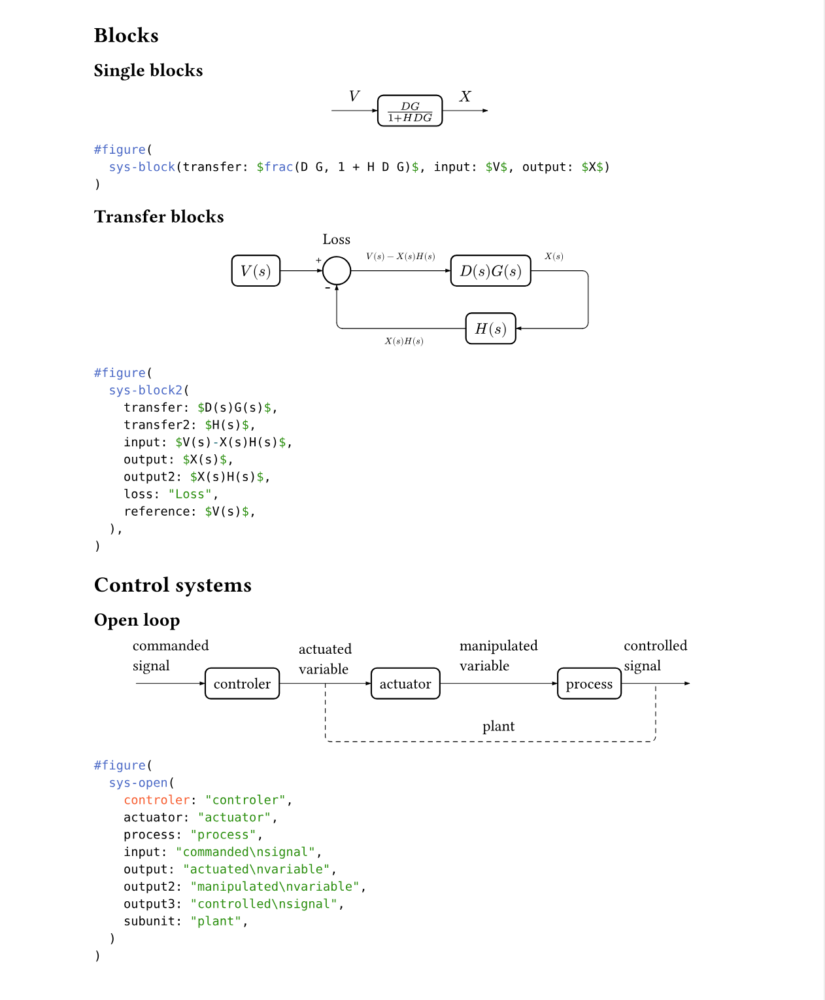
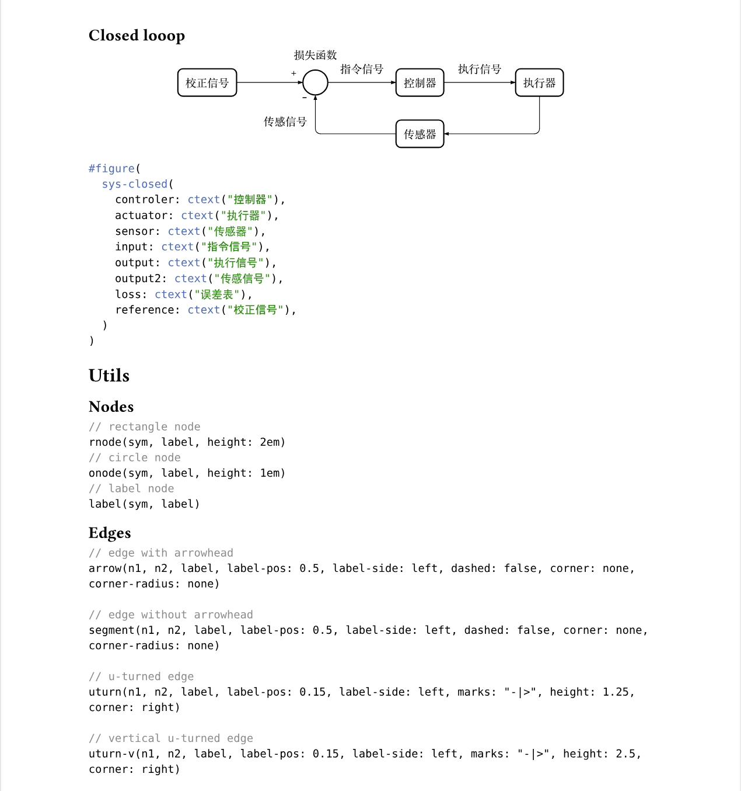

# Consketcher

Consketcher is a Typst package for drawing control-system sketches with
[CeTZ](https://github.com/cetz-package/cetz).

It provides:

- ready-to-use block and control-system templates
- reusable nodes, labels, junctions, and edge helpers
- small utilities for Chinese labels and automatic spacing

## Installation

If you are using a published release, import it from `@preview`:

```typst
#import "@preview/consketcher:0.2.0": *
```

For local development, import it from `@local`:

```typst
#import "@local/consketcher:0.1.0": *
```

## Quick Start

### Open-loop block

```typst
#block-open(
  transfer: $G(s)$,
  input: $R(s)$,
  output: $Y(s)$,
)
```

### Closed-loop block

```typst
#block-closed(
  transfer: $D(s)G(s)$,
  transfer2: $H(s)$,
  input: $V(s)-X(s)H(s)$,
  output: $X(s)$,
  output2: $X(s)H(s)$,
  loss: "Loss",
  reference: $V(s)$,
)
```

### Closed-loop control system

```typst
#sys-closed(
  controler: ctext("控制器"),
  actuator: ctext("执行器"),
  sensor: ctext("传感器"),
  input: ctext("指令信号"),
  output: ctext("执行信号"),
  output2: ctext("传感信号"),
  loss: ctext("损失函数"),
  reference: ctext("校正信号"),
)
```





For complete examples, see
[examples/example.typ](examples/example.typ).

## API Overview

Consketcher exports everything from `0.1.0/src/lib.typ`, which re-exports:

- `src/charts.typ`
- `src/components.typ`
- `src/utils.typ`

### Diagram Templates

These are the highest-level entry points.

```typst
#block-open(
  transfer: none,
  input: none,
  output: none,
  width: 2,
  height: 2em,
  line: -2,
  start: 1,
  node-maker: rnode,
  edge-maker: arrow,
)
```

```typst
#block-closed(
  transfer: none,
  transfer2: none,
  input: none,
  output: none,
  output2: none,
  loss: none,
  reference: none,
  line: 0.5,
  start: 1,
  reference-gap: auto,
  input-gap: auto,
  feedback-height: 1.25,
  label-size: 0.6em,
  node-maker: rnode,
  ref-maker: reference,
  edge-maker: arrow,
  feedback-edge-maker: uturn-v,
)
```

```typst
#sys-open(
  controler: none,
  actuator: none,
  process: none,
  input: none,
  output: none,
  output2: none,
  output3: none,
  subunit: none,
  line: -2,
  start: -2,
  node-maker: rnode,
  edge-maker: arrow,
  boundary-edge-maker: uturn,
  label-maker: label,
)
```

```typst
#sys-closed(
  controler: none,
  actuator: none,
  sensor: none,
  input: none,
  output: none,
  output2: none,
  loss: none,
  reference: none,
  line: 0.5,
  start: 1,
  feedback-height: 1.25,
  node-maker: rnode,
  ref-maker: reference,
  edge-maker: arrow,
)
```

Legacy high-level helpers are also exported:

```typst
#closed-loop-block(plant)

#compensated-loop-block(
  first,
  second,
  third,
  first-width: 5em,
  second-width: 2em,
  third-width: 6em,
)
```

### Layout and Text Utilities

```typst
#control-diagram(
  spacing: (1.5em, 1.5em),
  node-stroke: 1pt,
  mark-scale: 80%,
  ..body,
)

#ctext(label, size: 0.8em, font: "Songti SC", ..options)

#edge-label(body, size: 0.6em, ..options)

#label-length(body, fallback: 1)

#auto-gap(body, scale: 1, fallback: 1)
```

`ctext` is a convenience wrapper around `text(...)` with a Chinese-friendly
default font.

### Nodes and Markers

```typst
#rnode(sym, label, shape: rect, height: 2em, corner-radius: 4pt, ..options)

#onode(sym, label, shape: circle, height: 1em, radius: 10pt, ..options)

#gain-node(
  sym,
  label,
  dir: left,
  width: 4em,
  height: 4em,
  fit: 0.8,
  ..options,
)

#formula-node(sym, body, width: 8em, height: 3em, ..options)

#label(sym, body, stroke: none, ..options)

#signed-node(
  sym,
  signs: (),
  node-maker: onode,
  label-maker: label,
  ..node-options,
)

#reference(
  sym,
  x-sign: "+",
  y-sign: "-",
  x-offset: -0.3,
  y-offset: 0.3,
  loss: none,
  loss-offset: -0.5,
  ..options,
)

#reference3(
  sym,
  x: "+",
  top: "+",
  bottom: "+",
  x-offset: -0.25,
  top-offset: -0.25,
  bottom-offset: 0.25,
  radius: 1.35em,
  node-maker: onode,
  label-maker: label,
  ..node-options,
)

#dashed-box(
  enclose,
  stroke: (thickness: 0.5pt, dash: "dashed"),
  inset: 1.5em,
  fill: none,
  corner-radius: 4pt,
  ..options,
)
```

### Edges

```typst
#connector(
  n1,
  n2,
  marks: "-",
  label: none,
  label-pos: 0.5,
  label-side: left,
  corner: none,
  corner-radius: 4pt,
  ..options,
)

#arrow(
  n1,
  n2,
  label,
  marks: none,
  label-pos: 0.5,
  label-side: left,
  dashed: false,
  corner: none,
  corner-radius: none,
  ..options,
)

#segment(
  n1,
  n2,
  label,
  marks: none,
  label-pos: 0.5,
  label-side: left,
  dashed: false,
  corner: none,
  corner-radius: none,
  ..options,
)

#uturn(
  n1,
  n2,
  label,
  label-pos: 0.15,
  label-side: left,
  marks: "-|>",
  height: 1.25,
  corner: right,
  corner-radius: 4pt,
  ..options,
)

#uturn2(
  n1,
  n2,
  label,
  label-pos: 0.15,
  label-side: left,
  marks: "-|>",
  height: 1.25,
  corner: right,
  corner-radius: 4pt,
  offset: 1,
  ..options,
)

#uturn-v(
  n1,
  n2,
  label,
  label-pos: 0.15,
  label-side: left,
  marks: "-|>",
  height: 2.5,
  corner: right,
  corner-radius: 4pt,
  ..options,
)

#uturn2-v(
  n1,
  n2,
  label,
  label-pos: 0.15,
  label-side: left,
  marks: "-|>",
  height: 2.5,
  corner: right,
  corner-radius: 4pt,
  offset: 1,
  ..options,
)
```

## Customization

The template functions are composable. You can pass custom maker functions to
change how nodes, references, or edges are drawn.

```typst
#let thick-arrow(n1, n2, body, ..options) = arrow(
  n1,
  n2,
  body,
  stroke: 1.5pt,
  ..options,
)

#block-open(
  transfer: $G(s)$,
  input: $u$,
  output: $y$,
  edge-maker: thick-arrow,
)
```

For closed-loop diagrams, you can also replace the summing-junction maker
through `ref-maker`.

## Repository Layout

- `0.1.0/src/lib.typ`: package entrypoint and export hub
- `0.1.0/src/charts.typ`: ready-made block and control-system templates
- `0.1.0/src/components.typ`: compatibility barrel that re-exports drawing helpers
- `0.1.0/src/nodes.typ`: nodes, labels, references, and marker helpers
- `0.1.0/src/edges.typ`: connectors, arrows, and feedback paths
- `0.1.0/src/core.typ`: shared CeTZ state, geometry, and path utilities
- `0.1.0/src/utils.typ`: canvas setup, text helpers, and spacing helpers
- `examples/example.typ`: usage examples

## Local Development

To use the package from `@local`, clone the repository into your local Typst
package workspace:

- Linux:
  - `$XDG_DATA_HOME/typst/packages/local`
  - `~/.local/share/typst/packages/local`
- macOS: `~/Library/Application Support/typst/packages/local`
- Windows: `%APPDATA%/typst/packages/local`

Then clone the repository as `consketcher`:

```bash
git clone https://github.com/ivaquero/typst-consketcher consketcher
```

and import it with:

```typst
#import "@local/consketcher:0.1.0": *
```
