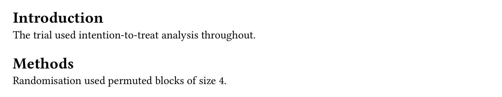

<p align="center">
  
</p>

# Contexture

**Contexture** is the small, package-agnostic engine three sibling packages — [`palimpsest`](https://eusebe.github.io/typst-contexture-site/palimpsest/), [`checkitoff`](https://eusebe.github.io/typst-contexture-site/checkitoff/), [`colophon`](https://eusebe.github.io/typst-contexture-site/colophon/) — are all built on: it turns Typst's experimental **bundle export** into a primitive any package author can use to produce a manuscript plus one or more companion documents that can query each other's real, final page numbers, from a single compile.

You'll rarely import `contexture` for what it does on its own — it has no notion of revisions, checklists, or word counts. You reach for it when you're building (or combining) packages that need to produce more than one document from one manuscript.

<p align="center">
  
  &nbsp;&nbsp;→&nbsp;&nbsp;
  
</p>

## The problem

Typst's bundle export (`--features bundle --format bundle`) lets one compile produce several documents that share one introspection space: a `query()` run from any of them sees content laid out in *all* of them, with real, final page numbers — because they were genuinely composed together in the same pass. That's the primitive a glossary, an index, a list of figures, a reviewer response letter, or a completed reporting-guideline grid all need: something that can say "this term is defined on page 4" and be *right*, always, because it's not a copy-pasted number.

The catch: Typst's own `document(...)` — the call that actually names one of those documents — cannot be nested inside another `document(...)`. That rules out two independent packages each calling it on their own; whichever runs second ends up trying to nest its document inside the first's. `contexture` is the fix: the *only* place that ever calls `document(...)`. Any package built on it instead exposes a small constructor that returns inert data — a `satellite(...)` — and the author lists as many of those as they like under one shared `documents:`.

## Key features

- **`anchor` / `anchors`** — mark a spot in one document, read it back from any other, by its real page. The primitive every "cite this from another document" feature in this ecosystem (`palimpsest`'s `passage`, `checkitoff`'s `check`) is built from.
- **`satellite` / `bundle`** — one shared entry point that decides which documents come out of a compile, so several independent pieces of code can each contribute a document without fighting over how the split works, or which one owns `document(...)`.
- **`variant` / `preview`** — two small, independent flags any document built on `contexture` can read: `variant` decides *whether something is there at all* (a package's own alternate output — tracked-changes, an internal-only note); `preview` decides *how much you can see of how it got there* (a drafting overlay, never present in the real deliverable). Crossed freely: a compile can ask for both, either, or neither.
- **`diagnose` / `set-strict`** — a shared way to flag a problem (a visible marker at the fault, most Typst editors preview it live) that turns into a hard compile error everywhere at once under `strict: true` — one CI gate, not one per package.
- **`xref`** — like `@label`/`ref(label)`, already correct across a bundle, but with the real page number appended: "Table 3, p. 14".
- **Structural utilities** — `collect-metadata`, `is-blank`, `is-textual`, `strip-labels`: the small, reusable walkers every package above builds its own marking functions from.

## Installation

```typ
#import "@preview/contexture:0.1.0": *
```

Requires **Typst 0.15** or later, specifically its `--features bundle` export (still experimental — Typst prints a warning about this on every compile, which is expected).

## Quick start

A manuscript, plus a second document generated from it — a two-function glossary, complete:

```typ
#import "@preview/contexture:0.1.0": *

// term() anchors a short definition where it's first used;
// render-glossary() lists every one of them, in document order, with
// its real page number.
#let term(id, body) = {
  anchor("demo-term", (id: id, body: body))
  body
}

#let render-glossary() = context {
  for h in anchors("demo-term") [
    *#h.value.id* --- #h.value.body (p. #h.location().page()) \
  ]
}

#show: bundle.with(
  documents: (satellite("glossary", render: () => render-glossary()),),
)

The trial used #term("itt")[intention-to-treat] analysis throughout.
```

```sh
typst compile --features bundle --format bundle main.typ
```

produces `manuscript.pdf` (the prose, exactly as written — `term()` never modifies its own output) and `glossary.pdf` (one line per term, citing the real page). Neither `anchor`/`anchors` nor `satellite`/`bundle` know anything about "glossaries" specifically — the same handful of primitives, arranged differently, is what a list of figures, an index, or a reporting-guideline grid is built from too.

## Composing independent packages

Two packages built independently on `contexture`, neither aware the other exists, combine by listing both of their satellites under the same `documents:` — no coordination needed, because neither of them ever calls `document(...)` itself:

```typ
#show: contexture.bundle.with(
  documents: (
    palimpsest.letter(exchanges: exchanges),
    checkitoff.checklist(checklist: checklists.consort),
  ),
)
```

One compile, one manuscript, a tracked-changes version, a reviewer response letter, and a completed CONSORT grid — each citing the others' real page numbers.

## Documentation

- [The contexture guide](https://eusebe.github.io/typst-contexture-site/contexture/) — the full guide, one primitive at a time: the anchor primitive, a fuller worked example (a multi-page list of figures), `satellite`/`bundle`, the two compile axes, diagnostics, `xref`, and composing independent packages — every result shown is a real compiled screenshot, not a simulation.

## Built on `contexture`

- [`@preview/palimpsest`](https://eusebe.github.io/typst-contexture-site/palimpsest/) — manuscript revisions and a reviewer response letter that cites the real pages.
- [`@preview/checkitoff`](https://eusebe.github.io/typst-contexture-site/checkitoff/) — reporting-guideline checklists (CONSORT, PRISMA, SPIRIT, STARD, STROBE) filled in with the real pages.
- [`@preview/colophon`](https://eusebe.github.io/typst-contexture-site/colophon/) — a companion audit of the composed manuscript: word counts, reading time, a figure/table inventory.

## License

MIT
