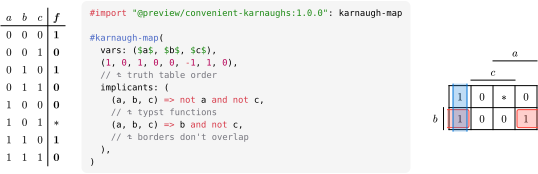
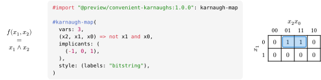

# convenient-karnaughs

In contrast to many other packages, this package is not inspired by any LaTeX
package, but tries to take full advantage of typst to be

- **☀️ convenient**: different formats for function values (e.g. array in
  truth-table order) and implicants (e.g. typst functions)
- **🎛️ flexibel**: different label styles, unlimited number of variables
- **🔋 batteries included**: input validation and error messages, implicant
  borders don't overlap while visual impact is minimized.

This project is 100% written by humans.

## Usage

For full documentation, take a look at the [manual](docs/manual.pdf). The
following examples illustrate some common use cases.

<!-- <table>
  <tbody>
    <tr>
      <th scope="row">a</th>
      <td>0</td>
      <td>0</td>
      <td>0</td>
      <td>0</td>
      <td>1</td>
      <td>1</td>
      <td>1</td>
      <td>1</td>
    </tr>
    <tr>
      <th scope="row">b</th>
      <td>0</td>
      <td>0</td>
      <td>1</td>
      <td>1</td>
      <td>0</td>
      <td>0</td>
      <td>1</td>
      <td>1</td>
    </tr>
    <tr>
      <th scope="row">c</th>
      <td>0</td>
      <td>1</td>
      <td>0</td>
      <td>1</td>
      <td>0</td>
      <td>1</td>
      <td>0</td>
      <td>1</td>
    </tr>
    <tr>
      <th scope="row">f(a, b, c)</th>
      <td>1</td>
      <td>0</td>
      <td>1</td>
      <td>0</td>
      <td>0</td>
      <td>*</td>
      <td>1</td>
      <td>0</td>
    </tr>
  </tbody>
</table> -->

A karnaugh map for a truth table:

A karnaugh map for a function and with different label styles:

