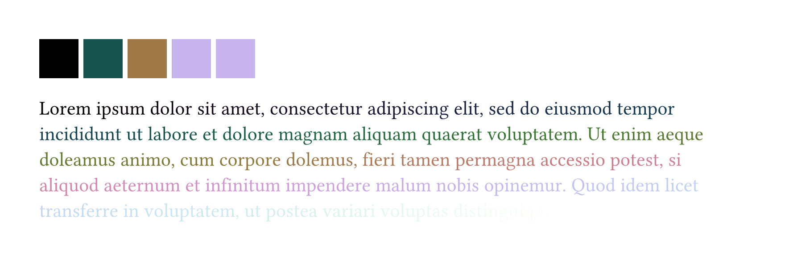
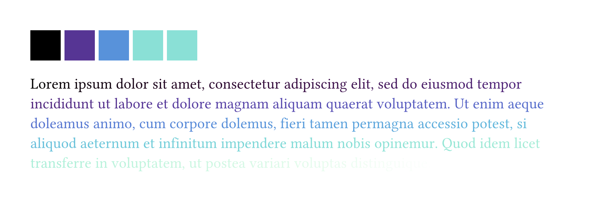
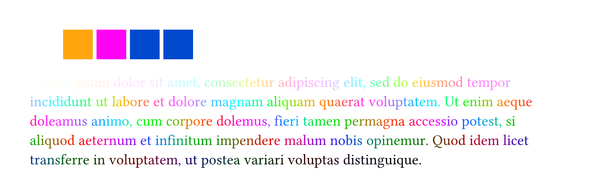
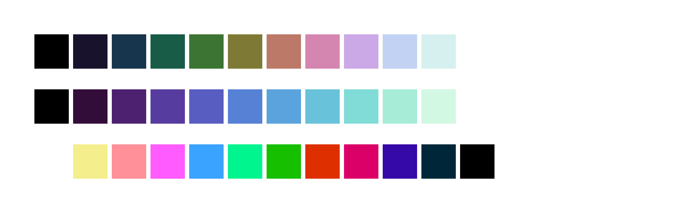
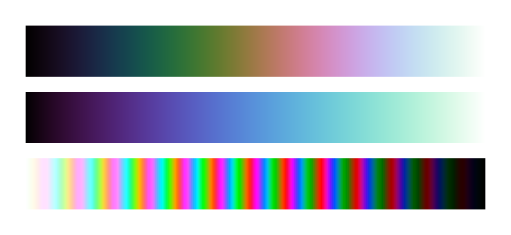

# Corkscrew

The `corkscrew` package for Typst includes a set of functions to generate color scales based on [Dave Green’s `cubehelix` color scheme](https://people.phy.cam.ac.uk/dag9/CUBEHELIX/) ([arXiv link](https://arxiv.org/abs/1108.5083)).

Add `corkscrew` to your project using the following code:

```typst
#import "@preview/corkscrew:0.1.0" as chx
```

## `cubehelix()`

Given a number (integer or float), returns the color at the corresponding point on the default cubehelix color scale.

### Parameters

- **`value`** (required, positional): The numeric value (integer or float) to map to a color. Values outside the input domain are clipped.
- **`domain`** (optional, named): Change the input domain. Set this to a single number `n` (integer or float) to get a domain of `0..n`. Set this to an array of 2 numbers `(n1, n2)` to get a domain of `n1..n2`. _Default: `(0.0, 1.0)`_
- **`type`** (optional, named): Set this to `dictionary` to return the raw calculated RGB values as a dictionary with the keys `r`, `g` and `b`. _Default: `color`_

### Examples

```typst
#box(fill: chx.cubehelix(0))
#box(fill: chx.cubehelix(0.25))
#box(fill: chx.cubehelix(0.5))
#box(fill: chx.cubehelix(0.75))
#box(fill: chx.cubehelix(3, domain: (0, 4)))

#{
  let body = lorem(54)
  let length = body.len()
  let i = 0
  for char in body {
    text(fill: chx.cubehelix(i, domain: length), char)
    i += 1
  }
}
```



## `new()`

Generates a cubehelix color scale and returns a mapping function that maps a numeric value to a color on that scale.

All parameters are optional and named. The function returned by `new()` with default parameters is equivalent to the `cubehelix()` function.

### Parameters

- **`start`**: The hue to start from. A value of `1` starts at red, `2` starts at green, and `3` starts at blue. Values above `3` are converted to the value modulo 3. _Default: `0.5`_
- **`rotations`**: How many R→G→B→R… rotations are made from the start to the end of the scale. Negative values rotate in reverse (B→G→R→B…). _Default: `-1.5`_
- **`saturate`**: Controls how saturated the colors are. A value of `0` produces a totally greyscale palette. Values above `1.0` may produce out-of-gamut values, which will be clipped. _Default: `1.0`_
- **`gamma`**: Lightens or darkens the midtones of the scale, to emphasize lower or higher values. Values below `1.0` lighten the midtones of the scale, while values above `1.0` darken the midtones. _Default: `1.0`_
- **`reverse`**: Setting this to `true` reverses the lightness of the scale, so it starts at 100% lightness and ends at 0%. _Default: `false`_
- The **`domain`** and **`type`** parameters may also be set here. They behave identically to their corresponding parameters in the mapping function.

### Mapping function

Given a number (integer or float), returns the color at the corresponding point on the color scale generated with `new()`.

#### Parameters

- **`value`** (required, positional): The numeric value (integer or float) to map to a color. Values outside the domain are clipped to the domain.
- **`domain`** (optional, named): Change the input domain. Set this to a single number `n` (integer or float) to get a domain of `0..n`. Set this to an array of 2 numbers `(n1, n2)` to get a domain of `n1..n2`. _Default: `(0.0, 1.0)`, unless changed in `new()`_
- **`type`** (optional, named): Set this to `dictionary` to return the raw calculated RGB values as a dictionary with the keys `r`, `g` and `b`. _Default: `color`, unless changed in `new()`_

### Examples

```typst
#let cool-scale = chx.new(
  rotations: -0.5,
  saturate: 1.5,
  gamma: 0.9,
)

#box(fill: cool-scale(0))
#box(fill: cool-scale(0.25))
#box(fill: cool-scale(0.5))
#box(fill: cool-scale(0.75))
#box(fill: cool-scale(3, domain: (0, 4)))

#{
  let body = lorem(54)
  let length = body.len()
  let i = 0
  for char in body {
    text(fill: cool-scale(i, domain: length), char)
    i += 1
  }
}
```



```typst
#let wild-scale = chx.new(
  start: 2,
  rotations: 13,
  saturate: 4,
  gamma: 1.1,
  reverse: true,
)

#box(fill: wild-scale(0))
#box(fill: wild-scale(0.25))
#box(fill: wild-scale(0.5))
#box(fill: wild-scale(0.75))
#box(fill: wild-scale(3, domain: (0, 4)))

#{
  let body = lorem(54)
  let length = body.len()
  let i = 0
  for char in body {
    text(fill: wild-scale(i, domain: length), char)
    i += 1
  }
}
```



## `colors()`

Returns an array of colors taken from evenly-spaced points on the color scale.

### Parameters

- **`num`** (required, positional): the number of colors to generate. Must be a positive integer.
- **`func`** (optional, named): the mapping function used to generate the color scale. _Default: `cubehelix`_

### Examples

```typst
#grid(
  columns: 12 * (2em,),
  ..chx.colors(12).map(it => block(fill: it))
)
#grid(
  columns: 12 * (2em,),
  ..chx.colors(12, func: cool-scale).map(it => block(fill: it))
)
#grid(
  columns: 12 * (2em,),
  ..chx.colors(12, func: wild-scale).map(it => block(fill: it))
)
```



## `gradient-map()`

A helper function that, given a mapping function, returns an array of colors suitable for use in gradients.

The function `gradient-map(func)` is equivalent to `colors(256, func: func)`.

Use this in gradients by destructuring the returned array, i.e. `gradient.linear(..chx.gradient-map(func))`.

```typst
#set block(width: 100%, height: 4em)
#block(fill: gradient.linear(..chx.gradient-map(chx.cubehelix)))
#block(fill: gradient.linear(..chx.gradient-map(cool-scale)))
#block(fill: gradient.linear(..chx.gradient-map(wild-scale)))
```



## `gradient` array

The default color palette as an array of colors suitable for use in gradients. Equivalent to `gradient-map(cubehelix)`.

Use this in gradients by destructuring the array, i.e. `gradient.linear(..chx.gradient)`.

```typst
#set block(width: 100%, height: 4em)
#block(fill: gradient.linear(..chx.gradient))
```


