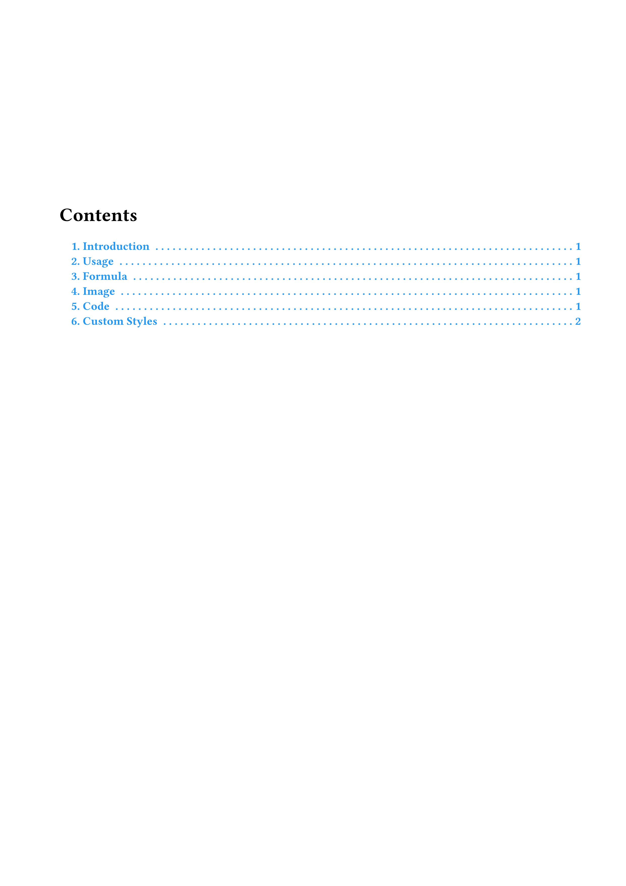

# Typst note template

[简体中文](README_zh.md) English

| Cover | Contents | Main Body |
|:--:|:--:|:--:|
|  |  |  |

Simple and Functional Typst Note Template

This template is designed for efficient and organized note-taking with Typst. It provides a clean and straightforward structure, making it easy to capture and organize your thoughts without unnecessary complexity.

## Acknowledgments

The following projects have been instrumental in providing substantial inspiration and code for this project.

https://github.com/gRox167/typst-assignment-template

https://github.com/DVDTSB/dvdtyp

https://github.com/a-kkiri/SimpleNote

https://github.com/spidersouris/touying-unistra-pristine

https://github.com/wardenxyz/xyznote