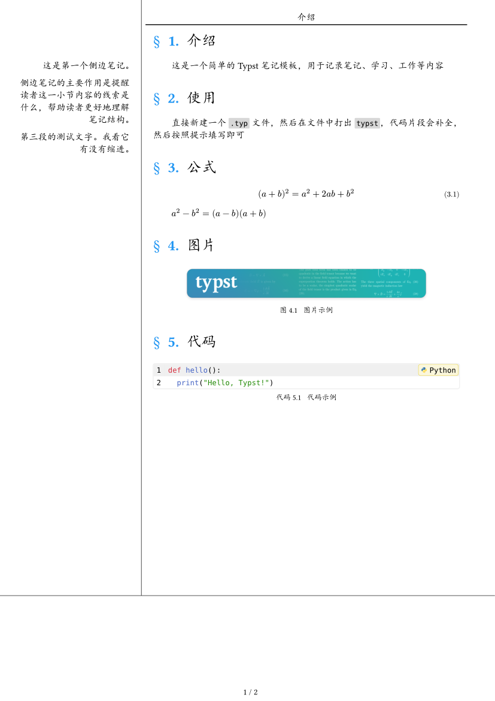

# Typst note template

简体中文 [English](README.md)

| 封面 | 目录 | 正文 |
|:--:|:--:|:--:|
|  |  |  |

简单且实用的 Typst 笔记模板

cornell-note是一个专为 Typst 设计的模板，旨在帮助用户记录高效且有组织的笔记。它提供了一个干净且直接的结构，使得记录和整理想法变得更加简单。

## 鸣谢

以下项目为本项目的开发提供了关键的灵感和重要的代码贡献。

https://github.com/gRox167/typst-assignment-template

https://github.com/DVDTSB/dvdtyp

https://github.com/a-kkiri/SimpleNote

https://github.com/spidersouris/touying-unistra-pristine