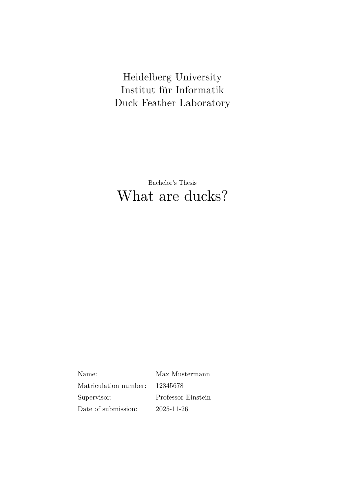
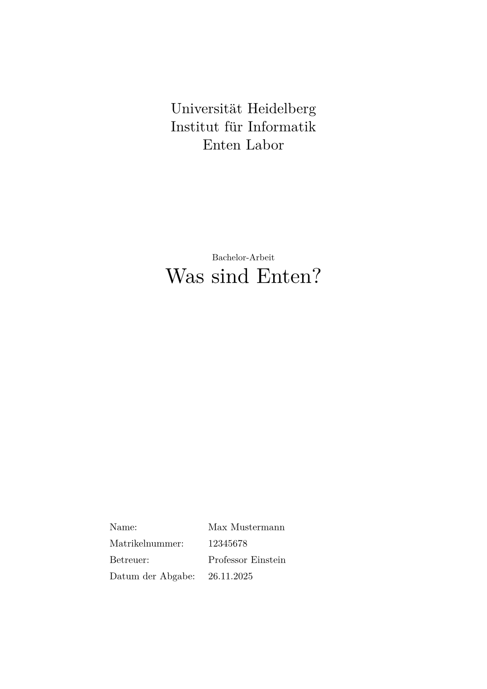

<div align="center">

# `covered-cs-thesis`

**A template for writing a bachelor's or master's computer science thesis at the University Heidelberg.**

</div>

The cover is available in **english** and **german**! Switch the language via the `language` option (see the Usage).

## Usage

Either initialize the template via
```sh
typst init @preview/covered-cs-thesis:0.1.5
```
Or use the cover function standalone:
```typ
#import "@preview/covered-cs-thesis:0.1.5": *

/// This function creates the a title page that fulfills the requirements
/// that the Institut für Informatik of Heidelberg University has for a bachelor or master thesis.
#cs-thesis-cover(
  /// Your name [string]
  author: "Max Mustermann",
  /// Your matriculation number (Matrikelnummer) [string]
  matriculation-number: "12345678",
  /// What your thesis is (bachelor/master) [string]
  thesis-type: "Bachelor's Thesis",
  /// The title of your thesis [string]
  title: "What are ducks?",
  /// Your university [string]
  university: "Heidelberg University",
  /// Your institute [string]
  institute: "Institut für Informatik",
  /// The working group that supervises your thesis [string]
  working-group: "Duck Feather Laboratory",
  /// Your supervisor [string]
  supervisor: "Professor Einstein",
  /// The date of your submission [anything]
  date-submission: [#datetime.today().display()],
  /// Language of your thesis ["en" OR "de"]
  /// This switches in what language your cover is displayed.
  language: "en",
)
```

For a cover in German:
```typ
#import "@preview/covered-cs-thesis:0.1.5": *

#cs-thesis-cover(
  author: "Max Mustermann",
  matriculation-number: "12345678",
  thesis-type: "Bachelor-Arbeit",
  title: "Was sind Enten?",
  university: "Universität Heidelberg",
  institute: "Institut für Informatik",
  working-group: "Enten Labor",
  supervisor: "Professor Einstein",
  date-submission: [#datetime.today().display("[day].[month].[year]")],
  language: "de",
)
```

## License

This template is licensed under the [Unlicense license](./LICENSE).


## Images

* [English example pdf](https://github.com/WyvernIXTL/computer-science-heidelberg-thesis-typst-template/releases/download/v0.1.5/covered-cs-thesis-0.1.5-english-example.pdf)
* [German example pdf](https://github.com/WyvernIXTL/computer-science-heidelberg-thesis-typst-template/releases/download/v0.1.5/covered-cs-thesis-0.1.5-german-example.pdf)




