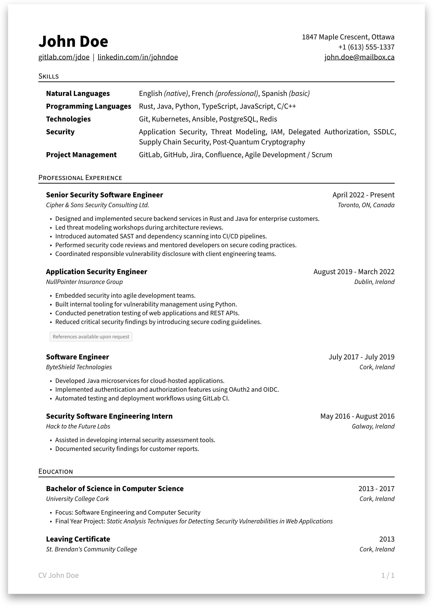
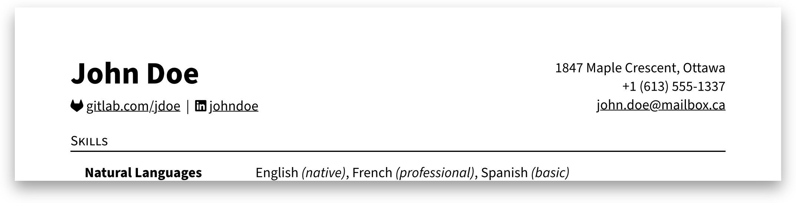

# crisp-cv
A clean, concise Typst CV template with a sensible default layout and easy customization.

<div align="center">
    
</div>

## Getting Started
This package is designed in a way that you can focus on writing your CV, without having to worry about the layout.
The template provides a polished default structure you can fill with your own content.

However, it remains highly flexible.
Apart from the header, the template consists of modular building blocks you can arrange or replace however you like. 
Want to add your own section with a completely different layout, such as a table or bibliography? Go for it.

### Typst App
Open [this template in the Typst Universe](https://typst.app/universe/package/crisp-cv) and click "`Create project in app`".

### Local
1. Install the Typst CLI on your machine.
2. Run `typst init @preview/crisp-cv:1.0.0`.
3. *(Optional)* The template uses *Source Sans Pro* as the default font. If you'd like to use it, make sure that the font is installed on your system. Otherwise, you can simply choose a different font in the configuration dictionary. Additional configuration details are included in the automatically generated template.

## Recommendation: Icons
Enhance the header by adding icons to the links. You can include icons however you like, but the [fontawesome package](https://typst.app/universe/package/fontawesome/) is a great and easy choice. Follow the instructions on the package page to install and use the icons in your Typst project.

<div align="center">
    
</div>

```typ
// ...
#import "@preview/fontawesome:0.6.2": *

#show: cv.with(
  name: "John Doe",
  contact: ("1847 Maple Crescent, Ottawa", /* ... */),
  links: (
    [#fa-icon("gitlab", size: 10pt) #link("https://gitlab.com/jdoe")[gitlab.com/jdoe]],
    [#fa-icon("linkedin", size: 10pt) #link("https://linkedin.com/in/johndoe")[johndoe]],
  ),
)
// ...
```
