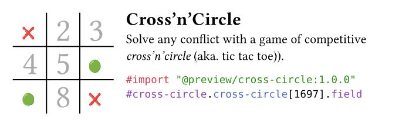

# Cross Circle ❌🟢


Ever had a heated debate on how to format the class summary? Or using letter format instead of A4 (may god have mercy with you).

Fear not, a convoluted implementation of Cross'n'Circles (aka. Tic Tac Toe) is here!

## Set it up

```typst
#import "@preview/cross-circle:1.0.0": cross-circle
```

or if you use it locally:

```typst
#import "/path/to/cross-circle.typ": cross-circle
```

## Playing it

Playing Cross'n'Circles is easily: you gotta win and your opponent has to lose! For the exact details and a history lesson, head over to the [Wikipedia article](https://en.wikipedia.org/wiki/Tic-tac-toe) on this fantastic game!

By default field indexes are shown to help you see, which numbers are left. Just type the number of the field you wish to see your icon in and it should show up. So just call the function as following and write your coordinates in the `[..]`.

```typst
#cross-circle[123679].field
```

Basic filtering such as duplicate purging is done before hand. Only numbers are considered and each valid entry will be assigned to the respective player!

For more information, just head to the [manual.pdf](./manual/manual.pdf), there customization and a complete working example with current player indicator and winner display is shown!

## Customization

Head to the [manual.pdf](./manual/manual.pdf)
