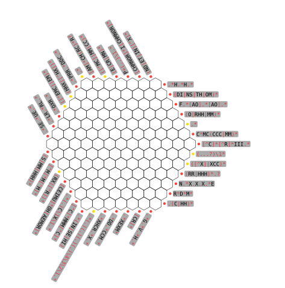
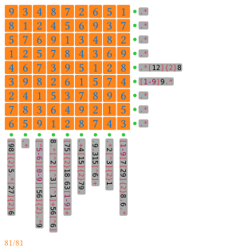

# crossregex

A crossword-like game written in Typst. You should fill in letters to satisfy regular expression constraints.
Currently, _squares_ and _regular hexagons_ are supported.

> [!note]
> This is not a puzzle solver, but a puzzle layout builder.

It takes inspiration from a web image, which derives our standard example.





More examples and source code: <https://github.com/QuadnucYard/crossregex-typ>

## Basic Usage

We use `crossregex-square` and `crossregex-hex` to build square and hex layouts respectively. They have the same argument formats. A `crossregex` dispatcher function can be used for dynamic grid kind, which is compatible with version 0.1.0.

```typst
#import "@preview/crossregex:0.2.0": crossregex
// or import and use `crossregex-hex`

#crossregex(
  3,
  constraints: (
    `A.*`, `B.*`, `C.*`, `D.*`, `E.*`,
    `F.*`, `G.*`, `H.*`, `I.*`, `J.*`,
    `K.*`, `L.*`, `M.*`, `N.*`, `O.*`,
  ),
  answer: (
    "ABC",
    "DEFG",
    "HIJKL",
    "MNOP",
    "QRS",
  ),
)
```

```typst
#import "@preview/crossregex:0.2.0": crossregex-square

#crossregex-square(
  9,
  alphabet: regex("[0-9]"),
  constraints: (
    `.*`,
    `.*`,
    `.*`,
    `.*`,
    `.*[12]{2}8`,
    `[1-9]9.*`,
    `.*`,
    `.*`,
    `.*`,
    `[1-9]7[29]{2}8.6.*`,
    `.*2[^3]{2}1.`,
    `.9.315[^6]+`,
    `.+4[15]{2}79.`,
    `[75]{2}18.63[1-9]+`,
    `8.*[^2][^3][^1]+56[^6]`,
    `[^5-6][0-9][56]{2}.*9`,
    `.*`,
    `[98]{2}5.*[27]{2}6`,
  ),
  answer: (
    "934872651",
    "812456937",
    "576913482",
    "125784369",
    "467395128",
    "398261574",
    "241537896",
    "783649215",
    "659128743",
  ),
  cell: rect(width: 1.4em, height: 1.4em, radius: 0.1em, stroke: 1pt + orange, fill: orange.transparentize(80%)),
  cell-config: (size: 1.6em, text-style: (size: 1.4em)),
)
```

## Document

Details are shown in the doc comments above the `crossregex` function in `lib.typ`. You can choose to turn off some views.

Feel free to open issues if any problems.

## Changelog

### 0.2.0

- Feature: Supports square shapes.
- Feature: Supports customization the appearance of everything, even the cells.
- Feature: Supports custom alphabets.
- Fix: An mistake related to import in the README example.

### 0.1.0

First release with basic hex features.
