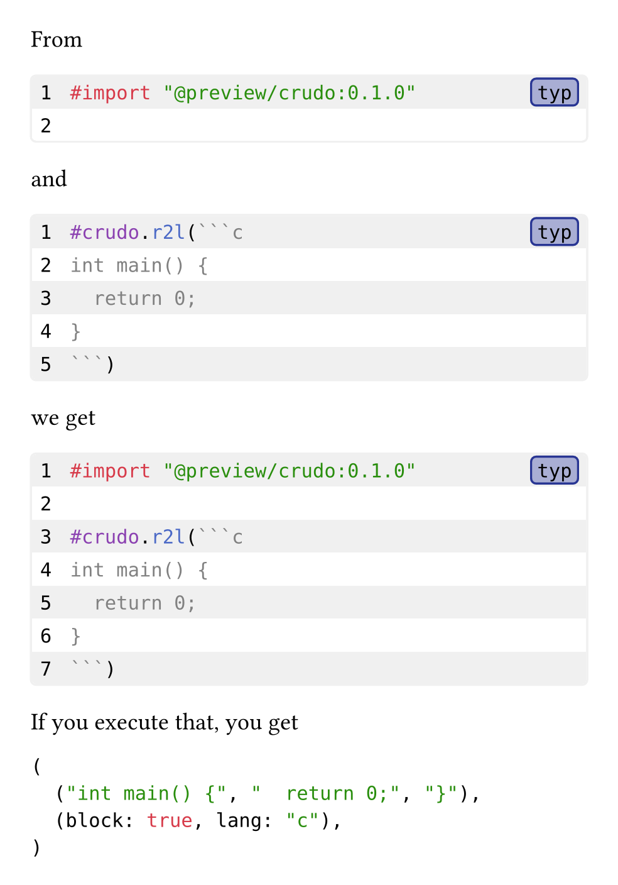

# Crudo

Crudo allows conveniently working with `raw` blocks in terms of individual lines. It allows you to e.g.

- filter lines by content
- filter lines by range (slicing)
- transform lines
- join multiple raw blocks

While transforming the content, the original [parameters](https://typst.app/docs/reference/text/raw/#parameters) specified on the given raw block will be preserved.

## Getting Started

The full version of this example can be found in [gallery/thumbnail.typ](gallery/thumbnail.typ).

`````typ
From

#let preamble = ```typ
#import "@preview/crudo:0.1.0"

```
#preamble

and

#let example = ````typ
#crudo.r2l(```c
int main() {
  return 0;
}
```)
````
#example

we get

#let full-example = crudo.join(preamble, example)
#full-example

If you execute that, you get

#eval(full-example.text, mode: "markup")
`````



## Usage

See the [manual](docs/manual.pdf) for details.
