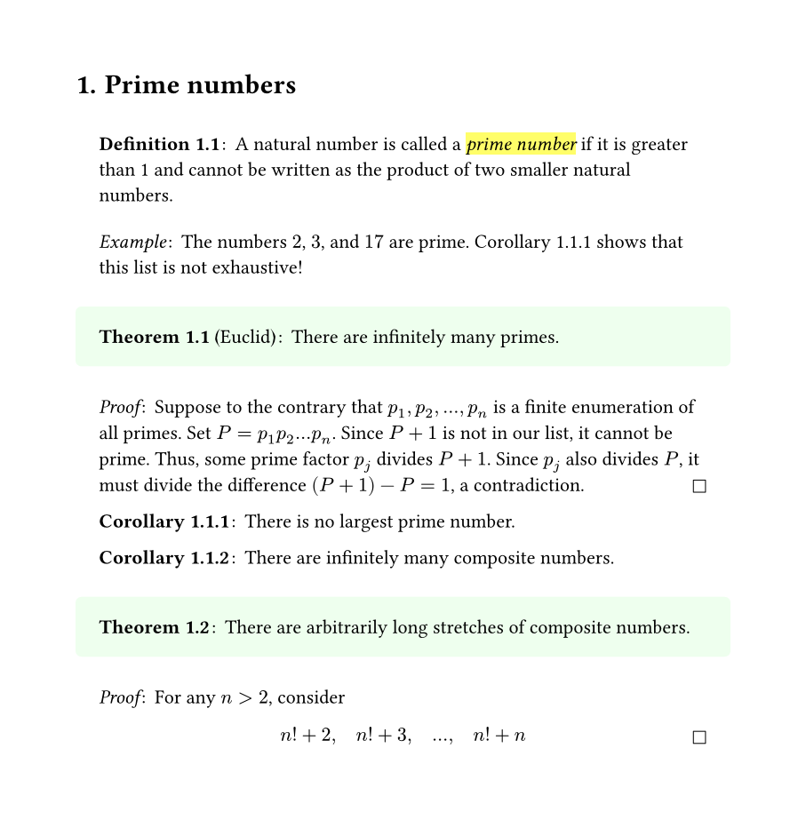

# ctheorems

An implementation of numbered theorem environments in
[typst](https://github.com/typst/typst). Import using
```typst
#import "@preview/ctheorems:1.1.3": *
#show: thmrules
```

### Features
- Numbered theorem environments can be created and customized.
- Environments can share the same counter, via same `identifier`s.
- Environment counters can be _attached_ (just as subheadings are attached to headings) to other environments, headings, or keep a global count via `base`.
- The depth of a counter can be manually set, via `base_level`.
- Environments can be `<label>`'d and `@reference`'d.
- Awesome presets (coming soon!)

## Manual and Examples
Get acquainted with `ctheorems` by checking out the minimal example below!

You can read the [manual](assets/manual.pdf) for a full walkthrough of functionality offered by this module; flick through [manual_examples](assets/manual_examples.pdf) to just see the examples.



### Preamble
```typst
#import "@preview/ctheorems:1.1.3": *
#show: thmrules.with(qed-symbol: $square$)

#set page(width: 16cm, height: auto, margin: 1.5cm)
#set heading(numbering: "1.1.")

#let theorem = thmbox("theorem", "Theorem", fill: rgb("#eeffee"))
#let corollary = thmplain(
  "corollary",
  "Corollary",
  base: "theorem",
  titlefmt: strong
)
#let definition = thmbox("definition", "Definition", inset: (x: 1.2em, top: 1em))

#let example = thmplain("example", "Example").with(numbering: none)
#let proof = thmproof("proof", "Proof")
```

### Document
```typst
= Prime numbers

#definition[
  A natural number is called a #highlight[_prime number_] if it is greater
  than 1 and cannot be written as the product of two smaller natural numbers.
]
#example[
  The numbers $2$, $3$, and $17$ are prime.
  @cor_largest_prime shows that this list is not exhaustive!
]

#theorem("Euclid")[
  There are infinitely many primes.
]
#proof[
  Suppose to the contrary that $p_1, p_2, dots, p_n$ is a finite enumeration
  of all primes. Set $P = p_1 p_2 dots p_n$. Since $P + 1$ is not in our list,
  it cannot be prime. Thus, some prime factor $p_j$ divides $P + 1$.  Since
  $p_j$ also divides $P$, it must divide the difference $(P + 1) - P = 1$, a
  contradiction.
]

#corollary[
  There is no largest prime number.
] <cor_largest_prime>
#corollary[
  There are infinitely many composite numbers.
]

#theorem[
  There are arbitrarily long stretches of composite numbers.
]
#proof[
  For any $n > 2$, consider $
    n! + 2, quad n! + 3, quad ..., quad n! + n #qedhere
  $
]
```


## Changelog

### v1.1.3

- Fixed alignment and block-breaking issues resulting from breaking changes
  in Typst 0.12.

### v1.1.2

- Introduced the `thmproof` function for creating proof environments.
- Inserting `#qedhere` in a block equation/list/enum item (in a proof) places
  the qed symbol on the same line. The qed symbol can be customized via
  `thmrules`.

### v1.1.1

- Extra named arguments given to a theorem environment produced by `thmbox` (or `thmplain`) are passed to `block`.

### v1.1.0

- The `supplement` (for references) is no longer set in `thmenv`. It can be passed to the theorem environment directly, along with `refnumbering` to control the appearance of `@reference`s.
- Extra named arguments given to `thmbox` are passed to `block`.
- Fixed spacing bug for unnumbered environments.
- Replaced dummy figure with labelled metadata.

### v1.0.0

- Extra named arguments given to a theorem environment are passed to its formatting function `fmt`.
- Removed `thmref`, introduced normal `<label>`s and `@reference`s.
- Import must be followed by `show: thmrules`.
- Removed `name: ...` from theorem environments; use `#theorem("Euclid")[]` instead of `#theorem(name: "Euclid")[]`.
- Theorems are now wrapped in `figure`s.


## Credits

- [sahasatvik (Satvik Saha)](https://github.com/sahasatvik)
- [MJHutchinson (Michael Hutchinson)](https://github.com/MJHutchinson)
- [rmolinari (Rory Molinari)](https://github.com/rmolinari)
- [PgBiel](https://github.com/PgBiel)
- [DVDTSB](https://github.com/DVDTSB)
