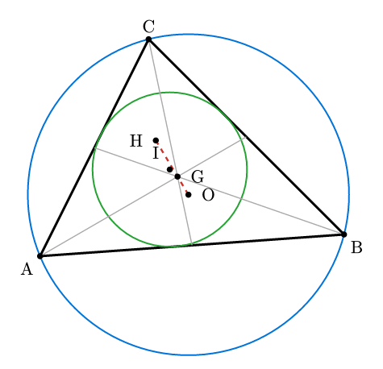
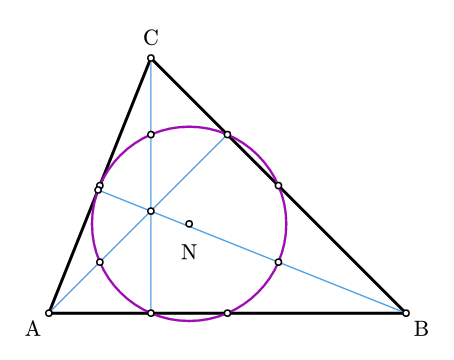
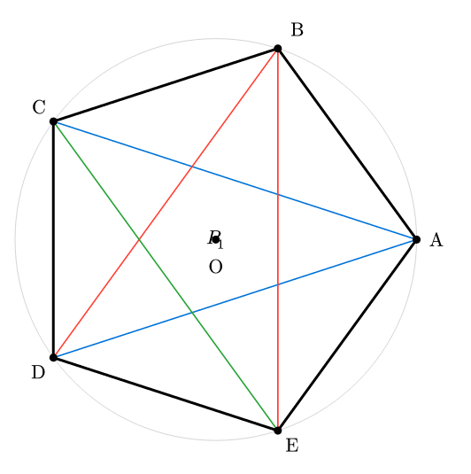
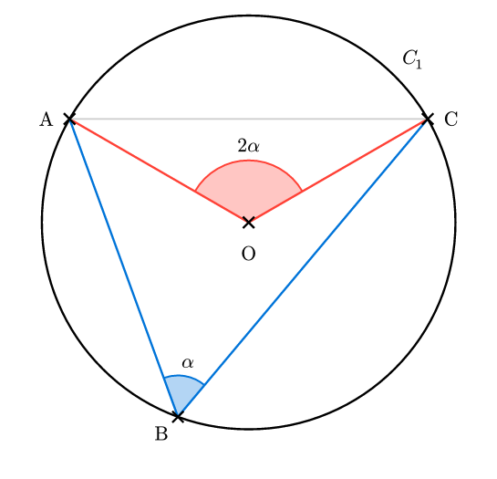
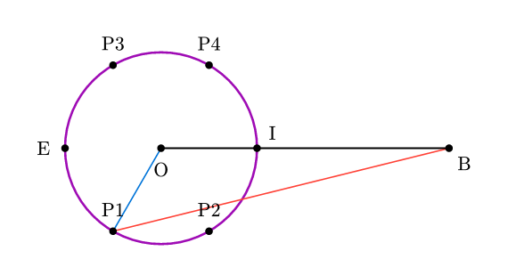
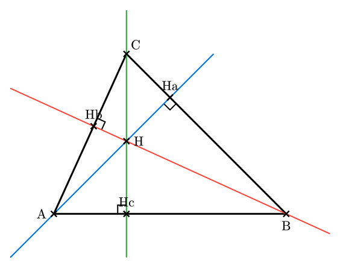
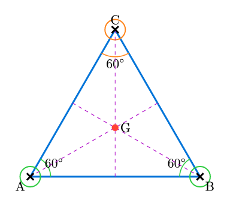
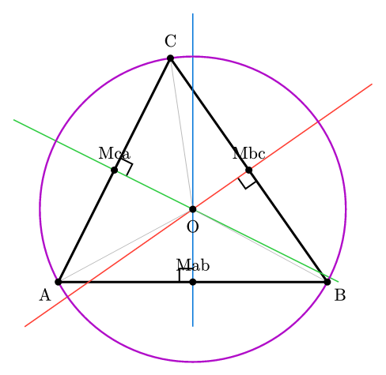
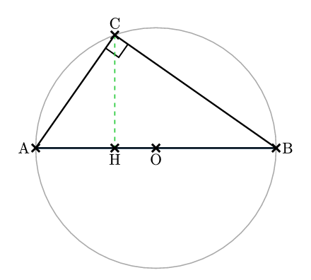

# ctz-euclide

A comprehensive Euclidean geometry package for Typst, inspired by the LaTeX **tkz-euclide** package.

> **Note:** This package is a port of the LaTeX [tkz-euclide](https://ctan.org/pkg/tkz-euclide) package. We are deeply grateful to Alain Matthes for creating the original **tkz-euclide** package, without which this Typst port would have been impossible. We will be glad if this package comes close to reaching one day the quality of the figures which the original package can render.

> **Development Note:** This package was coded entirely by [Claude Code Opus 4.5](https://www.anthropic.com/claude). Nevertheless, I have spent lots of time and energy in the following feedback look : prompting, reviewing, testing and designing. Any mistakes or bugs are my own.

## ⚠️ Early Development Status

This package is currently in early development and is **by no means definitive**. Many improvements and features are planned and will be implemented over time. The API may change as the package evolves.

 This package is being developed. Expect:
- Bug fixes and improvements
- New features and triangle centers
- API refinements
- Performance optimizations

## Dependencies

- [CeTZ](https://typst.app/universe/package/cetz) v0.4.2

## Gallery

Click on an image to see the source code.

<table>
  <tr>
    <td align="center">
      <a href="gallery/01-triangle-centers.typ"></a><br>
      Triangle Centers
    </td>
    <td align="center">
      <a href="gallery/02-nine-point-circle.typ"></a><br>
      Nine-Point Circle
    </td>
    <td align="center">
      <a href="gallery/03-pentagon.typ"></a><br>
      Regular Pentagon
    </td>
  </tr>
  <tr>
    <td align="center">
      <a href="gallery/04-inscribed-angle.typ"></a><br>
      Inscribed Angle
    </td>
    <td align="center">
      <a href="gallery/05-apollonius-circle.typ"></a><br>
      Apollonius Circle
    </td>
    <td align="center">
      <a href="gallery/06-orthocenter.typ"></a><br>
      Orthocenter
    </td>
  </tr>
  <tr>
    <td align="center">
      <a href="gallery/equilateral-triangle.typ"></a><br>
      Equilateral Triangle
    </td>
    <td align="center">
      <a href="gallery/perpendicular-bisectors.typ"></a><br>
      Perpendicular Bisectors
    </td>
    <td align="center">
      <a href="gallery/thales-theorem.typ"></a><br>
      Thales' Theorem
    </td>
  </tr>
</table>

## Documentation

📖 **[Complete Manual (PDF)](docs/manual.pdf)** - Comprehensive documentation with examples and gallery

The manual includes:
- Detailed API reference for all functions
- Step-by-step examples and tutorials
- Gallery of advanced geometric constructions
- Complete feature overview

## Contributions Welcome

Contributions, bug reports, feature requests, and feedback are warmly welcomed! Please feel free to:
- Open issues on the repository
- Submit pull requests
- Share examples and use cases
- Report bugs or suggest improvements

## Quick Start

```typst
#import "@preview/ctz-euclide:0.1.0": *
#import "@preview/cetz:0.4.2"

#let ctz = create-api(cetz)

#cetz.canvas({
  import cetz.draw: *

  (ctz.init)()
  (ctz.style)(point: (shape: "cross", size: 0.1, stroke: black + 1.5pt))

  // Define points
  (ctz.pts)("A", (0, 0), "B", (4, 0), "C", (2, 3))

  // Draw triangle
  line("A", "B", "C", close: true, stroke: black)

  // Mark points and add labels
  (ctz.points)("A", "B", "C")
  (ctz.labels)("A", "B", "C",
    A: "below left", B: "below right", C: "above")

  // Mark an angle
  (ctz.angle)("B", "A", "C", label: $alpha$, radius: 0.5)
})
```

## Features

- **Point Constructions**: Define points by coordinates, transformations, intersections
- **Transformations**: Rotation, reflection, translation, scaling, projection
- **Intersections**: Line-line, line-circle, circle-circle
- **Triangle Centers**: Centroid, circumcenter, incenter, orthocenter, and many more
- **Special Triangles**: Medial, orthic, intouch triangles
- **Drawing**: Points, lines, angles, circles, arcs
- **Angle Marking**: With customizable labels and positioning
- **Point Styles**: Multiple marker types (cross, dot, circle, plus, etc.)

## Basic Features

### Point Definition

```typst
// Define points
(ctz.pts)("A", (0, 0), "B", (3, 0), "C", (1.5, 2.5))
```

### Transformations

```typst
// Rotation
(ctz.rotate)("B", "A", "O", 60)  // Rotate A around O by 60°

// Reflection
(ctz.reflect)("C", "A", "P", "Q")  // Reflect A across line PQ

// Translation
(ctz.translate)("D", "A", (2, 3))  // Translate A by vector (2, 3)
```

### Intersections

```typst
// Line-line intersection
(ctz.ll)("E", ("A", "B"), ("C", "D"))

// Line-circle intersection
(ctz.lc)(("F", "G"), ("A", "B"), ("O", "P"))

// Circle-circle intersection
(ctz.cc)(("H", "I"), ("O1", "P1"), ("O2", "P2"))
```

### Triangle Centers

```typst
// Centroid
(ctz.centroid)("G", "A", "B", "C")

// Circumcenter
(ctz.circumcenter)("O", "A", "B", "C")

// Incenter
(ctz.incenter)("I", "A", "B", "C")

// Orthocenter
(ctz.orthocenter)("H", "A", "B", "C")
```

### Drawing

```typst
// Draw points
(ctz.points)("A", "B", "C")

// Add labels
(ctz.labels)("A", "B", "C",
  A: "below left", B: "below right", C: "above")

// Mark angles
(ctz.angle)("B", "A", "C", label: $alpha$, radius: 0.6)
```

## Advanced Features

The package includes many advanced features:
- Extended triangle centers (Euler, Lemoine, Nagel, Gergonne, Spieker, Feuerbach, etc.)
- Special triangle constructions (medial, orthic, intouch, excentral, tangential)
- Circle operations (tangents, radical axis, Apollonius circles)
- Point constructions (midpoint, golden ratio, barycentric coordinates)
- Geometric transformations (symmetry, inversion)
- Drawing utilities (polygons, segments, arcs, sectors)
- Marking utilities (segment marks, right angles, angle fills)

See the draft documentation for complete details on all features.

## Acknowledgments

This package is a port of the LaTeX [tkz-euclide](https://ctan.org/pkg/tkz-euclide) package created by **Alain Matthes**. The original tkz-euclide package has been an invaluable resource for geometric constructions in LaTeX, and this port aims to bring similar functionality to the Typst ecosystem.

## License

MIT License - see LICENSE file for details.

## Changelog

### [0.1.0] - 2026-01-21

#### Initial Release
- Core geometric constructions (points, lines, circles)
- Point transformations (rotation, reflection, translation, scaling)
- Intersection algorithms (line-line, line-circle, circle-circle)
- Basic triangle centers (centroid, circumcenter, incenter, orthocenter)
- Extended triangle centers (Euler, Lemoine, Nagel, Gergonne, Spieker, etc.)
- Special triangle constructions
- Angle marking with customizable labels
- Multiple point styles
- Drawing utilities
- Built on CeTZ v0.4.2
