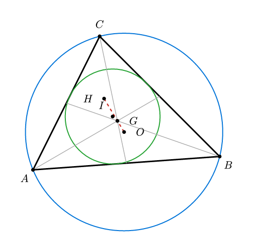
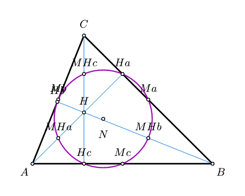
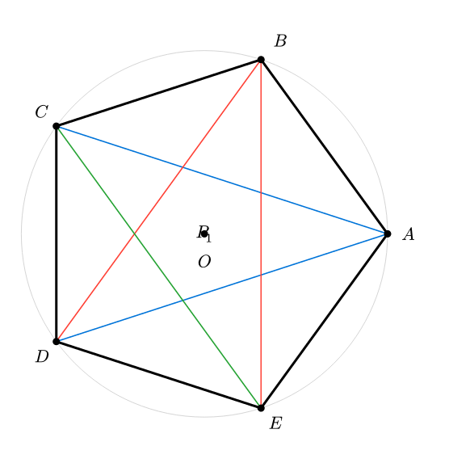
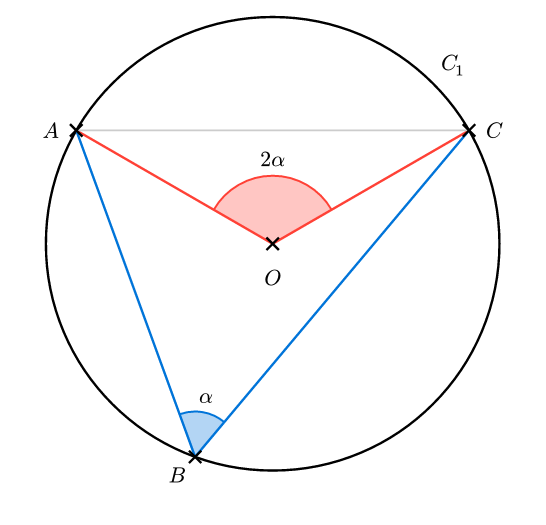
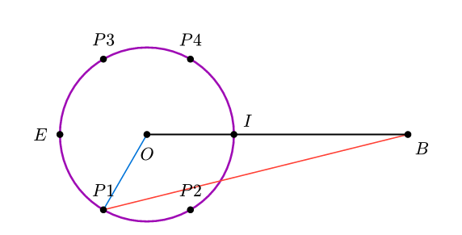
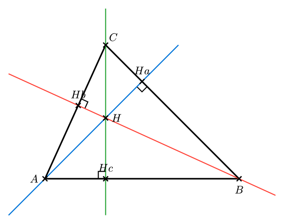
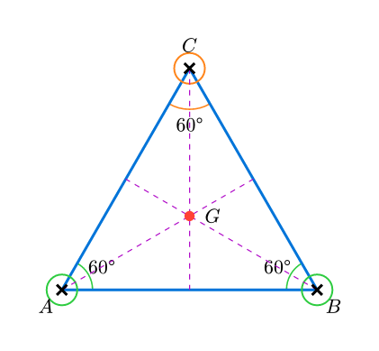
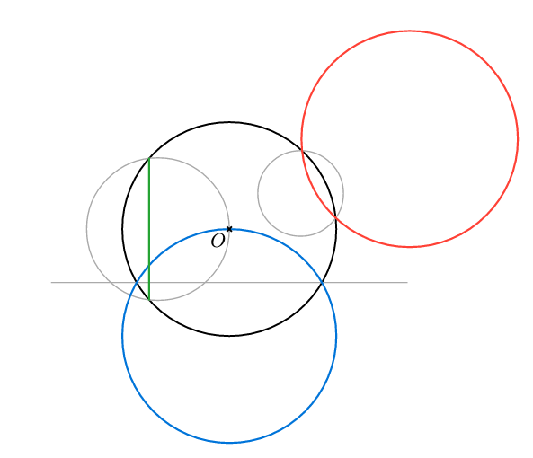
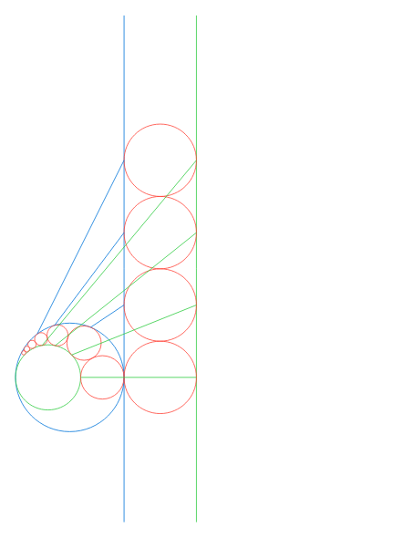

# ctz-euclide

A comprehensive Euclidean geometry package for Typst, inspired by the LaTeX **tkz-euclide** package.

> **Note:** This package is a port of the LaTeX [tkz-euclide](https://ctan.org/pkg/tkz-euclide) package. We are deeply grateful to Alain Matthes for creating the original **tkz-euclide** package, without which this Typst port would have been impossible. This package is will try to implement the complete set of features of the **tkz-euclide** package, we are not there yet.  

> **Development Note:** This package was coded entirely by [Claude Code Opus 4.5](https://www.anthropic.com/claude) and [Codex](https://openai.com/codex/). Nevertheless, I have spent lots of time and energy in the following feedback look : prompting, reviewing, testing and designing. Any mistakes or bugs are my own.

## ⚠️ Early Development Status

This package is **by no means definitive**. Improvements and features are planned and will be implemented over time. The API may change as the package evolves.

 This package is being developed. Expect:
- Bug fixes and improvements
- New features and triangle centers
- API refinements
- Performance optimizations

## Dependencies

- [CeTZ](https://typst.app/universe/package/cetz) v0.4.2

## Changelog

### 0.1.5

- Main-levée (hand-drawn/sketchy) style, including `sketchy: true` on `ctz-draw`
- Global style configuration variables for colors, point shapes, sizes, and mark widths
- Canvas-level clipping via `ctz-canvas(clip-canvas: ...)` with line/segment clipping
- Labels now render in math font by default
- Expanded docs and gallery examples for styling, main-levée, and clipping

### 0.1.0

- Initial public release
- Core Euclidean constructions, transformations, intersections
- Drawing utilities with unified `ctz-draw`
- Conics, parabola helpers, and inversion features
- Manual PDF and gallery examples

## Gallery

Click on an image to see the source code.

<table>
  <tr>
    <td align="center">
      <a href="gallery/01-triangle-centers.typ"></a><br>
      Triangle Centers
    </td>
    <td align="center">
      <a href="gallery/02-nine-point-circle.typ"></a><br>
      Nine-Point Circle
    </td>
    <td align="center">
      <a href="gallery/03-pentagon.typ"></a><br>
      Regular Pentagon
    </td>
  </tr>
  <tr>
    <td align="center">
      <a href="gallery/04-inscribed-angle.typ"></a><br>
      Inscribed Angle
    </td>
    <td align="center">
      <a href="gallery/05-apollonius-circle.typ"></a><br>
      Apollonius Circle
    </td>
    <td align="center">
      <a href="gallery/06-orthocenter.typ"></a><br>
      Orthocenter
    </td>
  </tr>
  <tr>
    <td align="center">
      <a href="gallery/equilateral-triangle.typ"></a><br>
      Equilateral Triangle
    </td>
    <td align="center">
      <a href="gallery/perpendicular-bisectors.typ"></a><br>
      Perpendicular Bisectors
    </td>
    <td align="center">
      <a href="gallery/thales-theorem.typ"></a><br>
      Thales' Theorem
    </td>
  </tr>
  <tr>
    <td align="center">
      <a href="gallery/07-inversion.typ"></a><br>
      Inversion
    </td>
    <td align="center">
      <a href="gallery/08-inversion-packing.typ"></a><br>
      Inversion Packing
    </td>
    <td align="center">
      <a href="gallery/09-inversion-ladder.typ"></a><br>
      Inversion Ladder
    </td>
  </tr>
</table>

## Documentation

📖 **[Complete Manual (PDF)](docs/manual.pdf)** - Comprehensive documentation with examples and gallery

The manual includes:
- Detailed API reference for all functions
- Step-by-step examples and tutorials
- Gallery of advanced geometric constructions
- Complete feature overview

## Deploy Checklist

1) Switch docs to local imports and compile:

```bash
./scripts/use-local-docs.sh
typst compile docs/manual.typ docs/manual.pdf
```

2) Rebuild gallery images locally:

```bash
for f in gallery/*.typ; do
  typst compile "$f" "${f%.typ}.png"
done
```

3) Switch docs/tests back to preview imports for publishing:

```bash
./scripts/use-preview-package.sh
find gallery -name "*.typ" -type f -exec sed -i 's|@local/ctz-euclide:0.1.0|@preview/ctz-euclide:0.1.5|g' {} \;
```

## Contributions Welcome

Contributions, bug reports, feature requests, and feedback are warmly welcomed! Please feel free to:
- Open issues on the repository
- Submit pull requests
- Share examples and use cases
- Report bugs or suggest improvements

## Quick Start

```typst
#import "@preview/ctz-euclide:0.1.5": *

#ctz-canvas({
  import cetz.draw: *

  ctz-init()
  ctz-style(point: (shape: "cross", size: 0.1, stroke: black + 1.5pt))

  // Define points
  ctz-def-points(A: (0, 0), B: (4, 0), C: (2, 3))

  // Draw triangle
  ctz-draw-line("A", "B", "C", "A", stroke: black)

  // Mark points and add labels
  ctz-draw-points("A", "B", "C")
  ctz-draw-labels("A", "B", "C",
    A: "below left", B: "below right", C: "above")

  // Mark an angle
  ctz-draw-angle("A", "B", "C", label: $alpha$, radius: 0.5)
})
```

Naming notes:
- All public functions are prefixed with `ctz-` to avoid conflicts.
- Point creation and drawing use `ctz-def-points` and `ctz-draw-points`.
- Other constructors use `ctz-def-*`, and drawing utilities use `ctz-draw-*`.

## Features

- **Point Constructions**: Define points by coordinates, transformations, intersections
- **Transformations**: Rotation, reflection, translation, scaling, projection
- **Intersections**: Line-line, line-circle, circle-circle
- **Triangle Centers**: Centroid, circumcenter, incenter, orthocenter, and many more
- **Special Triangles**: Medial, orthic, intouch triangles, Thales' triangle
- **Drawing**: Points, lines, angles, circles, arcs
- **Inversion**: Invert points and objects about a circle
- **Conics**: Ellipses and parabolas, including focus/directrix and focus/parameter forms
- **Parabolas**: Directrix helpers, tangents, and projectile trajectories
- **Projections**: Point projections and descriptive-geometry helpers
- **Unified Drawing**: `ctz-draw()` works with any object type (points, lines, circles, polygons)
- **Object Duplication**: `ctz-duplicate()` duplicates any geometric object
- **Angle Marking**: With customizable labels and positioning
- **Point Styles**: Multiple marker types (cross, dot, circle, plus, etc.)

## Basic Features

### Point Definition

```typst
// Define points
ctz-def-points(A: (0, 0), B: (3, 0), C: (1.5, 2.5))
```

### Transformations

```typst
// Rotation
ctz-def-rotation("B", "A", "O", 60)  // Rotate A around O by 60°

// Reflection
ctz-def-reflect("C", "A", "P", "Q")  // Reflect A across line PQ

// Translation
ctz-def-translate("D", "A", (2, 3))  // Translate A by vector (2, 3)
```

### Intersections

```typst
// Line-line intersection
ctz-def-ll("E", ("A", "B"), ("C", "D"))

// Line-circle intersection
ctz-def-lc(("F", "G"), ("A", "B"), ("O", "P"))

// Circle-circle intersection
ctz-def-cc(("H", "I"), ("O1", "P1"), ("O2", "P2"))
```

### Triangle Centers

```typst
// Centroid
ctz-def-centroid("G", "A", "B", "C")

// Circumcenter
ctz-def-circumcenter("O", "A", "B", "C")

// Incenter
ctz-def-incenter("I", "A", "B", "C")

// Orthocenter
ctz-def-orthocenter("H", "A", "B", "C")
```

### Drawing

```typst
// Draw points
ctz-draw-points("A", "B", "C")

// Add labels
ctz-draw-labels("A", "B", "C",
  A: "below left", B: "below right", C: "above")

// Mark angles
ctz-draw-angle("B", "A", "C", label: $alpha$, radius: 0.6)
```

### Paths and Arrows

```typst
// TikZ-like per-segment tips
ctz-draw-path("A--B->C|-|D", stroke: black)
```

Supported connectors: `--`, `->`, `<-`, `<->`, `|-|`, `|->`, `<-|`.
By default, points (small dots) and labels (below) are drawn. Override with `{...}` in the path:
`"A{below}--B{below}->C{above}|-|D{below}"`.
You can customize point appearance with `point-style` and `point-color`, or disable with `points: false`.

### Segment Measurements

```typst
ctz-draw-measure-segment("A", "B", label: $5$, offset: 0.3, side: "left")
```

## Advanced Features

The package includes many advanced features:
- Extended triangle centers (Euler, Lemoine, Nagel, Gergonne, Spieker, Feuerbach, etc.)
- Special triangle constructions (medial, orthic, intouch, excentral, tangential)
- **Thales' Triangle**: `ctz-def-thales-triangle()` creates right triangles inscribed in circles
- Circle operations (tangents, radical axis, Apollonius circles)
- Point constructions (midpoint, golden ratio, barycentric coordinates)
- Geometric transformations (symmetry, inversion)
- **Polymorphic Transformations**: `ctz-def-rotation()` works on all object types (points, lines, circles, polygons)
- Drawing utilities (polygons, segments, arcs, sectors)
- Marking utilities (segment marks, right angles, angle fills)

See the complete documentation for details on all features.

## Acknowledgments

This package is a port of the LaTeX [tkz-euclide](https://ctan.org/pkg/tkz-euclide) package created by **Alain Matthes**. The original tkz-euclide package has been an invaluable resource for geometric constructions in LaTeX, and this port aims to bring similar functionality to the Typst ecosystem.

## License

MIT License - see LICENSE file for details.

## Changelog

### [0.1.5] - 2026-01-27

#### Canvas Clipping
- Canvas-level clipping via `ctz-canvas(clip-canvas: ...)`
- Line/segment drawing respects canvas clip bounds (circles/shapes unchanged)

#### Main-levée (Hand-drawn Style)
- Sketchy drawing mode for lines/circles/ellipses/polygons/rects/arcs
- `ctz-draw(..., sketchy: true)` support

#### Math Labels
- Labels now render in mathematical font by default

#### Global Styling
- Centralized, user-configurable defaults for colors, point sizes/shapes, and mark widths
- Manual updates documenting global style configuration

### [0.1.0] - 2026-01-21

#### Initial Release
- Core geometric constructions (points, lines, circles)
- Point transformations (rotation, reflection, translation, scaling)
- Intersection algorithms (line-line, line-circle, circle-circle)
- Basic triangle centers (centroid, circumcenter, incenter, orthocenter)
- Extended triangle centers (Euler, Lemoine, Nagel, Gergonne, Spieker, etc.)
- Special triangle constructions
- Angle marking with customizable labels
- Multiple point styles
- Drawing utilities
- Built on CeTZ v0.4.2
