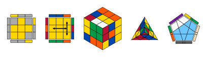

# cubst
<div align="center">Version 0.1.0</div>

Draw twisty puzzles in Typst. `cubst` builds a puzzle *state* from an
algorithm and renders it: OLL/PLL diagrams, any face straight on, 3D views,
or an unfolded net. It supports N×N cubes, the skewb, the pyraminx, the
megaminx and the Square-1, all driven by one geometric engine.

<picture>
  <source media="(prefers-color-scheme: dark)" srcset="docs/thumbnail-dark.svg">
  
</picture>

The [manual](docs/manual.pdf) covers every view, option and puzzle with
pictures; the [changelog](CHANGELOG.md) lists what changed in each version.

## Getting started

```typ
#import "@preview/cubst:0.1.0": *

// the case an algorithm solves, drawn as an OLL diagram
#draw(case("R U R' U R U2 R'"), view: "oll")

// a PLL diagram with arrows between (row, col) positions on the top face
#draw(case("R U R' U' R' F R2 U' R' U' R U R' F'"), view: "ll", arrows: (
  (from: (0, 2), to: (2, 2), double: true),
  (from: (1, 0), to: (1, 2), double: true),
))

// an F2L case (last-layer pieces greyed out) and a scrambled cube in 3D
#draw(case("U R U' R'"), view: "f2l")
#draw(cube(scramble: "R U F2 D' L B'"), view: "full")

// other puzzles, chosen by event
#draw(cube(event: "pyraminx", scramble: "U L R' B u"), view: "tip")
#draw(cube(event: "skewb", scramble: "R L U B'"), view: "full")
#draw(cube(event: "megaminx", scramble: "R++ D-- U"), view: "face", face: "U", sides: true)
#draw(cube(event: "square1", scramble: "(0,-1)/ (3,0)/ (4,0)/"), view: "layers")
```

## How it works

States are plain values, so you can build them once and draw them many ways:

```typ
#let c = cube(scramble: "R U F2 D' L B'")
#draw(c, view: "full")
#draw(apply(c, "y2"), view: "full")   // look at the other side
#draw(c, view: "net")
```

| Function | Purpose |
| --- | --- |
| `cube(event: "3x3", scramble: none, inverted: false, scheme: auto, options: (:))` | build a state; events: `"NxN"` (or `"N*N"`), `"skewb"`, `"pyraminx"`, `"megaminx"`, `"square1"`; options such as `(cut: 0.4)` on the megaminx |
| `case(alg, event: ..)` | the state that `alg` solves (inverse scramble) |
| `apply(c, alg)` | apply more moves, returns a new state |
| `keep-colors`, `hide-faces`, `hide-pieces`, `mask` | hide stickers before drawing |
| `draw(c, view: auto, mask: auto, face: auto, top: auto, tip: auto, options: (:), ..)` | render; views: `face`, `ll`, `oll`, `full`, `f2l`, `tip`, `net`, `layers`, `obl`, `cs`; `auto` is `full`, or `layers` on the Square-1; `face`/`top` put a face in front / on top of the 3D view; Square-1 settings such as `(direction: "vertical")` go in `options` |

| Puzzle | Views | Notation |
| --- | --- | --- |
| N×N cubes | all | `R U F' D2`, wide `Rw r 3Rw`, slices `M E S`, rotations `x y z`, groups `(R U R' U')3`, commutators `[R, U]`, conjugates `[F: [R, U]]` |
| skewb | `face`, `full`, `net` | `R L U B` (WCA fixed-corner), rotation `y` |
| pyraminx | `face`, `tip`, `full`, `net` | `U L R B`, tips `u l r b`, rotations `y z` |
| megaminx | `face`, `full`, `net` | face turns, `R++ R-- D++ D--` |
| Square-1 | `face`, `layers`, `obl`, `cs`, `net` | `(x,y)` and `/`; an impossible slice is a compile error |

The default scheme is yellow on top, green in front. The
[manual](docs/manual.pdf) documents every parameter, the sticker numbering of
each puzzle and the notation in full.

## Development

The source lives at [github.com/ANCuber/cubst](https://github.com/ANCuber/cubst).
It needs [Typst](https://typst.app) ≥ 0.14.0, [just](https://github.com/casey/just)
and [Tytanic](https://github.com/typst-community/tytanic):

```sh
just test          # run the test suite
just doc           # build the manual and the thumbnails in docs/
just install       # install to the @local namespace for use in other documents
```

How the package is built and how to add a puzzle is explained in the
[developer guide](https://github.com/ANCuber/cubst/blob/v0.1.0/docs/DEVELOPMENT.md).

## License

[MIT](LICENSE)
