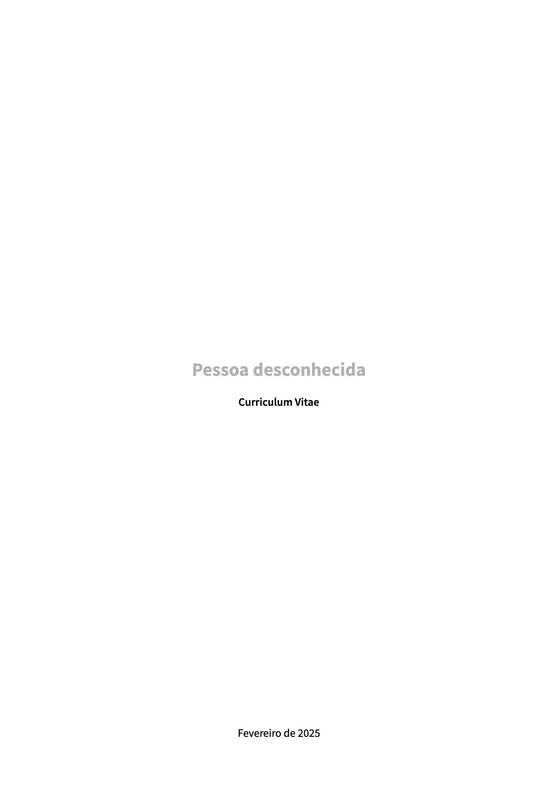
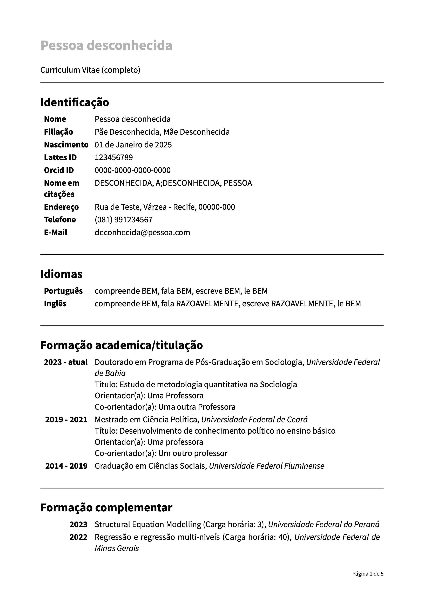
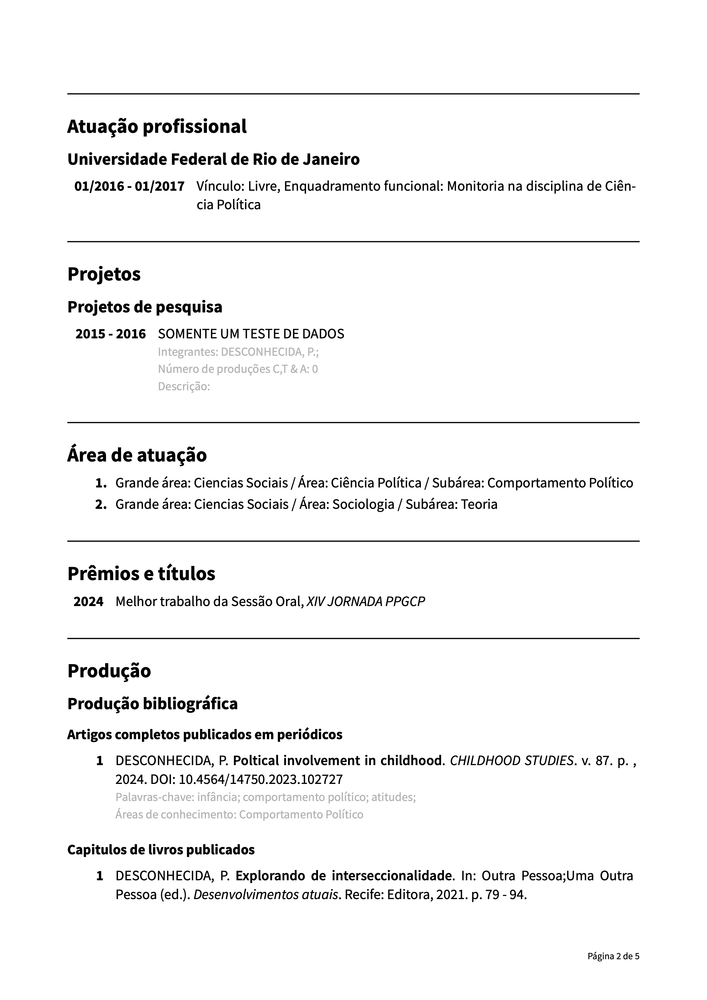
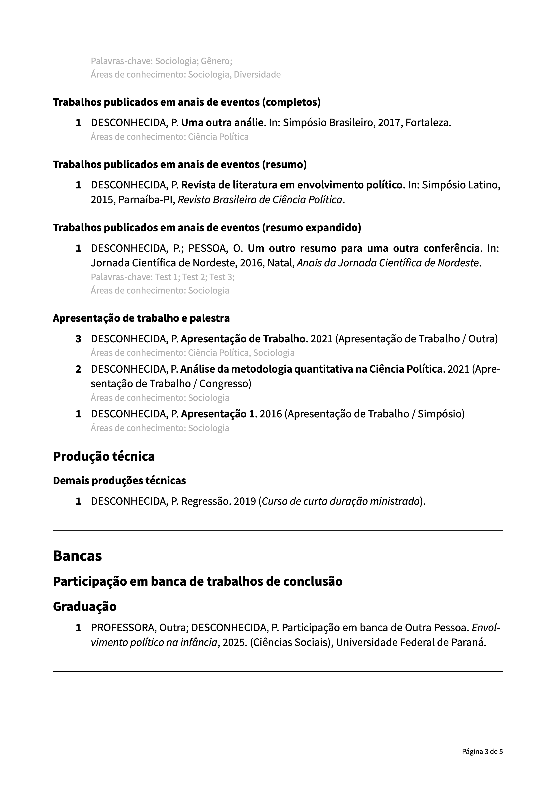
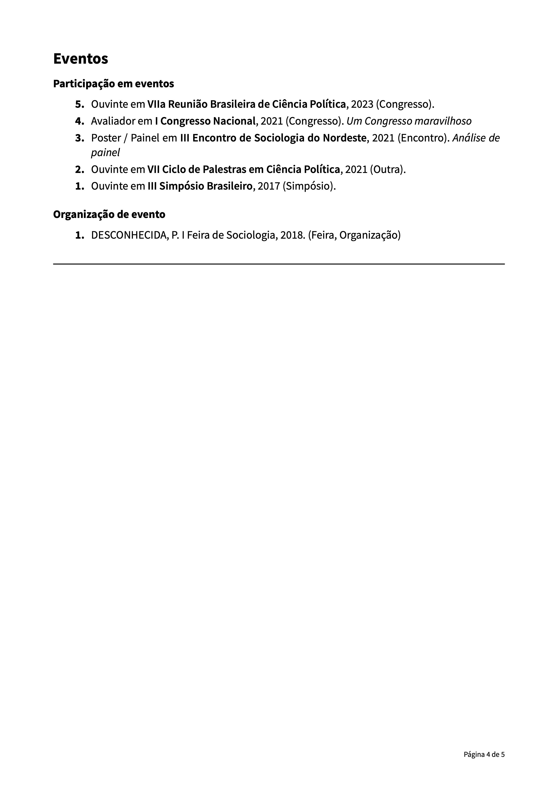
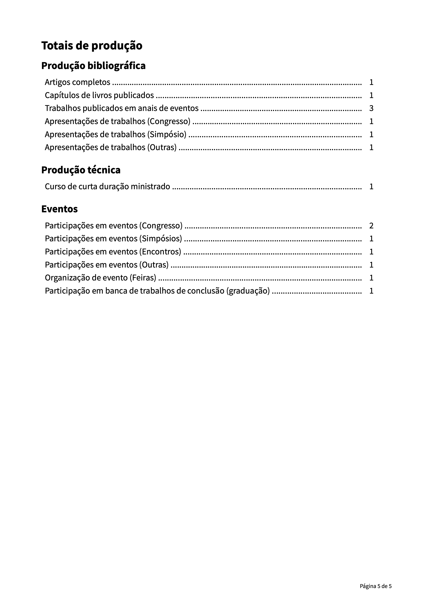

# curriculo-acad

# 👷🏼‍♀️ ⚠ Ainda em construção, não está pronto para todos os tipos de entradas.

_English version below_

[LATTES](https://lattes.cnpq.br) é uma ótima plataforma para acadêmicos armazenarem todo o seu trabalho científico. No entanto, as opções de exportação são bastante frustrantes, já que a exportação em RTF não resulta em um currículo com uma boa aparência.

Por isso, estou tentando resolver esse problema exportando o arquivo XML e criando este modelo para gerar um PDF bem formatado usando [Typst](https://typst.app). Se você ainda não conhece o [Typst](https://typst.app), ele é uma linguagem muito mais fácil de aprender e um compositor mais rápido do que o LaTeX.

Eu iniciei este projeto e, como no meu currículo do [LATTES](https://lattes.cnpq.br) não estão disponíveis todas as opções possíveis, pode haver erros quando você testá-lo. Você pode abrir uma [issue](https://github.com/philkleer/curriculo-acad/issues) ou criar um pull request com uma solução sugerida. Além disso, este é apenas o começo, então o código pode não estar tão simples e bonito quanto deveria ser.

## Fonts

Eu uso [Source Sans 3](https://fonts.google.com/specimen/Source+Sans+3), que você pode obter [aqui](https://fonts.google.com/specimen/Source+Sans+3).

## Uso

### Exportar arquivo XML e criar arquivo toml
Como estou mais familiarizado com arquivos toml e seu uso no [Typst](https://typst.app), criei o script em Python `helper.py`, que converte seu arquivo XML do [LATTES](https://lattes.cnpq.br) em um arquivo toml. Para fazer a transformação, basta executar a seguinte linha no terminal, onde o script está localizado:

```bash
python3 helper.py caminho-para-o-seu-arquivo-xml
```

Isso criará o arquivo `meu-arquivo.toml`, que você poderá usar nos documentos do Typst.

O script você encontra [aqui](https://github.com/philkleer/curriculo-acad).

### Criando o PDF 

A estrutura do arquivo principal é bastante simples. Você só precisa indicar qual versão do currículo deseja no argumento `kind`: `resumido`, `ampliado` ou `completo`. Dependendo da sua escolha, você utiliza a função específica:

```typst
// Import of libraries
#import "@preview/curriculo-acad:0.1.2": *

#show: lattes-cv.with(
  database: "data/lattes.toml",
  kind: "completo",
  me: "PESSOA",
  date: datetime.today(),
  last_page: true
)     
```

#### Uso de Typst local

Antes de usar, você precisa instalar ou fazer update para Typst 0.14. Como você poderia instalar é descrevido [aqui](https://github.com/typst/typst).

#### Uso no editor online de Typst
Você poderia usar o editor online de [Typst](https://typst.app) para criar um projeto. Você poderia copiar esse projeto que já tem todos os arquivos (sem o arquivo criado do Lattes): [Link](https://typst.app/project/rDHeKkEoT9UuHDnnH93mQq). Você poderia copiar o projeto para usar.

Antes de executar, você somente precisa fazer o upload do arquivo transformado para `.toml` do Lattes. 

### Uso ou melhorias das funções

Esta é uma primeira abordagem simples para uma solução, e eu ainda não estruturei tudo completamente. O objetivo principal, até o momento, é ter funções para cada área que são chamadas se a área específica estiver presente nos dados XML/TOML.

As variáveis locais (em funções, loops, etc.) têm nomes em português. As variáveis globais têm nomes em inglês (global refere-se ao uso em `lib.typ`).

### Como participar? (pull request)

Se você quiser participar no projeto, você pode gerar um *fork* e depois um *pull request* para adicionar seu código. 

### O que já está incluído

Embaixo tem uma tabela sobre as áreas no currículo Lattes. Eu não tenho todas categórias no meu, enfim eu não sei quais categórias são incluídas. Se você tiver uma dessas categórias marcada com 🧐 no seu currículo, você poderia alterar a tabela. 

#### Status de programar a área

👷🏼 : precisa de trabalho (parcialmente codificado)

🎬 : finalizado

⛔️ : ainda não é começado

#### Inclusão no tipo de currículo

❌ : não incluído no tipo

✅ : incluído no tipo

🧐 : não certo que é incluído ou não

| Área                                                                                   | Coded? | Parte de tipo *completo* | Parte de tipo *ampliado* | Parte de tipo *resumido* | Key para área                                                                                    |
|:---------------------------------------------------------------------------------------|:------:|:------------------------:|:------------------------:|:------------------------:|:-------------------------------------------------------------------------------------------------|
| **Identificação**                                                                      |   🎬   |            ✅             |            ✅             |            ✅             | `detalhes.DADOS-GERAIS`                                                                          |
| **Idiomas**                                                                            |   🎬   |            ✅             |            ✅             |            ❌             | `DADOS-GERAIS.IDIOMAS`                                                                           |
| **Formação acadêmica** (provavelmente nem todos tipos)                                 |  👷🏼  |            ✅             |            ✅             |            ✅             | `DADOS-GERAIS.FORMACAO-ACADEMICA-TITULACAO`                                                      |
| **Formação complementar**                                                              |   🎬   |            ✅             |            ✅             |            ✅             | `DADOS-COMPLEMENTARES.FORMACAO-COMPLEMENTAR`                                                     |
| **Atuação profissional** (talvez tenha mais tipos)                                     |  👷🏼  |            ✅             |            ✅             |            ✅             | `DADOS-GERAIS.ATUACOES-PROFISSIONAIS.ATUACAO-PROFISSIONAL`                                       |
| Atuação profissional - Vínculos                                                        |   🎬   |            ✅             |            ✅             |            ✅             |                                                                                                  |
| Atuação profissional - Vínculos - Atividades Comissões (provavelmente não todos tipos) |  👷🏼  |            ✅             |            ✅             |            ✅             |                                                                                                  |
| Atuação profissional - Vínculos - Atividades Ensino (provavelmente não todos tipos)    |  👷🏼  |            ✅             |            ✅             |            ✅             |                                                                                                  |
| **Projetos** (talvez tenha mais tipos)                                                 |  👷🏼  |            ✅             |            ❌             |            ❌             | `DADOS-GERAIS.ATUACOES-PROFISSIONAIS.ATUACAO-PROFISSIONAL.ATIVIDADES-DE-PARTICIPACAO-EM-PROJETO` |
| Projetos - Projetos de pesquisa                                                        |   🎬   |            ✅             |            ❌             |            ❌             |                                                                                                  |
| Projetos - Projetos de desenvolvimento tecnologica                                     |  👷🏼  |            ✅             |            ❌             |            ❌             |                                                                                                  |
| Projetos - Projetos de extensão                                                        |   🎬   |            ✅             |            ❌             |            ❌             |                                                                                                  |
| Projetos - Projetos de ensino                                                          |   🎬   |            ✅             |            ❌             |            ❌             |                                                                                                  |
| Projetos - Outros tipos de extensão                                                    |  👷🏼  |            ✅             |            ❌             |            ❌             |                                                                                                  |
| **Revisor periódico**                                                                  |   🎬   |            ✅             |            ✅             |            ✅             | `DADOS-GERAIS.ATUACOES-PROFISSIONAIS.ATUACAO-PROFISSIONAL.VINCULOS.OUTRO-VINCULO-INFORMADO`      |
| **Membro de comitê de assessora**                                                      |   🎬   |            ✅             |            ✅             |            ✅             | `DADOS-GERAIS.ATUACOES-PROFISSIONAIS.ATUACAO-PROFISSIONAL.VINCULOS.OUTRO-VINCULO-INFORMADO`      |
| **Revisor de projeto de agência de fomento**                                           |   🎬   |            ✅             |            ✅             |            ✅             | `DADOS-GERAIS.ATUACOES-PROFISSIONAIS.ATUACAO-PROFISSIONAL.VINCULOS.OUTRO-VINCULO-INFORMADO`      |
| **Área de atuação**                                                                    |   🎬   |            ✅             |            ✅             |            ❌             | `DADOS-GERAIS.AREAS-DE-ATUACAO.AREA-DE-ATUACAO`                                                  |
| **Prêmios e títulos** (provavelmente nem todos tipos)                                  |  👷🏼  |            ✅             |            ✅             |            ❌             | `DADOS-GERAIS.PREMIOS-TITULOS`                                                                   |
| **Produção bibliográfica** (talvez tenha mais tipos)                                   |  👷🏼  |            ✅             |            ✅             |            ✅             | `PRODUCAO-BIBLIOGRAFICA`                                                                         |
| Produção bibliográfica - artigos                                                       |   🎬   |            ✅             |            ✅             |            ✅             | `PRODUCAO-BIBLIOGRAFICA.ARTIGOS-PUBLICADOS.ARTIGO-PUBLICADO`                                     |
| Produção bibliográfica - livros                                                        |   🎬   |            ✅             |            ✅             |            ✅             | `PRODUCAO-BIBLIOGRAFICA.LIVROS-E-CAPITULOS.LIVROS-PUBLICADOS-OU-ORGANIZADOS`                     |
| Produção bibliográfica - capítulos de livros                                           |   🎬   |            ✅             |            ✅             |            ✅             | `PRODUCAO-BIBLIOGRAFICA.LIVROS-E-CAPITULOS.CAPITULOS-DE-LIVROS-PUBLICADOS`                       |
| Produção bibliográfica - texto em jornal ou revista                                    |   ⛔️   |            ✅             |            ❌             |            ❌             |                                                                                                  |
| Produção bibliográfica - Trabalhos em eventos - Resumo expandido publicado em anias do congresso |  🎬 |  ✅ |  ✅ |  ✅ | 
| Produção bibliográfica - Trabalhos em eventos - Resumo publicado em anias de congresso |  🎬 |  ✅ |  ✅ |  ✅ | 
| **Produção técnica** | 👷🏼 | ✅ | ✅ | ✅ | |
| Produção técnica - Demais produções técnicas | 👷🏼 |  ✅ |  ✅ | ✅ | |
| Produção técnica - Assessoria | ⛔️ | ✅ |  ❌ | ❌ | |
| Produção técnica - Extensão tecnológica |  ⛔️ | ✅ |  ❌ | ❌ | |
| Produção técnica - Programa de computador sem registro | ⛔️ | ✅ |  ❌ | ❌ | |
| Produção técnica - Produtos |  ⛔️ | ✅ |  ❌ | ❌ | |
| Produção técnica - Processos |  ⛔️ | ✅ |  ❌ | ❌ | |
| Produção técnica - Trabalhos técnicos |  ⛔️ | ✅ |  ❌ | ❌ | |
| Produção técnica - Extensão tecnológica |  ⛔️ | ✅ |  ❌ | ❌ | |
| Produção técnica - Outras produções técnicas |  ⛔️ | ✅ |  ❌ | ❌ | |
| Produção técnica - Entrevistas, mesas redondas, programas e comentários na mídia |  ⛔️ | ✅ |  ❌ | ❌ | |
| Produção técnica - Redes sociais, websites, blogs |  ⛔️ | ✅ |  ❌ | ❌ | |
| Produção técnica - Apresentações de trabalho e palestra | 🎬 |  ✅ |  ❌ | ❌ | `PRODUCAO-TECNICA.DEMAIS-TIPOS-DE-PRODUCAO-TECNICA.APRESENTACAO-DE-TRABALHO` |
| **Produção artista/cultural** | ⛔️ | 🧐 | 🧐 | 🧐 | |
| Produção artista/cultural - Artes cénicas | ⛔️ | 🧐 | 🧐 | 🧐 | |
| Produção artista/cultural - Música | ⛔️ | 🧐 | 🧐 | 🧐 | |
| Produção artista/cultural - Artes visuais | ⛔️ | 🧐 | 🧐 | 🧐 | |
| Produção artista/cultural - Outra produção artista/cultural | ⛔️ | 🧐 | 🧐 | 🧐 | |
| **Patentes e registros** | ⛔️ | 🧐 | 🧐 | 🧐 | |
| Patentes e registros - Patente | ⛔️ | 🧐 | 🧐 | 🧐 | |
| Patentes e registros - Programa de Computador registrado | ⛔️ | 🧐 | 🧐 | 🧐 | |
| Patentes e registros - Cultivar protegida | ⛔️ | 🧐 | 🧐 | 🧐 | |
| Patentes e registros - Cultivar registrada | ⛔️ | 🧐 | 🧐 | 🧐 | |
| Patentes e registros - Desenho industrial registrado | ⛔️ | 🧐 | 🧐 | 🧐 | |
| Patentes e registros - Marca registrada | ⛔️ | 🧐 | 🧐 | 🧐 | |
| Patentes e registros - Topografia de circuito integrado registrada| ⛔️ | 🧐 | 🧐 | 🧐 | |
| **Bancas** | 👷🏼 |  ✅ |  ❌ | ❌ | `DADOS-COMPLEMENTARES` |
| Bancas - Participação em banca de trabalhos de conclusão | 👷🏼 |  ✅ |  ❌ | ❌ | `DADOS-COMPLEMENTARES.PARTICIPACAO-EM-BANCA-TRABALHOS-CONCLUSAO` |
| Bancas - Participação em banca de trabalhos de conclusão - graduação | 🎬 |  ✅ |  ❌ | ❌ |`DADOS-COMPLEMENTARES.PARTICIPACAO-EM-BANCA-TRABALHOS-CONCLUSAO.PARTICIPACAO-EM-BANCA-DE-GRADUACAO` |
| Bancas - Participação em banca de trabalhos de conclusão - mestrado | 🎬 | ✅ |  ❌ | ❌ | `DADOS-COMPLEMENTARES.PARTICIPACAO-EM-BANCA-TRABALHOS-CONCLUSAO.PARTICIPACAO-EM-BANCA-DE-MESTRADO` |
| Bancas - Participação em banca de trabalhos de conclusão - doutorado (not tested) | 👷🏼 |  ✅ |  ❌ | ❌ | `DADOS-COMPLEMENTARES.PARTICIPACAO-EM-BANCA-TRABALHOS-CONCLUSAO.PARTICIPACAO-EM-BANCA-DE-DOUTORADO` |
| Bancas - Participação em banca de trabalhos de conclusão - Exame de qualificação de doutorado | ⛔️ | ✅ |  ❌ | ❌ | |
| Bancas - Participação em banca de trabalhos de conclusão - Exame de qualificação de mestrado | ⛔️ | ✅ |  ❌ | ❌ | |
| Bancas - Participação em banca de trabalhos de conclusão - Curso de aperfeiçoamento/especialização | ⛔️ | ✅ |  ❌ | ❌ | |
| Bancas - Participação em banca de comissões julgadores - Professor titular | ⛔️ | ✅ |  ❌ | ❌ | |
| Bancas - Participação em banca de comissões julgadores - Concurso público | ⛔️ |✅ |  ❌ | ❌ | |
| Bancas - Participação em banca de comissões julgadores - Livre-docência | ⛔️ | ✅ |  ❌ | ❌ | |
| Bancas - Participação em banca de comissões julgadores - Avaliação de cursos | ⛔️ | ✅ |  ❌ | ❌ | |
| Bancas - Participação em banca de comissões julgadores - Outra | ⛔️ | ✅ |  ❌ | ❌ | |
| **Eventos** | 👷🏼 |  ✅ |  ❌ | ❌ | `DADOS-COMPLEMENTARES` |
| Eventos - Participação em eventos, congressos, exposições, feiras e olimpíadas | 🎬 |  ✅ |  ❌ | ❌ | `DADOS-COMPLEMENTARES.PARTICIPACAO-EM-EVENTOS-CONGRESSOS` / `."PARTICIPACAO-EM-SIMPOSIO` / `.PARTICIPACAO-EM-ENCONTRO` / `.OUTRAS-PARTICIPACOES-EM-EVENTOS-CONGRESSOS` |
| Eventos - Organização de eventos, congressos, exposições, feiras e olimpíadas | 👷🏼 | ✅ |  ❌ | ❌ | |
| **Orientaçãoes e Supervisões** | 👷🏼 | ✅ | ✅ | ✅ | `OUTRA-PRODUCAO` |
| Orientações e Supervisões - em andamento (not tested yet) | 👷🏼 | ✅ | ✅ | ✅ | `OUTRA-PRODUCAO.ORIENTACOES-EM-ANDAMENTO` ?|
| Orientações e Supervisões - em andamento - graduação (not tested yet) | 👷🏼 | ✅ | ✅ | ✅ | |
| Orientações e Supervisões - em andamento - mestrado (not tested yet) | 👷🏼 | ✅ | ✅ | ✅ | |
| Orientações e Supervisões - em andamento - doutorado (not tested yet) | 👷🏼 | ✅ | ✅ | ✅ | |
| Orientações e Supervisões - em andamento - Monografia de conclusão de curso de aperfeiçoamento/especialização | ⛔️ | ✅ | ✅ | ✅ | |
| Orientações e Supervisões - em andamento - Iniciação Científica | ⛔️ | ✅ | ✅ | ✅ | |
| Orientações e Supervisões - em andamento - Supervisão de pós-doutorado | ⛔️ | ✅ | ✅ | ✅ | |
| Orientações e Supervisões - em andamento - orientação de outra natureza | ⛔️ | ✅ | ✅ | ✅ | |
| Orientações e Supervisões - concluídas | 👷🏼 | ✅ | ✅ | ✅ | `OUTRA-PRODUCAO.ORIENTACOES-CONCLUIDAS` |
| Orientações e Supervisões - concluídas - graduação (not fully tested) | 👷🏼 | ✅ | ✅ | ✅ | |
| Orientações e Supervisões - concluídas - mestrado | 🎬 | ✅ | ✅ | ✅ | |
| Orientações e Supervisões - concluídas - doutorado (not tested) | 👷🏼 | ✅ | ✅ | ✅ | |
| Orientações e Supervisões - concluídas - Monografia de conclusão de curso de aperfeiçoamento/especialização | ⛔️ | ✅ | ✅ | ✅ | |
| Orientações e Supervisões - concluídas - Iniciação Científica | ⛔️ | ✅ | ✅ | ✅ | |
| Orientações e Supervisões - concluídas - Supervisão de pós-doutorado | ⛔️ | ✅ | ✅ | ✅ | |
| Orientações e Supervisões - concluídas - orientação de outra natureza | ⛔️ | ✅ | ✅ | ✅ | |
| **Inovação** (somente um filtro) | 👷🏼 | ✅ | ❌ | ❌ | `DADOS-GERAIS.ATUACOES-PROFISSIONAIS.ATUACAO-PROFISSIONAL` com filtro `FLAG-POTENCIAL-INOVACAO == "SIM"`|
| Inovação - Patente | ⛔️ | ✅ | ❌ | ❌  | |
| Inovação - Programa de Computador registrado | ⛔️ | ✅ | ❌ | ❌  | |
| Inovação - Cultivar protegida | ⛔️ | ✅ | ❌ | ❌  | |
| Inovação - Cultivar registrada | ⛔️ | ✅ | ❌ | ❌  | |
| Inovação - Desenho industrial registrado | ⛔️ | ✅ | ❌ | ❌  | |
| Inovação - Marca registrada | ⛔️ | ✅ | ❌ | ❌  | |
| Inovação - Topografia de circuito integrado registrada| ⛔️ | ✅ | ❌ | ❌  | |
| Inovação - Programa de Computador sem registro | ⛔️ | ✅ | ❌ | ❌  | |
| Inovação - Produtos | ⛔️ | ✅ | ❌ | ❌  | |
| Inovação - Processos ou técnicas | ⛔️ | ✅ | ❌ | ❌  | |
| Inovação - Projeto de pesquisa | 🎬 |  ✅ |  ❌ | ❌ | |
| Inovação - Projeto de desenvolvimento tecnologico | 👷🏼 | ✅ | ❌ | ❌  | |
| Inovação - Projeto de extensão | 🎬 |  ✅ | ❌ | ❌  | |
| Inovação - Projeto de ensino | 🎬 |  ✅ |  ❌ | ❌ | |
| Inovação - Outros projetos | 👷🏼 |  ✅ | ❌ | ❌  | |
| **Educação e Popularização de C&T** (somente um filtro) | 👷🏼 |  ✅ |  ❌ | ❌ | |
| Educação e Popularização de C&T - Artigos aceitos para publicação |  ⛔️ | ✅ | ❌ | ❌  | |
| Educação e Popularização de C&T - Livros e capítulos  |  ⛔️ | ✅ | ❌ | ❌  | |
| Educação e Popularização de C&T - Texto em jornal ou revista (magazine) |  ⛔️ | ✅ | ❌ | ❌  | |
| Educação e Popularização de C&T - Trabalhos publicados em anais de eventos  |  ⛔️ | ✅ | ❌ | ❌  | |
| Educação e Popularização de C&T - Apresentação de trabalho e palestra | ✅ |  ✅ |  ❌ | ❌ | `PRODUCAO-TECNICA.DEMAIS-TIPOS-DE-PRODUCAO-TECNICA.APRESENTACAO-DE-TRABALHO` com filtro `FLAG-DIVULGACAO-CIENTIFICA == "SIM"` |
| Educação e Popularização de C&T - Programa de computador sem registro |  ⛔️ | ✅ | ❌ | ❌  |  |
| Educação e Popularização de C&T - Curso de curta duração ministrado |  ⛔️ | ✅ | ❌ | ❌  | |
| Educação e Popularização de C&T - Desenvolvimento de material didático ou instrucional |  ⛔️ | ✅ | ❌ | ❌  | |
| Educação e Popularização de C&T - Entrevista, mesas redondas, programas e comentários na mídia |  ⛔️ | ✅ | ❌ | ❌  | |
| Educação e Popularização de C&T - Programa de Computador Registrado |  ⛔️ | ✅ | ❌ | ❌  | |
| Educação e Popularização de C&T - Organização de eventos, congressos, exposições, feiras e olimpíadas  |  ⛔️ | ✅ | ❌ | ❌  | |
| Educação e Popularização de C&T - Participação de eventos, congressos, exposições, feiras e olimpíadas |  ⛔️ | ✅ | ❌ | ❌  | |
| Educação e Popularização de C&T - Redes sociais, websites e blogs |  ⛔️ | ✅ | ❌ | ❌  | |
| Educação e Popularização de C&T - Artes visuais |  ⛔️ | ✅ | ❌ | ❌  | |
| Educação e Popularização de C&T - Artes cênicas |  ⛔️ | ✅ | ❌ | ❌  | |
| Educação e Popularização de C&T - Músicas |  ⛔️ | ✅ | ❌ | ❌  | |
| Educação e Popularização de C&T - Outra produção bibliográfica |  ⛔️ | ✅ | ❌ | ❌  | |
| Educação e Popularização de C&T - Outra produção técnica |  ⛔️ | ✅ | ❌ | ❌  | |
| Educação e Popularização de C&T - Outra produção artística/ cultural |  ⛔️ | ✅ | ❌ | ❌  | |
| **Licenças** | ⛔️ | 🧐 | 🧐 | 🧐 |  |
| **Citações** | ⛔️ | ✅ | ✅ | ✅ | |
| **Totais de produções** (você poderia escolher também para resumido e ampliado com argumento `last_page`) | 👷🏼 | ✅ | ❌ | ❌ | |
| **Outras informações relevantes** | ⛔️ | 🧐 | 🧐 | 🧐 | |

## Exemplos ("completo")














# English version

# 👷🏼‍♀️ ⚠ Still under construction, it is not ready for all types of entrances.

[LATTES](https://lattes.cnpq.br) is a great platform for academics to store all their scientific work. However, the export options are quite frustrating, as exporting to RTF does not result in a well-formatted résumé.  

That's why I'm trying to solve this problem by exporting the XML file and creating this template to generate a well-formatted PDF using [Typst](https://typst.app). If you haven't heard of [Typst](https://typst.app) yet, it's a much easier-to-learn language and a faster typesetting system than LaTeX.  

I started this project, and since my [LATTES](https://lattes.cnpq.br) résumé does not include all possible options, there may be errors when you test it. You can open an [issue](https://github.com/philkleer/curriculo-acad/issues) or create a pull request with a suggested fix. Additionally, this is just the beginning, so the code may not be as clean and elegant as it should be.

## Fonts

I use [Source Sans Pro](https://fonts.google.com/specimen/Source+Sans+3), which you can get [here](https://fonts.google.com/specimen/Source+Sans+3).

## Usage

### Export XML file and create a TOML file

Since I am more familiar with TOML files and their use in [Typst](https://typst.app), I created the Python script `helper.py`, which converts your [LATTES](https://lattes.cnpq.br) XML file into a TOML file. To perform the transformation, simply run the following command in the terminal where the script is located:

```bash
python3 helper.py path-to-your-xml-file
```

This will create the file my-file.toml, which you can use in Typst documents.

You can find the script [here](https://github.com/philkleer/curriculo-acad).

### Creating the PDF  

The structure of the main file is quite simple. You only need to specify which version of the résumé you want in the `kind` argument: `resumido`, `ampliado`, or `completo`. Depending on your choice, you use the specific function:  

```typst
// Import of libraries
#import "@preview/curriculo-acad:0.1.2": *

#show: lattes-cv.with(
  database: "data/lattes.toml",
  kind: "completo",
  me: "PESSOA",
  date: datetime.today(),
  last_page: true
)     
```

#### Using Typst locally  

Before using it, you need to install or update to Typst 0.14. Instructions on how to install it are described [here](https://github.com/typst/typst).  

#### Using Typst's online editor  

You can use the online [Typst](https://typst.app) editor to create a project. You can copy this project, which already contains all the necessary files (except the Lattes-generated file): [Link](https://typst.app/project/rDHeKkEoT9UuHDnnH93mQq). You can duplicate the project for your use.  

Before running it, you only need to upload the transformed `.toml` file from Lattes.  

### Using or improving functions  

This is a first simple approach to a solution, and I haven’t fully structured everything yet. The main goal so far is to have functions for each section, which are called only if the specific section is present in the XML/TOML data.  

Local variables (inside functions, loops, etc.) have names in Portuguese. Global variables have names in English (global refers to their use in `lib.typ`).  

### How to contribute? (Pull request)  

If you want to contribute to the project, you can create a *fork* and then submit a *pull request* to add your code.  

### What is already included  

Below is a table listing the sections in the Lattes résumé. I don’t have all categories in mine, so I’m unsure which categories are included. If your résumé contains one of the categories marked with 🧐, you can update the table accordingly.  

#### Status of area implementation  

👷🏼 : needs work (partially coded)  

🎬 : completed  

⛔️ : not started yet  

#### Inclusion in résumé type  

❌ : not included in this type  

✅ : included in this type  

🧐 : uncertain whether it is included or not  
You can access the list above!
