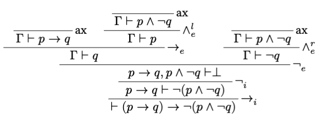

# Curryst

A Typst package for typesetting proof trees. You can import this package with :

```typst
#import "@preview/curryst:0.1.1"
```

## Examples

Here is a basic usage example:

```typst
#let r = curryst.rule(
  name: "Rule name", 
  "Conclusion", 
  "Premise 1", 
  "Premise 2", 
  "Premise 3"
  )
#curryst.proof-tree(r)
```

Result:


Here is a more complete example, to typeset a proof tree in [natural deduction](https://en.wikipedia.org/wiki/Natural_deduction). First, define the set of rules :

```typst
#let ax(ccl) = curryst.rule(name: "ax", ccl)
#let and_i(ccl, p1, p2) = curryst.rule(name: $and_i$, ccl, p1, p2)


#let and_el(ccl, p) = curryst.rule(name: $and_e^l$, ccl, p)
#let and_er(ccl, p) = curryst.rule(name: $and_e^r$, ccl, p)
#let or_il(ccl, p1) = curryst.rule(name: $or_i^l$, ccl, p1)
#let or_ir(ccl, p2) = curryst.rule(name: $or_i^r$, ccl, p2)
#let or_e(ccl, por, p1, p2) = curryst.rule(name: $or_e$, ccl, por, p1, p2)
#let impl_i(ccl, p) = curryst.rule(name: $attach(->, br: i)$, ccl, p)
#let impl_e(ccl, pi, p1) = curryst.rule(name: $attach(->, br: e)$, ccl, pi, p1)
#let not_i(ccl, p) = curryst.rule(name: $not_i$, ccl, p)
#let not_e(ccl, pf, pt) = curryst.rule(name: $not_e$, ccl, pf, pt)
#let absurd(ccl, p) = curryst.rule(name: $bot$, ccl, p)
```

Next, combine these rules to build a proof tree:

```typst
#curryst.proof-tree(
  impl_i(
    $tack (p -> q) -> not (p and not q)$,
    not_i(
      $p -> q tack  not (p and not q)$,
      not_e(
        $p -> q, p and not q tack bot$,
        impl_e(
          $Gamma tack q$,
          ax($Gamma tack p -> q$),
          and_el(
            $Gamma tack p$,
            ax($Gamma tack p and not q$)
          )
        ),
        and_er(
          $Gamma tack not q$,
          ax($Gamma tack p and not q$)
        )
      )
    )
  )
)
```

Result:

