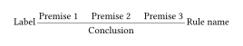
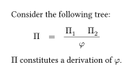
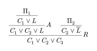
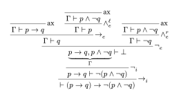

# Curryst

A Typst package for typesetting proof trees.


## Import

You can import the latest version of this package with:

```typst
#import "@preview/curryst:0.5.1": rule, prooftree
```

## Basic usage

To display a proof tree, you first need to create a tree, using the `rule` function. Its first argument is the conclusion, and the other positional arguments are the premises. It also accepts a `name` for the rule name, displayed on the right of the bar, as well as a `label`, displayed on the left of the bar.

```typ
#let tree = rule(
  label: [Label],
  name: [Rule name],
  [Conclusion],
  [Premise 1],
  [Premise 2],
  [Premise 3]
)
```

Then, you can display the tree with the `prooftree` function:

```typ
#prooftree(tree)
```

In this case, we get the following result:



Proof trees can be part of mathematical formulas:

```typ
Consider the following tree:
$
  Pi quad = quad prooftree(
    rule(
      phi,
      Pi_1,
      Pi_2,
    )
  )
$
$Pi$ constitutes a derivation of $phi$.
```



You can specify a rule as the premises of a rule in order to create a tree:

```typ
#prooftree(
  rule(
    name: $R$,
    $C_1 or C_2 or C_3$,
    rule(
      name: $A$,
      $C_1 or C_2 or L$,
      rule(
        $C_1 or L$,
        $Pi_1$,
      ),
    ),
    rule(
      $C_2 or overline(L)$,
      $Pi_2$,
    ),
  )
)
```



As an example, here is a natural deduction proof tree generated with Curryst:



<details>
  <summary>Show code</summary>

  ```typ
  #let ax = rule.with(name: [ax])
  #let and-el = rule.with(name: $and_e^ell$)
  #let and-er = rule.with(name: $and_e^r$)
  #let impl-i = rule.with(name: $scripts(->)_i$)
  #let impl-e = rule.with(name: $scripts(->)_e$)
  #let not-i = rule.with(name: $not_i$)
  #let not-e = rule.with(name: $not_e$)

  #prooftree(
    impl-i(
      $tack (p -> q) -> not (p and not q)$,
      not-i(
        $p -> q tack  not (p and not q)$,
        not-e(
          $ underbrace(p -> q\, p and not q, Gamma) tack bot $,
          impl-e(
            $Gamma tack q$,
            ax($Gamma tack p -> q$),
            and-el(
              $Gamma tack p$,
              ax($Gamma tack p and not q$),
            ),
          ),
          and-er(
            $Gamma tack not q$,
            ax($Gamma tack p and not q$),
          ),
        ),
      ),
    )
  )
  ```
</details>


## Advanced usage

The `prooftree` function accepts multiple named arguments that let you customize the tree:

<dl>
  <dt><code>min-premise-spacing</code></dt>
  <dd>The minimum amount of space between two premises.</dd>

  <dt><code>title-inset</code></dt>
  <dd>The amount to extend the horizontal bar beyond the content. Also determines how far from the bar labels and names are displayed.</dd>

  <dt><code>stroke</code></dt>
  <dd>The stroke to use for the horizontal bars.</dd>

  <dt><code>vertical-spacing</code></dt>
  <dd>The space between the bottom of the bar and the conclusion, and between the top of the bar and the premises.</dd>

  <dt><code>min-bar-height</code></dt>
  <dd>The minimum height of the box containing the horizontal bar.</dd>

  <dt><code>dir</code></dt>
  <dd>The orientation of the proof tree (either <code>btt</code> or <code>ttb</code>, <code>btt</code> being the default).</dd>
</dl>

For more information, please refer to the documentation in [`curryst.typ`](curryst.typ).
